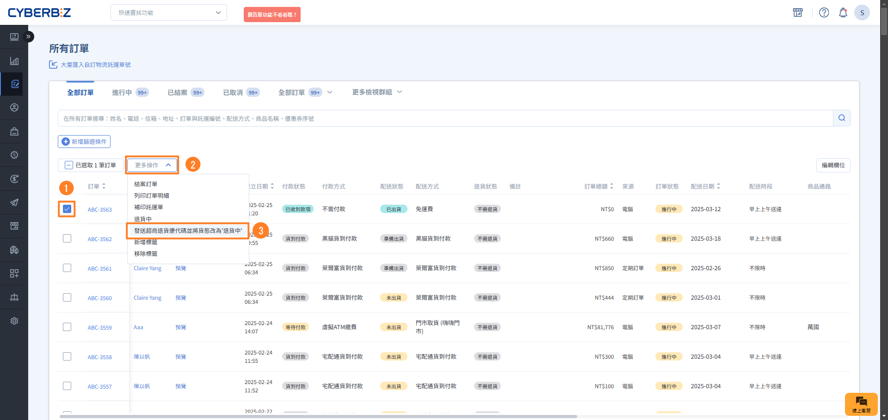
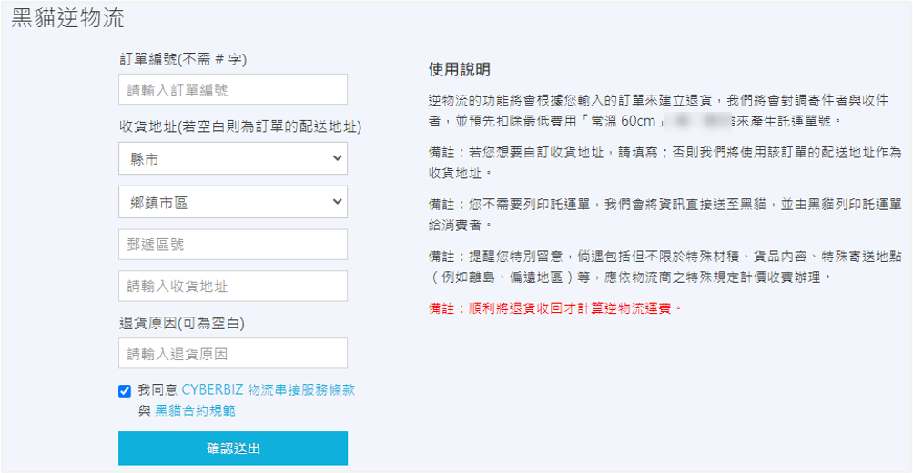
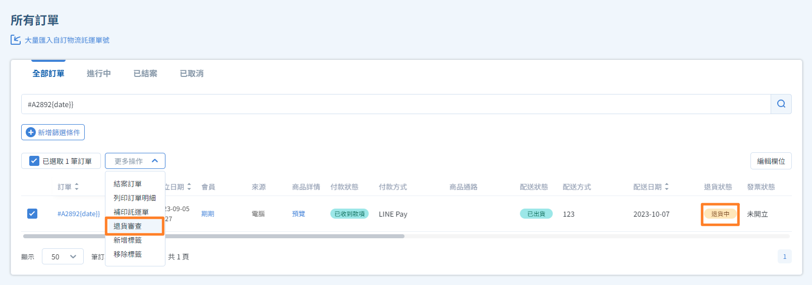
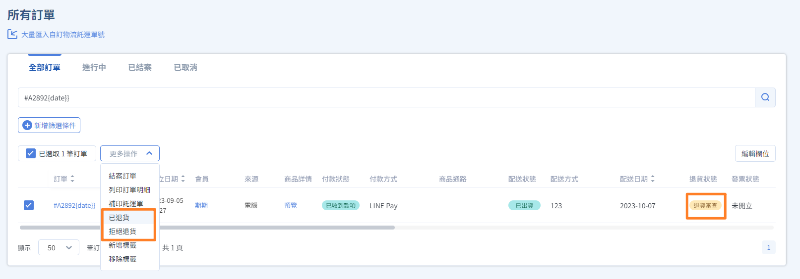
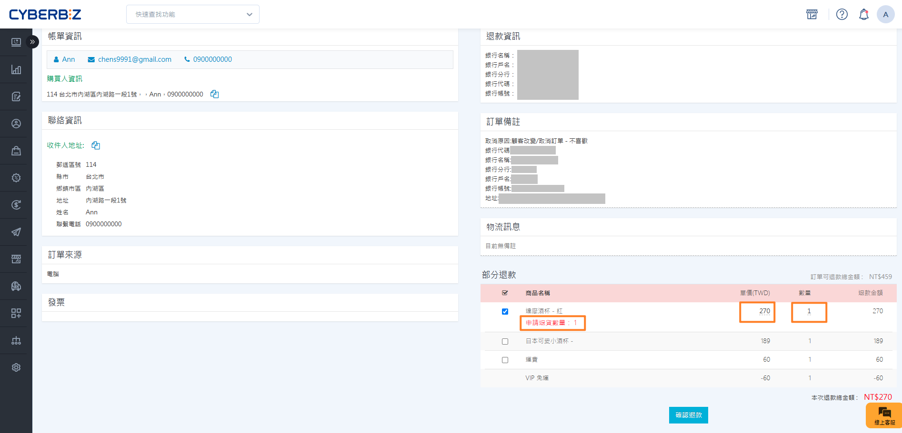

# 訂單退貨流程

當會員提出退貨申請或商家需手動啟動退貨程序時，您可以透過後台進行「逆物流安排」與「退貨審核」。
{ .subtitle }

{ .hero-page }

!!! info "核心規則須知"
    - **次數限制**：每筆訂單僅接受 **一次** 退貨退款申請。若已完成部分退貨，該訂單剩餘商品無法再次申請。
    - **紅利與優惠券**：系統 **不會自動歸還** 訂單中使用的點數/券，也 **不會自動扣除** 該訂單消費產生的點數回饋。若需更動，請至 **會員明細頁** 手動調整。
    - **分潤機制**：只要訂單曾達到 **已結案** 狀態，即會計算分潤；後續退貨 **不會影響** 已產生的分潤紀錄。

## 步驟 1：啟動退貨與安排逆物流

依據退貨發起方，訂單列表中的 **退貨狀態** 會有不同顯示：

- **會員申請**：自動顯示為 `退貨申請`。
- **商家發起**：初始顯示為 `不須退貨`。

=== "安排逆物流寄回"

    您可透過系統提供寄回服務：

    === "超商退貨 (C2B)"
        
        1. 前往 **訂單 > 所有訂單**。
        2. 勾選指定訂單，點選 **發送超商退貨便代碼並將貨態改為退貨中**，系統將簡訊發送代碼給會員。

        !!! warning "超商退貨服務啟用限制"
            超商 C2B 退貨僅支援已啟用 **超商 B2C** 之站台；使用超商 C2C 服務則不適用。
        
        

    === "宅配逆物流"

        1. 前往 **金物流 > XX 託運單**。
          > 請依據使用的物流（黑貓、宅配通）選擇對應介面（黑貓託運單、宅配通託運單）。
        2. 輸入訂單編號，產出逆物流單號。

        

=== "手動切換狀態"

    若由會員自行寄回包裹，商家可手動切換切換狀態，代表已收到包裹進入驗收階段。

    1. 前往 **訂單 > 所有訂單**。
    2. 勾選指定訂單，點選 **退貨中** > **退貨審查**。

    

## 步驟 2：執行退貨審查

收到包裹並檢查品項無誤後，請依據情況選擇審查結論。

=== "已啟用 CYBERBIZ PAYMENTS"

    CYBERBIZ PAYMENTS 已整合系統化退款服務，當您審查完畢，系統將同步準備退款，方便您後續快速完成原路退刷或帳戶匯款。

    === "全部退貨"

        適用於整筆訂單品項皆需退回。

        1. 前往 **訂單 > 所有訂單**。
        2. 勾選指定訂單，點選 **退貨審查** > **已退貨**。
        3. 狀態更動後，請接續進行 [退款操作](訂單退款流程.md)。

        

    === "部分退貨"

        適用於僅退回訂單內部分商品。

        1. 前往 **訂單 > 所有訂單**。
        2. 勾選指定訂單，點選 **退貨審查** 後，進入訂單明細頁。
        3. 找到 **部分退款** 區塊，勾選核准退回的商品與輸入退款數量。
        4. 輸入 **退款金額**（系統會代入原價總計，商家可手動調整）。
        5. 點擊 **確認退款**，`退貨狀態`將更新為 `部分退貨`。
        6. 狀態更動後，請接續進行 [退款操作](訂單退款流程.md)。

        

    === "拒絕退貨"

        適用於商品毀損、超出期限等不符退貨標準的情況。

        1. 前往 **訂單 > 所有訂單**。
        2. 勾選指定訂單，點選 **退貨審查** > **拒絕退貨**。
        3. 流程至此結束。

        

=== "無使用 CYBERBIZ PAYMENTS"

    由於未串接 CYBERBIZ PAYMENTS 金流，此處操作僅限於更新系統內的訂單狀態。審查完成後，請務必依據商家政策手動前往第三方金流後台或透過線下匯款完成撥款。

    1. 前往 **訂單 > 所有訂單**。
    2. 勾選指定訂單，點選 **退貨審查** > **已退貨/部分退貨/拒絕退貨**。
    3. 狀態更動後，請接續進行 [退款操作]()。

    

## 常見問題

??? quote "為什麼使用了逆物流，訂單狀態會自動變更？"
    若使用系統整合的逆物流，當會員將包裹交給物流人員後，系統接收到物流訊號，會自動將狀態從 `退貨中` 更新為 `退貨審查`，方便商家追蹤進度。

??? quote "部分退貨時，運費要退嗎？"
    這取決於您的商店政策。系統代入的退款金額僅為商品原價加總，若您需退還部分運費，請手動增加退款金額；若需扣除整新費，則手動減少金額。

??? quote "如果退貨審核點錯了，可以重來嗎？"
    由於每筆訂單僅能執行一次退貨流程，一旦狀態變更為 **退貨中**，系統便視為流程結束。建議在點擊前務必確認核實。

---

## 後續步驟

- :lucide-dollar-sign:{ .lg }   
  [__執行金流退款操作__](訂單退款流程.md)       
  了解如何針對不同金流管道完成最後的撥款或退刷動作。

- :lucide-clipboard-check:{ .lg }     
  [__管理超商逾期未取__](../shipping/超商逾期未取處理)  
  針對物流未取件造成的自動退貨，了解對應的對帳流程。

