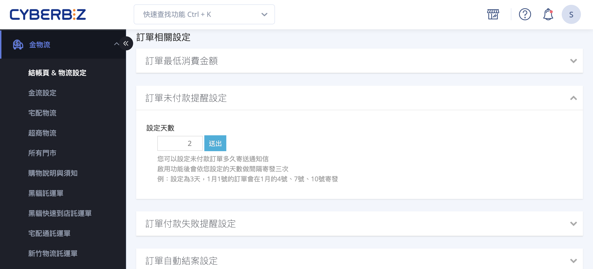

# 設定未付款提醒

如何配置自動化未付款提醒機制，透過 Email、簡訊及 LINE OA 多管道推播，引導顧客完成後續支付並有效提升訂單轉換率。
{ .subtitle }

{ .hero-page }

## 未付款提醒說明

在 CYBERBIZ 系統中，**未付款提醒** 功能主要針對下單後尚未完成付款的訂單（不含貨到付款），自動發送通知引導顧客完成支付，以提升轉換率。

### 功能啟閉與間隔設定

商家可自訂發送提醒的時間頻率，系統最多會寄發 **3 次** 提醒。

> :lucide-navigation: 設定路徑：**金物流 > 結帳頁 & 物流設定 > 訂單相關設定 > 訂單未付款提醒設定**。

**設定規則**：

- **開啟功能**：設定發送的 **間隔天數**（例如每隔 1 天發送一次）。

- **關閉功能**：將間隔天數設定為 **0** 即代表關閉。

- **自動停止**：若顧客在提醒期間完成付款，系統將自動停止後續的提醒發送。

## 三大通知管道設定

未付款提醒支援 Email、簡訊及 LINE OA 三種管道，商家可依需求個別設定與編輯樣板內容。

### 樣板編輯注意事項

- **樣板變數**：編輯內文時，請勿更動 **{{ }}** 大括號內的樣板變數（如 `{{shop_name}}`、`{{customer_name}}` 等），這些代碼會自動代入網站名稱、顧客姓名或訂單編號。

- **避免違禁詞**：發送簡訊時應避免使用電信商容易攔截的字眼（如：領取、連結、LINE 等），以免發送失敗但仍被計費。

- **短網址功能**：建議開啟短網址設定，自動將提醒訊息中的連結縮短，以節省簡訊字數（每封上限 70 字）並使 Email 內容更精簡。

### Email 提醒（系統預設開啟）

> :lucide-navigation: **路徑：** 訊息推播 > Email 通知樣板 > 顧客相關 > **顧客訂單未付款提醒信**。

**編輯說明**：

- 點擊標題進入後，可編輯信件主旨與內文（支援 HTML 或純文字），並可透過右上角「預覽」按鈕查看實際畫面。
- 若有修改內容，點擊 **儲存** 以套用變更。

### 簡訊提醒（需手動開啟）

> :lucide-navigation: **路徑：** 訊息推播 > 簡訊樣板設定 > 顧客相關 > **顧客訂單未付款通知**。

- **功能設定**：將「狀態」切換為 **開啟 (ON)**，即可啟用自動化簡訊提醒。
- **費用說明**：發送簡訊會扣除 **1 點 CYBER 幣**，使用前須確保帳戶額度充足（PLUS版 / 企業版 以外之商家需預先儲值）。

### LINE OA 提醒（需手動開啟）

!!! info "本功能僅適用 PLUS版 / 企業版 方案。"

> :lucide-navigation: **路徑：** 訊息推播 > LINE OA 通知樣板 > 顧客相關 > **顧客訂單未付款提醒信**

**前置條件**：發送前請確保已完成以下設定：

- 商家端：完成 [**LINE OA Messaging API 串接**](../integrations/line/串接 LINE OA Messaging API.md){ data-preview } 。
    
- 顧客端：會員須完成 **[LINE 帳號綁定](#)** 並加入商家官方帳號好友。

**功能設定**：

- **啟用功能**：將「狀態」切換為 **開啟 (ON)**。
    
- **內容編輯**：於「文字訊息」欄位編輯提醒文字，系統支援變數插入以自動帶入訂單資訊。
    
- **即時預覽**：編輯內容將同步顯示於右方預覽視窗，供商家確認顯示樣式。

## 相關操作

- :simple-line:{ .lg }   
  [__串接 LINE OA Messaging API__](../integrations/line/串接 LINE OA Messaging API)     
 建立 LINE OA 並串接 Messaging API。

- :lucide-link-2:{ .lg }     
  [__LINE 會員綁定整合__](串接 LINE 官方帳號與官網會員系統)  
  設定商品的配送物流條件，限制特定物流方式於結帳流程中的顯示與使用。

## 常見問題

??? quote "顧客已付款卻仍收到提醒"

	請確認以下情況：

	1. 顧客是否於付款完成後才收到提醒（可能是排程已產生但尚未取消）。
    
	2. 顧客是否使用多個裝置（如手機與電腦）登入：
    
    - 未付款提醒是依「訂單狀態」判斷。
        
    - 若顧客在其中一個裝置完成付款，另一裝置的購物流程尚未同步清空，可能造成短時間內重複通知。
        

	系統在下一次檢查訂單狀態時，會自動停止後續提醒。
	
	請檢查顧客是否使用多個裝置（如手機與電腦）登入。購物車未結帳提醒通常與裝置綁定，若顧客在一台裝置結帳，另一台裝置的購物車若未同步清空，可能會產生重複通知。

??? quote "自動取消訂單與提醒的關係"

	若商家有設定「訂單自動取消天數」（例如 3 天未付款即取消）：

	- 未付款提醒應設定在自動取消天數 **之前完成發送**。
    
	- 一旦訂單被系統自動取消，未付款提醒將不再發送。
    

	建議提醒間隔天數的總和小於自動取消天數，以避免發送無效提醒。

??? quote "系統什麼時候會發送第一封未付款提醒"

	系統會以「訂單成立時間」為起點，依設定的間隔天數計算。

	例如：

	- 間隔設定為 1 天
    
	- 訂單於 12/01 15:00 成立
    

	則第一封提醒將於 **12/02 15:00 左右** 發送。

??? quote "最多會發送幾次未付款提醒"

	系統最多會發送 **3 次** 提醒通知。若在第 1 或第 2 次提醒後顧客完成付款，後續提醒將自動取消。

??? quote "哪些訂單不會收到未付款提醒"

	以下情況不會觸發提醒：

	- 貨到付款（COD）訂單
    
	- 已完成付款的訂單
    
	- 已被取消或關閉的訂單
    
	未付款提醒僅適用於「線上付款但尚未付款完成」的訂單。

??? quote "可以只針對特定付款方式發送提醒嗎"

	不行。目前未付款提醒為 **全站統一設定**，無法依付款方式（如信用卡、超商條碼）個別設定是否發送。

??? quote "LINE OA 為什麼沒有發送提醒"

	請檢查以下前置條件：

	1. 商家是否已完成 LINE OA Messaging API 串接。
    
	2. 顧客是否已完成 LINE 帳號綁定。
    
	3. 顧客是否已加入商家官方帳號好友。
    
	4. LINE OA 樣板是否已開啟（狀態為 ON）。
    
	任一條件未符合，系統將無法發送 LINE OA 提醒。

??? quote "簡訊提醒發送失敗但仍被扣點數怎麼辦"

	簡訊發送是否成功，最終仍取決於電信商回傳結果。若內容包含易被攔截關鍵字（如：連結、免費、領取、LINE 等），可能會：

	- 發送失敗
    
	- 但仍被電信商計費

	建議避免使用敏感字詞，並搭配短網址功能降低風險。

