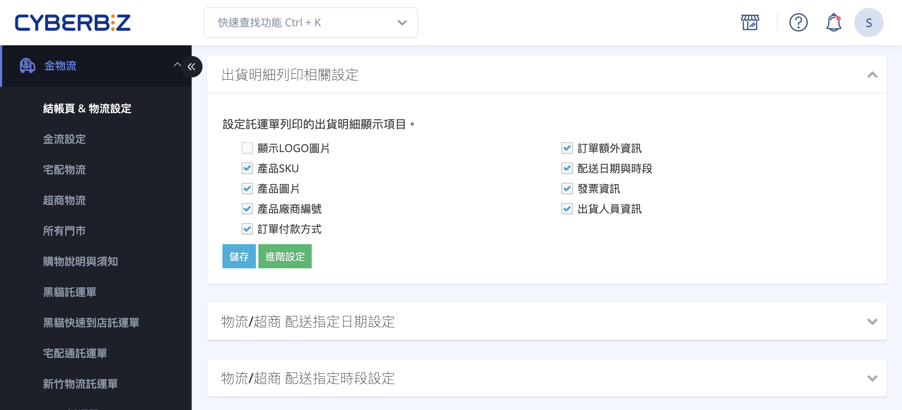
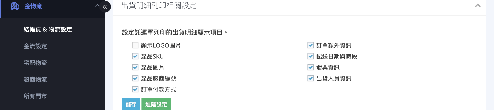
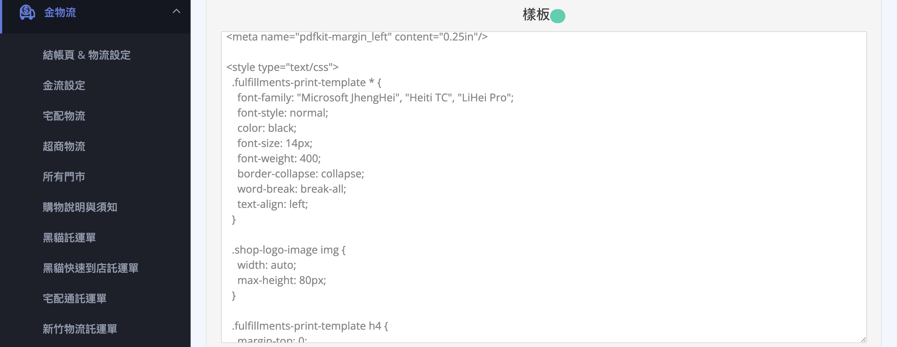
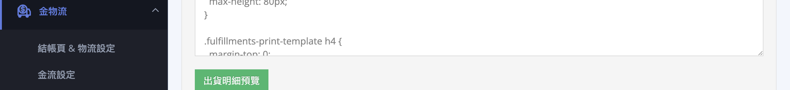
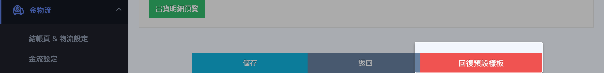
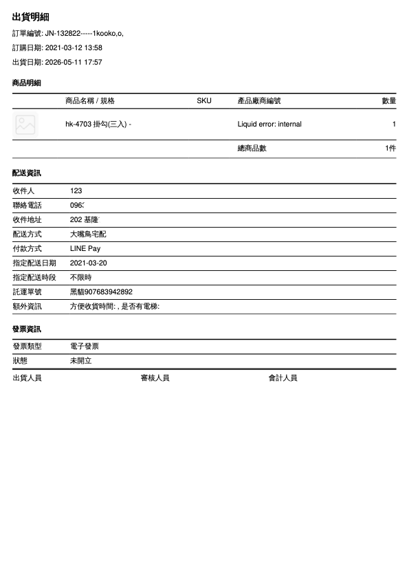

自訂出貨明細的顯示內容、套用列印模板，以及從訂單列表批次下載出貨明細。
{ .subtitle }

{ .hero-page }

## 出貨明細說明

「出貨明細」是您在出貨流程中提供給內部倉儲、揀貨、出貨人員使用的書面文件，通常隨包裹一起於出貨流程中備存，協助出貨核對與內部交接。

本頁說明如何在後台

- [x] 自訂出貨明細的呈現內容
- [x] 如何在實際出貨流程中取得出貨明細。

如需設定隨包裹寄給顧客的「訂單明細」，請參考另一份文件 [設定與列印訂單明細](./order-print.md)。

??? note "出貨明細與訂單明細差異"

    系統將明細分為兩種用途，您可以分別設定其內容以符合需求：

    *   **訂單明細 (顧客)**：通常包含完整的商品內容、單價、金額與配送方式。
    *   **出貨明細 (員工)**：主要提供給倉儲或出貨人員，通常僅包含商品數量與配送地址，**不含訂單金額**，以精簡資訊並節省成本。

!!! info "個資隱碼不適用於出貨明細"
    後台「安全性設定」中的「訂單明細列印」[隱碼][orders-print-pii-masking-rules]{ data-preview } 功能僅作用於 **訂單明細**，不會套用到出貨明細上。出貨明細因為是內部使用，設計上不會遮蓋顧客個資。



??? plan "點此查看各方案差異"

    | 功能 | 開通條件 |
    | :-- | :-- |
    | 出貨明細列印基本功能（勾選欄位、儲存） | 全方案皆有（POS 限定方案除外） |
    | 進階設定：Liquid 模板與 CSS 自訂 | 全方案皆有 |
    | 出貨明細多語言列印 | 需加購 **多國語系與多幣別加值功能** |



## 出貨明細內容設定 { #fulfillment-print }

### 1. 進入出貨明細列印設定 { #fulfillment-print-activate }

於後台側邊選單尋找以下路徑（依您的後台選單版本略有不同）：

- 新版選單：**金物流** > **結帳頁 & 物流設定** > 找到 **「出貨明細列印相關設定」** 區塊
- 舊版選單：**線上購物設定** > **購物車與金流** > 找到 **「出貨明細列印相關設定」** 區塊

> 進入後，該區塊的副標說明為「設定託運單列印的出貨明細顯示項目」。

---

### 2. 勾選要呈現的項目 { #fulfillment-print-configure }

面板提供 9 個勾選項，可依您的內部出貨流程需求自由組合（預設皆未勾選）。[完整欄位說明][fulfillment-print-fields]{ data-preview }

 

??? example "常見組合範例" 
    - **倉儲揀貨優先**：勾選產品 SKU、產品圖片、產品廠商編號、配送日期與時段
    - **出貨核對為主**：勾選產品 SKU、訂單額外資訊、配送日期與時段、出貨人員資訊
    - **多倉 / 代發貨**：勾選產品廠商編號、訂單額外資訊、出貨人員資訊

!!! tip "建議資訊精簡"

    出貨明細是內部流程文件，建議只勾選揀貨、出貨核對所需的最少資訊，可以節省紙張、加快人員閱讀速度。涉及顧客敏感的金額、紅利、個資等，通常不需出現在這份文件上。

---

### 3. 儲存設定

於設定區塊底部點選 **「儲存」** 完成基本設定。

---

### 4. 進階設定 { #fulfillment-print-advanced-settings }

於設定區塊底部點選 **「進階設定」**，進入 **「編輯列印出貨明細樣板」** 頁面。

您可於此頁：

- :lucide-code:{ .ig }
  [__自訂樣板__](#fulfillment-print-template){ data-preview }
- :lucide-eye:{ .ig }
  [__預覽列印效果__](#fulfillment-print-preview){ data-preview }
- :lucide-rotate-ccw:{ .ig }
  [__回復預設樣板__](#fulfillment-print-revert){ data-preview }

---

#### 自訂樣板 { #fulfillment-print-template }

「樣板」區塊是 Liquid 程式碼，可調整版面排版、字型大小、邊距等。一般情況下使用預設模板即可。

!!! note "提醒"

    - 儲存前請務必先預覽是否正常顯示。
    - 預覽時必須有「已經出貨」的訂單，否則樣板可能無法正常渲染。

---

#### 預覽列印效果 { #fulfillment-print-preview }

點選 **「出貨明細預覽」**，系統會以最近一筆已出貨訂單套用您目前的樣板，即時呼叫瀏覽器的列印對話框。

---

#### 回復預設樣板 { #fulfillment-print-revert }

若調整後想還原，點選 **「回復預設樣板」** 即可重置為系統預設版本（已儲存的勾選項不會被影響）。

!!! info "出貨明細沒有開頭提醒文字"

    與訂單明細不同，出貨明細的進階設定頁不提供「開頭提醒文字標題 / 內容」欄位。這是因為出貨明細是內部文件，不需要顧客面的文案。

## 如何列印出貨明細 { #fulfillment-print-operate }

完成 [明細內容設定][fulfillment-print] 後，出貨明細不會像訂單明細那樣可單獨列印，而是在 **批次出貨打包** 流程中與其他出貨文件一併產生：

1. 後台選單進入 **訂單** > **所有訂單**。
2. 在訂單列表勾選一筆或多筆要出貨的訂單。
3. 點選列表上方的下拉操作選單（依後台版本顯示為 **「更多操作」** 或 **「選擇操作」**）。
4. 選擇 **「下載」** 並指定欲下載的物流商。
5. 系統會產出一個 ZIP 壓縮檔，內含：

    - 物流商的 **託運單**（PDF）
    - **出貨明細**（套用本頁設定的模板）
    - **揀貨單**
    - **訂單明細**（套用訂單明細模板）

6. 解壓縮後即可分送到揀貨 / 出貨 / 客戶包裹各自的用途。

??? example "出貨明細範例"

    

!!! warning "為什麼沒有「列印出貨明細」這個獨立選項？"

    出貨明細的設計是與「託運單」綁在一起產生的。商家通常會在準備出貨的同一動作中，需要託運單、出貨明細、揀貨單三份文件。系統因此設計成同批產生一份 ZIP，而非每份獨立列印。如僅需顧客面的明細，請參考 [訂單明細列印](設定與列印訂單明細.md){ data-preview } 流程。

## 後續操作

- :lucide-receipt:{ .lg }  
  [__設定與列印訂單明細__](設定與列印訂單明細.md){ data-preview }  
  了解如何設定隨包裹寄給顧客的訂單明細，包含完整的商品內容、單價、金額與配送方式。

- :lucide-truck:{ .lg }  
  [__訂單出貨流程__](訂單出貨流程.md){ data-preview }  
  了解完整出貨流程。從單筆出貨到批次打包，涵蓋宅配、超取與自訂物流。

## 常見問題

??? quote "出貨明細看起來和訂單明細很像，我該如何分工？"

    - **訂單明細**：給顧客看的，放進包裹寄出。建議勾選訂購人資訊、發票資訊、客戶預計獲得紅利等顧客關心的資訊。
    - **出貨明細**：給內部出貨人員看的，協助揀貨核對。建議勾選 SKU、廠商編號、配送日期等出貨流程需要的資訊。

    雖然兩者欄位有重疊，實務上可透過「勾選不同項目」做出明顯區隔。

??? quote "出貨明細上會顯示顧客姓名 / 地址嗎？"

    會顯示（從託運單抓取的收件人資訊），但出貨明細 **不適用個資隱碼** 功能。如果出貨明細會被顧客看到（例如黏貼在包裹外側），建議於樣板中自訂遮罩，或乾脆不要把出貨明細放在包裹外。

??? quote "為什麼按了「儲存」後，下次出貨產生的 ZIP 內容沒變？"

    - 主面板的「儲存」只儲存勾選項；模板樣式必須在 **進階設定** 頁面點擊 **「儲存」** 才會生效。
    - 已產生過的 ZIP 不會回頭更新。只有 **下次** 觸發「下載」時產生的新 ZIP 才會套用新設定。

??? quote "預覽時顯示空白或報錯，該怎麼辦？"

    預覽功能需要至少一筆 **「已出貨」** 訂單作為樣本。若您的後台目前沒有已出貨訂單，請先完成一筆測試訂單的出貨流程，再回到此頁預覽。

??? quote "可以只下載出貨明細，不要其他文件嗎？"

    後台目前不支援單獨下載出貨明細。若有此需求，建議在訂單列表完成下載後，從 ZIP 中只取用出貨明細 PDF 即可。

??? quote "出貨明細與揀貨單有什麼差別？"

    - **出貨明細**：格式接近訂單明細，適合放進包裹做最後核對。
    - **揀貨單**：精簡版，專為倉儲人員「依清單揀貨」設計，通常只列商品名稱、SKU、數量、儲位。

    兩者皆會包含在出貨 ZIP 中。

                                                                   
## 參考資料                                                      
                                                                  
### 出貨明細欄位對照表 { #fulfillment-print-fields }

| 勾選項 | 列印效果 | 適用情境 |
| :-- | :-- | :-- |
| 顯示 LOGO 圖片 | 在出貨明細頂部印出店家 LOGO | 多品牌共用倉儲時辨識來源 |
| 產品 SKU | 商品列印時加上 SKU 編號 | 倉儲揀貨主要依據 |
| 產品圖片 | 商品列印時加上縮圖 | 協助揀貨人員視覺核對 |
| 產品廠商編號 | 商品列印時加上供應商編號 | 多廠商代發貨、寄倉模式核對 |
| 訂單付款方式 | 印出顧客選擇的金流方式 | 通常不勾選（屬顧客資訊） |
| 訂單額外資訊 | 印出顧客結帳時填寫的備註欄 | 客製化需求、贈品註記、特殊指示 |
| 配送日期與時段 | 印出顧客指定配送時間 | 排程出貨、生鮮時效控管 |
| 發票資訊 | 印出電子發票相關資訊 | 通常不勾選（屬顧客資訊） |
| 出貨人員資訊 | 印出處理本筆出貨的後台人員 | 多人協作出貨流程的責任歸屬 |

!!! note "註釋"

    - 勾選項皆為「附加顯示」，未勾選的欄位不會印出，但不影響資料儲存。
    - 出貨明細不支援個資隱碼，亦無「開頭提醒文字 / 圖片」設定。                                      

---



## 訂單明細與出貨明細對照表      
                                                                  
| 項目 | 訂單明細 | 出貨明細 |
| :-- | :-- | :-- |                                              
| 對象 | 顧客 | 內部出貨人員 |         
| 隨包裹寄出 | 通常會 | 視內部流程而定 |
| 列印觸發 | 訂單列表 > 「列印訂單明細」(可單筆 / 多筆) | 訂單列表 > 「下載」打包成 ZIP(連同託運單 / 揀貨單) |
| 個資隱碼 | 支援(專業 PLUS 以上) | **不支援** |                 
| 開頭提醒文字 / 圖片 | 可設定 | **不支援** |
| 預設可勾選欄位 | 11 項 | 9 項 |                                


                                                                  
