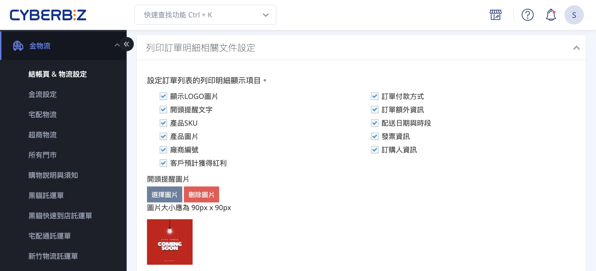

{ .subtitle }

{ .doc-badge }

{ .hero-page }

## 訂單明細設定與列印說明

「訂單明細」是您在出貨時隨包裹寄給顧客的書面文件,內容通常包含商品
  明細、訂購人資訊、付款方式與金額。本頁說明如何在後台自訂訂單明細 
  的呈現內容、套用列印模板,以及從訂單列表列印或下載 PDF。
                                                                   
  如需設定提供給內部出貨人員使用的「出貨明細」,請參考另一份文件
  [設定與列印出貨明細](./fulfillment-print.md)。

## 功能說明

「訂單明細」是您在出貨時隨包裹提供給顧客的書面文件，內容通常包含商品明細、訂購人資訊、付款方式與訂單金額。

本篇將說明如何在後台：

- [x] 自訂訂單明細的顯示內容
- [x] 套用列印模板
- [x] 從訂單列表列印或下載 PDF

如需設定提供給內部出貨人員使用的「出貨明細」，請參考另一篇文件：[設定與列印出貨明細](./fulfillment-print.md)。

## 訂單明細內容設定

您可以決定明細中要呈現哪些資訊（如商品單價、總額、提醒文字等）。

1.  **設定路徑**：

    - **新版介面**：進入管理後台，點選 **「金物流」** > **「結帳頁 & 物流設定」** > **「列印訂單明細相關文件設定」**。
    - **舊版介面**：線上購物設定 > 購物車與金流 > 列印訂單明細相關文件設定   

2.  **勾選呈現項目**：
    *   在頁面中勾選您希望列印在明細上的項目。
    *   **開頭提醒文字**：可填入「標題」與「內容」，例如購物須知或感謝語。
    *   **開頭提醒圖片**：建議可上傳公司 LOGO 或官網 **QR Code**（建議規格 90px * 90px），方便顧客回訪。
3.  **個資保護（隱碼設定）**：
    *   **適用版本**：PLUS 版、企業版專用。
    *   **路徑**：點選「管理中心」>「安全性設定」>「會員安全」。
    *   **功能**：開啟「訂單明細列印」隱碼後，列印出的明細會遮蓋會員姓名（如 k***n）、手機（如 093******3）及地址中間段落，保護顧客隱私。
4.  **預覽與儲存**：
    *   設定完成後儲存，可點選 **「進階設定」** > **「訂單明細預覽」** 查看實際呈現效果。

## 如何列印訂單明細

訂單明細必須透過後台的「訂單管理」頁面進行列印。

1.  **進入訂單列表**：前往 **「訂單」** > **「所有訂單」**。
2.  **勾選訂單**：選取欲列印的一筆或多筆訂單。
3.  **執行列印**：
    *   在列表右上方點選 **「更多操作」** 或 **「選擇操作」**。
    *   下拉選單中選擇 **「列印訂單明細」** 即可產出 PDF 或開啟列印視窗。

## 出貨明細（給員工使用）與訂單明細的差異

系統將明細分為兩種用途，您可以分別設定其內容以符合需求：

*   **訂單明細 (For 顧客)**：通常包含完整的商品內容、單價、金額與配送方式。
*   **出貨明細 (For 員工)**：主要提供給倉儲或出貨人員，通常僅包含商品數量與配送地址，**不含訂單金額**，以精簡資訊並節省成本。
    *   **設定路徑**：後台「金物流」>「結帳頁 & 物流設定」> **「出貨明細列印相關設定」**。

## 進階與特殊設定

*   **調整格式**：若需更動明細的排版外觀，可在設定頁面點選「進階設定」，透過編輯 **CSS 語法** 自行調整。
*   **出貨壓縮檔內容**：當商家在後台執行「確認出貨」並下載託運單時，系統會自動產生一個壓縮檔，內含：**託運單**、**出貨明細**、**訂單明細**及**揀貨單**。
*   **日本站專用**：日本站商家可在此路徑下載符合日本法令格式的發票（Invoice）、收據（Receipt）及對應的退款文件。

**💡 溫馨提醒：**
建議員工使用的「出貨明細」設定越少資訊越好，僅保留揀貨必要的品名與數量，可有效提升作業效率並降低營運成本。

## 後續操作

- :lucide-import:{ .lg }
  [____]()
  。

- :lucide-ban:{ .lg }
  [____]()
  。

## 常見問題

??? quote ""

---

## 訂閱方案開通對照

??? plan "點此查看各方案差異"

    | 功能 | 開通條件 |
    | :-- | :-- |
    | 訂單明細列印基本功能（勾選欄位、開頭提醒、儲存） | 全方案皆有（POS 限定方案除外） |
    | 進階設定：Liquid 模板與 CSS 自訂 | 全方案皆有 |
    | 訂單明細多語言列印 | 需加購 **多國語系與多幣別加值功能** |
    | 訂單明細列印個資隱碼 | **專業 PLUS** / **高手 PLUS** / **進階 PLUS** / **企業版** 內建 |

---

## 操作步驟

### 步驟一：進入訂單明細列印設定

於後台側邊選單依版本進入以下路徑：

- 較新的選單版本：
  **金物流** → **結帳頁 & 物流設定** → 找到 **「列印訂單明細相關文件設定」**

- 較舊的選單版本：
  **線上購物設定** → **購物車與金流** → 找到 **「列印訂單明細相關文件設定」**

進入後，區塊副標會顯示：

> 設定訂單列表的列印明細顯示項目

---

### 步驟二：勾選要呈現的項目

面板提供多個勾選項目，可依營運需求自由組合（預設皆未勾選）。

完整欄位說明請參考：

[訂單明細欄位對照表][order-print-fields]{ data-preview }

#### 常見組合範例

!!! tip "情境配方"

    - **B2C 一般網購**
      勾選：顯示 LOGO 圖片、產品 SKU、產品圖片、訂單付款方式、訂購人資訊、發票資訊

    - **批發 / 大量出貨**
      勾選：產品 SKU、廠商編號、訂單額外資訊（略過產品圖片以節省紙張）

    - **重視品牌體驗**
      勾選：顯示 LOGO 圖片、開頭提醒文字、產品圖片、客戶預計獲得紅利

---

### 步驟三：設定開頭提醒文字與圖片（選用）

當您勾選 **「開頭提醒文字」** 後，需於 [步驟五](#步驟五進階設定-liquid-模板與預覽) 的進階設定頁填入「標題」與「內容」，否則將無法儲存。

常見用途：

- 購物須知：退換貨期限、客服聯絡方式
- 感謝訊息：回購折扣碼、社群帳號邀請

---

#### 開頭提醒圖片

您可於主面板下方上傳圖片：

1. 點選 **「選擇圖片」** 上傳檔案
2. 建議圖片尺寸為 **90px × 90px**
3. 適合放置：
    - 公司 LOGO
    - 官網 QR Code
    - LINE 官方帳號 QR Code
4. 如需移除，點選 **「刪除圖片」**

---

### 步驟四：儲存設定

於設定區塊底部點選 **「儲存」** 完成基本設定。

!!! info "儲存範圍"

    此按鈕僅儲存：

    - 勾選項目
    - 提醒圖片

    提醒文字內容與樣板樣式需於進階設定頁另外儲存。

---

### 步驟五：進階設定（Liquid 模板與預覽）

於設定區塊底部點選 **「進階設定」**，進入 **「編輯列印訂單明細樣板」** 頁面。

您可於此頁：

- 編輯提醒文字
- 自訂模板
- 預覽列印效果
- 回復預設模板

---

#### 5-1. 編輯開頭提醒文字

若步驟二有勾選「開頭提醒文字」，此頁會出現：

- **開頭提醒文字標題**
- **開頭提醒文字內容**

兩欄皆為必填。

---

#### 5-2. 自訂樣板

「樣板」區塊為 Liquid 程式碼，可調整：

- 排版
- 字型大小
- 邊距
- CSS 樣式

一般情況建議使用預設模板。

若需大幅客製化，建議由熟悉 HTML / CSS 的人員協助。

!!! note "提醒"

    - 儲存前請先預覽
    - 預覽需至少一筆「已出貨」訂單

---

#### 5-3. 預覽列印效果

點選 **「訂單明細預覽」** 後：

- 系統會套用最近一筆已出貨訂單
- 自動開啟瀏覽器列印視窗

可直接預覽實際列印結果。

---

#### 5-4. 回復預設樣板

若需還原樣板：

點選 **「回復預設樣板」**

即可恢復系統預設版本。

> 已儲存的勾選項不會受到影響。

---

### 步驟六：從訂單列表列印

完成上述設定後，可於訂單列表執行列印：

1. 前往 **訂單** → **所有訂單**
2. 勾選欲列印的訂單
3. 點選：
    - **更多操作**
    - 或 **選擇操作**
4. 選擇 **「列印訂單明細」**
5. 系統將開啟瀏覽器列印視窗

您可選擇：

- 紙本列印
- 另存 PDF

---

## 個資隱碼（專業 PLUS / 高手 PLUS / 進階 PLUS / 企業版）

若您的方案支援此功能，可於列印時遮罩部分會員資訊。

---

### 開啟方式

1. 前往 **安全性設定** → **會員安全**
2. 找到 **「會員個資部分隱碼」**
3. 勾選 **「訂單明細列印」**
4. 點選儲存

---

### 遮罩規則

| 欄位 | 遮罩規則 | 範例 |
| :-- | :-- | :-- |
| 姓名 | 保留首字與末字 | 劉 \*\*\*\* 權 |
| 手機 | 保留前三碼與末一碼 | 093 \*\*\*\*\* 3 |
| 地址 | 保留郵遞區號、前段與末字 | 10001 台北市松山 \*\*\*\*\* 路 |

設定完成後會立即生效。

!!! info "提示"

    進階設定頁上方會顯示：

    > 若須進行訂單明細列印部份個資隱碼，請前往安全性設定

---

## 出貨壓縮檔內含的訂單明細

當您於訂單列表執行 **「確認出貨」** 並下載託運資料時，系統產生的壓縮檔會自動包含：

- 託運單
- 出貨明細
- 訂單明細
- 揀貨單

其中訂單明細會沿用本頁設定的：

- 勾選項目
- 列印樣板

詳細流程請參考：

**訂單管理 → 出貨流程**

---

## 常見問題

??? question "為什麼按了儲存之後，列印出來還是舊版面？"

    主面板的「儲存」只會儲存勾選項。

    若有修改模板樣式，需於「進階設定」頁再次點擊儲存。

---

??? question "預覽時顯示空白或報錯，該怎麼辦？"

    預覽功能需要至少一筆「已出貨」訂單。

    若目前沒有已出貨訂單，請先完成一筆測試訂單。

---

??? question "上傳的提醒圖片變模糊？"

    建議使用 90px × 90px 圖檔。

    若原圖過大，系統縮圖後可能導致模糊。

---

??? question "我想隱藏顧客地址中間段，但找不到設定？"

    請確認您的方案是否支援「訂單明細列印個資隱碼」。

    若支援，請至：

    **安全性設定 → 會員安全**

    開啟相關功能。

---

??? question "出貨明細與訂單明細是同一份嗎？"

    不是。

    - **訂單明細**：提供給顧客，通常包含金額與付款資訊
    - **出貨明細**：提供給內部出貨人員，通常不含金額

    兩者為獨立設定。

    詳見：[設定與列印出貨明細](./fulfillment-print.md)

---

## 參考資料

- [訂單明細欄位對照表][order-print-fields]{ data-preview }

---

[order-print-fields]: ./references/order-print-fields.md#order-print-fields

---

firebase raw                
                                                                   
  「訂單明細」是您在出貨時隨包裹寄給顧客的書面文件,內容通常包含商品
  明細、訂購人資訊、付款方式與金額。本頁說明如何在後台自訂訂單明細 
  的呈現內容、套用列印模板,以及從訂單列表列印或下載 PDF。
                                                                   
  如需設定提供給內部出貨人員使用的「出貨明細」,請參考另一份文件
  [設定與列印出貨明細](./fulfillment-print.md)。
                                                                   
  ---                   
                                                                   
  ## 訂閱方案開通對照                    
                                                                   
  ??? plan "點此查看各方案差異"          
      | 功能 | 開通條件 |                                          
      | :-- | :-- |                      
      | 訂單明細列印基本功能(勾選欄位、開頭提醒、儲存) |
  全方案皆有(POS 限定方案除外) |         
      | 進階設定:Liquid 模板與 CSS 自訂 | 全方案皆有 |
      | 訂單明細多語言列印 | 需加購 **多國語系與多幣別加值功能** | 
      | 訂單明細列印個資隱碼 | **專業 PLUS** / **高手 PLUS** /
  **進階 PLUS** / **企業版** 內建 |                                
                                         
  ---                                                              
                                         
  ## 操作步驟                                                      
                                                                   
  ### 步驟一:進入訂單明細列印設定                                  
                                                                   
  於後台側邊選單尋找以下路徑(依您的後台選單版本略有不同):          
                                         
  - 較新的選單版本: **金物流** → **結帳頁 & 物流設定** → 找到
  **「列印訂單明細相關文件設定」** 區塊
  - 較舊的選單版本: **線上購物設定** → **購物車與金流** → 找到
  **「列印訂單明細相關文件設定」** 區塊  
                                                                   
  進入後,該區塊的副標說明為「設定訂單列表的列印明細顯示項目」。
                                                                   
  ### 步驟二:勾選要呈現的項目            
                                                                   
  面板提供 11 個勾選項,可依您的營運需求自由組合(預設皆未勾選)。完整
  項目清單與業務情境說明請見           
  [訂單明細欄位對照表][order-print-fields]{ data-preview }。       
                                         
  常見組合範例:                                                    
                                         
  !!! tip "情境配方"                                               
      - **B2C 一般網購**:勾選 顯示 LOGO 圖片、產品
  SKU、產品圖片、訂單付款方式、訂購人資訊、發票資訊                
      - **批發 / 大量出貨**:勾選 產品    
  SKU、廠商編號、訂單額外資訊(略過產品圖片以節省紙張)
      - **重視品牌體驗**:勾選 顯示 LOGO
  圖片、開頭提醒文字、產品圖片、客戶預計獲得紅利                   
                                       
  ### 步驟三:設定開頭提醒文字與圖片(選用)                          
                                         
  當您勾選 **「開頭提醒文字」** 後,需於                            
  [步驟五](#步驟五進階設定liquid-模板與預覽)
  的進階設定頁填入「標題」與「內容」(否則無法儲存)。常見用途:      
                                         
  - 購物須知:退換貨期限、客服聯絡方式                              
  - 感謝訊息:回購折扣碼、社群帳號邀請    
                                                                   
  「開頭提醒圖片」可在主面板下方上傳:    
                                                                   
  1. 點選 **「選擇圖片」** 上傳檔案。    
  2. 系統建議規格為 **90px × 90px**(過大會被縮放)。                
  3. 適合放公司 LOGO、官網 QR Code 或 LINE 官方帳號 QR Code。
  4. 如需移除,點選 **「刪除圖片」** 並確認。                       
                                                                   
  ### 步驟四:儲存設定                                              
                                                                   
  於設定區塊底部點選 **「儲存」** 完成基本設定。
                                                                   
  !!! info "儲存範圍"                                              
      這個按鈕只儲存 **勾選項與提醒圖片**                          
  。提醒文字的標題與內容、樣板樣式,請於下一步的進階設定頁儲存。    
                                                                   
  ### 步驟五:進階設定(Liquid 模板與預覽)                           
                                         
  於設定區塊底部點選 **「進階設定」** ,進入                        
  **「編輯列印訂單明細樣板」** 頁面。在這裡您可以:
                                                                   
  #### 5-1. 編輯開頭提醒文字             
                                                                   
  若步驟二有勾選「開頭提醒文字」,此頁會出現:
                                                                   
  - **開頭提醒文字標題**:單行文字        
  - **開頭提醒文字內容**:多行文字(支援基本 HTML)                   
                                                                   
  兩欄皆為必填,空白將無法儲存。          
                                                                   
  #### 5-2. 自訂樣板                     
                                                                   
  「樣板」區塊是 Liquid 程式碼,可調整版面排版、字型大小、邊距等。一
  般情況下使用預設模板即可;如需大幅客製化,建議由熟悉 HTML / CSS    
  的人員協助。                                                     
                                                                   
  !!! note "提醒"                                                  
      - 儲存前請務必先預覽是否正常顯示。 
      - 預覽時必須有「已經出貨」的訂單,否則樣板可能無法正常渲染。  
                                         
  #### 5-3. 預覽列印效果                                           
                                         
  點選 **「訂單明細預覽」** ,系統會以最近一筆已出貨訂單套用您目前的
  樣板,即時呼叫瀏覽器的列印對話框。    
                                                                   
  #### 5-4. 回復預設樣板                                           
                                                                   
  若調整後想還原,點選 **「回復預設樣板」**                         
  即可重置為系統預設版本(已儲存的勾選項不會被影響)。               
                          
  ### 步驟六:從訂單列表列印                                        
                                         
  完成上述設定後,實際列印是從 **訂單管理** 頁面執行:
                                                                   
  1. 後台選單進入 **訂單** → **所有訂單** 。
  2. 在訂單列表勾選一筆或多筆要列印的訂單。                        
  3. 點選列表上方的下拉操作選單(依後台版本顯示為 **「更多操作」**
  或 **「選擇操作」** )。                
  4. 選擇 **「列印訂單明細」** 。                                  
  5. 系統會開啟瀏覽器列印對話框,可選擇紙本印表機或另存為 PDF。
                                                                   
  ---                                    
                                                                   
  ## 個資隱碼(專業 PLUS / 高手 PLUS / 進階 PLUS / 企業版)          
                                                                   
  若您的方案內含此功能,可在列印的訂單明細上對顧客個資進行部分遮罩, 
  降低紙本明細遺失或被第三方看見時的隱私風險。                     
                                                                   
  ### 開啟方式                                                     
                                                                   
  1. 後台側邊選單進入 **安全性設定** → **會員安全** 。
  2. 找到 **「會員個資部分隱碼」** 區塊。                          
  3. 勾選 **「訂單明細列印」** 並儲存。
                                                                   
  ### 遮罩規則                                                     
                          
  開啟後,系統會自動在列印的訂單明細上對以下欄位部分遮罩:           
                                         
  | 欄位 | 遮罩規則 | 範例 |                                       
  | :-- | :-- | :-- |                                              
  | 姓名 | 保留首字與末字,中間以星號取代 | 劉 \*\*\*\* 權 |
  | 手機 | 保留前三碼與末一碼 | 093 \*\*\*\*\* 3 |                 
  | 地址 | 保留郵遞區號、前段(縣市區)與末字 | 10001 台北市松山     
  \*\*\*\*\* 路 |                        
                                                                   
  設定一旦儲存即生效,無須在訂單明細設定頁額外調整。
                                                                   
  !!! info "提示"                                                  
      進階設定頁(編輯樣板處)頂部會出現一行藍色提示:「若須進行訂單明
  細列印部份個資隱碼,請前往安全性設定」,即為導向此區塊的捷徑。     
                                                                   
  ---                                                              
                                         
  ## 出貨壓縮檔內含的訂單明細                                      
                                         
  當您於訂單列表執行 **「確認出貨」** 並下載託運資料時,系統產生的壓
  縮檔內會自動包含當前批次的訂單明細(連同託運單、出貨明細、揀貨單)
  。壓縮檔內的訂單明細沿用本頁設定的勾選項與樣板。                 
                                         
  詳細的批次出貨流程請參考 **訂單管理 → 出貨流程** 文件。          
                                       
  ---                                                              
                                         
  ## 常見問題                                                      
                                         
  ??? question "為什麼按了儲存之後,列印出來還是舊版面?"            
      主面板的「儲存」只儲存勾選項;模板樣式必須在 **進階設定**
  頁面點擊 **「儲存」** 才會生效。請依步驟五-3 預覽確認。          
                                         
  ??? question "預覽時顯示空白或報錯,該怎麼辦?"
      預覽功能需要至少一筆 **「已出貨」** 訂單作為樣本。若您的後台
  目前沒有已出貨訂單,請先完成一筆測試訂單的出貨流程,再回到此頁預覽 
  。                                   
                                                                   
  ??? question "上傳的提醒圖片變模糊?"   
      建議使用 90px × 90px                                         
  的圖檔。若上傳尺寸過大,系統會自動縮圖,可能導致解析度下降。LOGO 或
   QR Code 建議使用向量轉點陣後的清晰版本。                        
                                                                   
  ??? question "我想隱藏顧客地址中間段,但找不到設定?"              
      請確認您的方案是否包含 **訂單明細列印個資隱碼** (專業 PLUS /
  高手 PLUS / 進階 PLUS / 企業版)。若是,請至 **安全性設定 →        
  會員安全** 開啟。                                                
                                                                   
  ??? question "出貨明細與訂單明細是同一份嗎?"                     
      不是。 **訂單明細** 是給顧客的(含金額、付款方式),**出貨明細**
   是給內部出貨人員的(通常不含金額)。兩者各自有獨立設定,請參考     
  [設定與列印出貨明細](./fulfillment-print.md)。                   
                                                                   
  ---                                                              
                                         
  ## 參考資料
                                                                   
  - [訂單明細欄位對照表][order-print-fields]{ data-preview }
                                                                   
  [order-print-fields]:                  
  ./references/order-print-fields.md#order-print-fields
                          
  ---                   
  對照表:docs/payments/references/order-print-fields.md
                                         
  ---                                                              
  title: 訂單明細欄位對照表
  ---                                                              
                                         
  # 訂單明細欄位對照表                   
                                                                   
  ## 訂單明細可勾選欄位 { #order-print-fields }
                                                                   
  | 勾選項 | 列印效果 | 適用情境 |       
  | :-- | :-- | :-- |                  
  | 顯示 LOGO 圖片 | 在訂單明細頂部印出您的店家 LOGO | 強化品牌識別
   |                                     
  | 開頭提醒文字 | 在訂單明細頂部印出您自訂的標題與內容 |          
  退換貨須知、感謝訊息、回購優惠碼 |     
  | 產品 SKU | 商品列印時加上 SKU 編號 | 倉儲對帳、批發訂單 |      
  | 產品圖片 | 商品列印時加上縮圖 | B2C 網購、提升閱讀體驗 |
  | 廠商編號 | 商品列印時加上供應商提供的編號 |                    
  多廠商代發貨、寄倉模式 |                                         
  | 客戶預計獲得紅利 | 印出顧客本筆訂單可得的紅利點數 |
  鼓勵回購、行銷溝通 |                                             
  | 訂單付款方式 | 印出顧客選擇的金流方式(信用卡 / ATM /
  超商代碼等) | 對顧客交代付款狀態 |                               
  | 訂單額外資訊 | 印出顧客結帳時填寫的備註欄內容 |                
  客製化訂單、贈品註記 |                                           
  | 配送日期與時段 | 印出顧客指定的配送時間 | 生鮮、定時配送服務 | 
  | 發票資訊 | 印出電子發票相關資訊(統編、抬頭等) | B2B            
  訂單、商家報帳 |                       
  | 訂購人資訊 | 印出訂購人姓名、電話、地址 |                      
  必備項目,大多數商家會勾選 |            
                                                                   
  !!! note "註釋"                        
      -                                                            
  勾選項皆為「附加顯示」,未勾選的欄位不會印出但不影響資料儲存。    
      - 「開頭提醒文字」勾選後,必須於進階設定頁填入標題與內容,否則 
  無法儲存。                                                       
      - 若您方案包含個資隱碼,訂購人資訊中的姓名、手機、地址會依設定
  自動遮罩。                                                       
                                         
  ---                                                              
                        
  ## 設定面板按鈕 { #order-print-buttons }                         
                                         
  | 按鈕 | 位置 | 行為 |                                           
  | :-- | :-- | :-- |                    
  | 儲存 | 主面板底部 | 儲存勾選項與提醒圖片 |                     
  | 進階設定 | 主面板底部 | 進入樣板與提醒文字編輯頁 |
  | 訂單明細預覽 | 進階設定頁底部 |      
  以最近一筆已出貨訂單預覽列印效果 |     
  | 回復預設樣板 | 進階設定頁底部 |                                
  將樣板還原為系統預設(不影響勾選項) |   u

