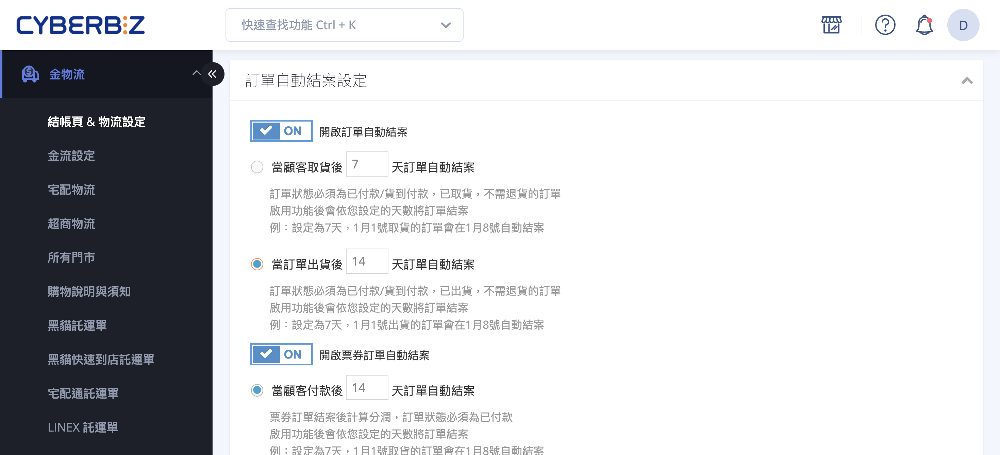
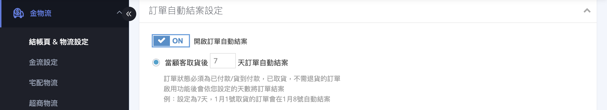
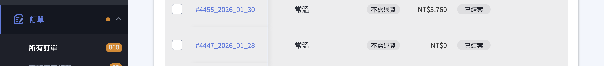

# 設定訂單自動結案

依物流狀態與設定天數，透過系統批次機制自動將符合條件的訂單更新為「已結案」，並同步觸發紅利發送、分潤計算與優惠券生效等後續流程。
{ .subtitle }

{ .hero-page }

## 訂單自動結案說明

透過設定特定天數，系統會自動將符合條件的訂單轉為「已結案」狀態，進而觸發紅利發送、分潤計算與優惠券生效等後續機制。

### 使用須知

- **部分出貨限制：** 若訂單處於「部分出貨」狀態，系統 **無法自動結案**。需等待該訂單所有商品皆更新為「已出貨」或「已收貨」後，方可手動或由系統自動結案。

- **退貨與結案：** 系統預設僅在「退貨狀態」為「不需退貨」時才會執行自動結案。

- **結案後的退貨處理：** 訂單一旦結案，即使後續再進行退貨或取消操作，系統 **不會自動扣除** 已發出的紅利或優惠券，亦不影響已計算成立的分潤，商家需手動至會員頁面處理。

- **對帳標準：**「結案」狀態與財務對帳無直接關係。對帳認列是以配送狀態「已收貨」或「已出貨」為標準，而非以結案日為準。

## 官網一般訂單自動結案設定

此設定適用於透過 **官網前台成立** 的訂單。系統會依據訂單所使用的物流類型（**系統串接物流 / 自訂物流**），在符合指定條件時，自動將訂單狀態更新為「已結案」。

> :lucide-navigation: **設定路徑：** 後台前往 **金物流 > 結帳頁 & 物流設定 > 訂單相關設定 > 訂單自動結案設定**。

---

### 功能與模式

**訂單自動結案** 提供兩種結案邏輯，請依實際使用的物流類型選擇適合的模式：

- [**取貨後自動結案**](#取貨後自動結案已收貨結案)：適用於系統可追蹤實際收貨狀態的物流。 
- [**出貨後自動結案**](#出貨後自動結案已出貨結案)：適用於系統無法取得最終貨態的自訂物流。

---

#### 取貨後自動結案（已收貨結案）

適用於使用系統 **串接物流** 的訂單（例如：7-11、全家、黑貓、宅配通）。  
當系統接收到物流回傳狀態為「已收貨」，並超過指定天數後，系統會自動將訂單結案。

##### 設定步驟

1. 開啟（ON）**訂單自動結案**。
2. 選擇 **取貨後自動結案**。
3. 設定「顧客已收貨後，自動結案的天數」。

---

#### 出貨後自動結案（已出貨結案）

適用於 **自訂物流** 的訂單（例如：商家自行配送、自訂貨到付款）。  
由於系統無法取得實際收貨狀態，當訂單狀態更新為「已出貨」，並超過指定天數後，系統即自動結案。

##### 設定步驟

1. 開啟（ON）**訂單自動結案**。
2. 選擇 **出貨後自動結案**。
3. 設定「訂單已出貨後，自動結案的天數」。

### 批次執行時間

系統於 **每日凌晨 06:15** 進行批次自動結案。

**計算邏輯：** 訂單需「滿 N 天」後的 **下一個 06:15 AM** 才會結案。

**舉例說明（設定 21 天）：**

- **12/03 19:25** 顧客取貨。  
- **12/24 19:25** 滿 21 天。
- **12/25 06:15** 系統正式結案。

> :lucide-flame: **小撇步：** 若設定為 **0 天**，代表取貨後的「隔天清晨 06:15」就會結案。

### 結案狀態確認

自動結案執行後，可已透過以下兩種方式確認結案狀態：

- 訂單操作紀錄：系統將在訂單明細中自動留下歷程紀錄，顯示「訂單被關閉」。
> **路徑：** 訂單 > 所有訂單 > 點擊該筆訂單編號 > 進入頁面底部 **訂單操作紀錄** 區塊。
	
- 訂單列表狀態標籤：在訂單列表頁面，已結案的訂單編號旁將顯示 **已結案** 標籤。

	=== "舊版訂單列表"

		

	=== "新版訂單列表"

		

## 結案狀態對系統的影響

當訂單完成「結案」後，系統會自動執行以下行銷與財務動作：

1. **發送紅利點數：** 購物回饋的紅利點數會在結案後正式歸戶至顧客帳號。

2. **生效優惠券：** 會員參與「滿額贈送優惠券」活動獲得的券，需待訂單結案後才可開始使用。

3. **計算分潤回饋：** 推薦人分潤、註冊分潤等皆在結案當下進行計算。

4. **清除提醒數字：** 自動清除後台左側選單「未結案訂單」的紅色數字提醒。

## 相關操作

- :lucide-file-clock:{ .lg }   
  [__POS 訂單自動結案__]()     
  設定 POS 訂單自動結案。

- :lucide-ticket-check:{ .lg }     
  [__票券訂單自動結案__](../e-ticket/電子票券設定指南#票券分潤與自動結案設定)  
  設定電子票券訂單自動結案。

## 常見問題

??? quote "為什麼我的訂單沒有自動結案"

	請確認以下條件是否皆已符合：

	1. 已開啟 **訂單自動結案** 功能。
    
	2. 訂單物流類型與所選結案模式相符：
    
	    - 串接物流 → 取貨後自動結案
        
	    - 自訂物流 → 出貨後自動結案
        
	3. 訂單狀態已達到「已收貨」或「已出貨」。
    
	4. 訂單未處於「部分出貨」狀態。
    
	5. 退貨狀態為「不需退貨」。
    
	6. 已超過設定天數，並經過下一次系統批次時間（06:15）。

??? quote "可以只針對某些訂單類型自動結案嗎"

	不行，目前訂單自動結案為 **全站統一設定**，無法依商品類型、付款方式或會員等級個別設定。

??? quote "手動結案與自動結案有差別嗎"

	在系統邏輯上 **沒有差別**。無論手動或自動結案，皆會同樣觸發：

	- 紅利點數發送
	- 優惠券生效
	- 分潤計算

	差別僅在於執行方式（人工或系統批次）。

??? quote "如果訂單結案後才發生退貨，系統會自動回收紅利或分潤嗎"

	不會。訂單一旦結案，後續即使發生退貨或取消：

	- 系統不會自動扣回紅利
	- 不會取消已生效優惠券
	- 不會回滾已計算分潤
    

	需由商家自行至會員管理或分潤後台進行人工調整。

??? quote "為什麼設定 0 天，還不是立刻結案"

	因為訂單自動結案是透過 **每日批次任務（06:15）** 執行。

	設定為 0 天代表：

    > 訂單達到「已收貨 / 已出貨」狀態後，於下一個批次時間（06:15）結案，而非即時結案。
    
??? quote "結案時間會影響財務對帳嗎"

	不會。財務對帳是依配送狀態「已出貨 / 已收貨」為準，與訂單是否結案、結案時間無直接關聯。

??? quote "可以查詢哪些訂單即將被自動結案嗎"

	目前系統尚未提供「即將結案清單」或預測列表。建議商家可透過：

	- 訂單列表篩選配送狀態
	- 搭配匯出訂單報表自行計算天數
    
    進行內部預估與管理。