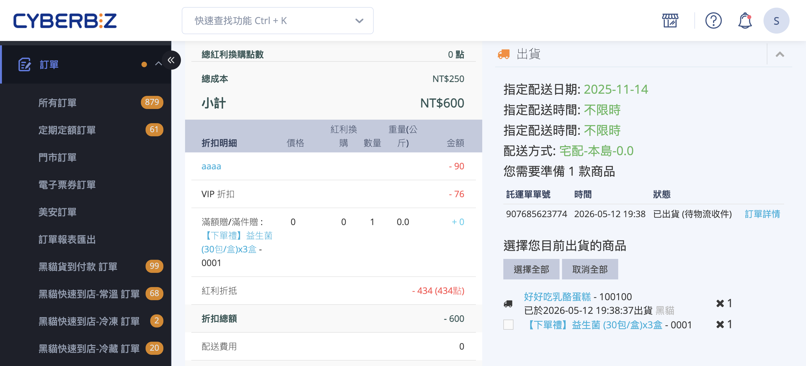

設定訂單部分出貨，包含操作步驟與不同物流的特殊情境說明。
{ .subtitle }

{ .hero-page }

## 部分出貨說明

當一筆訂單中只有部分商品有現貨可寄出時，「部分出貨」讓您先將可出貨的商品寄給顧客，剩餘的商品稍後再以同一筆訂單繼續出貨，以縮短顧客的等待時間。

您只需要在訂單詳情頁的「出貨」區塊勾選 **本次要出貨的商品** ，而非全部商品，系統就會自動將訂單的配送狀態改為「部分出貨」，並保留尚未出貨的品項供您後續處理。

!!! info "提示"
    每執行一次出貨，系統都會 **依照您的勾選** 寄送一封出貨通知 Email 給顧客（預設勾選），請留意顧客可能收到多封通知。

---

## 適用條件與限制

執行部分出貨前，請確認以下條件。任一項不符合，「出貨」區塊將不會出現可勾選的商品或可選的出貨方式。

### 訂單條件

- [x] **訂單狀態**：已開啟。
- [x] **付款狀態**：已付款、貨到付款、待部分退款、部分退款，或自訂付款方式的「待付款」。
- [x] **配送狀態**：未出貨、部分出貨、準備出貨、運送異常。

??? info "不支援部分出貨的情境"

    這些情境下「出貨」區塊會直接隱藏，或下拉選單不會列出對應的物流選項。

    * **大宗寄倉 B2C 訂單** (透過綠界 B2C 大宗寄倉物流的超商訂單)
    * **萊爾富超商 B2C 訂單** (萊爾富一般取貨 / 取貨付款，非店到店)
    * **全家冷鏈託運單** (請一次勾選全部商品)
    * **快速到貨 CYBERBIZ NOW 訂單** ，且狀態已超過「準備出貨」 (詳見後段「特殊情境」)
    * **已退貨的門市自取訂單**
    * **Amazon FBA 串倉訂單**
    * **完全來自串倉倉庫的訂單** ，且商家尚未加購「[部分串倉](../../wms/啟用部分串倉與拆單.md){ data-preview }」功能



### 加值功能對照

以下加值功能皆需另行加購，並非預設方案內建:

| 功能名稱 | 適用情境 |
| :-- | :-- |
| 部分串倉 | 訂單同時包含自行出貨商品與倉庫出貨商品時，允許就「自行出貨」的部分先行出貨 |
| API 超商部分出貨 | 透過 API 對 7-11、全家、萊爾富等超商訂單進行多次出貨 |
| API 快速到貨部分出貨 | 透過 API 對 Uber Direct、foodpanda pandago 等快速到貨訂單進行多次出貨 |

!!! plan "方案/加值功能"
    如不確定您的店家是否已開通上述功能，請聯繫您的 CYBERBIZ 業務窗口確認。一般宅配(黑貓、宅配通、新竹、順豐、自訂出貨方式)的部分出貨 **不需** 額外加購任何功能，可直接使用。



## 操作步驟教學 { #fuilfillment-partial-operate }

以下以「黑貓託運單」為例，其他物流商（如宅配通、順豐、新竹物流或自訂出貨）的操作步驟大致相同。

1. **進入訂單詳情頁：** 前往後台「訂單」>「所有訂單」，點選欲執行部分出貨的「訂單編號」。
2. **勾選本次出貨商品：** 在「出貨」區塊中，勾選本次要優先寄送的商品。如需一次選取全部商品，可點擊「選擇全部」；若需重新選擇，則可點擊「取消全部」。

    

    !!! warning "宅配貨到付款 (COD) 限制"
        若訂單為「貨到付款」，系統將不會顯示部分出貨選項。如需分箱寄送，請改用 「[加印託運單](../payments-and-logistics/補印與加印託運單.md#加印託運單)」 功能，以確保代收款金額能正確分配至多組單號。

3. **選擇出貨方式：** 在下方「選擇出貨方式」的下拉選單中，選擇本次要使用的物流(例如「黑貓託運單」)。

    

    !!! note "下拉選單僅會顯示 已開通的物流方式 及 該訂單可使用的物流選項。"

4. **選擇運費規格：** 在「請選擇費用」下拉選單中，挑選對應的託運單規格(如重量、尺寸區間)。

    

    !!! note "建立託運單後，系統會自動扣除對應的物流點數。"

5. **確認條款與貨件屬性**：
    - **同意條款**：勾選「我同意 CYBERBIZ 物流串接服務條款與...」。(此為必填)
    - **易碎品註記**：若商品易碎，請勾選「是否為易碎品？」，物流商將依此提供對應配送服務。
6. **確認出貨：** 點擊 **「確認出貨」** 按鈕。系統會建立託運單、扣除運費點數，並將該批商品標記為已出貨。
7. **檢視出貨紀錄**：
    - **商品出貨紀錄**：已出貨商品下方會顯示出貨時間與「快遞單號」。

      

    - **訂單配送狀態**：訂單上方的配送狀態將更新為 「部分出貨」。

      

    !!! info "取消限制"
        商家後台無法自行刪除已建立的託運單。若發生誤操作（如物流選錯、勾錯商品），請聯繫 CYBERBIZ 客服 協助取消。

## 後續繼續出貨 { #fulfillment-partial-resume }

當剩餘缺貨商品補齊後，只需要回到同一筆訂單，[重複上述步驟][fuilfillment-partial-operate]{ data-preview } 即可完成後續出貨：

1. **進入訂單**：前往「訂單」>「所有訂單」，點選狀態為 `部分出貨` 的訂單編號。
2. **選取品項**：勾選本次欲寄出的剩餘商品。
3. **執行出貨**：選擇出貨方式與運費後，點擊 **確認出貨**。

!!! info "重要規範"

    | 類別 | 說明 | 
    | :--- | :--- |
    | **狀態更新** | 最後一筆商品出貨前，狀態恆為 `部分出貨`；完成後轉為 `已出貨`。 |
    | **自動化限制** | 部分出貨訂單 **不會自動結案**，需於全數出貨後[手動結案](如何手動結案訂單.md){ data-preview }。 |
    | **顧客通知** | 每次出貨均視為獨立事件，系統將根據勾選狀況重複發送出貨通知。 |

## 不同物流的特殊情境 { #fuilfillment-partial-edge-case }

### 自訂出貨方式

當您使用合作的第三方物流或自行配送時（詳細操作請參考[如何使用自訂物流出貨](如何使用自訂物流出貨.md){ data-preview }）：

1. 於「選擇出貨方式」下拉選單選擇「自訂出貨方式」。
2. 系統會跳出「快遞單號」欄位與物流公司選單。
3. 自行填入該批商品的「快遞單號」並選擇對應的物流公司。
4. 點擊「確認出貨」即可。

---

### 快速到貨 CYBERBIZ NOW (門市出單)

- **進入路徑**：快速到貨訂單的操作入口位於 「門市訂單」，請勿於「所有訂單」列表中處理。
- **缺貨處理**：若門市庫存不足，可勾選實際有現貨的品項先行出貨。詳細流程請參閱 [缺貨訂單部分配送或取消指引](../payments-and-logistics/CYBERBIZNOW/缺貨訂單部分出貨或取消流程.md){ data-preview }。

!!! warning "出貨次數限制"
    預設情況下，快速到貨訂單 **每筆僅能執行一次出貨** 。一旦勾選並確認出貨後，該訂單就無法再對剩餘商品繼續出貨，剩餘部分需走 **退貨退款** 流程。操作前建議先與消費者聯繫並達成共識，避免訂單反覆退款影響顧客體驗。



!!! plan "方案/加值功能"
    若您需要對快速到貨訂單進行 **多次** 部分出貨(例如同一筆訂單分多次寄出)，請聯繫業務窗口加購 **「API 快速到貨部分出貨」** 功能。



---

### 部分串倉訂單

當訂單同時包含「自行出貨商品」與「倉庫商品」時，在已加購「[部分串倉](../../wms/啟用部分串倉與拆單.md){ data-preview }」功能的情況下，**自行出貨** 的部分可依照上述操作步驟先行出貨。倉庫出貨的部分則由倉庫端進行，不在本流程內。

## 何時建議改用「加印託運單」

若您 **不是因為缺貨** 而要分批出，而是「所有商品都要一次寄出，但需要拆成多個包裹」，建議改用 「[加印託運單](../payments-and-logistics/補印與加印託運單.md){ data-preview }」 功能:

* 在同一筆訂單內輸入訂單編號，即可產生多組託運單號，方便分箱追蹤。
* 貨到付款訂單需要分箱寄送時，**必須** 使用加印託運單而非部分出貨。

## 常見問題

??? quote "為什麼我在訂單詳情頁看不到「出貨」區塊？"

    請依以下順序檢查：

    - 訂單狀態是否為「開啟」（已取消的訂單無法出貨）
    - 付款狀態是否為「已付款」、「貨到付款」或「部分退款」等
    - 配送狀態是否為「未出貨」、「部分出貨」、「準備出貨」或「運送異常」
    - 是否為大宗寄倉 B2C、萊爾富 B2C、Amazon FBA 等不支援的物流類型
    - 若為串倉訂單，商家是否已加購「部分串倉」功能

??? quote "出貨後可以取消嗎？"

    商家後台 **無法自行取消** 已建立的託運單。如有勾錯商品、選錯物流或運費點數扣錯，請聯繫 CYBERBIZ 客服協助處理。

??? quote "部分出貨後，訂單會自動轉成「已出貨」嗎？"

    不會。訂單只有在 **所有商品都完成出貨** 之後才會自動轉為「已出貨」。在此之前，訂單狀態會一直停留在「部分出貨」。

??? quote "顧客會收到幾次出貨通知？"

    預設每執行一次出貨就會寄送一次通知 Email。若您不希望顧客收到多封通知，可在「確認出貨」前，**取消勾選**「發送郵件通知顧客」。

??? quote "貨到付款訂單可以部分出貨嗎？"

    因為代收款金額是綁定在託運單上的，分多次寄送會讓代收款分散在多張託運單，結帳對帳較複雜。請改用 **「加印託運單」** 功能，於同一筆訂單產生多組單號統一管理。

??? quote "部分出貨後要如何繼續出貨剩餘商品？"

    回到同一筆訂單詳情頁，重複部分出貨的操作步驟即可：

    1. 前往「訂單」>「所有訂單」，點選狀態為「部分出貨」的訂單編號。
    2. 勾選本次欲寄出的剩餘商品。
    3. 選擇出貨方式與運費後，點擊「確認出貨」。

??? quote "快速到貨訂單可以部分出貨嗎？有什麼限制？"

    快速到貨訂單允許在門市現場缺貨時執行部分出貨，但 **預設每筆僅能執行一次**。一旦出貨後，剩餘商品無法再繼續出貨，需走退貨退款流程。

??? quote "加印託運單和部分出貨有什麼不同？"

    兩者適用情境不同：

    - **部分出貨**：因缺貨而分批寄送，每次出貨後訂單狀態維持「部分出貨」，直到全部出貨完成。
    - **加印託運單**：所有商品都有現貨，但需要拆成多個包裹一次寄出，在同一筆訂單產生多組託運單號。貨到付款訂單分箱寄送時 **必須** 使用加印託運單。

