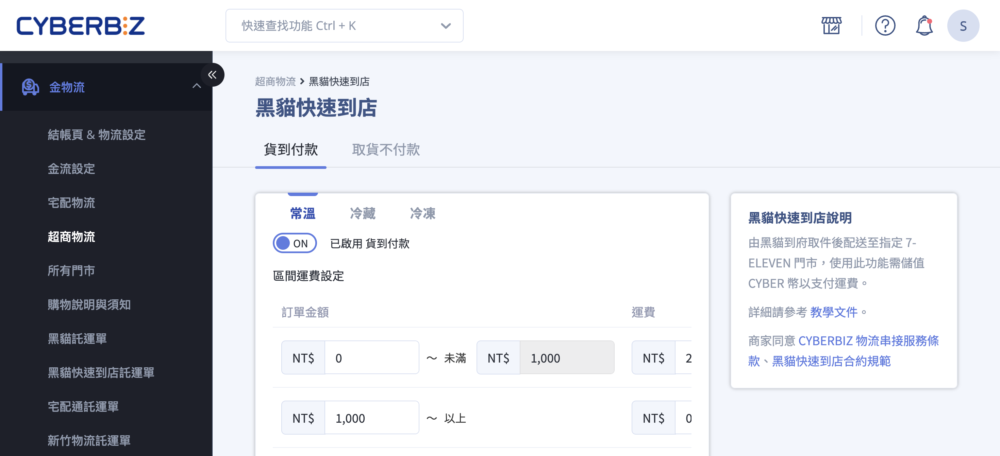
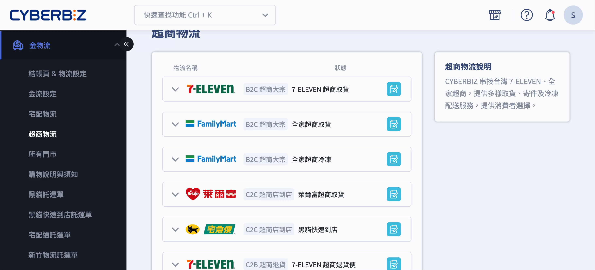
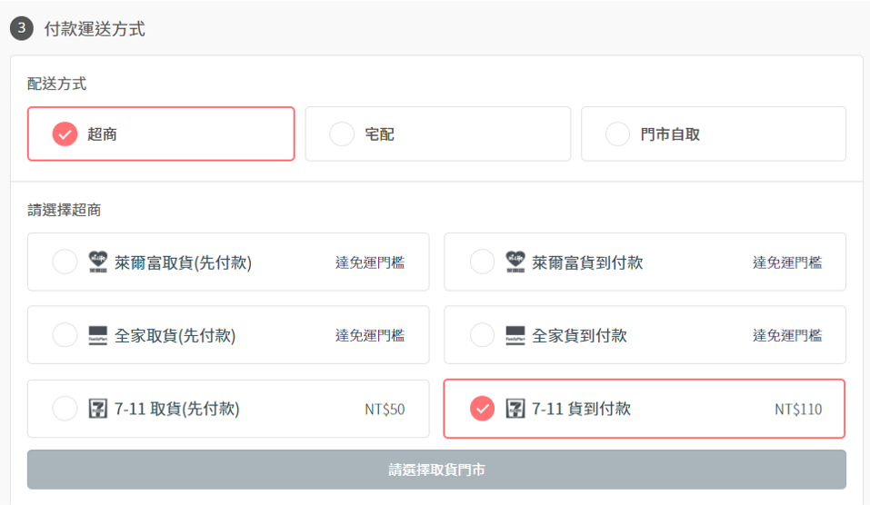
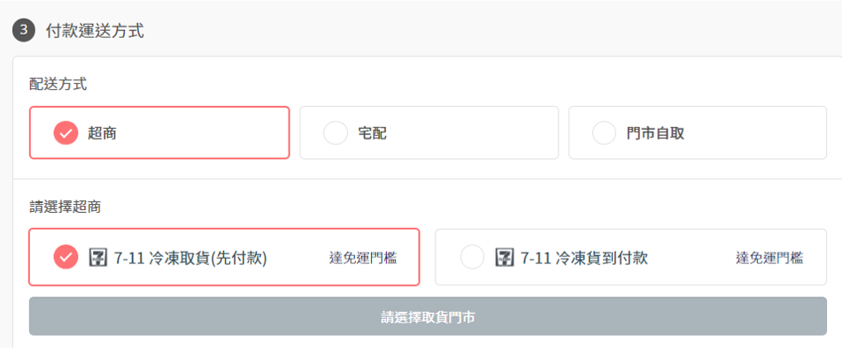

# 設定黑貓快速到店付款方式

設定黑貓快速到店的付款方式，包含貨到付款與取貨不付款的設定步驟。
{ .subtitle }

{ .hero-page }

## 黑貓快速到店付款說明

商家可提供「貨到付款」與「取貨不付款」兩種選擇，其運作模式是由黑貓司機到商家指定地點收貨，隨後配送至消費者指定的 **7-11 門市**。

## 步驟一：後台設定路徑

1. 登入 CYBERBIZ 管理後台，前往 **金物流 > 超商物流**。
2. 在 **黑貓快速到店** 區塊，點擊編輯按鈕 :material-file-document-edit-outline: 進入編輯頁面。

## 步驟二：付款方式設定步驟

### 設定「貨到付款」（COD）

!!! info "此功能 **僅限開通 CYBERBIZ PAYMENTS 的商家** 使用。"

1. 切換至 **貨到付款** 頁籤。
2. **開啟功能：** 將「貨到付款」開關切換至 **「ON」**。

3. **運費與手續費：**

	- 商家需根據「常溫」、「冷藏」、「冷凍」等不同溫層設定運費區間與免運門檻。
	- **注意：** 使用貨到付款時，黑貓會根據代收金額額外收取「代收手續費」，運費部分則比照原配送金額。
	
4. 點擊 **儲存**，套用變更。

??? note "黑貓快速到店代收金額表"

	|**貨到付款手續費 (TWD)**|**代收金額 (TWD)**|
	|---|---|
	| 30 |0 ~ 2,000 |
	| 60 |2,001 ~ 5,000 |
	| 90 |5,001 ~ 10,000 |
	| 120 |10,001 ~ 20,000 |
	| 150 |20,001 ~ 50,000 |
	| 300 |50,001 ~ 100,000 |
	
### 設定「取貨不付款」（貨到不付款）

1. 切換至 **取貨不付款** 頁籤。
2. **開啟功能：** 將「取貨不付款」開關切換至 **「ON」**。
3. **運費設定：** 可針對各別溫層設定基本運費與免運金額，若不開放免運則選擇「關閉」。
4. 點擊 **儲存**，套用變更。
5. **前台顯示：** 消費者在結帳頁面完成線上支付（如信用卡）後，即可選擇此物流方式。

## 顧客端呈現畫面

- 顧客在官網結帳頁面 **不會直接看到** 「黑貓快速到店」的字樣。

- 系統會顯示由黑貓提供的 **7-11 超商地圖**，消費者選取門市後，商家端即透過黑貓快速到店服務進行配送。

- 若商家同時開啟常溫與冷凍配送，顧客會依據購買商品的溫層看到相對應的 7-11 配送選項。

/// caption
常溫
///

/// caption
冷凍
///

## 重要規範與注意事項

- **物流運費查詢：** 可至後台 **管理中心 >對帳中心 >  其他物流運費** 查看詳細費率。

- **包裹規格限制：**
	
	- **重量：** 不得超過 **10 公斤**。
	- **材積：** 三邊總和不得超過 **105 公分**（無單邊長度限制）。

- **配送區域：** 僅支援 **台灣本島** 配送。

- **退貨費用：** 若消費者逾期未取，包裹退回商家時，黑貓會收取 **兩次運費**（去程運費 + 回程退貨運費），若為貨到付款則代收手續費另計。

- **低溫預冷：** 寄送低溫包裹前，務必先行預冷（冷藏 6 小時以上，冷凍 12 小時以上），以確保配送品質。

## 後續步驟

- :lucide-import:{ .lg }   
  [__黑貓快速到店出貨__]()     
  操作黑貓快速到店出貨。

- :lucide-ban:{ .lg }     
  [__物流限制與排除選項__](設定超商配送限制與物流排除.md)  
  設定商品的配送物流條件，限制特定物流方式於結帳流程中的顯示與使用。

## 常見問題

??? quote "是否可以同時開啟 黑貓快速到店 和 7-11 超商取貨付款?" 
	可以。但顧客在前台結帳頁會看到兩個 7-11 選項。為了避免混淆，建議同一種超商取貨只開啟一種配送物流方式。

??? quote "顧客在結帳頁要如何選擇黑貓快速到店配送?" 
	顧客在前台 **不會直接看到** 名為 **黑貓快速到店** 的物流選項，而是直接看到黑貓提供的 **7-11 超商地圖**。對顧客而言，流程與一般超取無異，差別僅在於商家端是透過黑貓體系將商品送達指定超商。

??? quote "能否同時開啟黑貓快速到店 常溫和冷凍 的配送?" 
	可以。若顧客購買的商品同時包含常溫與冷凍溫層，結帳頁面會分別顯示對應的黑貓快速到店物流選項（皆顯示為 7-11 超商配送），供顧客依溫層選擇。

??? quote "黑貓快速到店常溫和冷凍配送的超商地圖是否相同?" 
	**不一定相同**。顧客在結帳頁看到的超商取貨地圖由黑貓直接提供，系統會根據 **常溫或冷凍** 的配送需求，自動篩選並顯示支援該溫層配送的超商門市。