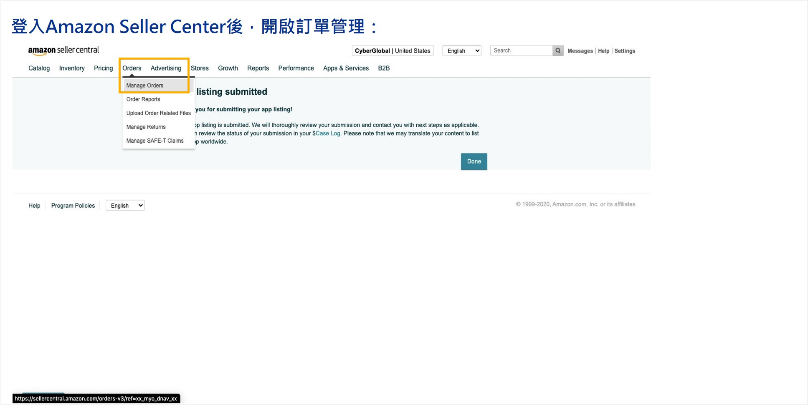
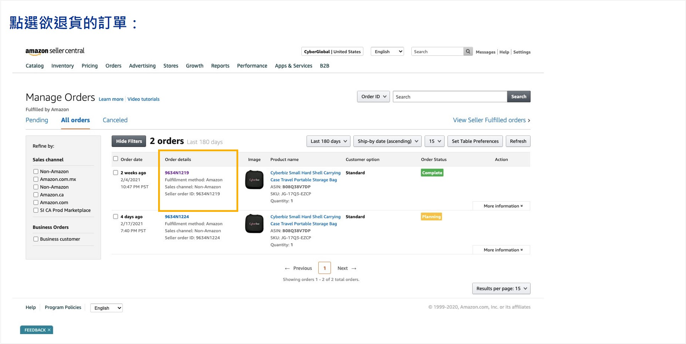
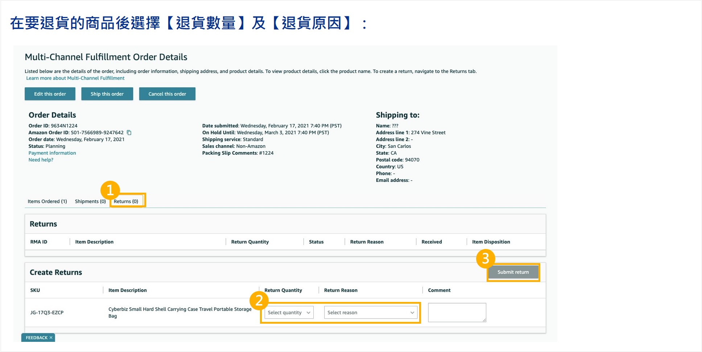
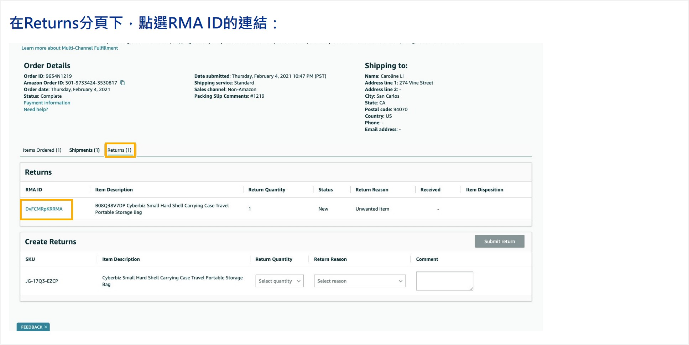
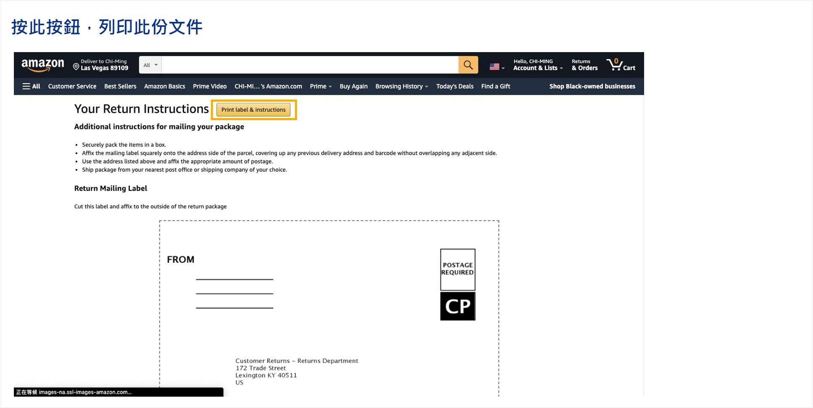

# 跨境電商退貨流程

當會員提出退貨申請或商家需手動啟動退貨程序時，您可以透過後台進行「逆物流安排」與「退貨審核」。
{ .subtitle }

[:lucide-layers:{ title="適用產品" }](../../resources/conventions#適用產品) | 跨境電商 (北美站 / 日本站 / 東南亞站)
[:lucide-tag:{ title="適用方案" }](../../resources/conventions#適用方案) | Pro / Business
{ .doc-badge }

!!! info "核心規則須知"
    - **次數限制**：每筆訂單僅接受 **一次** 退貨退款申請。若已完成部分退貨，該訂單剩餘商品無法再次申請。
    - **紅利與優惠券**：系統 **不會自動歸還** 訂單中使用的點數/券，也 **不會自動扣除** 該訂單消費產生的點數回饋。若需更動，請至 **會員明細頁** 手動調整。
    - **分潤機制**：只要訂單曾達到 **已結案** 狀態，即會計算分潤；後續退貨 **不會影響** 已產生的分潤紀錄。

## 步驟 1：啟動退貨與安排逆物流

依據退貨發起方，訂單列表中的 **退貨狀態** 會有不同顯示：

- **會員申請**：自動顯示為 `退貨申請`。
- **商家發起**：初始顯示為 `不須退貨`。

操作步驟：

1. 前往 **訂單 > 所有訂單**。
2. 勾選指定訂單，點選 **退貨中** > **退貨審查**。

### Amazon逆物流取回（僅適用Amazon FBA物流出貨訂單）

該筆訂單若使用 Amazon FBA 物流出貨，可透過 Amazon 建立逆物流託運單，請依照下方步驟操作。

1. 登入 Amazon Seller Center，前往 **Orders > Manage Orders**。
    
2. 點選指定訂單。
    
3. 選擇 **Returns** 頁籤，於 **Create Returns** 區域選擇欲退貨商品。
    
4. 於 **Returns** 區域，點選 **RMA ID 連結**。
    
5. 點選 **Print label & instructions**，儲存 **RMA label** 與 **託運單**。
    
6. 將 **RMA label** 與 **託運單** 提供給消費者，指引消費者將 2 份標籤貼至包裹外箱，並寄回包裹。
7. Amazon 倉庫收貨後會執行檢查與入庫作業。

## 步驟 2：執行退貨審查

=== "全部退貨"

    > 適用情境 
        - 整筆訂單品項皆需退回 
        - 訂單金額全數退款

    1. 前往 **訂單 > 所有訂單**。
    2. 勾選指定訂單，點選 **退貨審查** > **已退貨**。
    3. 狀態更動後，請接續進行 [退款操作](跨境電商退款流程.md)。

    

=== "部分退貨"

    > 適用情境 
        - 僅退回訂單內部分商品 
        - 訂單部分金額退款

    1. 前往 **訂單 > 所有訂單**。
    2. 勾選指定訂單，點選 **退貨審查** 後，進入訂單明細頁。
    3. 找到 **部分退款** 區塊，勾選核准退回的商品與輸入退款數量。
    4. 輸入 **退款金額**（系統會代入原價總計，商家可手動調整）。
    5. 點擊 **確認退款**，`退貨狀態`將更新為 `部分退貨`。
    6. 狀態更動後，請接續進行 [退款操作](跨境電商退款流程.md)。

    

=== "拒絕退貨"

    > 適用情境 
        - 商品毀損、超出期限等不符退貨標準的情況

    1. 前往 **訂單 > 所有訂單**。
    2. 勾選指定訂單，點選 **退貨審查** > **拒絕退貨**。
    3. 流程至此結束。

    

## 常見問題

??? quote "為什麼使用了逆物流，訂單狀態會自動變更？"
    若使用系統整合的逆物流，當會員將包裹交給物流人員後，系統接收到物流訊號，會自動將狀態從 `退貨中` 更新為 `退貨審查`，方便商家追蹤進度。

??? quote "部分退貨時，運費要退嗎？"
    這取決於您的商店政策。系統代入的退款金額僅為商品原價加總，若您需退還部分運費，請手動增加退款金額；若需扣除整新費，則手動減少金額。

??? quote "如果退貨審核點錯了，可以重來嗎？"
    由於每筆訂單僅能執行一次退貨流程，一旦狀態變更為 **退貨中**，系統便視為流程結束。建議在點擊前務必確認核實。

