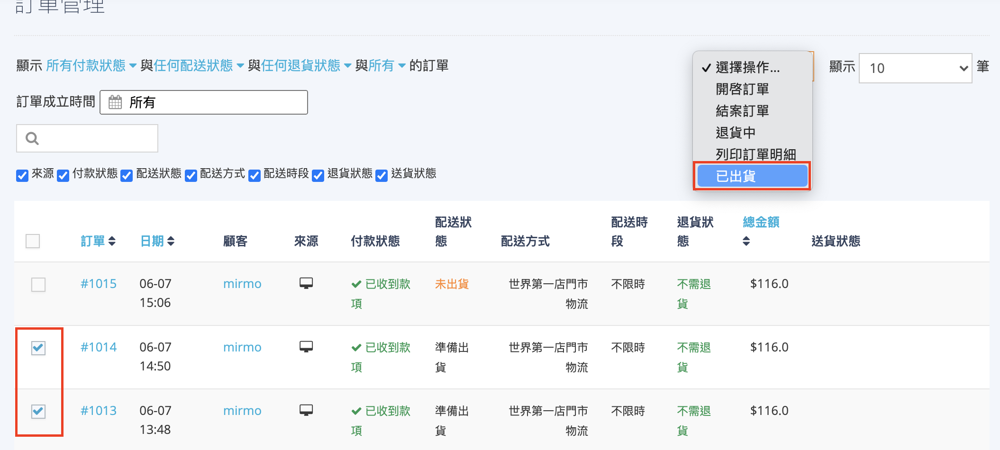
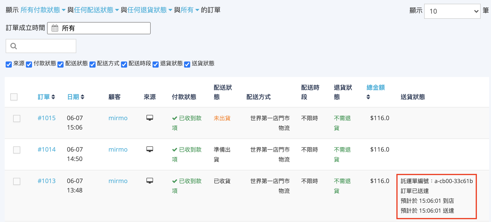

# 快速到貨出貨與配送追蹤
本文件指引門市人員如何發起出貨請求、媒合司機、交付商品，並追蹤配送狀態直至消費者收貨。
{ .subtitle }

[:lucide-tag:{ title="適用方案" }](../../resources/conventions#適用方案) | 所有PLUS / 企業
{ .doc-badge }

!!! tip "應用情境"
	- **呼叫司機**：商品打包完成，需通知外送平台派遣司機前往門市取貨。
	- **配送監管**：消費者詢問訂單進度時，透過後台即時查看司機位置與預計送達時間。

## 使用須知

- **出貨不可逆性**：一旦狀態變更為 **已出貨**，系統將即時向外送平台發起派單，無法隨意取消。
- **司機媒合時效**：媒合時間視外送平台供需狀況而定，若長時間未媒合成功，可參考 [異常處理](快速到貨配送異常規範.md) 建議。

## 操作流程

### 步驟 1：發起出貨並媒合司機

1. 前往 **訂單 > 門市訂單**，找到狀態為 **準備出貨** 的訂單。
2. 勾選目標訂單，在上方選單選擇 **已出貨**。
    { .screenshot }

3. 系統即刻向外送平台（Pandago 或 Uber Direct）發送派單請求。
4. 在 **送貨狀態** 欄位觀察狀態變化：
    - `司機媒合中`：系統正在尋找附近外送員。
    - `司機媒合成功`：已確定外送員，頁面將顯示司機姓名與聯絡資訊（視平台支援度而定）。

### 步驟 2：交付商品予外送司機

1. 當外送司機抵達門市，請主動詢問其所屬平台及要取的訂單編號。
2. 核對司機手機介面上的 **託運單編號** 是否與後台訂單的 **送貨狀態** 顯示的編號一致。
    { .screenshot }
3. 將包裝好的商品交付司機。

### 步驟 3：追蹤配送進度

1. 查看訂單的 **送貨狀態**，了解即時配送資訊：
    - **司機位置**：部分平台提供動態地圖連結。
    - **狀態名稱**：包含 **司機已到店取貨**、**訂單已送達**。
2. 司機將貨送達消費者手中後，後台訂單的配送狀態即會改為 **已收貨**。

## 配送狀態邏輯說明

快速到貨的配送狀態會隨外送平台的資訊自動更新，主要節點如下：

| 狀態名稱 | 觸發條件 | 消費者端感受 |
| :--- | :--- | :--- |
| **司機媒合中** | 商家點擊 **已出貨** 後 | 收到簡訊告知正在為您尋找司機 |
| **司機已媒合成功** | 司機接單後 | 可查看司機位置與預計送達時間 | 
| **司機已到店取貨** | 司機於門市領取商品後 | 收到簡訊告知司機已取貨，開始配送 |
| **訂單已送達** | 司機完成交付並點選完成 | 已取得包裹 |

!!! note "結案說明"
    當配送狀態轉為 **已收貨** 後，該訂單會自動更新為 **已結案** 狀態，商家無需手動結案。若系統因網路延遲未更新，可於 24 小時後手動將狀態標記為 **已結案**。

---

## 常見問題

??? quote "司機媒合成功後，我可以取消這筆出貨嗎？"
    若司機已在前往門市途中，取消派單可能會產生取消費用（視外送平台規範而定）。若非必要（如發現商品毀損或嚴重缺貨），建議不要隨意取消已媒合的訂單。

??? quote "消費者反映沒收到簡訊追蹤連結怎麼辦？"
    請門市人員在訂單詳情頁的 **物流訊息** 區塊中，複製該筆訂單的 **外送追蹤連結**，手動發送給消費者或透過後台通訊工具提供。

??? quote "Uber Direct 的 PIN 碼是什麼？在哪裡看？"
    PIN 碼是為了確保配送準確性的驗證機制，通常為 **消費者訂購電話的末四碼**。司機送達時會向消費者索取，商家端在後台訂單詳情的客戶資訊中也可查看到該電話號碼。

