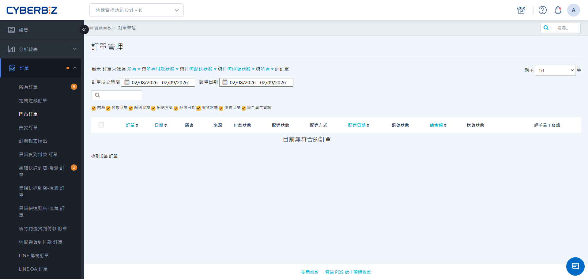
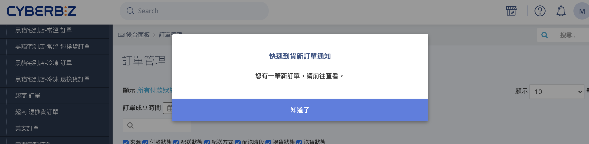
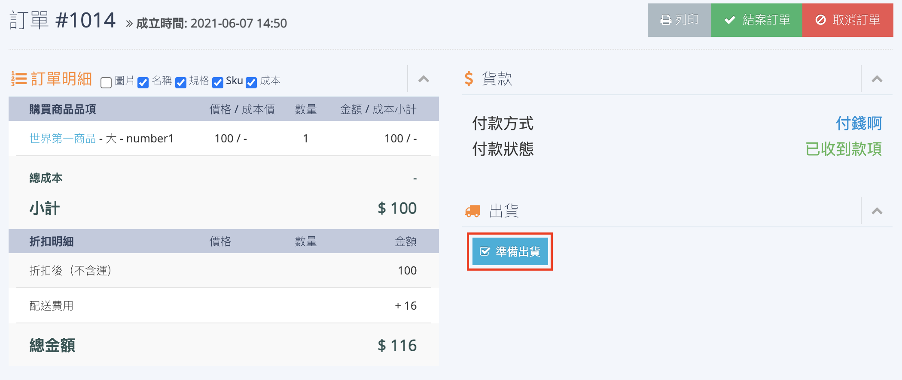

# 快速到貨接單準備
指引門市人員如何識別、準備並接收快速到貨訂單，確保配送服務的即時性。
{ .subtitle }

[:lucide-tag:{ title="適用方案" }](../../resources/conventions#適用方案) | 所有PLUS / 企業
{ .doc-badge }

{ .hero-page }

!!! tip "應用情境"
	- **門市即時接單**：當消費者透過快速到貨下單，門市人員需第一時間響應並確認庫存。
	- **配送限制核對**：在接單前確認商品是否符合外送業者的材積與重量規範。

---

## 使用須知

- **付款狀態限制**：快速到貨不支援 **貨到付款**，僅限 **已收到款項** 之訂單方可操作出貨。
- **系統通知機制**：需維持管理後台 **門市訂單** 分頁開啟，方能接收新訂單鈴聲與彈窗通知。
- **材積規範限制**：商家需自行評估商品是否超過外送業者（Pandago / Uber Direct）的配送限制，若超標建議 **拆單處理**。
- **時效性限制**：快速到貨強調即時配送，建議在訂單成立後 10-30 分鐘內完成接單與備貨。

## 操作流程

### 識別並接收新訂單

1. 登入 CYBERBIZ 管理後台，前往 **訂單 > 門市訂單**。
2. 維持頁面開啟，當有新訂單成立時，系統會播放新訂單鈴聲並跳出彈窗。
3. 點選彈窗中的 **知道了** 關閉通知。
    { .screenshot }

4. 點擊 **訂單編號** 進入明細頁，核對商品種類、數量與庫存。
5. 點選 **準備出貨**。
    { .screenshot }

!!! info "系統行為說明"
    當訂單狀態變更為 **準備出貨** 後：

    - 系統會自動發送 **快速到貨確認信 Email** 給消費者。
    - 消費者端將無法自行取消訂單。

## 配送材積規範

在接單準備商品前，請務必確認包裝後的材積符合以下規範：

| 外送業者 | 材積限制 (長 x 寬 x 高) | 重量限制 | 備註 |
| :--- | :--- | :--- | :--- |
| **Pandago** | - 置於機車前腳踏板：30 x 60 x 40 cm (約 2 材) - 置於保溫袋： 40 x 40 x 20 cm | 總重 20 公斤內 | 可併用腳踏板空間與保溫袋出貨 |
| **Uber Direct** | - 置於機車前腳踏板：30 x 60 x 40 cm - 置於保溫袋： 40 x 40 x 40 cm | 總重 13 公斤內 | 可併用腳踏板空間與保溫袋出貨 |

---

## 常見問題

??? quote "為什麼我沒有聽到新訂單的提醒鈴聲？"
    請確認是否已登入後台並保持 **訂單 > 門市訂單** 頁面開啟（可切換至其他分頁，但不可關閉）。同時請檢查瀏覽器是否已開啟分頁靜音，或電腦音量是否正常。

??? quote "消費者反映下錯門市，我可以直接幫他修改嗎？"
    不可以。快速到貨訂單的門市與外送地址是綁定的。若地址有誤或選錯門市，建議與消費者協調取消訂單後，由消費者重新下單選擇正確地址或門市。

??? quote "訂單狀態是 **未付款**，我可以先點擊準備出貨嗎？"
    不可以。請等待狀態更新為 **已收到款項** 後再處理。由於快速到貨不支援貨到付款，為避免後續收款問題，應確保金流完成後再開始作業。

