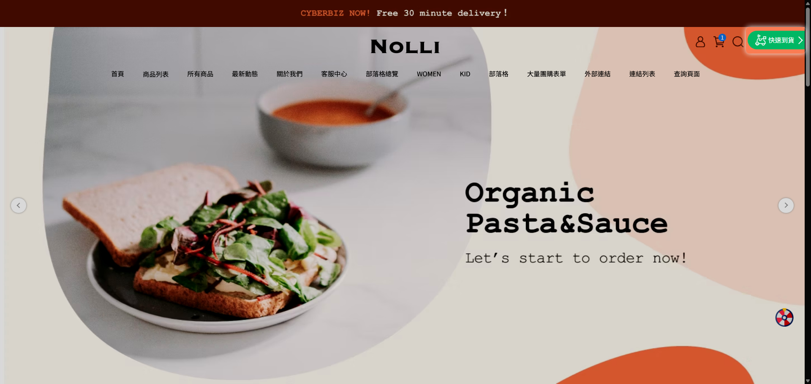
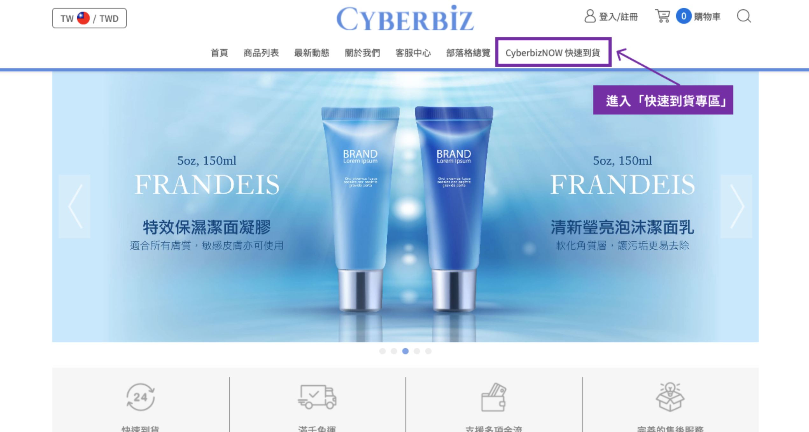
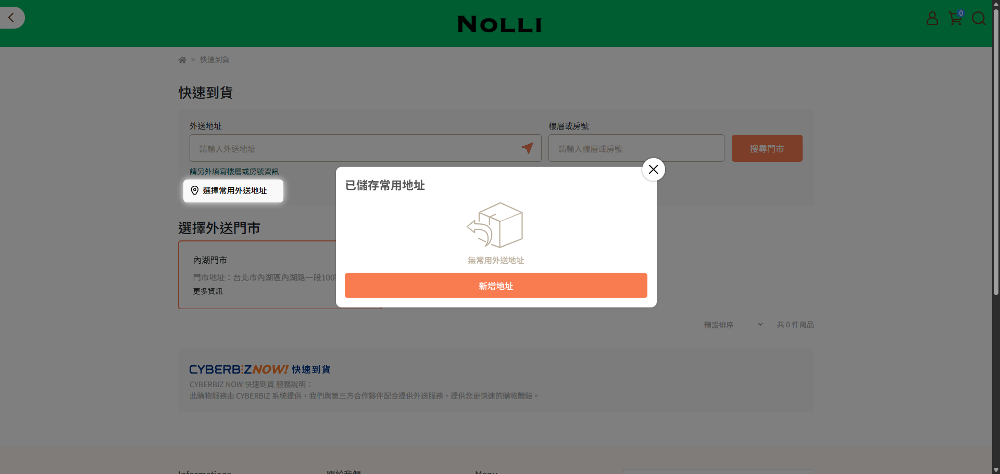
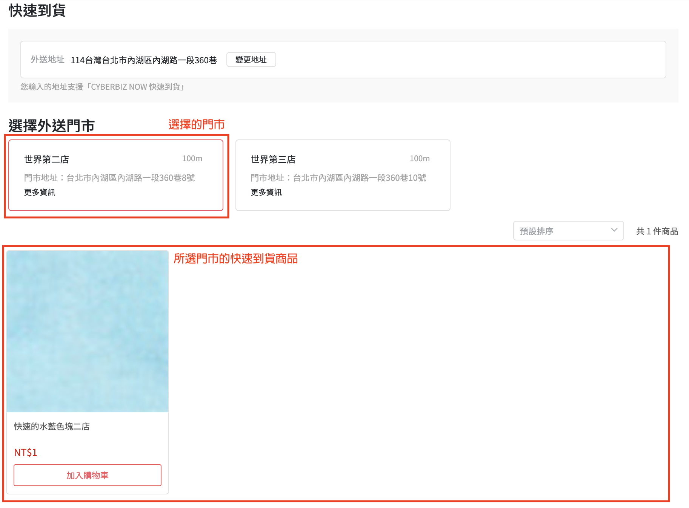

# 消費者購買流程
本文件說明消費者在前台 **快速到貨專區** 的下單流程、運費計算邏輯，以及收貨時的 PIN 碼驗證規範。
{ .subtitle }

[:lucide-tag:{ title="適用方案" }](../../resources/conventions#適用方案) | 所有PLUS / 企業
{ .doc-badge }

{ .hero-page }

!!! tip "應用情境"
	- **顧客教育**：商家可參考本文件製作消費者版的操作手冊。
	- **門市諮詢**：當消費者詢問如何使用快速到貨或為何無法結帳時，提供對應解答。

## 使用須知

- **付款方式限制**：快速到貨 **不支援貨到付款**。消費者必須先完成線上付款（狀態為 **已收到款項**），商家端方可執行接單出貨。
- **地址鎖定**：結帳時的收件人地址預設為搜尋時輸入的地址，且 **進入結帳流程後無法修改**。
- **運費組成**：總運費 = 平台運費（Pandago/Uber Direct）+ 商家設定之加價費用。若訂單金額達免運門檻，則消費者免付運費。
- **服務範圍限制**：因快速到貨特性，配送最遠距離限制為 **5 公里**。
---

## 下單流程

### 步驟 1：輸入配送地址

1. 進入商店前台，點擊 **CYBERBIZ NOW 快速到貨專區**。

    === "拖拉版型"
        { .screenshot }

    === "預設版型"
        { .screenshot }

2. 在地址搜尋欄輸入詳細配送地址。
    - 或點擊搜尋框右側的 :lucide-send:，使用當前位置。
3. 系統將依據距離顯示所有可配送門市。
    - 若門市顯示 **目前不接受服務**，表示該門市目前不在接單時段內。
4. **建立常用外送地址(選用)**：可點擊 **選擇常用外送地址**，新增並儲存地址(至多可儲存5個地址)。
  { .screenshot }

### 步驟 2：選購門市商品

1. 點擊選定門市，即可於下方瀏覽該門市的商品列表。
2. 挑選商品並加入購物車。

    > 注意：快速到貨商品以彈窗形式呈現，無獨立商品分頁。
    
3. **多門市結帳邏輯**：
    - 若同時加入不同門市的商品，結帳前會進入 **多購物車** 選擇頁面。
    - 消費者一次僅能針對一家門市的購物車進行結帳。

{ .screenshot }

### 步驟 3：結帳與備註

1. 進入結帳頁面，確認收件資訊與電話。
2. 在 **訂單備註** 欄位輸入給外送司機的特殊指示（如：請放門口、到了請打電話）。
3. 點選 **立即結帳**。即可收到 **新訂單提醒 Email**。

    > 此時須待門市接單，訂單才會開始配送。門市有權有權決定接單與否，若商家拒絕接單，款項將退還給您。

---

## 收貨與驗證

### 1. 追蹤配送進度
訂單成立並經門市確認接單後，當司機媒合成功，消費者會收到 CYBERBIZ 發送的 **門市確認接單Email**，此時無法再取消訂單。 

### 2. 追蹤配送進度

司機媒合功能後，外送平台會發送 **簡訊通知**，點擊簡訊內的連結即可即時查看：

- 司機當前地圖位置。
- 預計送達時間。

### 3. PIN 碼收貨驗證 (Uber Direct 適用)
若該筆訂單是由 **Uber Direct** 配送，為確保配送安全，收貨時需核對身分：

- **操作方式**：消費者需提供 **手機末四碼** 作為 PIN 碼給予外送員。
- **目的**：外送員輸入正確 PIN 碼後，訂單方可完成。

---

## 常見問題

??? quote "為什麼搜尋地址後顯示 **目前不接受服務**？"
    這表示該門市目前不在 **接單時間** 內。請注意， **接單時間** 由商家自行設定，不一定等於門市的實際營業時間。

??? quote "可以在結帳時更改外送地址嗎？"
    不可以。快速到貨的門市配送範圍是依據搜尋時的地址判定的。若需更改地址，必須返回搜尋頁重新輸入，系統將重新匹配對應的配送門市。

??? quote "下單後可以隨時取消訂單嗎？"
    在商家尚未點擊 **準備出貨** 前，消費者可聯繫客服取消；一旦商家點擊 **準備出貨** 並發出確認信，消費者端將無法自行取消，以保障即時配送的資源調度。

??? quote "商家可以自行調整外送門市的順序嗎？"
    可以。您可以於 **金物流 > 所有門市**，手動調整門市排序，前台即會依序顯示。

