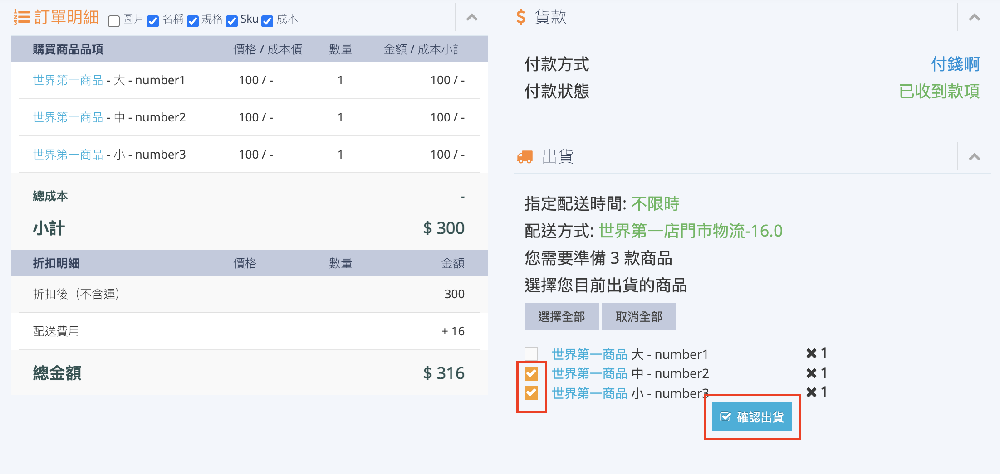
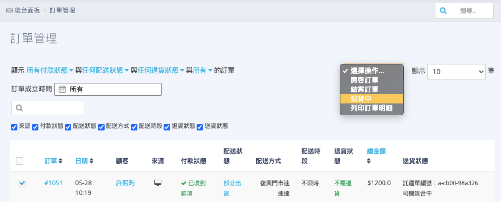
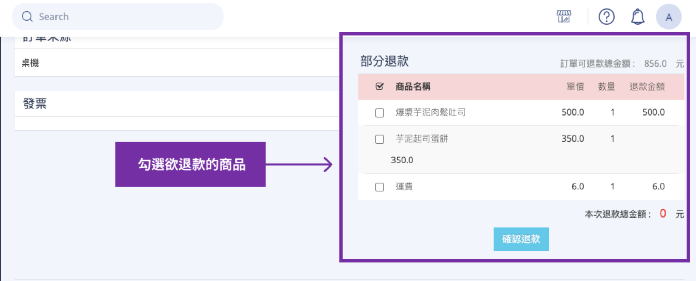
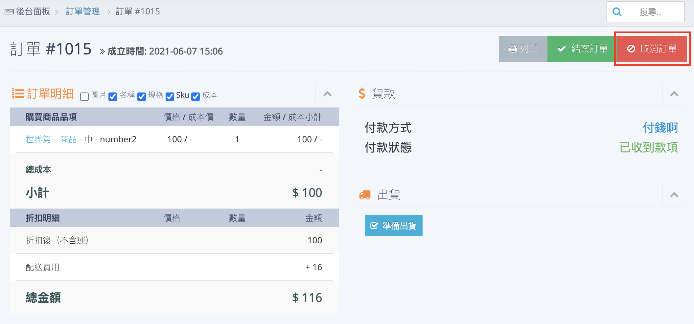

# 缺貨訂單部分配送或取消流程
當快速到貨訂單發生商品缺貨、訂單超出材積限制時，本文件指引如何操作部分出貨、辦理差額退款或執行整單取消作業。
{ .subtitle }

[:lucide-tag:{ title="適用方案" }](../../resources/conventions#適用方案) | 所有PLUS / 企業
{ .doc-badge }

!!! tip "應用情境"
	- **部分缺貨**：訂單中僅部分商品缺貨，經聯繫後消費者同意先寄出有貨商品。
	- **整單缺貨**：門市無法供應訂單內所有商品，需主動取消訂單並全額退款。

---

## 使用須知

!!! danger "關鍵限制：部分出貨僅限一次"
    快速到貨訂單的部分出貨功能 **只能操作一次**。一旦點選確認出貨，系統將立即呼叫外送司機，剩餘未勾選的商品將自動視為不配送，且後續無法再次針對該筆訂單呼叫司機。

- **溝通先行原則**：操作任何缺貨處理（部分出貨或取消）前，建議先撥打電話與消費者確認，避免發生消費糾紛或不必要的逆物流運費。
- **狀態前置要求**：
    - **部分出貨**：訂單必須先改為 **準備出貨** 狀態，方能進行部分出貨的操作。
    - **取消訂單**：訂單狀態必須保留為 **未出貨**，若訂單已切換至 **準備出貨**，請以 **部分出貨** 或 **退貨處理**。
- **退款時效**：快速到貨訂單皆為已付款，取消或退貨後，系統將依原付款方式（如：信用卡刷退）自動啟動退款程序。

## 操作流程

### 任務一：操作部分商品出貨

當您決定只寄出訂單中的部分商品時，請依照以下步驟操作：

1. 前往 **訂單 > 門市訂單**，點擊進入該筆貨態為 **準備出貨** 的訂單明細。
2. 在商品清單中，勾選本次要實際寄出的商品與數量。
3. 再次確認勾選內容無誤（記住：剩餘未勾選商品將無法再次呼叫司機）。
4. 點選 **確認出貨**。
    { .screenshot }
5. 系統將自動發起外送媒合，訂單配送狀態將更新為 **部分出貨**。

完成部分出貨後，需針對未寄出的商品執行退款作業：

1. 前往 **訂單 > 門市訂單**，將訂單配送狀態操作為 **退貨中 > 退貨審查**。
    { .screenshot }
2. 於訂單明細中的 **部分退款** 區塊，勾選要退款的商品項，並核對應退金額（系統會自動計算，亦可手動調整）。
    { .screenshot }
3. 點選 **確認退款**，系統將自動啟動金流刷退程序。

### 任務二：整單取消（拒絕接單）

若訂單完全無法供應，需整單取消時：

1. **尚未點擊「準備出貨」前**：
    - 直接在明細頁點擊 **取消訂單**，選擇取消原因並確認。
      { .screenshot }
2. **已點擊「準備出貨」但尚未呼叫司機前**：
    - 勾選訂單，操作為 **退貨中**，後續依退貨流程辦理全額退款。
3. **已點擊「已出貨」正在媒合司機中**：
    - 若狀態為 **司機媒合中**，可嘗試操作為 **退貨中** 來取消媒合。
    - 若取消成功，狀態將轉為 **運送異常**，商家需收信確認取消結果。
    - 若取消失敗，即可在送貨狀態看到 **不可取消媒合**。司機依然會前往門市取貨，且須支付運費。

## 常見問題

??? quote "我點了部分出貨後，發現漏勾了一個商品，還可以補寄嗎？"
    不可以。快速到貨訂單的系統邏輯是 **一次性媒合**，一旦點擊確認，派單請求就會送往外送平台。若漏寄商品，建議將該商品辦理退款，並請消費者重新下單，或與消費者協調以其他物流方式補寄（運費需由商家負擔）。

??? quote "部分出貨後，運費會如何計算？"
    快速到貨的運費是依照該筆訂單成立時的預估路徑計算。即便您操作部分出貨，支付給外送平台的運費通常仍會維持原金額，不會因商品減少而降低。

??? quote "為什麼我點了取消媒合卻失敗了？"
    若外送平台已成功指派司機且司機已接近門市，系統可能不允許取消媒合。此時建議等司機抵達後告知原因，並由商家負擔該筆第一段運費（司機已出車費用）。
