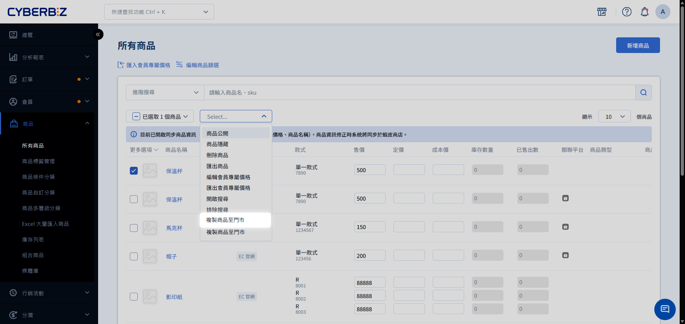

# 複製商品到快速到貨門市

將適合快速配送的商品複製到門市，讓消費者可在快速到貨專區選購並享受即時配送服務。
{ .subtitle }

[:lucide-tag:{ title="適用方案" }](../../resources/conventions#適用方案) | 所有PLUS / 企業
{ .doc-badge }

{ .hero-page }

!!! tip "應用情境"
    - **提升即時購物率**：將日用品、熱銷零食複製到門市，滿足消費者 **現在就要** 的需求。
    - **地區限定銷售**：針對特定門市區域的客群特性，複製適合的地區性商品。
    - **優化配送效率**：挑選尺寸與重量適中的商品，降低外送司機的配送難度與損壞風險。

## 使用須知

### 庫存與價格獨立

門市商品是官網商品的 **副本**。

- **銷售扣減**：門市 A 賣出商品，僅會扣除門市 A 的庫存，官網與門市 B 的庫存不會變動。
- **差異定價**：您可以針對租金較高的都會區門市調高門市售價，而不影響官網售價。

### 多購物車結帳流程

當消費者同時將 **一般商品** 與 **快速到貨商品** 加入購物車時：

1. 結帳時系統會引導至 **多購物車** 頁面。
2. 消費者需選擇其中一個購物車先進行結帳（兩類商品無法合併於同一筆訂單下單）。

## 操作流程

### 步驟 1：挑選適合的商品

並非所有商品都適合快速到貨配送，建議依據以下標準進行篩選：

| 篩選標準 | 建議規格 | 範例 |
| :--- | :--- | :--- |
| **尺寸重量** | 單邊 ≤ 45cm，重量 ≤ 2kg | 3C 配件、服飾、日用品 |
| **溫層特性** | 常溫商品為佳 | 餅乾、飲料、書籍 |
| **週轉率** | 熱銷或高頻次購買商品 | 口罩、充電線、衛生紙 |

!!! warning "應避免的商品類型"
    請勿將大型家具、易碎玻璃製品、或需要特殊冷鏈保護（除非門市具備設備）的生鮮商品複製到快速到貨區。

### 步驟 2：執行批次複製操作

1. 登入 CYBERBIZ 管理後台，前往 **商品 > 所有商品**。
2. 勾選欲複製的商品（可利用搜尋或標籤進行篩選）。
3. 點選頁面上方的 **更多操作 > 複製商品至門市**。
4. 在彈出視窗中設定以下資訊：
    - **目標門市**：選擇欲加入的快速到貨門市（可複選或全選）。
    - **連帶複製圖片**：建議勾選，以確保門市專區呈現完整資訊。
5. 點擊 **確認** 執行任務。

### 步驟 3：確認複製結果與啟用

1. 系統將於背景處理複製任務，完成後會寄送 Email 通知。
2. 收到通知後，返回 **商品 > 所有商品**，點擊 **進階搜尋**。
3. 在 **商店類別** 下拉選單選擇該門市，確認商品已出現於列表中。
4. 將狀態切換為 :lucide-eye: `公開` 並設定正確的門市庫存量。

## 快速到貨商品規格

- **預設狀態**：新複製的快速到貨商品預設為 :lucide-eye-off: `不公開`。
- **庫存管理**：**管理庫存** 開關預設為 `ON`。
  > **庫存不足** 預設 **停止銷售**， **收貨地址** 預設 **需要填寫** ，且不得更改。
- **功能限制**：快速到貨商品 **不支援預購**，且無法個別設定 SEO、商品分類、溫層。
  > 外送司機的外送箱若有保溫袋及隔板，可同時運送不同溫層的商品，無須於後台設定商品溫層。
- **商品分類綁定** ：分類設定僅會複製 **自訂分類** ，其餘分類不予複製。
- **不支援行銷活動**：快速到貨商品不支援加上紅配綠多組合優惠、任選折扣群組、紅利商城。
- **物流綁定**：系統會自動綁定該門市的快速到貨物流，且不支援其他物流。
- **同步機制**：官網修改商品資訊後，門市商品 **不會自動同步**，需再次執行 **複製商品至門市** 進行覆蓋。

## 常見問題

??? quote "複製商品到門市需要多久時間？"
    處理時間受商品數量與是否複製圖片影響。一般 10 個商品約需 5-10 分鐘。 
    建議分批操作，避免一次選擇過多商品導致處理時間過長。

??? quote "可以只複製特定款式（規格）到門市嗎？"
    目前系統不支援 **部分款式複製**，執行時會複製該商品的所有款式。 
    若門市不販售特定規格，請在複製後進入門市商品編輯，將該款式的庫存設為 `0` 。

??? quote "如果官網商品刪除了，門市商品會消失嗎？"
    會。從商品管理中刪除官網原商品，系統會同時移除該商品在所有門市的副本。

---

## 後續步驟

- :lucide-package-check:{ .lg }   
  [__管理門市庫存__](../products/庫存管理)       
  了解如何定期盤點並更新門市副本商品的獨立庫存。

- :lucide-layout-dashboard:{ .lg }     
  [__設定快速到貨前台頁面__](../shipping/快速到貨設定)  
  規劃前台專區的版面配置，吸引消費者使用即時配送。

