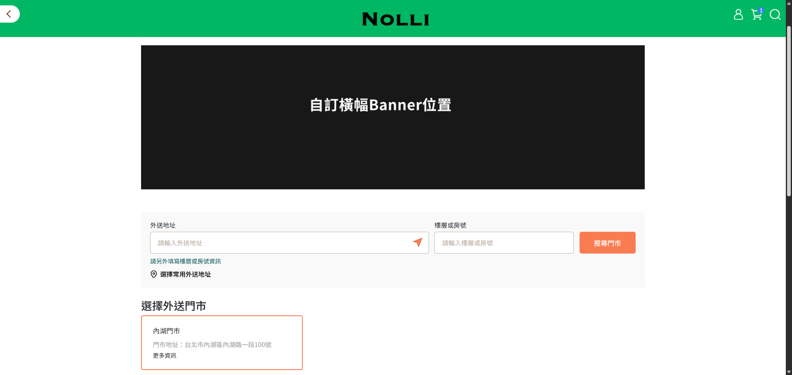
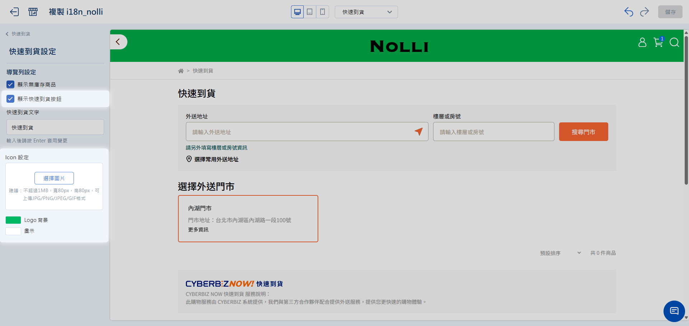
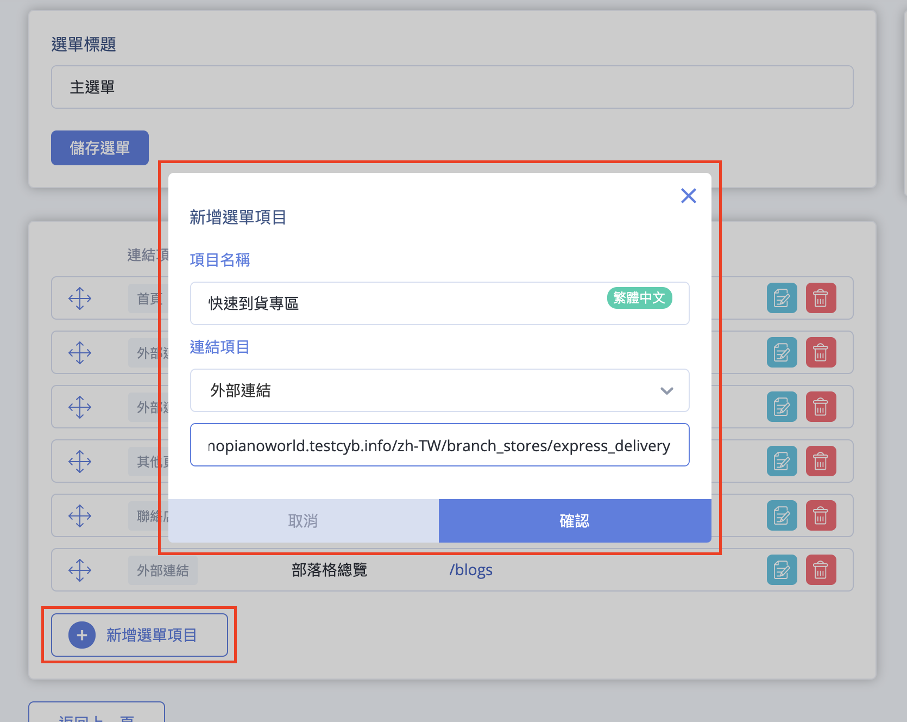
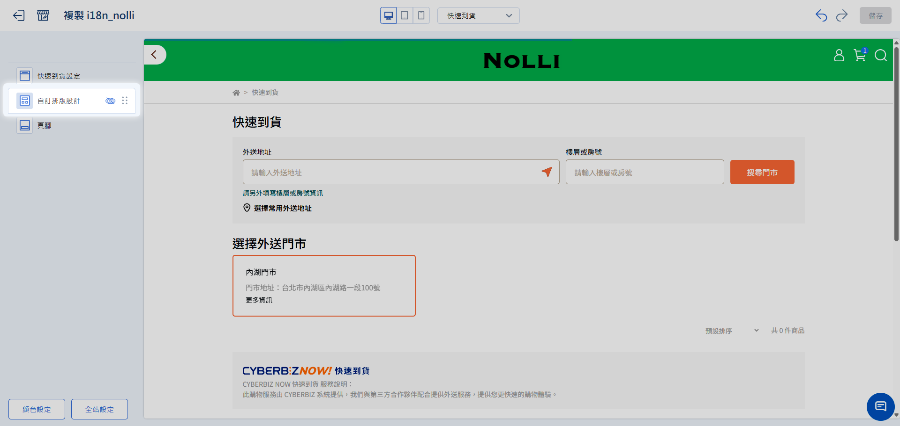

# 設定快速到貨前台入口與專區

透過專屬的入口按鈕與視覺化專區設定，吸引消費者進入快速到貨服務，提升轉單效率並減少配送混淆。
{ .subtitle }

[:lucide-lock:{ title="適用方案" }](../../resources/conventions#適用方案) | 所有PLUS / 企業
{ .doc-badge }

{ .hero-page }

!!! tip "應用情境"
    - **醒目入口引導**：在首頁設置顯眼的快速到貨按鈕，讓有緊急需求的消費者第一時間找到服務。
    - **品牌視覺延伸**：自訂專區導覽列顏色，讓 **快速到貨** 與 **一般官網** 在視覺上有明確區隔，降低購物混淆。
    - **促銷內容配置**：在快速到貨頁面頂端加入專屬活動橫幅（Banner）或跑馬燈，強化即時配送的優惠訊息。

## 使用須知

在設定前台頁面前，請留意以下系統限制：

- **版型限制**：系統提供 **拖拉版型** 與 **預設版型**  兩種建站方式，因兩者設計底層不同，在功能規格與自訂彈性上會有些許差異。

## 設定入口

以下提供兩種設定方式，請依網站版型選擇：

=== "拖拉版型"

    開啟全站共用按鈕，此按鈕會出現在官網頁面的右上方，最為醒目。

    1. 登入 CYBERBIZ 管理後台，前往 **網站外觀 > 套版主題管理 > 網站設定**。
    2. 在頂部中央的頁面選單中選擇 **快速到貨設定**。
    3. 進入 **快速到貨設定** 模組：勾選開啟 **顯示快速到貨按鈕**。

    { .screenshot }

=== "預設版型"

    手動新增導覽列連結，消費者可點擊導覽列。

    1. 前往 **網站外觀 > 選單/導覽列設定**。
    2. 點選 **主選單** 中的 **新增選單項目**。
    3. **項目名稱**：輸入 **快速到貨專區**。
    4. **連結項目**：選擇 **外部連結**。
    5. **網址**：輸入您的官網首頁網址，後方加上 `/branch_stores/express_delivery`。

        > 範例：`https://www.yourstore.com/zh-TW/branch_stores/express_delivery`
    
    { .screenshot }

## 自訂專區視覺與內容

=== "拖拉版型"

    ### 1. 導覽列與圖示配色
    可設定專屬的配色，與一般商品區隔開來：

    - **Logo 背景色**：設定專區頂端導覽列的底色（建議與品牌主色呼應）。
    - **圖示顏色**：設定導覽列功能圖示（如購物車、搜尋）的線條顏色。

    ### 2. 加入專區專屬區塊
    雖然主體版面固定，但您仍可以在專區上方加入吸引人的內容：

    1. 在編輯器的 **自訂排版設定** 模組中點選 **新增區塊**。
    2. 選擇欲加入的類型：
        - **圖片**：加入專屬活動橫幅（Banner）。
        - **排程跑馬燈**：顯示「滿千免運中」或「配送範圍說明」。
        - **商品**：手動挑選 3-4 件主打快速到貨的精選商品。
    3. 拖曳區塊可調整顯示順序。

    !!! warning "版面結構"
        快速到貨頁面採用固定結構以確保效能與跨裝置一致性，除了 **頁面頂端** 可新增區塊外，其餘部分不可拖拉。

    { .screenshot }

=== "預設版型"

    預設版型不支援此功能。

## 常見問題

??? quote "為什麼我的快速到貨頁面無法拖拉區塊？"
    快速到貨頁面為了提供最佳的載入速度與跨裝置一致體驗（尤其是手機版），採用了固定版面設計。您只能透過 **自訂排版設定** 在頁面頂端加入自訂內容，或是修改 **頁腳**。

??? quote "修改導覽列顏色會影響官網其他頁面嗎？"
    不會。快速到貨編輯器中的 **Logo 背景色** 僅會影響快速到貨專區頁面，這正是為了讓消費者能清楚辨識目前所在的專區環境。但請注意，**頁腳** 的修改則是全站同步的。

??? quote "如何讓缺貨的商品不要出現在專區？"
    在編輯器的 **快速到貨設定** 模組中，將 **顯示無庫存商品** 切換為 `關閉 (OFF)`。系統將會自動隱藏庫存為 0 的商品副本。

