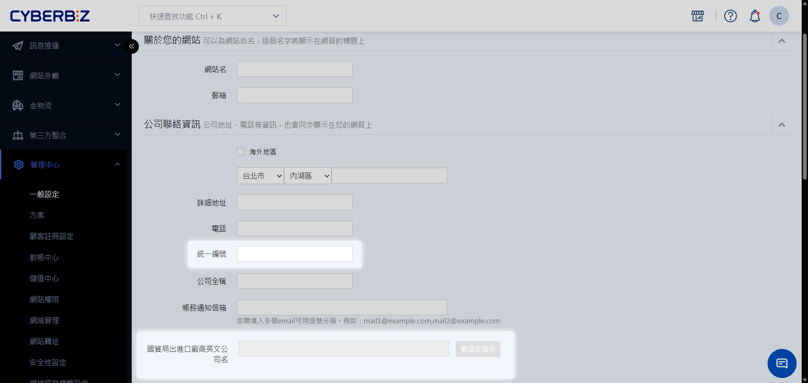
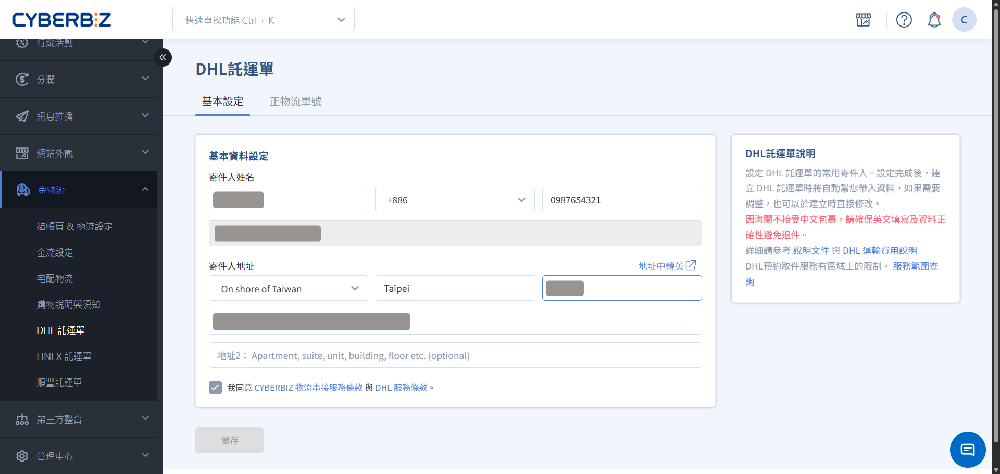

# DHL 跨境物流
透過 CYBERBIZ 後台串接 DHL 國際快遞，您可以直接產出全英文託運單與商業發票，並享有到府取件與自動化貨態追蹤服務。
{ .subtitle }

[:lucide-layers:{ title="適用產品" }](../../resources/conventions#適用產品) | 電商官網
[:lucide-tag:{ title="適用方案" }](../../resources/conventions#適用方案) | PLUS / 企業 
[:lucide-layers:{ title="適用產品" }](../../resources/conventions#適用產品) | 跨境電商 (北美站 / 日本站 / 東南亞站)
[:lucide-tag:{ title="適用方案" }](../../resources/conventions#適用方案) | Pro / Business
{ .doc-badge }

## 使用須知

- **服務限制**：目前僅支援 **台灣出貨至國外**。
- **英文要求**：所有報關資料（寄件人、收件人、商品名）必須使用 **全英文** 填寫。
- **批次限制**：因跨境資訊需逐筆核對，目前 **不支援批次列印** 託運單。
- **委任關係**：使用前請務必完成 **長期委任書** 申請，以確保出口報關順利。

## 前置設定

### 步驟 1：申請長期委任書

依[長期委任書線上申辦流程](https://drive.google.com/file/d/1_zj4H9feFFECoCSGi-GUtfG8h-REsekP/view)申請。

### 步驟 2：驗證公司英文名稱

1. 登入 CYBERBIZ 後台，前往 **管理中心 > 一般設定**。
2. 找到 **國貿局出進口廠商英文公司名** 欄位。
3. 輸入貴司在 [商工登記](https://findbiz.nat.gov.tw/fts/query/QueryBar/queryInit.do) 上的正式英文名稱。
4. 儲存後此欄位將鎖定，系統會自動將此名稱帶入報關文件。

### 步驟 3：設定英文寄件人資訊

1. 前往 **金物流 > DHL 託運單 > 基本資料設定**。
2. 填入 **全英文** 的寄件人地址與聯繫資訊。
    - **寄件人姓名**：建議填寫 **品牌名稱**，作為報關負責人。
    - **寄件人地址**：DHL 目前只支援台灣出口的貨件，請填寫台灣地址。
    - **寄件人的公司名稱**：出口報關的公司，請填寫在國貿局登記的出進口廠商英文公司名。

### 步驟 4：設置物流與運費

1. 前往 **金物流 > 宅配物流**，選擇 **自訂物流** 頁籤。
2. 點擊 **新增自訂物流**。
3. **基本設定**：
    - **物流名稱**：命名物流，名稱不得與其他自訂物流相同。
        > 範例：DHL 物流
    - **運送地區**：地區設定層級至 **縣市** 級別，恕無法針對特定 **鄉鎮區** 進行獨立配置。
    - **運送溫層**：選擇 **常溫**。
    - **出貨方式**：選擇 **自行出貨**。
    - **付款方式**：選擇 **非自訂貨到付款**。
        > 如您有串接其他金流，則可選擇 **自訂貨到付款**。
4. **運費設定**：可依 **訂單金額** 與 **訂單重量** 設置運費。
    - **計費優先順序**：若訂單同時符合多項運費條件，系統將自動套用 **最優惠（即金額最低）** 之條件進行計費。
    - **選項顯示門檻**：訂單金額須達設定之起始門檻；若未達標，系統將自動於結帳頁面隱藏該物流選項。
    - **不限金額設定**：如需開放不限金額皆可使用，請將任一項條件區間之 **起始金額** 配置為 0 元。

### 步驟 5：商品綁定物流

1. 前往 **商品 > 所有商品**，選擇指定商品。
2. 進入 **設定** 頁籤。
3. **出貨方式** ：選擇 **自行出貨**。
4. **物流綁定狀態**：選擇 DHL 物流(您於步驟 3 設置的物流名稱)。

## 訂單出貨操作

### 步驟 1：建立託運單

1. 前往 **訂單 > 所有訂單**，勾選欲出貨訂單。
2. 點選 **選擇操作 > 建立 DHL 託運單**。
3. **核對基本資訊**：確認所有欄位均以 **英文** 填寫。
    - **收件人地址**：必須填寫，否則無法順利產單。
    - **收件人電話國碼**：**台灣站 (EC)** 系統不會自動帶入國碼，商家必須手動輸入正確的電話國碼（例如：886）。跨境站則會依顧客填寫自動帶入。

### 步驟 2：填寫報關資訊與稅費

1. **核對商品明細**：
    - **必填欄位檢查**：
        - **商品與款式名稱**：以 **英文** 填寫。
        - **產地**：選擇商品產地。
        - **毛重(KG)**：包裹與內容物之總重量（含外箱及緩衝包材）。
        - **淨重(KG)**：商品本身之重量（不含外包裝及紙箱）。
    - **商品概述**：簡單清晰描述訂單內所有商品，包括產品名、材質、用途等。
        - 若訂單包含多樣商品，請先列出最有價值的商品。
        - 正確範例：pearl earrings, blouse, ceramic tray。
        - 模糊範例：gifts, tools。
2. **加購貨件保險(非必要)**：保障因外在因素所造成運送貨件的損失或損壞。
    - 此為加購型額外服務，將產生額外的費用，可依據商品價值與風險承擔能力，評估是否投保。
    - **貨件申報價值**：建議輸入含運費的訂單總價值。若運送過程發生任何意外，您將能獲得所有賠償。
    - **保險費用（未稅）**：新台幣 400 元或申報總價值之 2% ，取其高者。
3. **填寫包裹資訊**：
    - **包裹名稱**：可輸入任何名稱，此處不影響報關。請以英文填寫。
    - **新增包裹資訊**：若單筆訂單須拆分為多箱配送，可新增包裹。
    - **包裹備註**：必填，若無特殊說明，可填寫 **N/A**。
4.  **設定稅費收取方式**：
    - **未完稅交貨（DDU Delivered Duty Unpaid）**：由消費者負擔清關的稅費與手續費。
    - **完稅後交貨（DDP Delivered Duty Paid ）**：由商家負擔清關的稅費與手續費。
        - **手續費**：每筆訂單 720 元，建立託運單時會向您收取。若無後續進口稅費，會退還 720 元手續費，並列為運費對帳單上的調整項。
        - **稅費**：出貨後依照 DHL 實際代付的稅費向您收取，並列為運費對帳單上的調整項。
5. **預約取件時間**：
    - **取件日期**：自當日起算 7 日內之時段。
    - **取件時間**：周一至周五 10：00 至 17：00。
        - 如需當日派員取件，請於當日 14：00 前完成預約。
    - **取件人**：提供 DHL 司機前往取貨時可聯繫的人員姓名及電話。
6. 點選 **試算運費** 後 **建立託運單**。
    - **即時費率獲取**：系統會從 DHL 獲取最新即時報價，計算過程約需 1–2 分鐘。
    - **預估運費**：顯示金額以新台幣 (TWD) 計費。
    - **預計送達日期**：所提供之日期僅供參考，實際配送時程將視物流公司作業及通關狀況而定。

### 步驟 3：列印託運文件

1. 點擊 **下載託運單**。
    - `配送狀態`將自動更改為`已出貨`。
2. 解壓縮託運文件並列印明細。
3. 完成出貨準備。
    - **DHL_Commercial_Invoice**：商業發票，共 3 份。須逐份簽名，其中 1 份置於包裹內，另 2 份於取件時交由司機帶回。
    - **DHL_waybill**：貨件提單，共 4 份。其中 3 份黏貼於包裹外箱，剩餘 1 份交由司機。
    - **Picking_list**：揀貨單。供內部作業使用，無需隨貨附寄。
    - **Fulfillment_details**：託運單明細。供商家留存備查，無需隨貨附寄。

### 步驟 4：正式報關(非必要)

 1. 若符合底下任一條件，則須走正式報關流程。
    - 商品總價值 > 50,000 元新台幣
    - 包裹單箱 > 70 公斤
    - 包裹最長邊 > 120 公分
2. 備妥報關需要資料。
    - [出口報關檢核表](https://drive.google.com/drive/folders/1XNBEuxjvoQa--rcfnt93_m8zt9A1DHyp)
    - 以下託運文件（下載後列印）
        - DHL_Commercial_Invoice(商業發票) 
        - DHL_waybill(貨件提單) 
        - Picking_list(揀貨單) 
    - [復運出口案件廠商具結書](https://drive.google.com/file/d/1AqEnDkTezsDO1c0VHtBw70MdfB3EA-Lw/view)(非必要)
        - 若出口商品非國貨（非台灣製造），則需附上。
    - [外貨復出口產證申請切結書](https://docs.google.com/document/d/14qSuAAZjMfPp0eXTWCZYTH6sozcgmjmD/edit?rtpof=true&sd=true&tab=t.0)(非必要)
        - 若出口商品非國貨，且需要產證，則需加附上。
3. 將上述文件全部蓋三個章（大章、小章、發票章），並傳到文件部。各區的文件部信箱如下：
    - 內湖：tpeesyisa@dhl.com
    - 中和：tpewscisa@dhl.com
    - 桃園：TWCKWISA@dhl.com
    - 新竹：twhcyisa@dhl.com
    - 台中：twtxwisa@dhl.com
    - 台南：TWTNWISA@dhl.com
    - 高雄：twkhyisa@dhl.com

## 常見問題

??? quote "訂單配送出現「運送異常」怎麼辦？"
    若貨態顯示異常，系統將鎖定狀態直到解決。建議商家透過單號連結至 DHL 官網查詢詳細原因，或聯繫 CYBERBIZ 客服協助。

