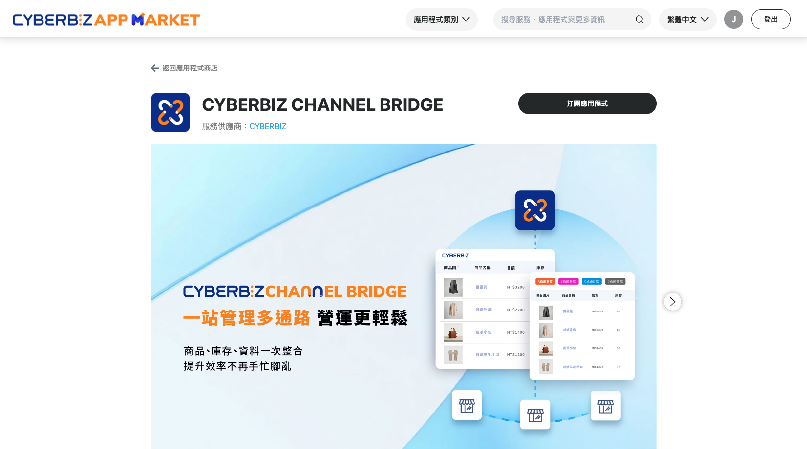
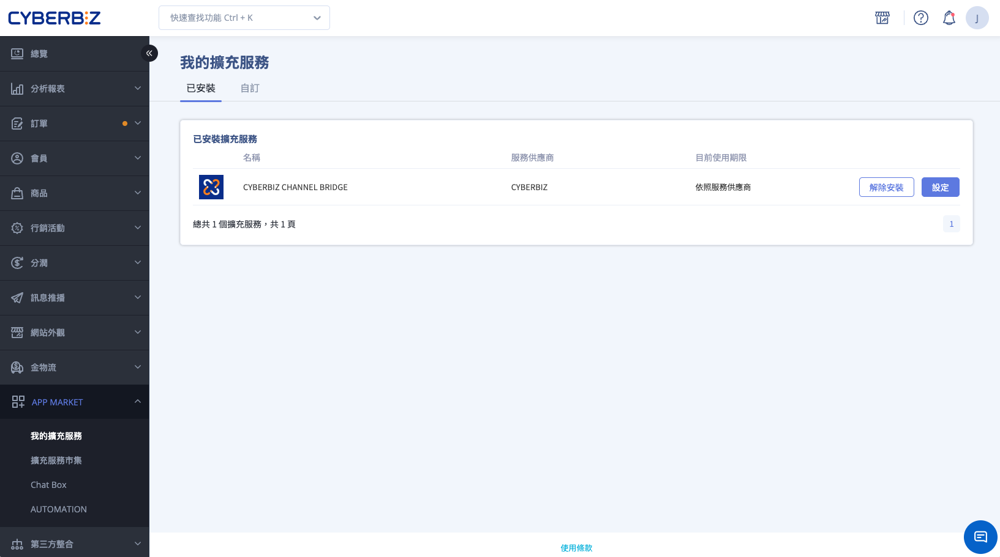
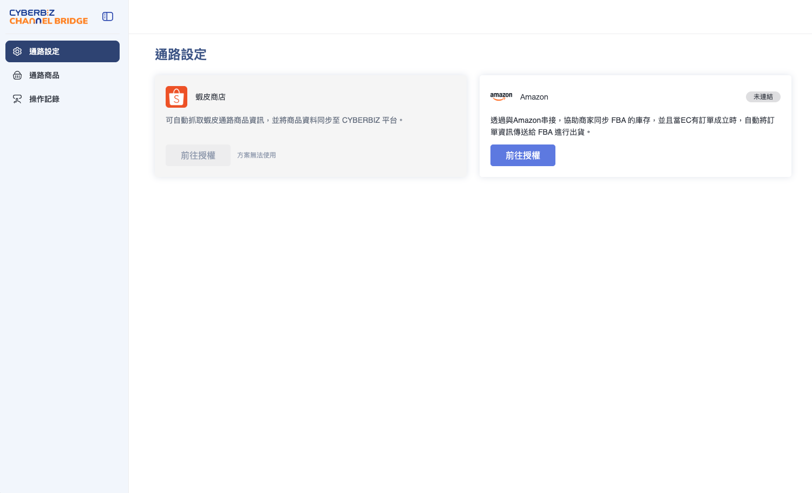
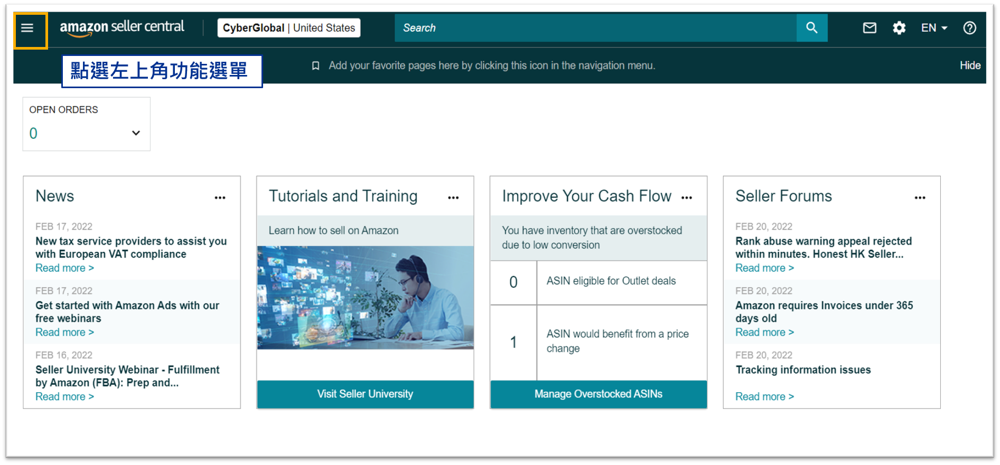
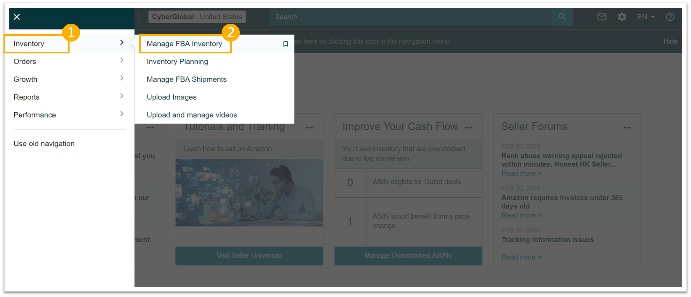
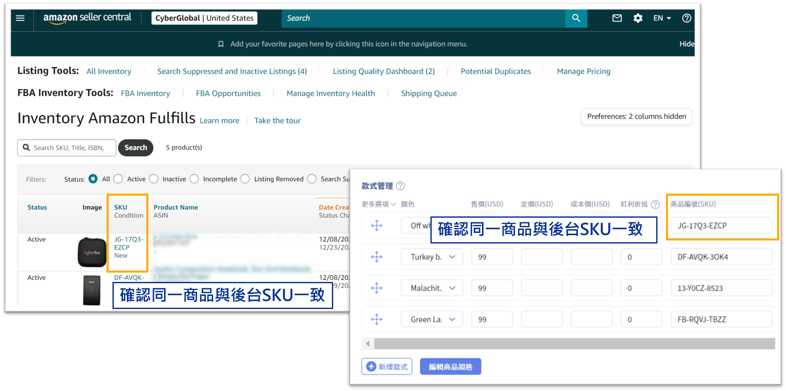
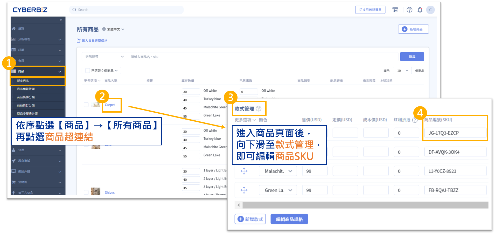
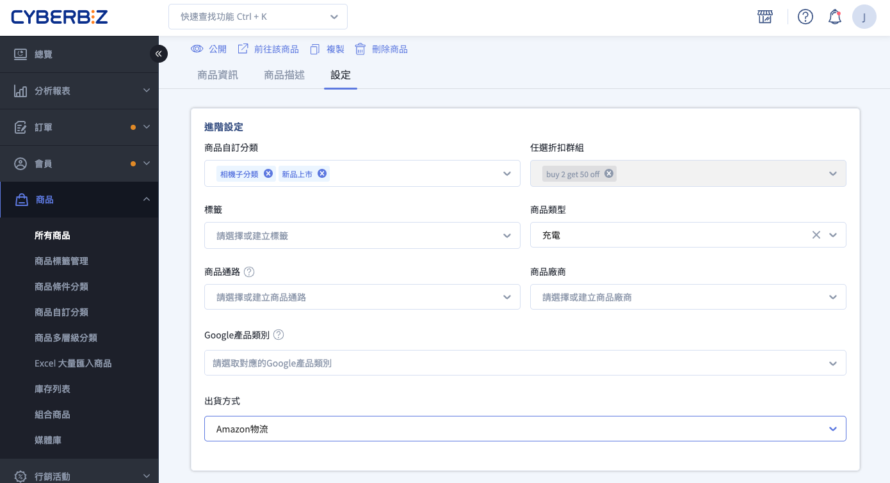
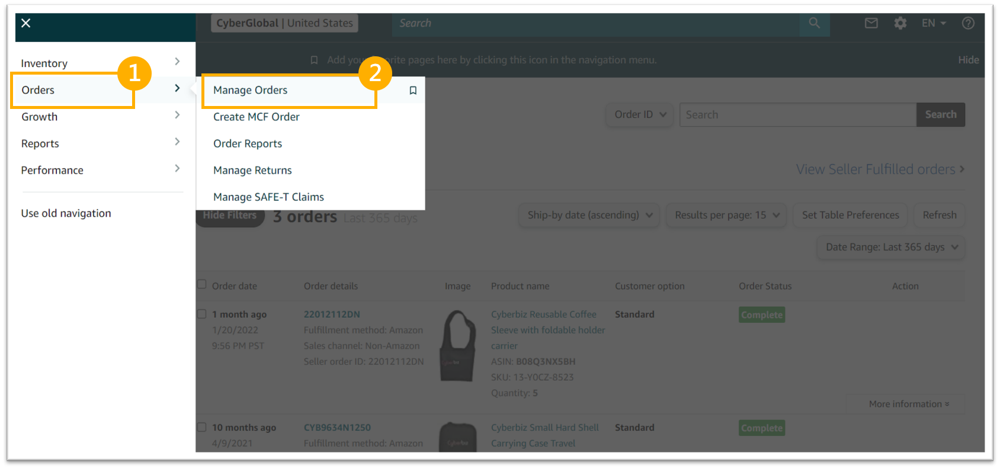
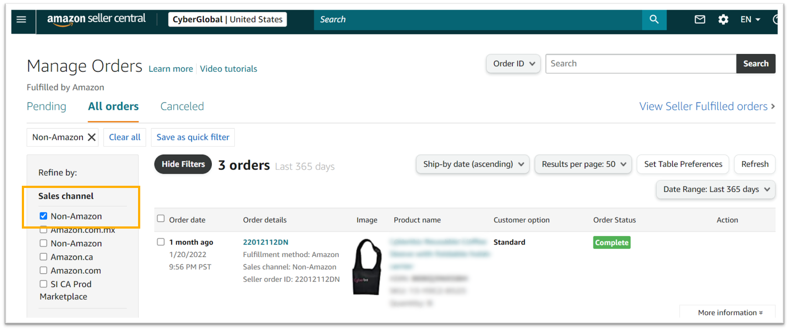

# Amazon FBA 跨境物流

透過 Amazon FBA 服務，您可以將官網訂單交由 Amazon 物流團隊代為包裝與配送。系統將自動拋轉訂單、同步貨態並更新庫存，實現跨境營運的自動化。
{ .subtitle }

[:lucide-layers:{ title="適用產品" }](../../resources/conventions#適用產品) | 跨境電商 (北美站 / 日本站)
[:lucide-tag:{ title="適用方案" }](../../resources/conventions#適用方案) | Pro / Business
{ .doc-badge }

## 使用須知

- **自動出貨**：官網訂單成立後，系統自動將資料拋轉至 Amazon 安排發貨。
- **庫存聯動**：一旦綁定，官網庫存將鎖定，無法手動修改，強制以 Amazon FBA 實際庫存為準。

## 啟用物流

### 步驟 1：安裝 FBA 擴充應用

1. 登入 CYBERBIZ 後台，前往 **第三方整合 > 擴充服務市集**。
2. 找到 **CYBERBIZ CHANNEL BRIDGE** 並點擊 **安裝應用程式**。[快捷連結 :lucide-external-link:](https://appmarket.cyberbiz.io/application/eb67e6a5-d38f-4a86-a1a4-8d5727dae0db)

    

### 步驟 2：完成帳號授權

1. 登入 CYBERBIZ 後台，前往 **第三方整合 > 我的擴充服務**。

    

2. 找到 **CYBERBIZ CHANNEL BRIDGE** 並點擊 **設定**。
3. 於 **Amazon** 通路點擊 **前往授權**，系統將導向 Amazon 授權頁面。

    

4. 輸入您的 Amazon Seller Central 帳號與密碼完成綁定。
    - 建議使用管理者帳號 (Admin User) 進行操作，以確保權限完整。

5. 綁定完成後，系統將自動導向 Amazon 設定頁面，請檢查串接資訊：

    - **檢查狀態**：在 **商店設定** 頁籤中可查看目前的 **商店狀態** 與 **到期日期**。
    - **到期提醒**：系統將於授權到期日前 15、7、3、1 日寄送 Email 通知。
    - **重新授權**：若授權過期，點選 **重新授權** 即可恢復功能。

### 步驟 3：綁定商品 SKU 

若要讓 Amazon 正確識別官網訂單對應的商品，**CYBERBIZ 的商品 SKU 必須與 Amazon 的商品 SKU 完全一致**。

#### 1. 查詢 Amazon 端 SKU

1. 登入 [Amazon Seller Central](https://sellercentral.amazon.com/)。
    
2. 前往 **Inventory > Manage FBA Inventory**。
    
3. 紀錄下該商品的 **Seller SKU**。
    

#### 2. 在 CYBERBIZ 設定 SKU 對應

1. 前往 **商品 > 所有商品**，進入目標商品的編輯頁。
2. 下滑至 **款式管理** 區塊。
3. 在 **SKU** 欄位填入與 Amazon 完全相同的字元（含大小寫、符號）。
4. 點擊儲存。

### 步驟 4：設定 Amazon 出貨方式

由 **Amazon物流** 出貨的商品，指定出貨方式：

1. 依照[設定商品出貨方式](../products/bulk-operations/set-product-shipping-method.md)，設定商品的出貨方式。
2. **出貨方式** 選擇 **Amazon物流**，完成設定並儲存。
3. 回到商品編輯頁確認 **SKU** 與 **出貨方式** 均已正確顯示。

!!! warning "Amazon SKU 與出貨方式限制"
    只有已啟用對應 Amazon 功能的商店，**Amazon物流** 才會出現在出貨方式選單。SKU 若與 Amazon Seller SKU 不一致，系統無法正確拋轉訂單或同步庫存。

## 訂單監控與貨態追蹤

### 1. 在 Amazon 查看官網訂單

官網成立之 FBA 出貨訂單也會同步顯示在 Amazon 後台：

1. 登入 [Amazon Seller Central](https://sellercentral.amazon.com/)。
    
2. 前往 **Orders > Manage Orders**。
    
3. 在 Sales Channel 篩選器勾選 **Non-Amazon**，即可看到來自官網的訂單。
    

### 2. 貨態同步機制

- 當 Amazon 倉庫準備出貨時，官網訂單狀態會同步更新。
- 當 FBA 完成配送，官網配送狀態將自動轉為 **已出貨** 並正式入帳。

## CYBERBIZ 與 Amazon FBA 貨態對照表

| Amazon FBA 狀態 | CYBERBIZ 配送狀態 | 備註 |
| :--- | :--- | :--- |
| Receiving → Processing | 未出貨 | 消費者與商家可取消訂單 | 
| Processing | 準備出貨 | 訂單已拋轉，等待 Amazon 處理 進入此狀態後不得取消訂單 |
| COmplete | 已出貨 | Amazon 已寄出，系統自動入帳 |
| Cancelled | 已取消 | 訂單於 Amazon 端取消 |

