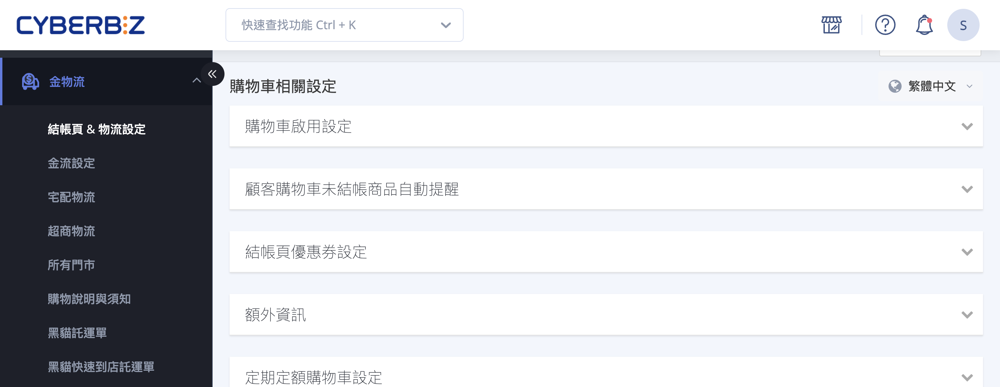
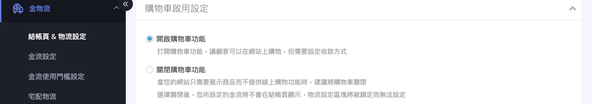
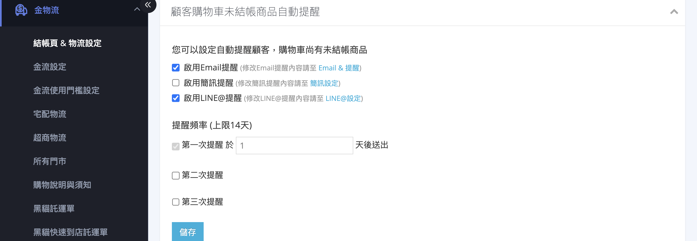
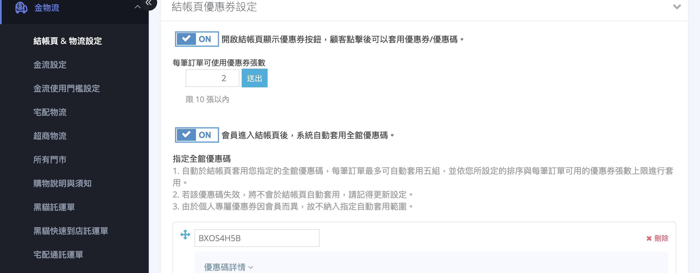
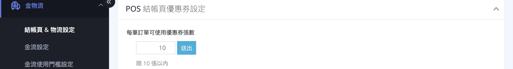
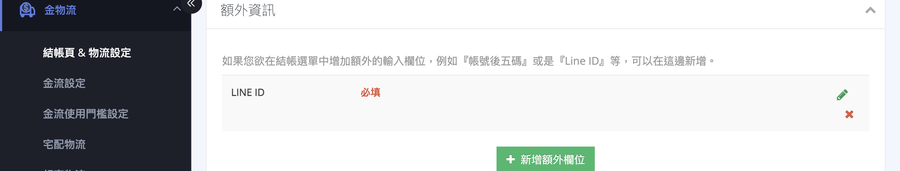
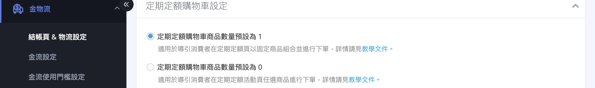

{ title="購物車相關設定頁面" .hero-page }

## 購物車相關設定說明 { #intro-cart-settings }

「購物車相關設定」位於後台「金物流」>「結帳頁 & 物流設定」頁面的最上方區塊，用來控管顧客進入正式結帳前的購物流程。您可以在這裡決定網站是否開放線上購買、要不要主動提醒顧客回來結帳、結帳頁是否顯示優惠券欄位，以及是否額外向顧客詢問特定資訊。

!!! info "提示"
    本頁所有設定都依「區塊」分組，各區塊預設為收合狀態。點擊區塊標題即可展開，展開後修改並儲存，設定才會生效。

---

## 頁面功能總覽 { #overview-cart-settings }

| 設定區塊 | 用途 | 方案限制 |
| :-- | :-- | :-- |
| [購物車啟用設定](#operate-cart-settings-activation) | 決定網站是否開放線上購買 | 所有方案 |
| [顧客購物車未結帳商品自動提醒](#operate-cart-settings-reminder) | 自動提醒購物車有遺留商品的顧客回來結帳 | PLUS版 / 企業版 |
| [結帳頁優惠券設定](#operate-cart-settings-coupon) | 是否在結帳頁顯示優惠券按鈕、自動套用全館優惠碼 | 所有方案 |
| [額外資訊](#operate-cart-settings-extra-info) | 在結帳流程新增自訂詢問欄位 | 所有方案 |
| [定期定額購物車設定](#operate-cart-settings-periodic) | 設定定期定額活動的購物車預設商品數量 | 企業版 |

!!! note "註釋"
    依您的方案與店家設定不同，部分區塊可能不會顯示。若找不到下列某個區塊，代表您的方案尚未啟用該功能。

---

## 使用前提與限制 { #prerequisites-cart-settings }

部分設定需要開通相應功能才會出現在頁面上。

!!! plan "方案 / 開通條件"
    * **顧客購物車未結帳商品自動提醒**：多數付費方案皆內建，其中 **LINE OA 提醒** 管道需 PLUS版以上 或 企業版。
    * **定期定額購物車設定**：企業版。

---

## 操作步驟 { #operate-cart-settings }

進入路徑：後台「金物流」>「結帳頁 & 物流設定」，於頁面最上方的「購物車相關設定」區塊操作。

### 開啟或關閉購物車 { #operate-cart-settings-activation }

當您的網站只用來展示商品(形象官網)，不提供線上購買時，可以關閉購物車功能。

1. **展開區塊：** 點擊「購物車啟用設定」區塊標題展開內容。
2. **選擇模式：** 選擇 **「開啟購物車功能」** (讓顧客可在網站上下單)或 **「關閉購物車功能」** (僅展示商品)。
3. **留意提示：** 選擇「關閉」後，您設定的金流將不會顯示於結帳頁，且 **物流設定區塊會被鎖定無法設定**[^cart-off]。

[^cart-off]: 若尚未設定任何付款方式，系統會在此區塊顯示紅色提醒，提醒您顧客將無法順利完成結帳。

{ title="開啟或關閉購物車" }

!!! warning "注意"
    若您看到「開啟購物車功能」選項無法點選(灰階)，代表店家目前由系統限定關閉購物車，請聯繫 CYBERBIZ 業務窗口確認。

---

### 設定未結帳商品自動提醒 { #operate-cart-settings-reminder }

[:lucide-tag:{ title="適用方案" }](../../../resources/conventions#適用方案) | PLUS / 企業

提醒天數依顧客身份有不同上限：**會員** 最長 40 天，**訪客** 最長 14 天。

當顧客把商品加入購物車卻沒有完成結帳時，系統可以自動發送提醒，引導顧客回來完成訂單。

1. **展開區塊：** 點擊「顧客購物車未結帳商品自動提醒」區塊標題展開內容。
2. **選擇提醒管道：** 勾選要啟用的通知管道 —— **啟用 Email 提醒**、 **啟用簡訊提醒**，或 **啟用 LINE OA 提醒**[^line-plan]。各管道的通知內容可至對應的「Email & 提醒」「簡訊設定」「LINE@設定」頁面修改。
3. **設定提醒頻率：** 啟用任一管道後，下方會出現「提醒頻率」設定，最多可設定三次提醒，並各自填入「於第幾天送出」的天數。
4. **完成：** 點擊 **「儲存」** 套用設定。

各提醒管道的開通條件請見 [購物車未結帳提醒管道對照表](../references/cart-reminder-channels-reference.md#cart-reminder-channels){ data-preview }。

[^line-plan]: LINE OA 提醒僅在開通對應功能(PLUS版以上 或 企業版)時顯示。

{ title="設定未結帳商品自動提醒" }

---

### 結帳頁優惠券設定 { #operate-cart-settings-coupon }

控制結帳頁是否顯示優惠券欄位，以及是否自動為顧客套用全館優惠碼。

1. **展開區塊：** 點擊「結帳頁優惠券設定」區塊標題展開內容。
2. **顯示優惠券按鈕：** 開啟後，顧客在結帳頁可看到優惠券按鈕，點擊即可套用優惠券或優惠碼。
3. **設定每筆可用張數：** 在「每筆訂單可使用優惠券張數」填入數字，上限為 **10 張**。
4. **(選用)指定自動套用的全館優惠碼：** 在「指定全館優惠碼」設定中填入優惠碼序號，顧客進入結帳頁後系統會自動套用[^coupon-auto]。
5. **完成：** 點擊 **「儲存」** 或 **「送出」** 套用設定。

[^coupon-auto]: 自動套用每筆訂單最多五組，並依您設定的排序與每筆可用張數上限套用；個人專屬優惠券因會員而異，不納入自動套用範圍。若指定的優惠碼失效，將不會自動套用，請記得更新設定。

{ title="結帳頁優惠券設定" }

---

### POS 結帳頁優惠券設定 { #operate-cart-settings-pos-coupon }

若您同時使用 POS 系統，可在後台設定 POS 結帳頁的優惠券使用規則。

1. **展開區塊：** 點擊「POS 結帳頁優惠券設定」區塊標題展開內容。
2. **設定每筆可用張數：** 在「每筆訂單可使用優惠券張數」填入數字，預設為 **10**，限制 **10 張以內**。
3. **完成：** 點擊 **「送出」** 套用設定。

{ title="POS 結帳頁優惠券設定" }

---

### 新增結帳額外資訊欄位 { #operate-cart-settings-extra-info }

若您想在結帳流程中額外詢問顧客資訊(例如「帳號後五碼」或「LINE ID」)，可在此新增自訂欄位。

1. **展開區塊：** 點擊「額外資訊」區塊標題展開內容。
2. **新增欄位：** 點擊 **「新增額外欄位」**，於彈出視窗輸入欄位名稱(例如「帳號後五碼」)。
3. **設定是否必填：** 視需要勾選「是否必填欄位」，再點擊 **「新增」**。
4. **管理欄位：** 已建立的欄位會列在表格中，可隨時編輯或刪除。

{ title="新增結帳額外資訊欄位" }

!!! note "註釋"
    額外資訊欄位最多可新增 **3 個**，達到上限後「新增額外欄位」按鈕會自動隱藏。若您的店家為多語系，欄位名稱會依當前所選語言分別設定。

---

### 定期定額購物車預設數量 { #operate-cart-settings-periodic }

[:lucide-tag:{ title="適用方案" }](../../../resources/conventions#適用方案) | 企業

使用定期定額活動時，可設定會員進入購物車時的商品預設數量。

1. **展開區塊：** 點擊「定期定額購物車設定」區塊標題展開內容。
2. **選擇預設數量：** 選擇 **「定期定額購物車商品數量預設為 1」**(適合固定商品組合的下單情境)或 **「定期定額購物車商品數量預設為 0」**(適合讓顧客在活動頁任選商品)。
3. **完成：** 系統即時儲存您的選擇。

{ title="定期定額購物車預設數量" }

---

## 常見問題 { #faq-cart-settings }

??? quote "關閉購物車後，為什麼物流設定無法調整？"
    { #faq-cart-settings-logistics-locked }
    這是正常的設計。當購物車關閉時，網站不提供線上購買，因此金流與物流設定都會被鎖定。若要重新設定物流，請先回到本頁上方的「購物車啟用設定」將購物車功能開啟。

??? quote "設定了未結帳提醒，但顧客沒收到通知"
    { #faq-cart-settings-reminder-not-sent }
    請依序確認以下項目：

    * 是否已勾選對應的提醒管道(Email、簡訊或 LINE OA)並儲存。
    * 簡訊與 LINE OA 提醒會消耗 Cyber幣，若餘額不足將發送失敗，請先確認餘額。
    * 提醒會在顧客留下購物車商品後，依您設定的天數發送；天數未到不會發送。

??? quote "為什麼消費者已下訂單後仍會一直收到未結帳通知？"
    { #faq-cart-settings-reminder-after-order }
    請消費者檢查其他裝置是否仍然有未結帳商品。

    購物車未結帳提醒是**綁裝置**（例如手機、平板、電腦等）。若消費者使用兩個以上的裝置登入會員並將商品加入購物車，雖然其中一個裝置完成結帳，系統不會自動將其他裝置的購物車清空，因而造成重複收到通知的狀況。

??? quote "為什麼我的後台沒有「定期定額購物車設定」或「未結帳提醒」區塊？"
    { #faq-cart-settings-section-missing }
    這些區塊需要對應的功能開通才會顯示。請參考 [使用前提與限制][prerequisites-cart-settings]{ data-preview }，或聯繫您的 CYBERBIZ 業務窗口確認方案是否已開通。

??? quote "結帳頁優惠券一次最多能用幾張？"
    { #faq-cart-settings-coupon-limit }
    每筆訂單最多可使用 **10 張** 優惠券或優惠碼，實際可用張數由您在「每筆訂單可使用優惠券張數」的設定決定。

---

## 後續操作 { #next-steps-cart-settings }

完成購物車相關設定後，您可以接著調整以下流程：

- :lucide-receipt:{ .lg }  
  [__訂單相關設定__](order-settings.md){ title="訂單相關設定" }  
  設定訂單金額門檻、未付款與付款失敗提醒、自動結案與取消規則。

- :lucide-truck:{ .lg }  
  [__物流相關設定__](logistics-settings.md){ title="物流相關設定" }  
  調整配送細節規範、超商取貨姓名、指定配送時段與退貨天數。

---

## 參考資料 { #reference-cart-settings }

* [購物車未結帳提醒管道對照表](../references/cart-reminder-channels-reference.md)
[prerequisites-cart-settings]: #prerequisites-cart-settings
