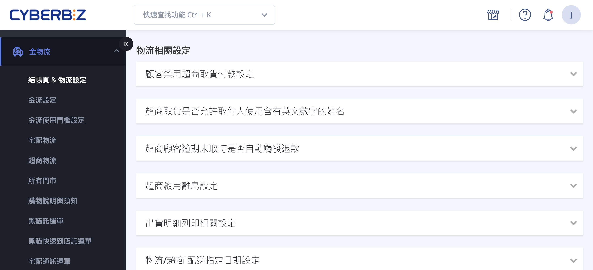
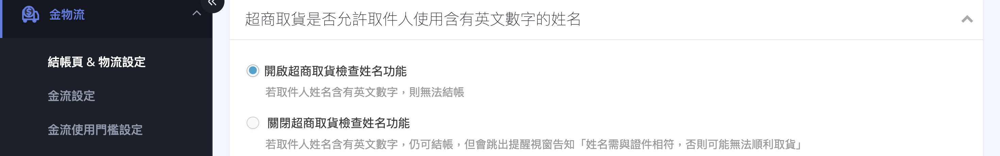
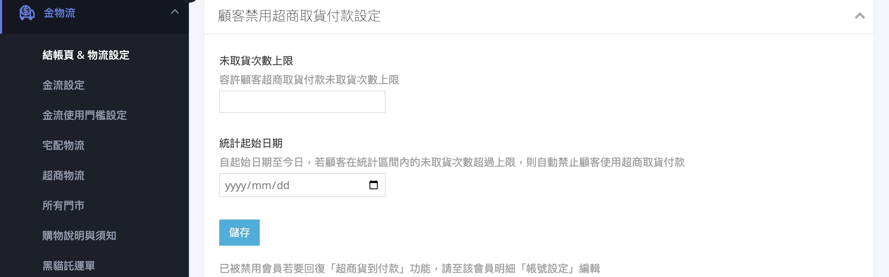
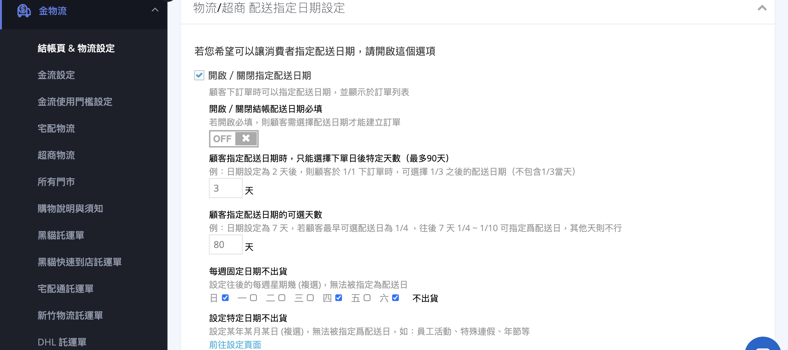
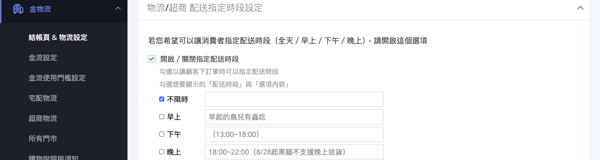
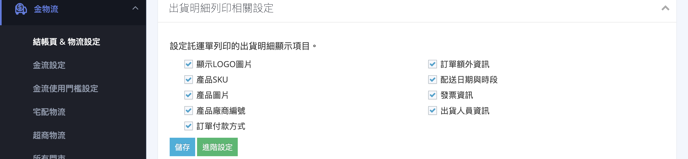
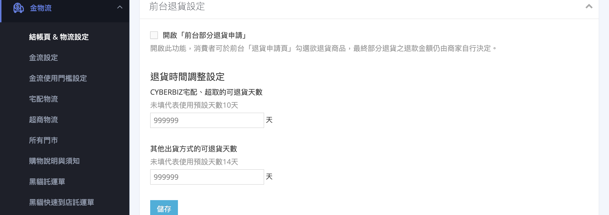

{ title="物流相關設定頁面"  .hero-page }

## 物流相關設定說明 { #intro-logistics-settings }

「物流相關設定」位於後台「金物流」>「結帳頁 & 物流設定」頁面下段的「物流相關設定」區塊，用來調整配送過程中的細節規範與顧客可指定的送貨偏好。您可以在這裡設定超商取貨的姓名規範與離島服務、出貨明細列印欄位、是否開放顧客指定配送日期與時段，以及前台可申請退貨的天數。

!!! info "提示"
    若您在頁面上方將「購物車啟用設定」關閉，本區塊會被鎖定而無法設定。請先開啟購物車功能再進行物流設定。

---

## 頁面功能總覽 { #overview-logistics-settings }

| 設定區塊 | 用途 | 方案限制 |
| :-- | :-- | :-- |
| [顧客禁用超商取貨付款設定](#operate-logistics-settings-cod-restrict) | 對多次未取貨的顧客自動禁用超商取貨付款 | 所有方案 |
| [超商取貨姓名規範](#operate-logistics-settings-cvs) | 取件人姓名是否允許含英文數字 | 所有方案 |
| [超商啟用離島設定](#operate-logistics-settings-cvs) | 是否開放 7-11 離島配送 | 所有方案 |
| [出貨明細列印相關設定](#operate-logistics-settings-fulfillment-print) | 設定託運單出貨明細的顯示欄位 | 所有方案 |
| [配送指定日期設定](#operate-logistics-settings-delivery-date) | 開放顧客指定配送日期(含進階規則) | 基本功能所有方案 / 進階(PLUS版 / 企業版) |
| [配送指定時段設定](#operate-logistics-settings-delivery-time) | 開放顧客指定配送時段 | 所有方案 |
| [退貨時間調整設定](#operate-logistics-settings-return-timing) | 設定前台可申請退貨的天數 | PLUS版 / 企業版 |

---

## 使用前提與限制 { #prerequisites-logistics-settings }

!!! plan "方案 / 開通條件"
    * **配送指定日期設定**：開啟 / 關閉與「備貨天數」為基本功能；進階規則(配送日期必填、可選天數、每週固定日不出貨)(PLUS版以上或企業版)。
    * **退貨時間調整設定**：「退貨時間調整設定」功能(PLUS版以上或企業版)；「前台部分退貨申請」(企業版)。

---

## 操作步驟 { #operate-logistics-settings }

進入路徑：後台「金物流」>「結帳頁 & 物流設定」，捲動至「物流相關設定」區塊。

### 設定超商取貨姓名與離島 { #operate-logistics-settings-cvs }

針對超商取貨，可規範取件人姓名格式並開放離島配送。

1. **超商取貨姓名規範：** 展開「超商取貨是否允許取件人使用含有英文數字的姓名」區塊，二選一：**「開啟超商取貨檢查姓名功能」**(姓名含英文數字則無法結帳)或 **「關閉超商取貨檢查姓名功能」**(仍可結帳，但會提醒姓名需與證件相符)。

    { title="超商取貨姓名規範" }

2. **超商啟用離島設定：** 展開「超商啟用離島設定」區塊，開啟 **「7-11 啟用離島」** 開關即可開放離島取貨。

    { title="超商啟用離島設定" }

---

### 設定顧客禁用超商取貨付款 { #operate-logistics-settings-cod-restrict }

對多次預訂超商取貨付款卻未取貨的顧客，系統可自動禁止其再使用超商取貨付款，降低棄單損失。

1. **展開區塊：** 點擊「顧客禁用超商取貨付款設定」區塊標題展開內容。
2. **設定未取貨次數上限：** 於「未取貨次數上限」填入容許的最大未取貨次數。
3. **設定統計起始日期：** 於「統計起始日期」選擇開始計算的日期。自起始日至今，若顧客未取貨次數超過上限，系統就會自動禁用其超商取貨付款。
4. **完成：** 點擊 **「儲存」**。

{ title="設定顧客禁用超商取貨付款" }

!!! note "註釋"
    已被禁用的會員若要恢復「超商貨到付款」功能，請至該會員明細的「帳號設定」編輯。

---

### 設定顧客可指定配送日期 { #operate-logistics-settings-delivery-date }

開放顧客在結帳時指定希望的配送日期，並可搭配備貨天數與不出貨日規則。

1. **展開區塊：** 點擊「物流/超商 配送指定日期設定」區塊標題展開內容。
2. **開啟指定配送日期：** 勾選 **「開啟／關閉指定配送日期」**，顧客下單時即可指定配送日期。
3. **設定備貨天數：** 在「顧客指定配送日期時，只能選擇下單日後特定天數」填入備貨天數(最多 90 天)[^prepare-day]。
4. **(進階)設定進階規則 `PLUS版 / 企業版`：** 若已啟用進階指定配送，可額外設定 **配送日期必填**、 **可選天數範圍** 與 **每週固定日期不出貨**；若已開通特定日期不出貨，可點擊 **「前往設定頁面」** 在地圖式介面勾選特定不出貨日(如年節、連假)。

[^prepare-day]: 例：備貨天數設為 2 天，顧客於 1/1 下單時，最早可選 1 / 3 之後的配送日(不含 1 / 3 當天)。

{ title="設定顧客可指定配送日期" }

---

### 設定顧客可指定配送時段 { #operate-logistics-settings-delivery-time }

開放顧客指定配送時段(全天 / 早上 / 下午 / 晚上)，並自訂各時段的說明文字。

1. **展開區塊：** 點擊「物流/超商 配送指定時段設定」區塊標題展開內容。
2. **開啟指定配送時段：** 勾選 **「開啟／關閉指定配送時段」**。
3. **選擇要顯示的時段：** 勾選想開放的時段，並可於右側欄位自訂每個時段的「選項內容」說明文字[^time-clear]。

[^time-clear]: 若取消勾選全部時段，系統會自動關閉指定配送時段並隱藏進階設定。

{ title="設定顧客可指定配送時段" }

---

### 設定出貨明細列印欄位 { #operate-logistics-settings-fulfillment-print }

自訂託運單出貨明細要呈現的欄位，方便倉儲與出貨人員作業。

1. **展開區塊：** 點擊「出貨明細列印相關設定」區塊標題展開內容。
2. **勾選顯示項目：** 依需求勾選欄位：訂單付款方式、產品圖片、產品 SKU、產品廠商編號、發票資訊、配送日期與時段、訂單額外資訊、出貨人員資訊、顯示 LOGO 圖片等。
3. **完成：** 點擊 **「儲存」**。

{ title="設定出貨明細列印欄位" }

- :lucide-printer:{ .lg }  [__設定與列印出貨明細__](../../orders/order-settings/shipping-detail-print.md)

---

### 設定前台可申請退貨天數 { #operate-logistics-settings-return-timing }

設定顧客可在前台會員中心申請退貨的天數，串接物流與自訂物流可分別設定。

1. **展開區塊：** 點擊「退貨時間調整設定」區塊標題展開內容。
2. **設定可退貨天數：** 分別填入「CYBERBIZ 宅配、超取的可退貨天數」與「其他出貨方式的可退貨天數」[^return-zero]。
3. **(選用)開啟前台部分退貨：** 若已開通對應功能，可勾選 **「開啟『前台部分退貨申請』」**，讓顧客在退貨申請頁勾選欲退貨的商品。
4. **完成：** 點擊 **「儲存」**。

各出貨方式的預設退貨天數與計算起點，請見 [前台可退貨天數對照表](../references/return-eligible-days-reference.md#return-eligible-days){ data-preview }。

[^return-zero]: 填入 0 代表不開放消費者在前台申請退貨；留空則使用系統預設天數。

{ title="設定前台可申請退貨天數" }

---

<!-- ### 設定 Uber Direct 優物流 { #operate-logistics-settings-uber-direct } -->
<!---->
<!-- 串接 Uber Direct 優物流，提供快速到貨的包裹配送服務。 -->
<!---->
<!-- 1. **展開區塊：** 點擊「Uber Direct 優物流」區塊標題展開內容。 -->
<!-- 2. **填寫商家資料：** 輸入公司名稱、E-mail、聯絡電話、商家類型與商品類型，並勾選同意合約規範。 -->
<!-- 3. **儲存：** 點擊 **「確認」** 完成建立。 -->
<!---->
<!--  -->
<!---->
<!-- !!! warning "注意" -->
<!--     Uber Direct 商家資料一旦存檔完成即無法修改(部分情況僅商品類型資料可再調整)，送出前請務必確認填寫正確。可另外開啟「包裹收件 PIN 碼驗證」，要求顧客向司機提供 PIN 碼才能完成取件。 -->
<!---->
<!-- --- -->

## 常見問題 { #faq-logistics-settings }

??? quote "為什麼物流設定區塊都無法點選 / 被鎖住？"
    { #faq-logistics-settings-locked }
    這通常是因為購物車功能被關閉了。當購物車關閉時，物流設定會一併鎖定。請回到本頁最上方的「購物車啟用設定」，將購物車功能開啟後即可設定物流。

??? quote "退貨天數填 0 是什麼意思？"
    { #faq-logistics-settings-return-zero }
    填入 0 代表 **不開放** 顧客在前台自行申請退貨。若希望使用系統預設天數，請將欄位 **留空**(CYBERBIZ 宅配 / 超取預設 10 天，其他出貨方式預設 14 天)。詳見 [前台可退貨天數對照表](../references/return-eligible-days-reference.md#return-eligible-days){ data-preview }。

??? quote "找不到「配送日期必填」或「設定特定日期不出貨」？"
    { #faq-logistics-settings-advanced-date-missing }
    開啟 / 關閉指定配送日期與備貨天數為基本功能，所有方案皆可使用；但「配送日期必填」「可選天數」「每週固定日不出貨」需「進階指定配送」功能，「設定特定日期不出貨」需「特定日期不出貨」功能。請參考 [使用前提與限制][prerequisites-logistics-settings]{ data-preview } 或洽業務窗口。

---

## 後續操作 { #next-steps-logistics-settings }

完成物流相關設定後，您可以接著調整以下流程：

- :lucide-shopping-cart:{ .lg }  
  [__購物車相關設定__](cart-settings.md){ title="購物車相關設定" }  
  調整顧客在正式結帳前的購物車行為，包含購物車啟用、未結帳提醒與優惠券設定。

- :lucide-receipt:{ .lg }  
  [__訂單相關設定__](order-settings.md){ title="訂單相關設定" }  
  設定訂單金額門檻、未付款與付款失敗提醒、自動結案與取消規則。

---

## 參考資料 { #reference-logistics-settings }

* [前台可退貨天數對照表](../references/return-eligible-days-reference.md)

[prerequisites-logistics-settings]: #prerequisites-logistics-settings
