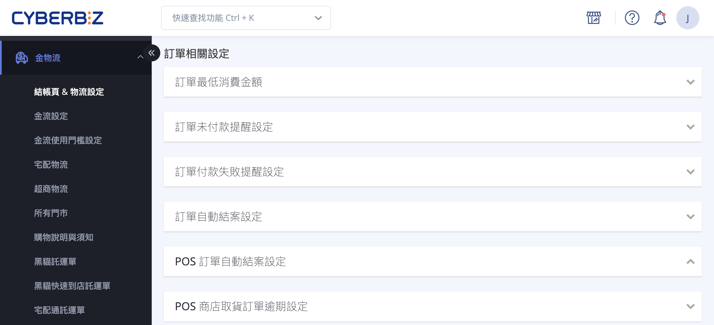{ title="訂單相關設定頁面"  .hero-page }

## 訂單相關設定說明 { #intro-order-settings }

「訂單相關設定」位於後台「金物流」>「結帳頁 & 物流設定」頁面中段的「訂單相關設定」區塊，涵蓋訂單從成立、提醒、結案到列印的各項自動化規則。透過這些設定，您可以控管下單門檻、減少未付款訂單流失、讓系統自動結案與取消逾期訂單，並決定列印單據要呈現哪些欄位。

!!! info "提示"
    各設定以「區塊」分組，預設收合。點擊區塊標題展開後修改並儲存，設定才會生效。

---

## 頁面功能總覽 { #overview-order-settings }

| 設定區塊 | 用途 | 方案限制 |
| :-- | :-- | :-- |
| [訂單最低消費金額](#operate-order-settings-amount-threshold) | 設定可下單的金額門檻 | 企業版 |
| [訂單未付款提醒設定](#operate-order-settings-payment-reminder) | 自動寄發未付款提醒信 | 所有方案 |
| [訂單付款失敗提醒設定](#operate-order-settings-payment-reminder) | 自動寄發付款失敗提醒信 | 所有方案 |
| [訂單自動結案設定](#operate-order-settings-auto-close) | 依配送狀態達 N 天後自動結案 | 所有方案 |
| [訂單自動取消](#operate-order-settings-auto-cancel) | 逾期未付款訂單自動取消 | 所有方案 |
| [顧客取消訂單、申請退貨設定](#operate-order-settings-customer-cancel) | 開放前台會員自行取消或申請退貨 | 拖拉版型 |
| [訂單取消退貨相關紅利設定](#operate-order-settings-return-bonus) | 退貨 / 取消時是否返還或發送紅利 | PLUS版 / 企業版 |
| [列印訂單明細相關文件設定](#operate-order-settings-print-detail) | 設定訂單明細列印欄位 | 所有方案 |
| [列印揀貨單相關文件設定](#operate-order-settings-print-picking) | 設定揀貨單組合商品呈現方式 | 所有方案 |

---

## 使用前提與限制 { #prerequisites-order-settings }

!!! plan "方案 / 開通條件"
    * **訂單最低消費金額**：企業版。
    * **訂單取消退貨相關紅利設定**：依您啟用的紅利相關功能(返還消費紅利、部分退貨返還 / 發送紅利、紅利商城等)顯示對應選項，多需 PLUS 版以上或企業版。
    * **顧客取消訂單、申請退貨設定**：僅適用於拖拉版型；非拖拉版型時此區塊會呈灰階且無法編輯。

---

## 操作步驟 { #operate-order-settings }

進入路徑：後台「金物流」>「結帳頁 & 物流設定」，捲動至「訂單相關設定」區塊。

### 設定下單金額門檻 { #operate-order-settings-amount-threshold }

[:lucide-tag:{ title="適用方案" }](../../../resources/conventions#適用方案) | 企業

若您經營低單價商品，想確保每筆訂單達到一定金額才能成立，可使用金額相關設定。

1. **訂單最低消費金額：** 展開區塊後，開啟「開啟／關閉 訂單最低消費金額」，於「訂單最終金額 大於等於 ___ 元 才能下單訂購」填入門檻金額，點擊 **「送出」**。可一併選擇 **「是否包含紅利折抵金額」**[^min-bonus]。
2. **訂單累計金額防護設定：** 展開區塊後，開啟設定，填入「訂單累計上限金額」與「計算時間區間」(開始日期、結束日期)，點擊 **「儲存」**。

[^min-bonus]: 開啟「包含紅利折抵金額」時，系統以紅利折抵前的訂單金額判斷是否達門檻；關閉時則以折抵後的最終金額判斷。

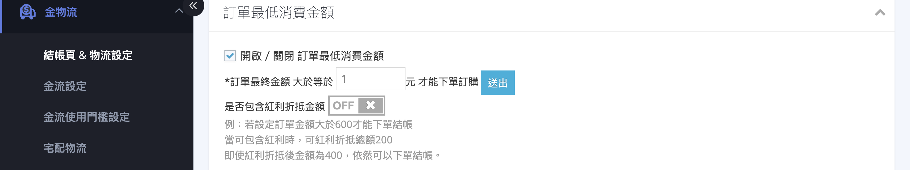{ title="設定下單金額門檻" }

---

### 設定未付款與付款失敗提醒 { #operate-order-settings-payment-reminder }

針對尚未付款或付款失敗的訂單，系統可自動寄發提醒信，協助您回收訂單。

1. **訂單未付款提醒設定：** 展開區塊，於「設定天數」填入間隔天數，點擊 **「送出」**。系統會依此天數間隔 **寄發三次** 提醒信[^reminder-rule]。

    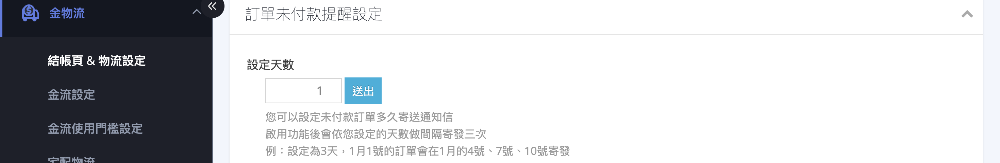{ title="訂單未付款提醒設定" }

2. **訂單付款失敗提醒設定：** 展開區塊，於「設定天數」填入間隔天數，點擊 **「送出」**。同一張付款失敗訂單最多 **寄發三次** 提醒[^set-rule]。

    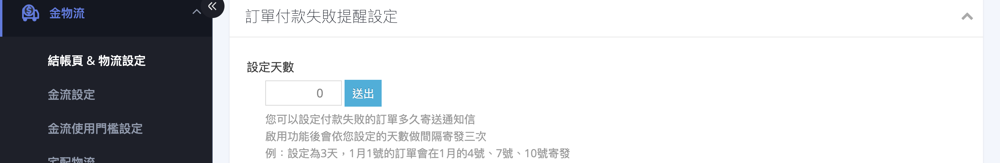{ title="訂單付款失敗提醒設定" }

[^reminder-rule]: 例：設定為 3 天，1 月 1 號的訂單會在 1 月的 4 號、7 號、10 號寄發。若顧客中途完成付款，提醒會自動停止。

[^set-rule]: 填入 0 代表不啟用付款失敗提醒。

---

### 設定訂單自動結案 { #operate-order-settings-auto-close }

讓系統依配送狀態，在指定天數後自動將訂單結案，免去逐筆手動結案。

1. **展開區塊：** 點擊「訂單自動結案設定」區塊標題展開內容。
2. **開啟自動結案：** 開啟 **「開啟訂單自動結案」** 開關，下方會出現結案條件選項。
3. **選擇結案條件：** 二選一 —— **「當顧客取貨後 ___ 天訂單自動結案」**(適用超商、黑貓等串接物流)或 **「當訂單出貨後 ___ 天訂單自動結案」**(適用自訂物流)，並填入天數。
4. **(票券訂單)** 若有開通票券功能，可另外開啟 **「開啟票券訂單自動結案」**，設定「當顧客付款後 ___ 天」自動結案。

各結案類型的觸發條件與訂單狀態要求，請見 [訂單自動結案類型對照表](../../orders/references/order-auto-close-types-reference.md#order-auto-close-types){ data-preview }。

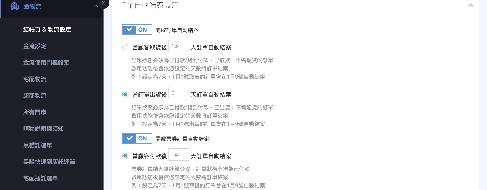{ title="設定訂單自動結案" }

!!! warning "注意"
     訂單一旦結案(手動或自動)，系統即會結算並發送消費紅利與分潤。若後續才發生退貨，已發送的紅利不會自動扣回，需於會員頁面手動處理。是否在退貨時返還紅利，請見 [設定退貨 / 取消的紅利處理][operate-order-settings-return-bonus]{ data-preview }。

- :lucide-clock:{ .lg }  [__自動結案訂單完整設定__](../../orders/order-settings/auto-close-order-settings.md)

---

### POS 訂單自動結案設定 { #operate-order-settings-pos-auto-close }

若您同時使用 POS 系統，可設定 POS 訂單的自動結案規則。

1. **展開區塊：** 點擊「POS 訂單自動結案設定」區塊標題展開內容。
2. **開啟自動結案：** 開啟 **「開啟 POS 訂單自動結案」** 開關。
3. **完成：** 點擊 **「儲存」** 套用設定。

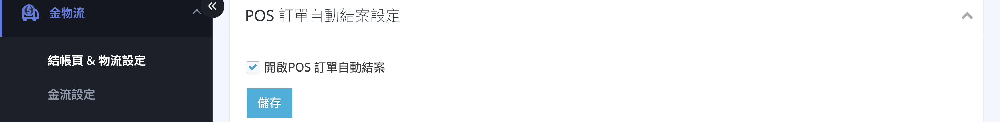{ title="POS 訂單自動結案設定" }

- :lucide-clock:{ .lg }  [__POS 訂單自動結案完整設定__](../../../pos/orders/pos-order-auto-close.md)

---

### POS 商店取貨訂單逾期設定 { #operate-order-settings-pos-store-overdue }

若您同時使用 POS 系統，可設定 POS 商店取貨訂單的逾期規則，當包裹到店後顧客未取貨，系統可自動將訂單標示為逾期。

1. **展開區塊：** 點擊「POS 商店取貨訂單逾期設定」區塊標題展開內容。
2. **開啟逾期設定：** 開啟 **「開啟/關閉 訂單逾期設定」** 開關。
3. **設定逾期天數：** 在「當包裹到店後 ___ 天訂單自動變為逾期送出」填入天數，預設為 **1** 天。僅限訂單狀態為「已收到款項、已到店」的訂單才會納入計算。
4. **完成：** 點擊 **「送出」** 套用設定。

啟用功能後，系統會依您設定的天數將未取貨的訂單改為逾期[^pos-store-overdue]。

[^pos-store-overdue]: 範例：設定為 7 天，若 1/1 00:00 訂單狀態變成已到店，則 1 / 8 00:00 後將改為逾期。

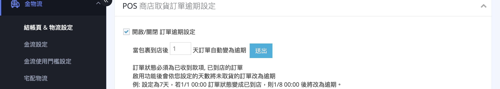{ title="POS 商店取貨訂單逾期設定" }

---

### 限定會員條碼取貨設定 <small>POS</small> { #operate-order-settings-pos-member-barcode }

若您同時使用 POS 系統，可限制 POS 前台取貨僅能透過 APP 會員條碼完成。

1. **展開區塊：** 點擊「限定會員條碼取貨設定」區塊標題展開內容。
2. **開啟設定：** 開啟 **「開啟/關閉 POS前台限定會員條碼取貨設定」** 開關。
3. **完成：** 點擊 **「儲存」** 套用設定。

開啟「限定會員條碼取貨設定」後，POS 前台的取貨彈窗僅能掃 APP 的會員條碼來完成取貨。

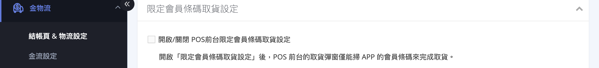{ title="限定會員條碼取貨設定" }

---

### 訂單自動取消設定 { #operate-order-settings-auto-cancel }

對超過特定天數仍未付款的訂單，系統可自動取消，釋出庫存。

1. **展開區塊：** 點擊「訂單自動取消」區塊標題展開內容。
2. **設定天數：** 填入天數，點擊 **「儲存」**。系統會自動取消超過該天數仍 **未付款** 的訂單[^auto-cancel-zero]。

[^auto-cancel-zero]: 填入 0 代表不啟用自動取消。此功能僅針對未付款訂單。

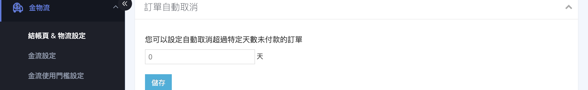{ title="設定訂單自動取消" }

---

### 開放顧客前台取消訂單 / 申請退貨 { #operate-order-settings-customer-cancel }

決定是否在前台會員中心顯示「取消訂單」與「申請退貨」按鈕，讓顧客自助處理。

1. **展開區塊：** 點擊「顧客取消訂單、申請退貨設定」區塊標題展開內容。
2. **設定權限：** 勾選 **「顧客可以取消訂單」** 或 **「顧客可以申請退貨」**，讓消費者可在前台自行操作。
3. **完成：** 點擊 **「儲存」**。

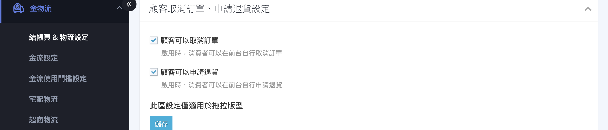{ title="開放顧客前台取消訂單 / 申請退貨" }

!!! note "註釋"
    此區設定僅適用於拖拉版型。若您使用的並非拖拉版型，選項會呈灰階無法編輯。

---

### 設定退貨 / 取消的紅利處理 { #operate-order-settings-return-bonus }

[:lucide-tag:{ title="適用方案" }](../../../resources/conventions#適用方案) | PLUS版 / 企業

當訂單退貨或取消時，決定系統要不要自動返還顧客折抵掉的紅利，或補發應得的紅利。

1. **展開區塊：** 點擊「訂單取消退貨相關紅利設定」區塊標題展開內容。
2. **依需求開啟對應開關：** 您會看到以下幾種選項(依啟用的功能顯示)[^bonus-options]:
    * **開啟「退貨訂單」返還折抵的紅利**：整筆退貨時，返還顧客原折抵的紅利。
    * **開啟「部分退貨訂單」返還折抵的紅利 `企業版`**：部分退貨時，返還該商品折抵的紅利。
    * **開啟「部分退貨訂單」發送紅利 `企業版`**：部分退貨結案後，補發顧客應得的紅利。
    * **開啟「取消紅利商城訂單」返還折抵的紅利 `企業版`**：取消紅利商城訂單時，返還折抵的紅利點數。

[^bonus-options]: 各開關僅對「開啟後」狀態才變更的訂單生效；開啟前狀態已是退貨 / 取消的訂單不會補發或返還。

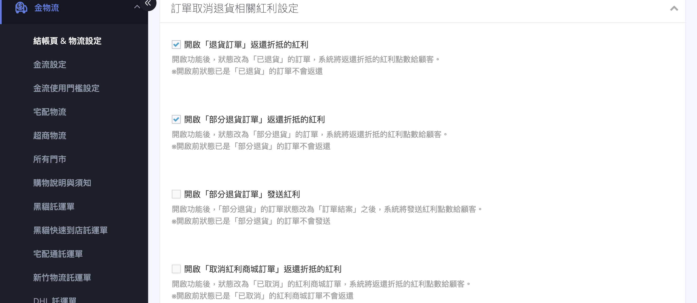{ title="設定退貨 / 取消的紅利處理" }

---

### 列印訂單明細相關文件設定 { #operate-order-settings-print-detail }

自訂訂單明細列印時要呈現的欄位與格式。

1. **展開區塊：** 點擊「列印訂單明細相關文件設定」區塊標題展開內容。
2. **勾選顯示項目：** 勾選明細要顯示的項目(訂購人資訊、訂單付款方式、產品圖片、產品 SKU、發票資訊、廠商編號、配送日期與時段、訂單額外資訊等)，可上傳 LOGO 圖片與設定開頭提醒文字。
3. **完成：** 點擊 **「儲存」**。

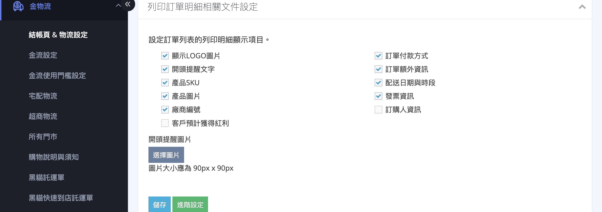{ title="列印訂單明細相關文件設定" }

- :lucide-printer:{ .lg }  [__設定與列印訂單明細__](../../orders/order-settings/order-detail-print.md)

---

### 列印揀貨單相關文件設定 { #operate-order-settings-print-picking }

自訂揀貨單列印時要呈現的格式。

1. **展開區塊：** 點擊「列印揀貨單相關文件設定」區塊標題展開內容。
2. **選擇顯示方式：** 於「揀貨單顯示方式(組合商品處理)」選擇 **「僅顯示組合商品名稱」**(已預先打包)或 **「展開組合內所有商品」**(集中揀貨)，可點擊 **「預覽 PDF」** 確認效果。
3. **完成：** 點擊 **「儲存」**。

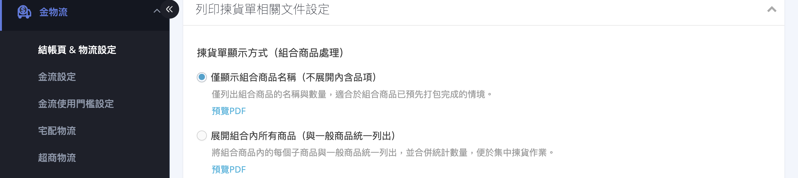{ title="列印揀貨單相關文件設定" }

!!! tip "技巧"
    若您常以託運單上的出貨明細出貨，相關欄位設定請見物流區塊的「出貨明細列印相關設定」，詳見 [物流相關設定](logistics-settings.md#operate-logistics-settings-fulfillment-print)。

---

## 常見問題 { #faq-order-settings }

??? quote "訂單結案後才退貨，先前發的紅利會自動扣回嗎？"
    { #faq-order-settings-bonus-after-close }
    不會。訂單一旦結案，消費紅利與分潤即結算發放。若後續退貨，系統不會自動扣回已發送的紅利，需商家至會員頁面手動處理。若希望退貨時自動返還顧客折抵的紅利，請於「訂單取消退貨相關紅利設定」開啟對應功能。

??? quote "貨到付款的訂單會被自動取消嗎？"
    { #faq-order-settings-cod-auto-cancel }
    訂單自動取消僅針對「未付款」的訂單。貨到付款訂單在顧客取貨前並非未付款狀態的一般金流訂單，請以您實際的金流與物流情境判斷；如有疑問請洽 CYBERBIZ 業務窗口。

??? quote "未付款提醒信會一直寄嗎？"
    { #faq-order-settings-reminder-count }
    不會。未付款與付款失敗提醒最多各寄發三次，並依您設定的天數間隔寄送。顧客一旦完成付款，提醒就會停止。

??? quote "自動結案要選「已收貨」還是「已出貨」？"
    { #faq-order-settings-close-type }
    使用超商、黑貓等串接物流時，建議選「當顧客取貨後 N 天」(依已收貨狀態結案)；使用自訂物流時，因系統無法得知顧客是否收貨，則選「當訂單出貨後 N 天」(依已出貨狀態結案)。詳見 [訂單自動結案類型對照表](../../orders/references/order-auto-close-types-reference.md#order-auto-close-types){ data-preview }。

---

## 後續操作 { #next-steps-order-settings }

完成訂單相關設定後，您可以接著進行以下設定：

- :lucide-shopping-cart:{ .lg }  
  [__購物車相關設定__](cart-settings.md){ title="購物車相關設定" }  
  調整顧客在正式結帳前的購物車行為，包含購物車啟用、未結帳提醒與優惠券設定。

- :lucide-package:{ .lg }  
  [__物流相關設定__](logistics-settings.md){ title="物流相關設定" }  
  調整配送細節規範與顧客可指定的送貨偏好。

---

## 參考資料 { #reference-order-settings }

* [訂單自動結案類型對照表](../../orders/references/order-auto-close-types-reference.md)

[operate-order-settings-return-bonus]: #operate-order-settings-return-bonus
