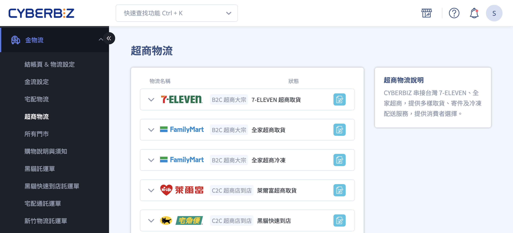
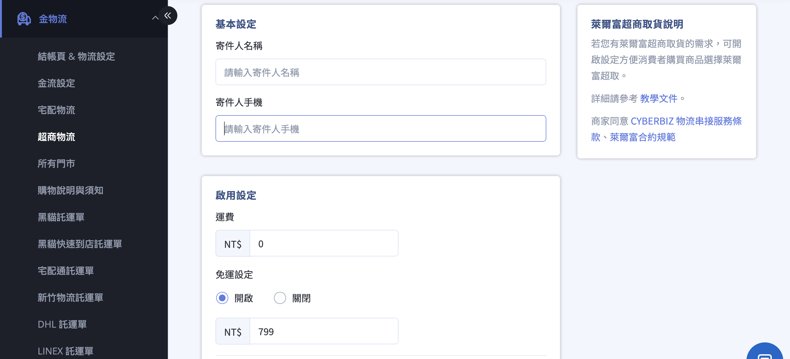
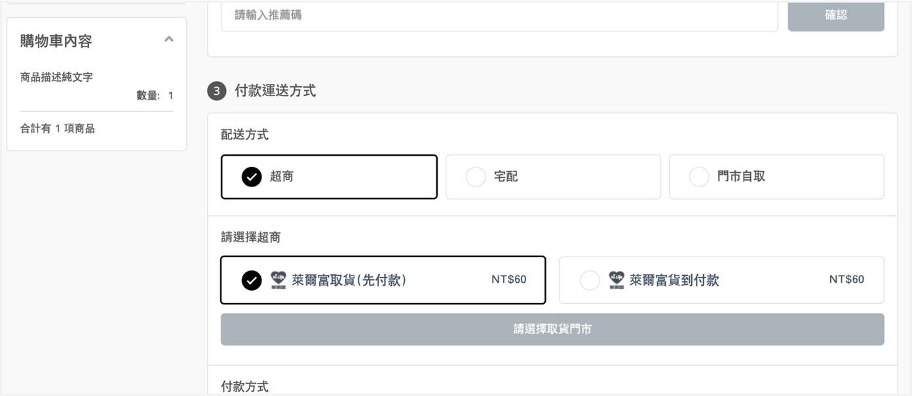

---

title: 設定超商店到店 C2C 物流串接
description: 啟用超商店到店（C2C）物流服務，讓顧客可於結帳時選擇指定超商門市取貨。
created:
last_modified: 2026-06-30 08:52
lang: zh-TW
permalink: "https://help.cyberbiz.io/ec/payments-and-logistics/setup-cvs-c2c-shipping/"
type: guide
status: update
author: Jase
reviewers: []
notes: []
ga_views: 0
feedback: 0
products:
  - EC
modules:
  - 金物流
sites:
  - TW
audiences:
  - merchant
difficulty: beginner
tnb: trunk
plans:
  - 企業
  - 專業
  - 專業PLUS
  - 進階
  - 進階PLUS
  - 高手
  - 高手PLUS
cyb_extensions:
  - CYBERBIZ PAYMENTS
intents:
  - 設定超商物流串接
  - 開啟超商免運
  - 設定取貨不付款
features:
  - 超商店到店 C2C
  - 7-ELEVEN 交貨便
  - 全家店到店
  - 萊爾富超商取貨
prerequisites: []
related: []
tags:
  - 超商物流
  - C2C
  - 超商取貨
  - 物流串接
  - 7-11
  - 全家
  - 萊爾富
acoiv:
apis:
  - 7-ELEVEN 交貨便
  - 全家店到店
  - 萊爾富超商取貨
devices:
  - desktop
  - mobile
ui_components: []
paths:
  - 金物流 > 超商物流
layouts: []
wp_url:
  - https://www.cyberbiz.io/helpcenter/?p=5058
  - https://www.cyberbiz.io/helpcenter/?p=6850
  - https://www.cyberbiz.io/support/?p=5958
comments: false
search:
  exclude: false
icon: lucide/store
hide:
---

{ title="超商物流 C2C" .hero-page }

## 超商店到店物流（C2C）說明

**超商店到店（C2C）** 是指商家完成商品包裝後，自行前往鄰近超商門市寄件，並配送至消費者指定的超商門市取貨。

!!! example "適用情境"

    - 小型或輕量商品
    - 商家可自行前往超商寄件
    - 不需物流商到府收件的出貨情境

!!! info "本服務適用於「商家自行至超商寄件」的出貨模式；若使用物流商到府收件，請改用其他物流方案。"

### 支援物流服務

CYBERBIZ 目前支援以下超商店到店物流：

- [x] **7-ELEVEN 交貨便**
- [x] **全家店到店**
- [x] **萊爾富超商取貨**
- [x] **黑貓快速到店**（提供超商取件服務，非傳統宅配）

## 操作步驟

### 步驟一：選擇物流服務

1. 登入 **CYBERBIZ 管理後台**，前往 **金物流 > 超商物流**。
2. 找到欲啟用的物流服務，點擊編輯按鈕 :material-file-document-edit-outline: 進入設定頁面。

---

### 步驟二：填寫基本資料

1. **同意服務條款**：勾選「已閱讀物流串接服務廠商規範」才能使用。
        
2. **公司寄件人資訊**：填寫 **寄件人姓名** 與 **手機號碼**，務必正確。
        
    !!! warning "若顧客辦理退貨，門市人員將使用寄件人 **身分證資訊** 進行身份核對。請確保填寫正確。"
        
1. **額外設定（依需求開啟）**
    
    - **免運設定**：設定是否提供超商免運優惠。
    -  **取貨不付款***：消費者取貨時不需付款（需先完成線上支付）。

	!!! info "CYBERBIZ PAYMENTS 專屬功能：COD 貨到付款"
	    - 僅限 **已開通 CYBERBIZ PAYMENTS** 的商家可使用貨到付款功能。
	    - 若尚未開通，前台僅會顯示「取貨不付款」選項。
	    - [開通 CYBERBIZ PAYMENTS](apply-cyberbiz-payments.md){ title="申請 CYBERBIZ PAYMENTS" } 以使用此功能。
    
{ title="超商物流設定" }

## 前台如何顯示超商取貨選項

以下以 **萊爾富超商取貨** 為例，展示消費者於結帳頁選擇超商取貨的畫面：

{ title="超商取貨前台顯示" }

## 後續步驟

- :lucide-package:{ .lg }   
  [__操作超商店到店 C2C 出貨__](../orders/cvs-shipping/cvs-c2c-shipping.md){ title="操作超商店到店 C2C 出貨" }     
  建立訂單後，前往訂單後台產生寄件單並完成超商寄件流程。

- :lucide-ban:{ .lg }     
  [__設定超商配送限制__](../products/shipping/cvs-shipping-restrictions-exclusions.md){ title="設定超商配送限制與物流排除" }  
  設定商品材積、重量或類型，讓系統自動排除不適用超商配送的商品。

