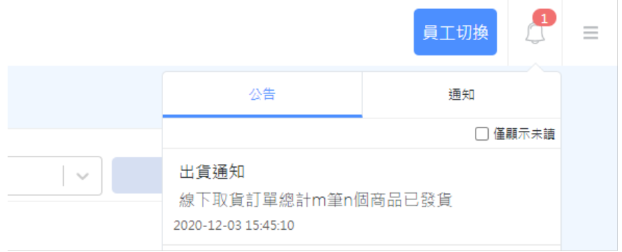
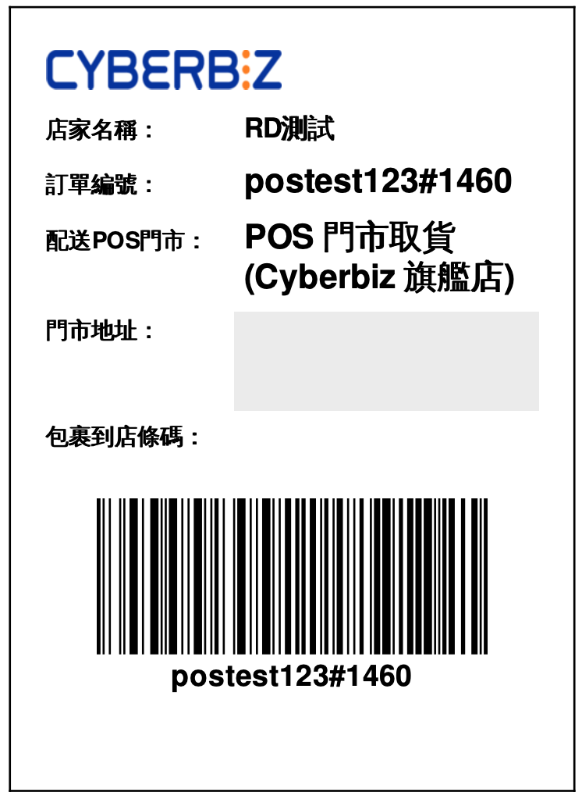
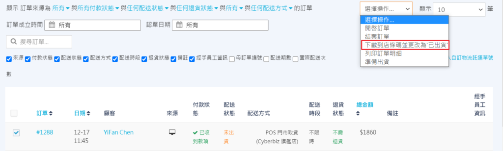
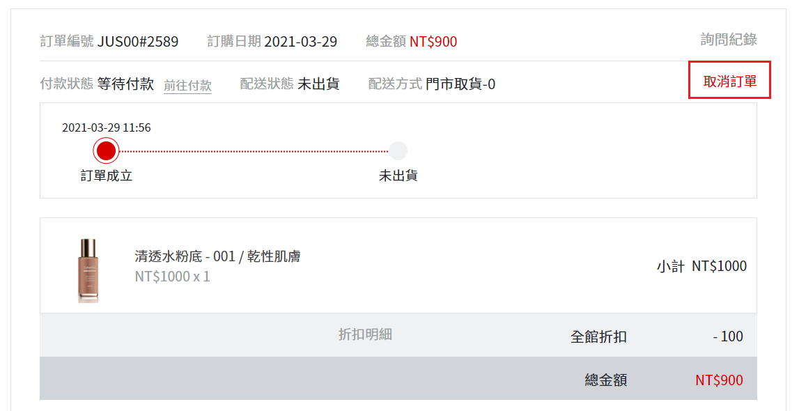
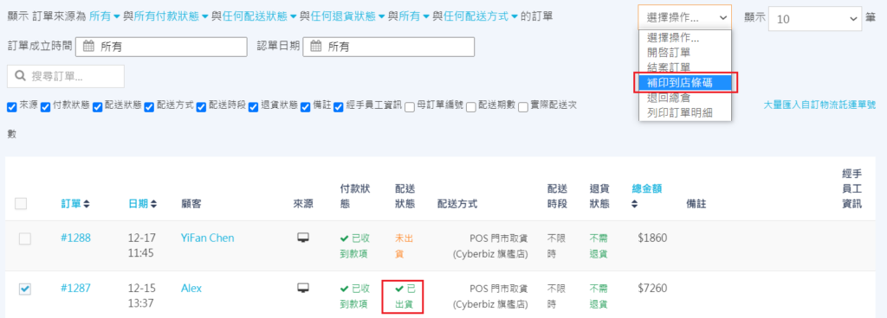
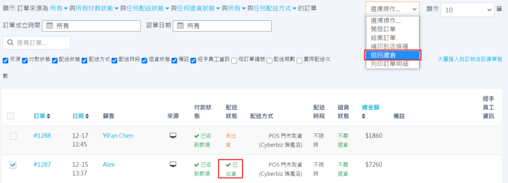
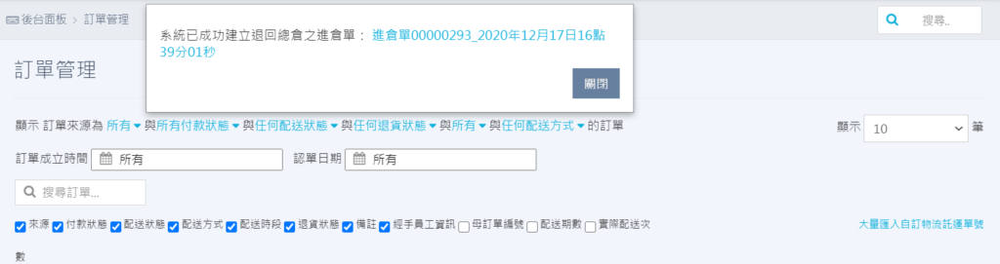
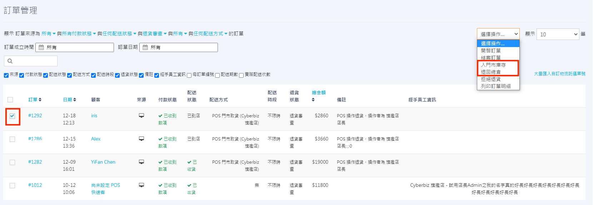
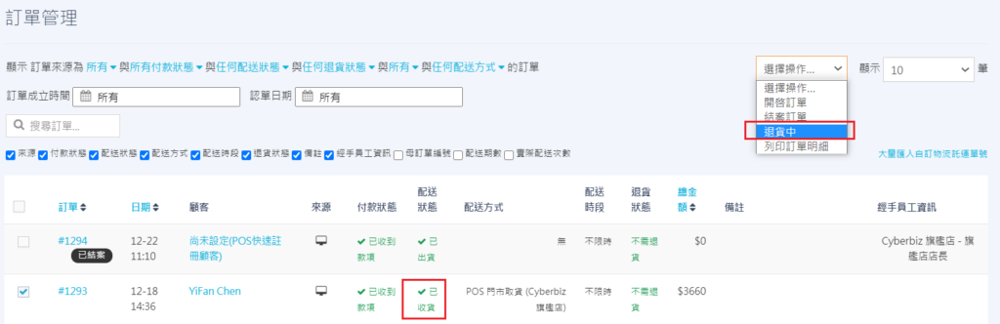

# 門市取貨訂單出貨
當顧客選擇「門市取貨」下單後，管理員需透過後台執行出貨作業。本指南將引導您完成從篩選訂單、列印到店條碼到處理後續退貨的完整流程。
{ .subtitle }

[:lucide-layers:{ title="適用產品" }](../../resources/conventions#適用產品) | EC / POS
[:lucide-tag:{ title="適用方案" }](../../resources/conventions#適用方案) | 所有 PLUS / 企業
{ .doc-badge }

## 使用須知

- **出貨限制**：門市到貨訂單僅支援 **全部出貨**，**不支援部分出貨**。

## 操作流程

### 出貨作業

1. 登入 CYBERBIZ 管理後台，前往 **訂單 > 門市訂單**。

    > 您也可前往 **訂單 > 所有訂單**，使用訂單篩選器，在 **配送方式** 中選擇 `門市取貨` 或 `POS 商店取貨`，找出待處理訂單。

3. 勾選欲處理的訂單（可單筆或批次勾選相同配送方式的訂單）。
4. 點選右上角 **選擇操作**：
    - **一般門市訂單**：選擇 **已出貨**。
    - **POS 門市訂單**：選擇 **下載到店條碼並改為已出貨**。

        !!! info "支援工具：POS 門市到店條碼"
            當 EC 官網同步啟用 POS 系統時，系統支援 **到店條碼** 功能。

            - **使用情境**：供門市收貨人員進行 **掃描入庫** 及顧客取貨時的 **POS 核銷結帳**。
            - **產生時機**：將訂單標記為 **已出貨** 時，系統會自動生成條碼文件並扣除 EC 庫存，同時推送通知至對應 POS 門市。
                { .small-image }
            - **操作方法**：列印下載的 PDF 到店條碼單，並貼在包裹外箱。
            - **注意事項**：此條碼僅供 **內部管理與門市核銷** 使用，**不具備** 第三方物流（如黑貓、宅配通）的配送與貨態追蹤功能。

            { .small-image }

    { .screenshot }

5. 將包裹交由配送人員送往指定門市。

## 常見情境處理

=== "一般門市訂單"

    ### 取消訂單

    若配送狀態為 `未出貨`，管理員可直接在訂單內點選 **取消訂單**。

    { .screenshot }

    消費者也可於前台訂單明細頁 **取消訂單**。

    { .screenshot }

=== "POS 門市訂單"

    ### 補印到店條碼單

    若訂單已改為 **已出貨** 但需重新列印條碼，請勾選該訂單，於 **選擇操作** 選單中點選 **補印到店條碼**。

    { .screenshot }

    ### 取消訂單與退回總倉

    根據訂單所處的不同階段，處理方式如下：

    #### 一、包裹出貨前（未出貨）

    若配送狀態為 `未出貨`，管理員可直接在訂單內點選 **取消訂單**。

    { .screenshot }

    消費者也可於前台訂單明細頁 **取消訂單**。

    { .screenshot }

    #### 二、包裹已出貨但尚未到店

    若需攔截已寄出的包裹，請執行以下操作：

    1. 於訂單列表勾選訂單，點選右上角 **選擇操作 > 退回總倉**。
        { .screenshot }
    2. 訂單狀態將變更為 `已退貨`，系統會自動建立一筆進倉單。

        > 來源店家為 **第三方**，狀態為 **待入庫**

        { .screenshot }

    3. 前往 **POS 功能 > 全通路庫存管理 > 進倉單** 完成 [收貨清點](../../../pos/inventory/進倉單/#確認--取消收貨)，回補 EC 庫存。

    #### 三、包裹已到店（顧客尚未取貨）

    當包裹已抵達門市但顧客要求退貨時，管理員可選擇 **入門市庫存** 或 **退回總倉**：

    { .screenshot }

    - **入門市庫存**：由後台執行 **退貨審查 > 入門市庫存**，系統會自動在該門市建立進倉單，由門市人員[收貨清點](../../../pos/inventory/進倉單/#確認--取消收貨)後轉為店內庫存。
    - **退回總倉**：由店員在 POS 端申請退貨，包裹寄回後由後台執行 **退貨審查** 並改為 `已退貨`。
        { .screenshot }

        
    !!! warning "退貨限制"
        POS 門市取貨訂單僅支援 **全單退貨**，不支援部分商品退貨。

## 常見問題

??? quote "為什麼下載到店條碼時提示失敗？"
    請檢查該訂單是否包含「貨到付款」選項。目前 POS 門市取貨僅支援「先付款後取貨」，若設定包含貨到付款，將無法產生到店條碼。

??? quote "消費者取貨後如何退貨？"
    - **現場退貨**：門市人員可在 POS 前台點選「申請退貨」，狀態會轉為 `退貨中`，後續由管理後台完成審查。
    - **官網退貨**：消費者可在官網前台申請退貨，流程與一般 EC 訂單相同。

