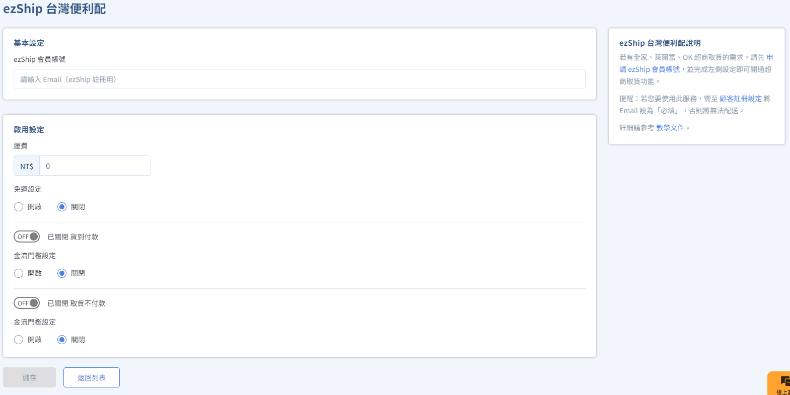
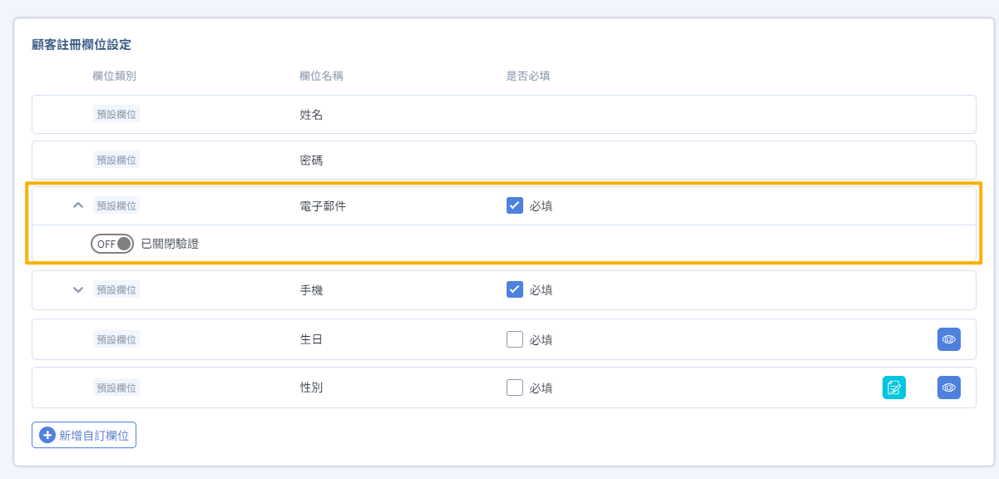
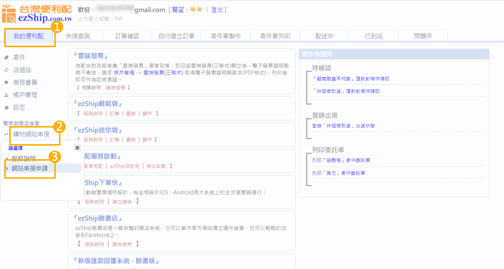
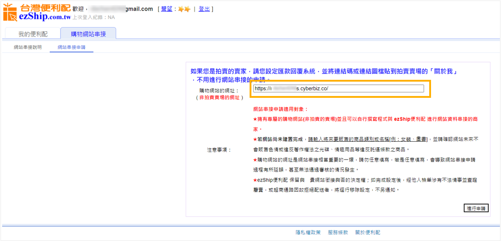
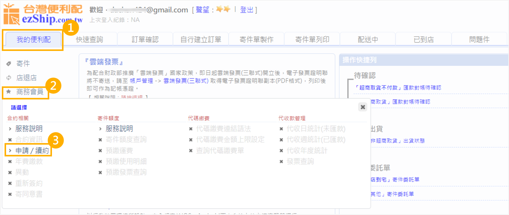
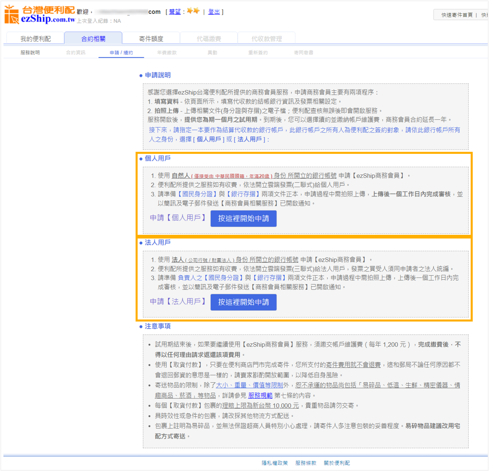
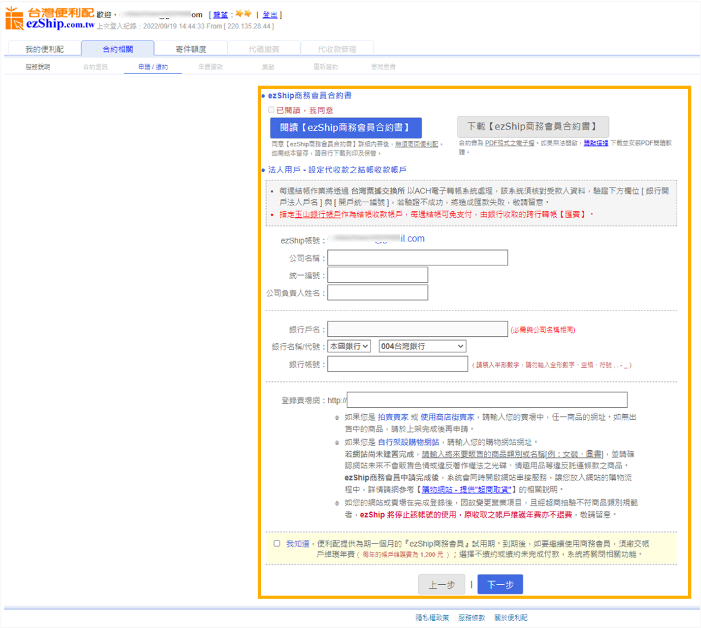

# 串接 ezShip 超商取貨 (C2C)

透過 ezShip 便利配串接，商家可以一次開啟全家、萊爾富、OK 三大超商的取貨功能，提供消費者更多元的配送選擇。
{ .subtitle }

[:lucide-tag:{ title="適用方案" }](../../resources/conventions#適用方案) | 專業 / 進階 / 高手
{ .doc-badge }

{ .hero-page }

!!! info "適用版本說明"
    綠界串接服務僅支援 **專業、進階、高手版** 商家，且限 **未啟用 CYBERBIZ PAYMENTS** 之用戶使用；若您已使用 CYBERBIZ PAYMENTS，其系統已內建完整的超商物流功能，無需另行串接 ezShip 服務。

!!! tip "應用情境"
    - **多通路超商覆蓋**：除了 7-11 外，一次補齊全家、萊爾富與 OK 超商的取貨服務。
    - **小規模經營起步**：適合出貨量較小、暫無大宗寄件 (B2C) 需求，採用店到店 (C2C) 模式的商家。
    - **多元支付選擇**：搭配 ezShip 商務會員，提供超商貨到付款服務，提升消費者下單意願。

## 使用須知

在啟用 ezShip 服務前，請務必了解以下系統邏輯與操作限制：

- **託運單列印**：使用 ezShip 建立的訂單，**必須前往 ezShip 後台** 進行託運單產出與寄件操作，CYBERBIZ 後台不提供列印功能。
- **運費限制**：ezShip 的 **貨到付款** 與 **貨到不付款** 運費 **無法分開設定**。
- **貨到付款限制**：
    - 需申請 ezShip **商務會員** 並簽訂合約，且需額外支付年費。
    - 每筆代收手續費為代收金額的 **0.8%**，不足 3 元以 3 元計（代收手續費有可能不同，依申請方案而定），將於轉匯代收款項時扣除。
    - 單筆代收上限為 **10,000 元**。
- **功能支援**：目前僅支援店到店 (C2C) 模式，尚未支援 ezShip B2C 大宗寄件。

## 操作流程

### 步驟 1：調整會員註冊欄位

ezShip 串接需以 Email 作為關聯，請務必先完成此設定。

1. 登入 CYBERBIZ 後台，前往 **管理中心 > 顧客註冊設定 > 顧客註冊欄位設定**。
2. 確保 **電子郵件** 欄位已勾選為 **必填**。

### 步驟 2：申請 ezShip 會員帳號

1. 前往 [ezShip 後台](https://www.ezship.com.tw/sender/sender_register_account.jsp) 進行註冊。
   
    > **建議**：寄件人名稱建議填寫 **公司名稱**，此名稱將顯示在託運單上。
    
2. 完成 Email 與手機簡訊驗證。
3. 進入 ezShip 後台 **我的便利配 > 購物網站串接 > 網站串接申請**。
    
4. 在網址欄位填入您的 **官網網址** 並送出審核。
    

### 步驟 3：申請超商貨到付款 (選填)

若僅需提供取貨不付款，可跳過此步驟。

1. 在 ezShip 後台點選 **我的便利配 > 商務會員 > 申請/續約**。
    
2. 選擇 **個人** 或 **法人** 身份。
    
3. 填寫資料後送出審核。
    > 審核通常需要 1-2 個工作日，完成後會收到功能開啟通知。
    

    !!! example "法人申請流程範例"

        1. 依序填入相關資料，並提供所需身分證、銀行存摺照片。
        2. 資料完整提供後 ezShip 將會於 1-2 個工作日內完成審核，並以簡訊及電子郵件發送 `申請審核完成《功能開啟》通知`。

### 步驟 4：CYBERBIZ 後台綁定與設定

1. 登入 CYBERBIZ 後台，前往 **金物流 > 超商物流 > ezShip 台灣便利配**。
2. **基本設定**：於 **ezShip 會員帳號** 欄位填入您的 ezShip 註冊 Email。
3. **啟用設定**：
    - **運費**：設定每筆訂單的固定運費。
    - **免運門檻**：設定消費滿額免運金額。
    - **貨到付款**：若已開通商務會員，可將此開關切換為 `開啟 (ON)`。
4. 點擊 **儲存** 完成設定。

## 常見問題

??? quote "為什麼訂單成立後，我在後台找不到列印託運單的地方？"
    因為 ezShip 屬於第三方串接平台，其物流標籤（託運單）是由 ezShip 系統產生的。您必須登入 ezShip 的管理後台，才能看到該筆訂單並執行列印。

??? quote "ezShip 支援 7-11 取貨嗎？"
    目前的串接版本主要支援 **全家、萊爾富、OK** 三大超商。若需提供 7-11 取貨，建議另外申請 **CYBERBIZ PAYMENTS** 提供的 7-11 C2C 或 B2C 服務。

??? quote "如果消費者沒有收到簡訊通知，我可以在哪裡查看包裹狀態？"
    您可以前往 ezShip 後台查詢。ezShip 與 CYBERBIZ 的狀態同步可能有些微延遲，最準確的狀態應以 ezShip 後台為準。

## 延伸閱讀

- :lucide-package:{ .lg }   
  [__超商物流 C2C 出貨流程__](../shipping/超商出貨流程)       
  了解如何處理店到店寄件與後台狀態變更。

- :lucide-credit-card:{ .lg }     
  [__申請 CYBERBIZ PAYMENTS__](../payments/cyberbiz-payments)  
  若需更完整的 7-11 與 B2C 物流支援，建議升級至官方支付工具。

