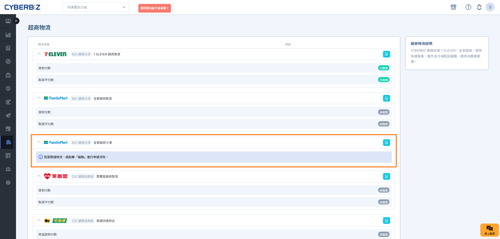
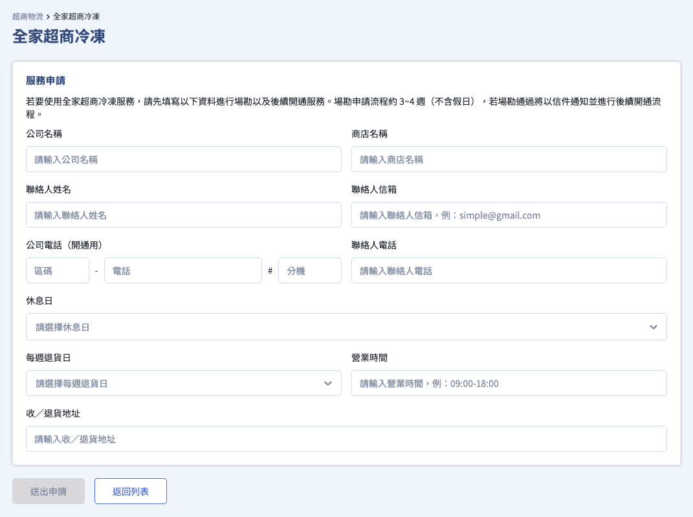
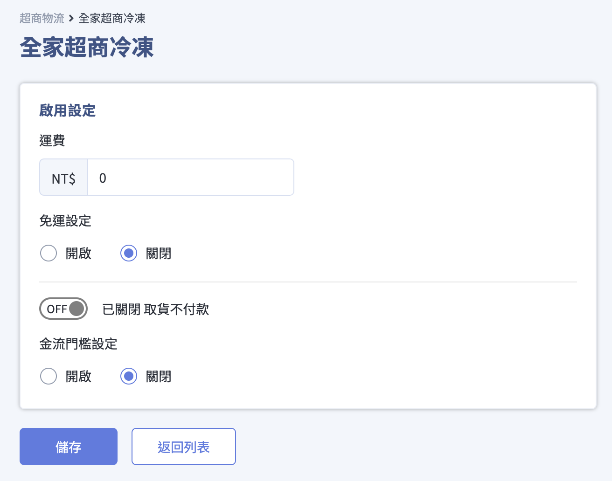

# 串接全家超商 B2C 冷凍物流

全家冷凍大宗寄倉 (B2C) 物流申請流程、出貨規範與配送須知完整說明。
{ .subtitle }

[:lucide-lock:{ title="適用方案" }](../../resources/conventions#適用方案) | 高手 / 高手PLUS / 企業
{ .doc-badge }

{ .hero-page }

## 全家超商 B2C 冷凍物流說明

全家冷凍 B2C (Business to Consumer) 為大宗寄倉服務，由全台物流統一至商家收貨，並配送至消費者指定的各全家門市。此服務專為有規模化冷凍商品配送需求的商家設計。

!!! tip "應用情境"
    - **大宗冷凍出貨**：適合每日有穩定冷凍訂單量，且具備自有冷凍倉儲的商家。
    - **食品零售**：冷凍生鮮、低溫調理食品等需全程維持 -12℃ 以下環境的商品。
    - **O2O 佈局**：結合線上訂購與全台 4,000+ 間全家門市 24 小時取貨的便利性。

## 使用須知

- **適用版本：貨到付款僅限使用 CYBERBIZ PAYMENTS 的商家；非使用商家僅支援取貨不付款。**
- **收貨日判定**：收貨日（D 或 D+1）由全台物流於場勘後判定，判定後 **無法自行修改** 。
- **配送時效**：配送到店約 **5-7 個工作日**。包裹若逾期（出貨日+7日）未到店，全家將取消該筆訂單預留的空間，系統會顯示運送異常，商家需聯繫客服走退貨流程。
- **取消訂單作業**：消費者無法自行取消訂單。商家若需取消已產單之收貨空間，需主動聯繫全台物流或於司機上門收貨時告知。
- **賠償上限**：貨物遺失或損壞之賠償上限為 **NT$5,000**。
- **物流處理費**：自 2024/02/01 起全家冷凍(B2C)服務未達最低收件量 10 件之物流處理費 80 元/件，優惠免收，如有接獲全家通知異動會再另行公告通知。

## 操作流程

### 步驟 1：提出申請與場勘準備

1. **聯繫客服**：向 CYBERBIZ 客服提出申請。
2. **開通申請頁面**：客服確認後，後台將出現申請分頁，並發送 email 通知。
3. **場地確認**：
    - 確認具備冷凍設備（-12℃ 以下）。
    - 準備公司營業資料、寄件人資訊與收貨地址。

### 步驟 2：填寫申請資料

1. 前往 **金物流 > 超商物流 > 全家超商冷凍**。
2. 填寫以下資訊：
    - **公司基本資料**：名稱、統編、地址。
    - **寄件人資訊**：用於退貨聯絡，需為真實姓名與手機。
    - **收貨地址**：司機實際收貨的地址（需有冷凍設備）。
    - **營業時間**：司機可收貨的時段。
3. 點擊 **送出申請**。

!!! warning "注意"
    送出後資料無法自行修改，如需變更請聯繫客服。資料錯誤將導致場勘失敗。場勘申請流程約 **3-4 週**。

### 步驟 3：場勘完成與服務開通

1. **場勘結果**：全台物流將派員至現場確認設備與場地。若場勘失敗，系統會發送 email 通知原因。
2. **開通通知**：場勘通過後，系統將自動開通並發送 Email。
3. **啟用設定**：登入後台進行以下設定：
    - **啟用服務**：前往 **金物流 > 超商物流 > 全家超商冷凍**。
    - **運費設定**：輸入物流費用。
    - **付款方式**：勾選開放 **取貨不付款** 或 **貨到付款** 。

## 出貨規範與包裹限制

為確保配送順暢，請務必遵守以下規格限制。若規格不符，全台物流將拒絕收貨或進行退件。

### 包裹規格表

| 規格 | 尺寸限制 (長+寬+高) | 材積限制 | 重量限制 | 物流費用 (未稅) |
| :--- | :--- | :--- | :--- | :--- |
| **S60** | 單邊最長 ≤ 45cm | 0.3 材 | ≤ 5 kg | $145 |
| **S105** | 單邊最長 ≤ 45cm | 1.5 材 | ≤ 10 kg | $155 |

!!! warning "規格標示與實體不符"
    - 使用 S60 託運單寄送 S105 大小的包裹，會因預訂空間不足而退件。
    - 使用 S105 託運單寄送 S60 大小的包裹，仍會以 S105 費用計收。

### 包裝與標籤規範

1. **溫度規範**：僅支援冷凍商品（需為食品），出貨前需預冷至少 **12 小時**，確保商品完全冷凍（-12℃ 以下）。
2. **標籤張貼**：託運單列印後，請放入 **防水透明袋** 內，牢固黏貼於包裹外箱，避免因冷凝水導致條碼模糊無法掃描。
3. **出貨操作**：下載託運單後，全台物流接收到訂單即會排程收貨，不需額外聯繫。請在司機收貨前填妥[取貨明細表](https://www.cyberbiz.co/support/wp-content/uploads/2021/01/%E5%86%B7%E5%87%8DEC%E5%8F%96%E8%B2%A8%E6%98%8E%E7%B4%B0%E8%A1%A8S105.xlsx)。

### 禁止託運物品

為符合法令與物流安全，嚴禁寄送以下物品：

- **溫層不符**：冷藏商品或未進行預冷之冷凍商品。
- **高價值物品**：單件價值超過 **NT$5,000** 的商品。
- **易碎/電子品**：玻璃製品、3C 產品（電腦、螢幕、手機、相機等）。
- **有價證券**：現金、票據、股票、珠寶、古董。
- **危險品**：易燃物、化學品、刀劍槍械、瓦斯瓶。
- **其他**：寵物、生鮮保存期限短於兩週之物品、准考證、護照。

!!! warning "違規處置"
    寄送禁止託運物品導致其他包裹受損或物流設備損壞時，商家需負擔相關賠償責任。

### 全台物流收件和配送時間

#### 收貨服務時間 (商家端)
- **收貨時段**：星期一至星期六 (星期日不收貨)。
- **收貨日判定**：由場勘時判定為 **D** 或 **D+1**，判定後無法更改。
- **收貨切割時間**：
    - **D 取貨**：當日 **09:00AM** 前印出託運單的包裹，會於當天收貨。
    - **D+1 取貨**：當日 **17:00PM** 前印出託運單的包裹，會於隔日收貨。
- **特別說明**：如遇農曆新年、天然災害或物流高峰期等不可抗力因素，時間將另行公告議定。

#### 物流配送時間 (門市端)
- **配送時段**：星期一至星期日 (包含例假日)。
- **配送時效**：包裹配送至門市約需 **5-7 個工作日**。

#### 全台物流服務範例 (以取貨日 D 為例)
以廠商點擊「下載託運單」時間點開始計算，若場勘判定為 D 取貨，範例如下：

| 訂單可收貨時間 (下載託運單) | 全台物流收貨時間 | 配送至店 (約收貨日+5天) |
| :--- | :--- | :--- |
| 9/1 (四) 09:00 前 | 9/1 (四) 下午 | 約 9/6 (二) |
| 9/1 (四) 09:00 後 | 9/2 (五) 下午 | 約 9/7 (三) |
| 9/2 (五) 09:00 前 | 9/2 (五) 下午 | 約 9/7 (三) |

!!! note "配送說明"
    1. 全台物流 **星期日休息不收貨** ，若遇星期日則收貨日需往後順延一天，但門市配送不受影響。
    2. 請商家務必於司機收貨前將商品準備完成，以確保交貨順利。

## 常見問題

??? quote "為什麼結帳頁沒有出現 **全家冷凍取貨** 選項？"
    可能原因包含：
    1. **商品溫層錯誤**：商品未正確設定為 **冷凍** 。
    2. **材積超標**：購物車中商品材積總計超過 S105 限制。
    3. **門市空間額滿**：該全家門市冷凍櫃空間已滿，全家系統會自動暫時隱藏該選項。

??? quote "若選定的門市突然結束營業（閉店）該怎麼辦？"
    系統會依據 Email 通知樣版中「商家通知設定」的信箱發送通知信給商家。商家需於收到通知後的 **6 日內** 聯繫消費者，並於後台搜尋該筆訂單後，重新選擇其他全家門市。

??? quote "消費者若在商品到店 4 日內未取件，包裹會如何處理？"
    包裹會由全台物流回收並暫放在物流中心。待商家下次有新訂單需收件時（3 天內），司機會在前往收件時順便將該逆物流包裹退回。此段逆物流 **不額外收費** 。若 3 天內商家皆無新訂單，全台物流會於第 4 天主動將包裹退回給商家。

??? quote "包裹未如期到店（D+3）該如何處理？"
    若包裹於出貨日後 3 天（D+3）仍未到店，將進入查找流程。若確認遺失或商品失溫損壞，則啟動調查與賠償流程（上限 NT$5,000）。
