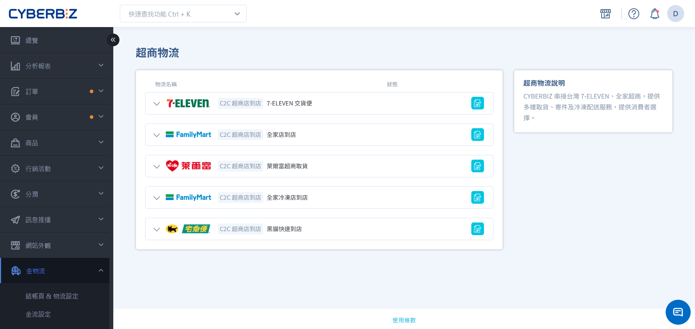
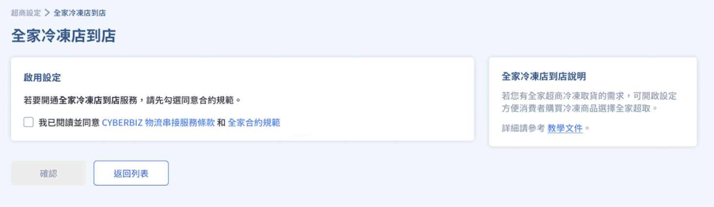
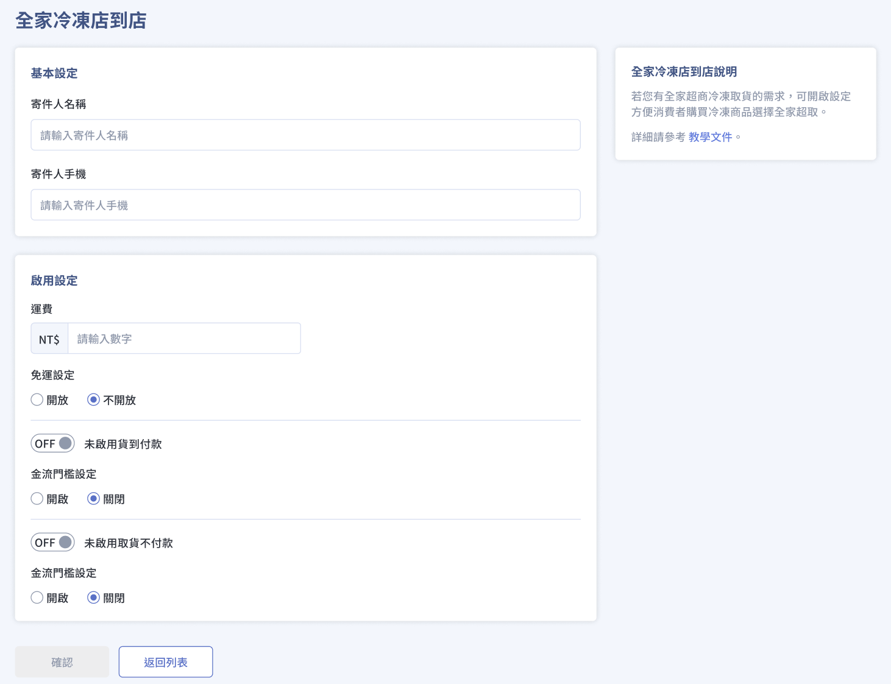

# 全家 C2C 冷凍店到店物流
串接全家冷凍店到店服務，專為冷凍商品設計的超商物流，支援貨到付款與取貨不付款，擴大冷凍商品銷售通路。
{ .subtitle }

[:lucide-toggle-right:{ title="適用功能" }](../../resources/conventions#適用功能) | CYBERBIZ PAYMENTS
{ .doc-badge }

## 使用須知

- **服務權限**：**貨到付款** 功能僅限使用 **CYBERBIZ PAYMENTS** 的商家。
- **運費查詢**：請至後台 **管理中心 > 對帳中心** 查看物流運費表。
- **寄件規範更新**： 自 2025/06/09 起，全家取消冷凍 C2C 寄件需使用全家冷凍寄件專用紙箱之規定。
- **託運單效期**：儲值 CYBER 幣使用全家冷凍店到店寄件，列印託運單後，7 天之後沒寄出將失效。
- **貨賠保障**：貨賠金額上限為 NT$5,000。
- **運費回補機制**：儲值 CYBER 幣使用全家冷凍店到店寄件，列印託運單後，實際卻未寄件，CYBER 幣將於14天後回補。

## 操作流程

### 步驟 1：同意條款

1. 登入 CYBERBIZ 管理後台，前往 **金物流 > 超商物流 > 全家冷凍店到店**。
    
2. 閱讀 **CYBERBIZ 物流串接服務條款**、**全家合約規範**，並勾選 **我已閱讀並同意**。
    

### 步驟 2：填寫基本資料

| 項目 | 說明 |
|------|------|
| 寄件人資訊 | 填寫寄件人姓名與手機 |
| 運費設定 | 設定運費金額 |
| 免運設定 | 依需求開啟免運門檻 |
| 付款方式 | 開啟「貨到付款」、「取貨不付款」 |

填寫完成後儲存，即可在前台顯示全家冷凍店到店選項。

## 退貨規範

**商家退貨領取**：刷退商品送達寄件門市後，請於 4 日內取回。

**逾期未取回退刷商品：**

1. 送回物流中心
2. 使用宅配到付方式寄回商家
3. 若拒收到付包裹導致再次退回物流中心

    - 日翊得銷毀刷退商品
    - 每筆可向商家收取 NT$150 處理費

