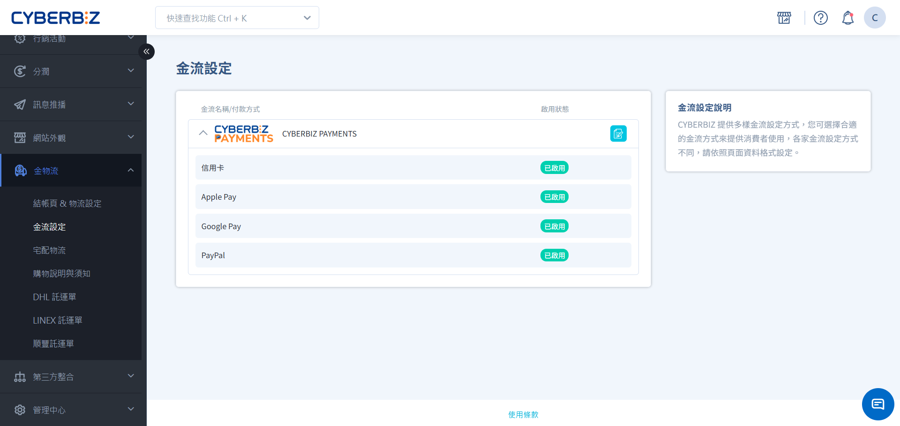
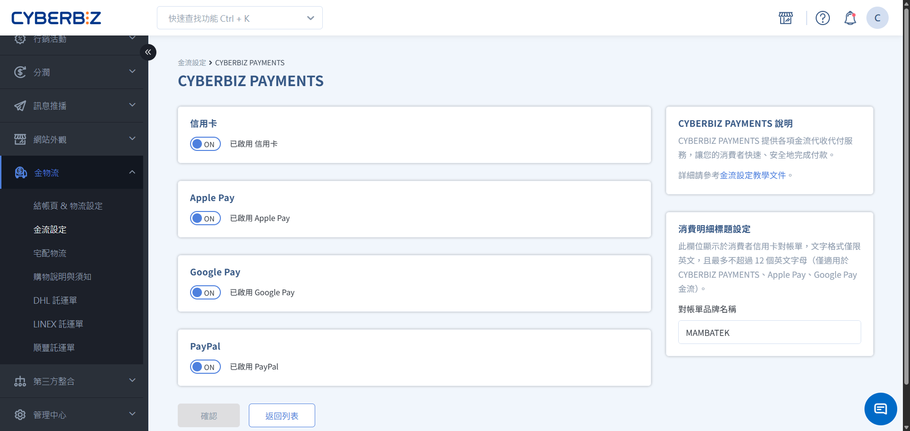

# 北美站金流服務

北美站整合了國際主流的金流解決方案，包含信用卡與電子錢包支付，以及廣泛使用的 PayPal 服務，幫助商家順利經營美國市場。
{ .subtitle }

[:lucide-layers:{ title="適用方案" }](../../resources/conventions#適用方案) | 跨境電商（北美站）
[:lucide-tag:{ title="適用方案" }](../../resources/conventions#適用方案) | Pro / Business
{ .doc-badge }

## 金流選項說明

| 付款方式 | 交易類別 | 信用卡持卡國別 | 手續費率 | 最低結帳門檻 |
| :--- | :--- | :--- | :--- | :--- | 
| **信用卡 / 簽帳金融卡 / Apple Pay / Google Pay** | 美國國內交易 | 美國 | 2.6% + 0.3 USD | 0.5 USD |
| | 國際交易 | 非美國 | 3.6% + 0.3 USD | 0.5 USD |
| **PayPal** | 美國國內交易 | 美國 | 3.49% + 0.49 USD | 無 |
| | 國際交易 | 非美國 | 4.99% + 0.49 USD | 無 |

- **帳務對帳**：相關金流手續費將列於每期對帳單。
- **最低結帳門檻**：系統設有預設之最低結帳門檻，商家無需手動配置；單筆訂單金額須達該門檻，結帳頁面始會顯示對應之付款選項。

## 使用須知

- **信用卡支援卡別**： Visa、Mastercard、American Express、Discover、Diners Club、JCB、China UnionPay （銀聯）。
- **[電子錢包使用規範](https://docs.stripe.com/stripe-js/elements/payment-request-button)**
    - **Apple Pay**：
        1. 支援使用 Safari 瀏覽器，並確認已啟用 Apple Pay 功能。
        2. 支援 iOS 16（含）以上版本之 Chrome 瀏覽器，且須預先啟用 Apple Pay 和 Google Pay。
    - **Google Pay**：須使用 Chrome 瀏覽器，並確認已啟用 Google Pay。若付款連結尚未通過身份驗證，請依系統指示完成。

## 步驟1：開啟金流選項

前往 **金物流 > 金流設定**，點擊 **CYBERBIZ PAYMENTS** 右側 :lucide-file-pen-line: **設定**。

- **對帳單品牌名稱**：設定顯示在消費者帳單上的名稱（僅限英文，最多 12 個字元）。

## 步驟2：開啟支付方式

可依需求勾選開啟以下付款方式。

- 信用卡
- Apple Pay
- Google Pay
- PayPal

