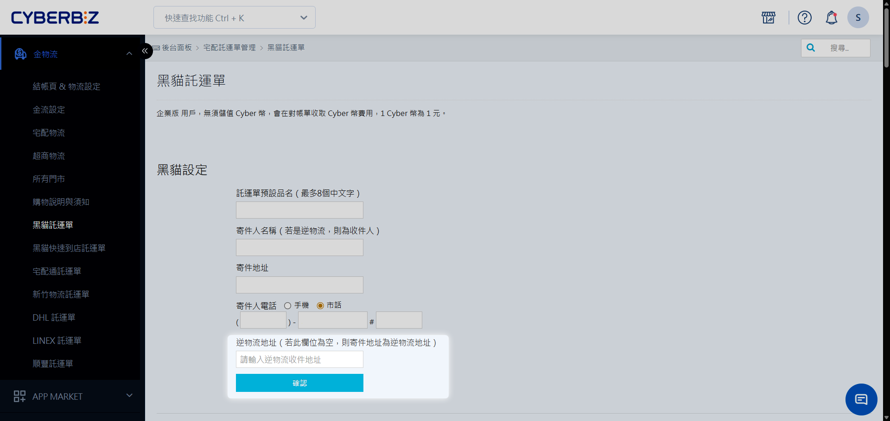
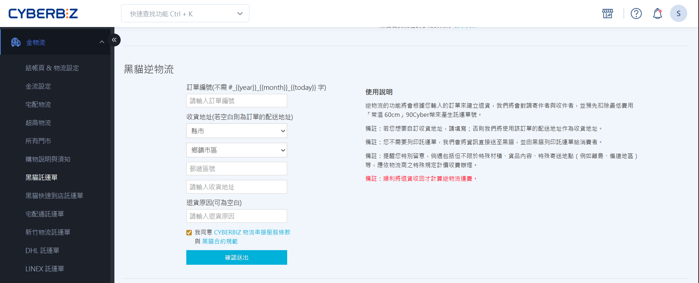

# 宅配逆物流（黑貓/宅配通/新竹物流）

當顧客提出退貨申請且商家核准後，透過 CYBERBIZ 系統發起「逆物流」託運單，通知合作物流商直接前往顧客指定地點收回商品。
{ .subtitle }

## 使用須知

- **物流選項**：CYBERBIZ 提供 **黑貓宅急便**、**宅配通**、**新竹物流** 三大宅配商的串接逆物流功能。
- **收件方式**：系統會自動通知司機，商家無需自行列印託運單交給顧客。
- **溫層限制**：目前系統串接逆物流僅支援 **常溫** 配送。
    - 若有冷藏或冷凍退貨需求，請商家自行聯繫物流商安排取件。
- **自動退點機制**：若逆物流單號列印後未於兩週內實際使用，系統將自動退還預扣點數。

## 設定退貨收回地址

自訂退貨商品要送回的地址（例如：特定倉庫或辦公室）。

1. 前往 **金物流 > [物流商名稱] 託運單**。
2. 找到 **逆物流地址** 設定區塊。
3. 填寫收貨人、電話與地址。
    - 若此處留空，物流商預設將商品送回原 **寄件地址**。

## 發起逆物流

### 1. 建立逆物流單

依據原出貨物流商，前往對應的路徑：

- **黑貓**：**金物流 > 黑貓託運單**
- **宅配通**：**金物流 > 宅配通託運單**
- **新竹物流**：**金物流 > 新竹物流託運單**

### 2. 填寫收件資訊

1. **輸入單號**：輸入欲收回的訂單編號。
2. **收貨地址**：
    - 若留空，系統自動帶入 **原訂單消費者收件地址**。
    - 若顧客欲從不同地址寄回，請務必手動輸入正確的 **收件資訊**（即司機取件地點）。
3. **退貨原因**：簡易註明退貨事由，供司機或內部查核。
4. 點擊 **確認送出**。

### 3. 取件時程

系統確認送出後，將自動派單給物流商，司機通常在 **1~2 個工作天** 內前往指定地址收貨。

## 退貨狀態追蹤

使用系統串接逆物流，系統會自動同步配送貨態：

- **自動轉單**：退貨商品送達後，系統會自動將訂單狀態更改為 **退貨審查**。
- **手動審查**：商家收到商品並確認無誤後，即可依照標準 [退貨退款流程](../訂單/訂單退款流程.md) 完成後續退款作業。

!!! tip "非系統串接退貨"
    若由顧客自行寄回或商家自行安排非系統派車，商家收到貨後須 **手動** 將訂單狀態勾選更改為 **退貨審查**，系統才可繼續[退貨退款流程]()。

## 常見問題

??? quote "司機去收貨時，顧客需要準備什麼？"
    顧客只需將商品包裝完整，無須張貼任何單據。司機前往取件時會攜帶預印好的託運單。

