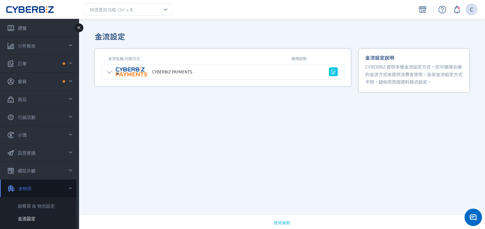
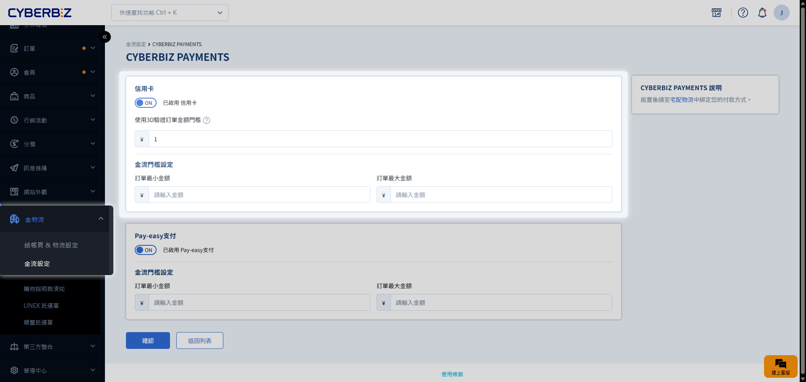
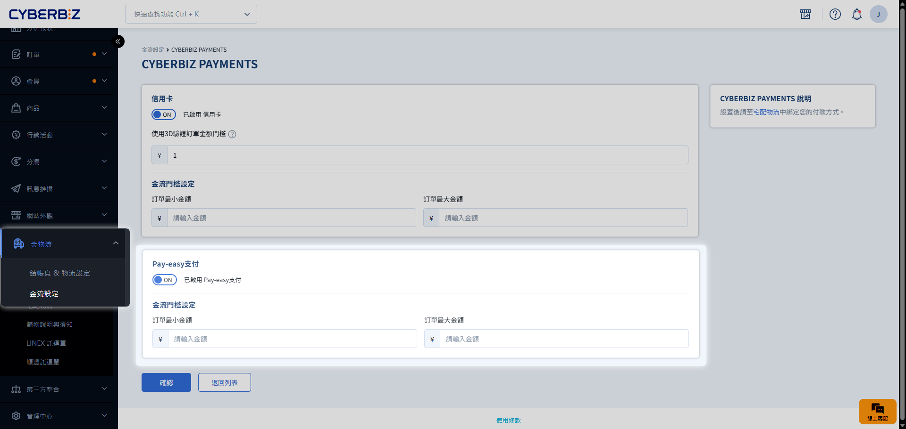

# 日本站金流服務

日本站提供在地化的金流解決方案，包含主流信用卡支付與日本特有的 Pay-Easy 便利服務，幫助商家順利進軍日本電商市場。
{ .subtitle }

[:lucide-layers:{ title="適用方案" }](../../resources/conventions#適用方案) | 跨境電商（日本站）
[:lucide-tag:{ title="適用方案" }](../../resources/conventions#適用方案) | Pro / Business
{ .doc-badge }

## 金流選項說明

| 付款方式 | 支援種類 | 手續費率 | 最低結帳門檻 |
| :--- | :--- | :--- | :--- |
| **信用卡** | 信用卡 簽帳金融卡 (VISA、MasterCard、JCB) | 3.6% (每筆) | 50 JPY |
| **Pay-Easy** | ATM 網路銀行轉帳 | 1.5% (每筆) | 無 |

- **帳務對帳**：相關金流手續費將列於每期對帳單。
- **最低結帳門檻**：系統設有預設之最低結帳門檻，商家無需手動配置；單筆訂單金額須達該門檻，結帳頁面始會顯示對應之付款選項。

## 步驟 1：信用卡支付設定

前往 **金物流 > 金流設定**，點擊 **CYBERBIZ PAYMENTS** 右側 :lucide-file-pen-line: **設定**。

- **啟用功能**：開啟 **信用卡**。
- **3D 驗證門檻**：設定訂單金額超過多少時需進行 3D 驗證。
- **金流門檻設定**：設定可使用信用卡的 **最小金額** 與 **最大金額**。

## 步驟 2：Pay-Easy 支付設定

前往 **金物流 > 金流設定**，點擊 Pay-Easy 右側 :lucide-file-pen-line: **設定**。

- **啟用功能**：開啟 **Pay-Easy 支付**。
- **金流門檻設定**：設定可使用 Pay-Easy 的 **最小金額** 與 **最大金額**。

