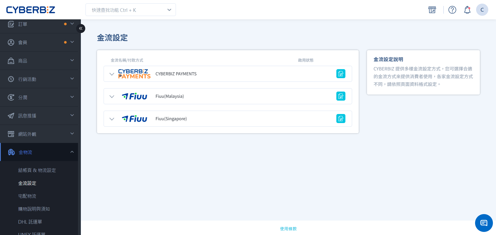
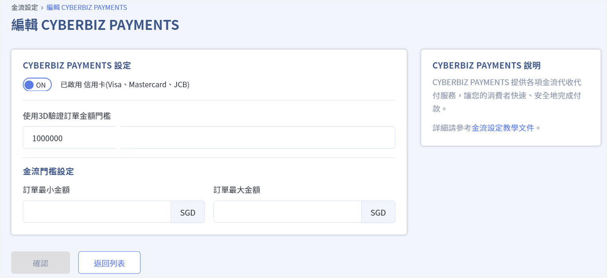
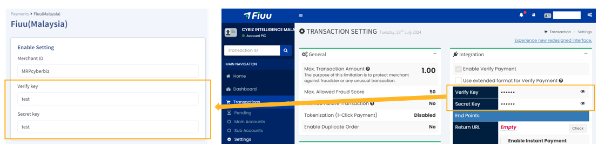
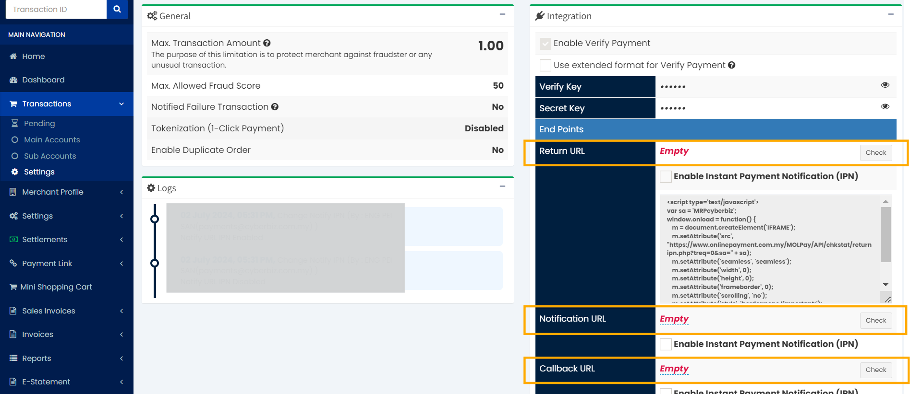

# 東南亞站金流服務
CYBERBIZ 提供標準信用卡服務，更整合了在地龍頭金流商 Fiuu (原 Razer Merchant Services)，支援銀行轉帳、電子錢包及超商現金支付。
{ .subtitle }

[:lucide-layers:{ title="適用方案" }](../../resources/conventions#適用方案) | 跨境電商 (東南亞站)
[:lucide-tag:{ title="適用方案" }](../../resources/conventions#適用方案) | Pro / Business
{ .doc-badge }

## 金流選項說明

| 付款方式 | 支援管道 | 費率 (每筆) |
| :--- | :--- | :--- |
| **CYBERBIZ PAYMENTS** | 信用卡 (VISA/JCB/MasterCard) | 2.0% |
| **Fiuu (馬來西亞)** | 銀行轉帳 | FPX 2.4% 或 MYR 0.6 (擇高) |
| | 現金 | 7-11 Cash 2.4% 或 MYR 0.8 (擇高) |
| | 電子錢包 | Boost (1.6%) DuitNow (1.0%) GrabPay/Shopee Pay (1.4%) Touch'n Go (1.8%) | 
| **Fiuu (新加坡)** | 銀行轉帳 | Paynow (0.7%)  eNETs 2.8% 或 SGD 1.6  (擇高) | 
| | 電子錢包 | GrabPay/Shopee Pay (2.6%) | 
| | Kiosk | SAM Kiosk 2.8% 或 SGD 1.6 (擇高) AXS Kiosk 2.8% 或 SGD 0.9 (擇高) | 

### 使用須知

- Fiuu previously known as Razer Merchant Services。

## 任務 1：設定 CYBERBIZ PAYMENTS (信用卡)

前往 **金物流 > 金流設定**，點擊 **CYBERBIZ PAYMENTS** 右側 :lucide-file-pen-line: **設定**。

- **啟用功能**：開啟 **信用卡**。
- **3D 驗證門檻**：設定訂單金額超過多少時需進行 3D 驗證。
- **金流門檻設定**：設定可使用信用卡的 **最小金額** 與 **最大金額**。

## 任務 2：串接 Fiuu 第三方支付平台

### 1. 取得 Fiuu 後台密鑰

登入 [Fiuu 管理後台](https://portal.merchant.razer.com)，前往 **Transactions > Settings**，複製以下資訊：

- **Verify Key**
- **Secret Key**

### 2. 在 CYBERBIZ 設定串接

1. 登入 CYBERBIZ 後台，前往 **金物流 > 金流設定**。
2. 點選 **Fiuu(Malaysia)** 或 **Fiuu(Singapore)** 進入設定頁面。
    - 請依照當初與 Fiuu 簽訂的合約，開啟對應 Fiuu (Malaysia)、Fiuu (Singapore) 選項，選擇錯誤將導致訂單無法順利結帳。
3. 填入上述複製的密鑰。
    - 務必核對 Merchant ID 正確性，並確保不包含任何空格。

### 3. 配置通知網址

為了讓 Fiuu 成功回傳交易結果給官網，請在 Fiuu 後台的 **Settings** 填入以下三個 URL：

- **Return URL**: `https://cyberbizpay.com/razer/frontend`
- **Notification URL**: `https://cyberbizpay.com/razer/backend`
- **Callback URL**: `https://cyberbizpay.com/razer/callback`

