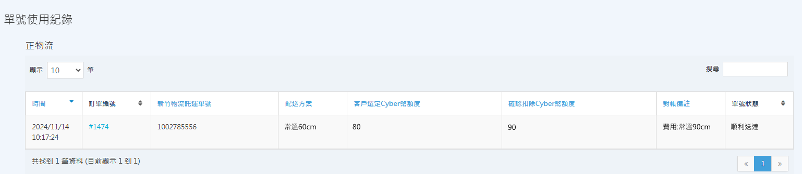

# 查詢宅配託運單紀錄

透過後台託運單管理頁面，您可以即時追蹤各家宅配物流的單號使用狀態，並核對因材積差異、繁盛期間或配送地區產生的運費調整紀錄。
{ .subtitle }

{ .hero-page }

!!! tip "應用情境"
	- **貨態追蹤**：即時掌握包裹目前的配送進度。
	- **費用核對**：比對系統預估運費與物流商對帳後的實際扣款。
	- **失效處理**：確認未使用的單號是否已正確退還運費。

## 使用須知

- **運費支付方式**：
    - **一般版**：需先儲值 Cyber 幣，費用由系統自動從 Cyber 幣扣除。
    - **PLUS版 / 企業版**：運費將列入月結對帳單，不需於後台儲值。
- **禁止手寫託運單**：請務必使用後台產出的託運單，勿使用手寫單，以免系統無法追蹤貨態。
- **單號效期**：託運單號下載後若超過 14 天未使用（未實際出貨），單號將失效，系統會於失效後自動退回預扣費用。
- **未使用單號處理**：未使用之單號，預扣金額將直接返還至 Cyber 幣，不需人工申請。

## 操作流程

### 查詢託運單紀錄與貨態

1. 登入 CYBERBIZ 管理後台，前往 **金物流 > [物流商名稱] 託運單**。
    - 例如：**金物流 > 黑貓托運單**。
2. 在頁面中即可看到 **單號使用紀錄** 列表。

### 核對運費扣款與調整紀錄

系統會根據物流商回傳的實際材積與重量進行費用校正，您可透過以下欄位核對：

- **配送方案**：物流商最終認定的配送溫層與材積標準。
- **客戶選定 CYBER 幣額度**：您在執行出貨操作時，預先選定的運費額度。
- **確認扣除 CYBER 幣額度**：經物流端實際判定後，最終從帳戶扣除的運費額度。

!!! example "常見調整情境"
    - **材積尺寸差異**：原選定常溫 60 cm，對帳後實際為常溫 90 cm，系統將補扣差額至實際運費。
    - **繁盛期間加收費**：春節或大型電商活動期間，物流商可能加收繁盛期費用，此金額會反映在調整後的實際扣費。
    - **特殊配送地區**：配送至離島地區（如澎湖、金門、馬祖、綠島、蘭嶼）時，費用將依物流商官網公告之離島費率計算並進行調整。

## 常見問題

??? quote "目前系統是否還支援黑貓或宅配通的轉單功能？"
    不支援。自 2022 年 12 月起，系統已正式停止支援託運單轉單功能。雖功能已停止，但您仍可於後台查看截至 2022 年 11 月的歷史紀錄。

