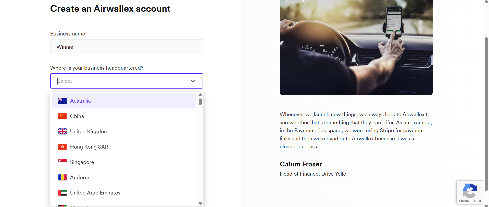
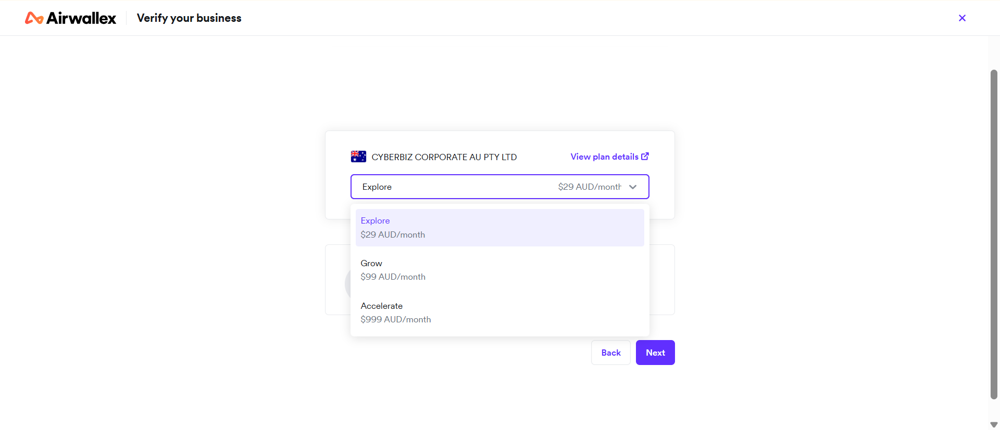
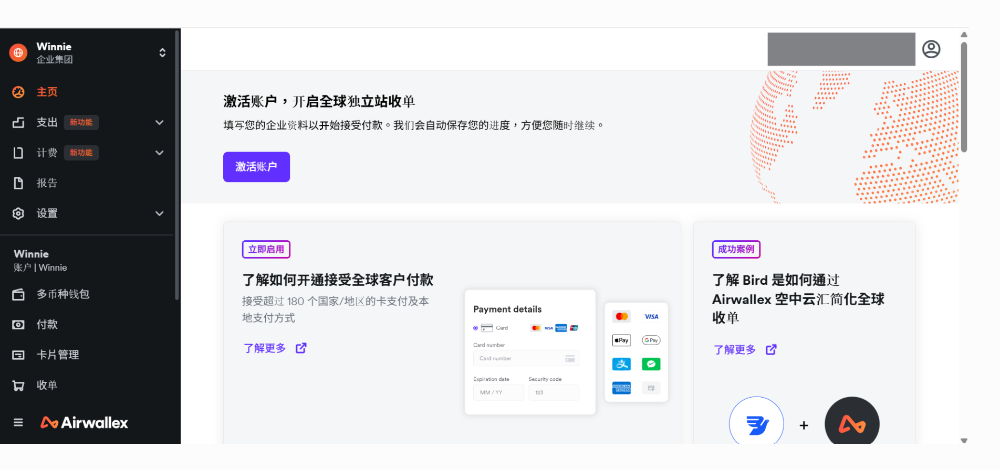
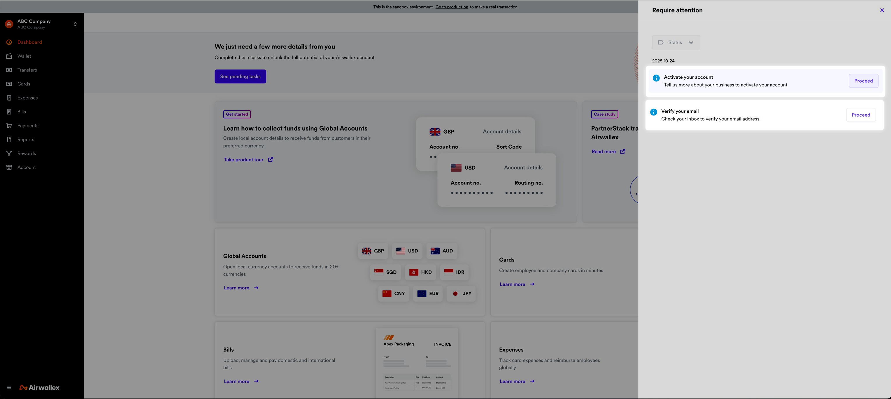
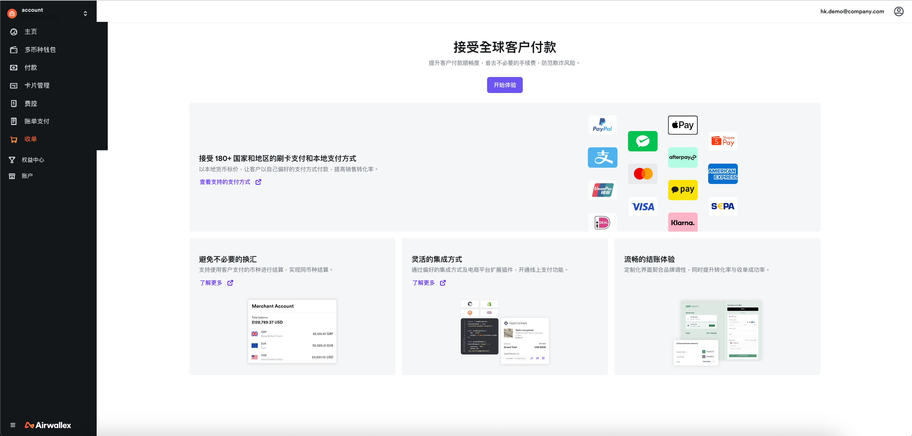
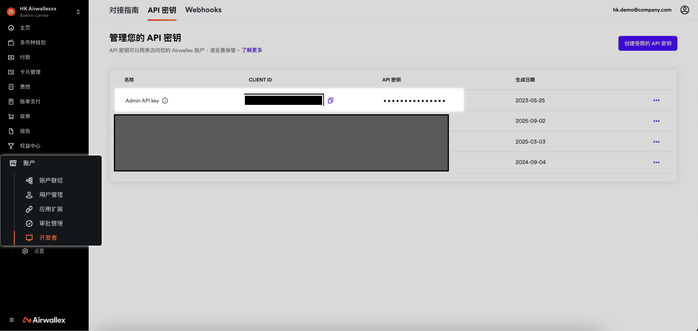
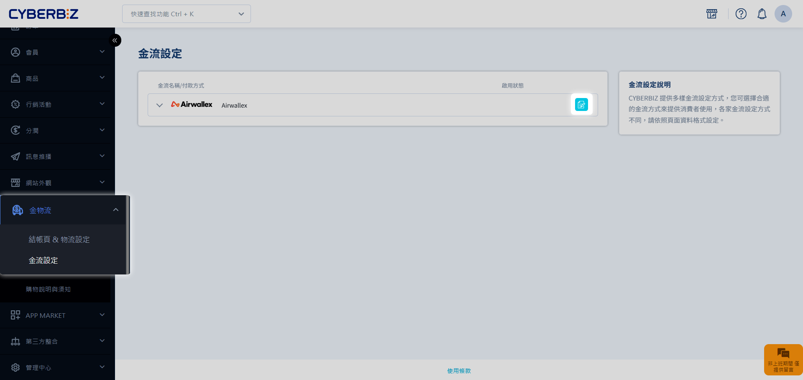
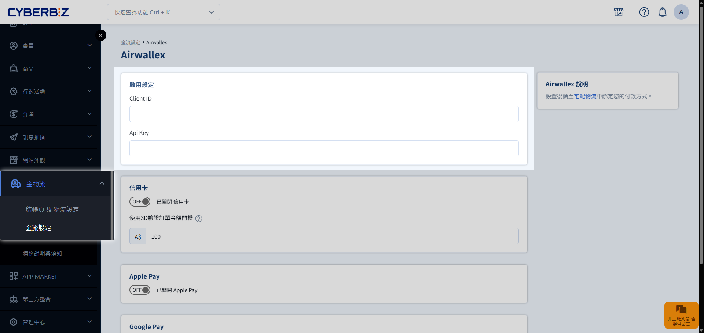
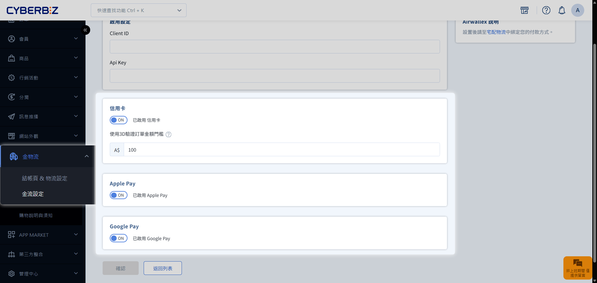

# 澳洲落地版金流服務

澳洲落地版透過與 Airwallex 合作，提供商家穩定且多元的在地金流服務。本文將引導您完成從帳戶申請、官網合規審核到後台 API 串接的完整流程。
{ .subtitle }

[:lucide-layers:{ title="適用方案" }](../../resources/conventions#適用方案) | 跨境電商 (澳洲落地版)
{ .doc-badge }

## 使用須知

- **費用規範**：有關帳戶月費、金流手續費及撥款機制，請參閱 [Airwallex 官方定價說明](https://www.airwallex.com/au/pricing)。

## 步驟 1：申請與激活 Airwallex 帳戶

### 1. 提交帳戶申請

請聯繫您的 CYBERBIZ 開店顧問取得專屬的 **Airwallex 申請連結**。

- **帳戶設置**：
    - **公司所在地**：請依貴司實際登記地點選擇。
        
    - **帳戶方案**：請務必選擇 **Explore** 方案。
        
- **準備文件**：開戶所需文件因地區而異，請參考 [Airwallex 各地區開戶文件清單](https://help.airwallex.com/hc/zh-cn/sections/8352632554767)。

### 2. 激活帳戶資格

1. 完成註冊並進入 Airwallex 後台後，請點擊主頁的 **激活帳戶** 按鈕。
    
2. 依指示完成 Email 驗證。
    

## 步驟 2：激活收單功能

### 1. 建立官網合規資訊

請確保您的官網已完成以下基本結構，以供 Airwallex 窗口審核：

- **品牌識別**：網站 Logo。
- **商品展示**：建立至少一個商品，並標註正確售價。
- **頁腳必備頁面**：
    - **聯絡資訊**：提供客服聯繫方式。
    - **關於我們**：須包含公司名稱與統編（或當地商業登記號碼）。
    - **隱私政策**。
    - **服務條款**。

### 2. 提交審核並開啟收單

1. 提供您的官網連結給 Airwallex 服務窗口進行評估。
2. 評估完成後，進入 Airwallex 後台的 **收單** 頁面。
3. 依據 Airwallex 指示完成激活流程，並選擇 CYBERBIZ 平台支援的金流選項。

## 步驟 3：串接 CYBERBIZ 後台

完成 Airwallex 端的激活後，最後一步是將兩端系統串接。

### 1. 取得 API 密鑰

前往 Airwallex 後台，**帳戶 > 開發者 > API 密鑰 (API Keys)**，複製您的 **CLIENT ID** 與 **API 密鑰**。

### 2. 在 CYBERBIZ 啟用金流

1. 登入 CYBERBIZ 後台，前往 **金物流 > 金流設定**。
2. 找到 **Airwallex** 選項並點擊編輯。
    
3. 於 **啟用設定** 區塊，填入剛複製的 **CLIENT ID** 與 **API 密鑰**。
    
4. 勾選欲在官網開啟的付款方式（如：Visa、Mastercard、Google Pay 等）。
    
5. 點擊儲存，即可完成金流啟用。

## 常見問題

??? quote "如有帳務疑義該聯繫誰？"
    有關撥款時間、手續費核對或交易失敗查詢，建議直接聯繫 [Airwallex 客服中心](https://www.airwallex.com/contact-us)，能獲得最即時的技術支援。

