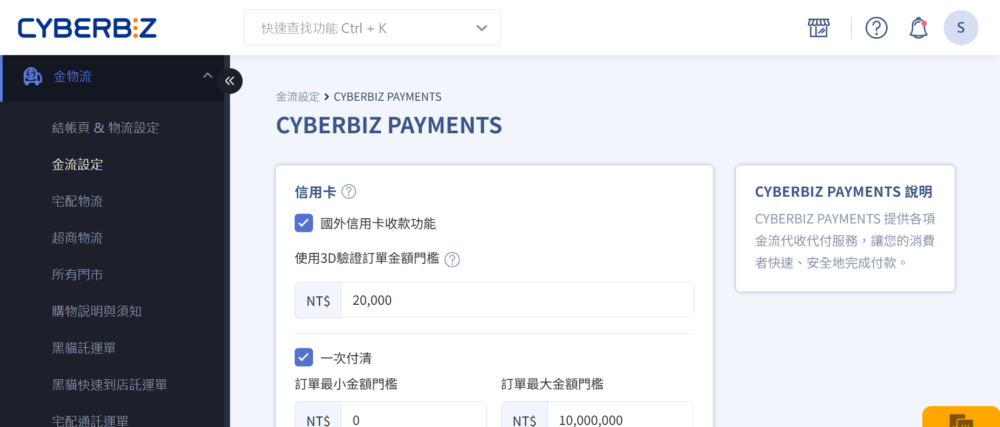
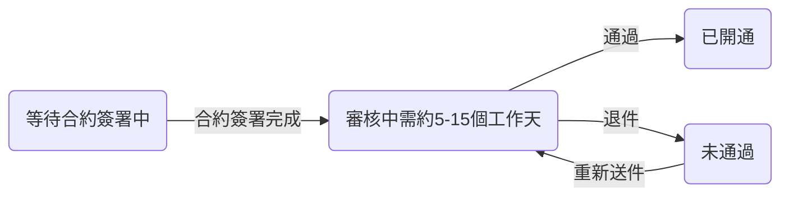
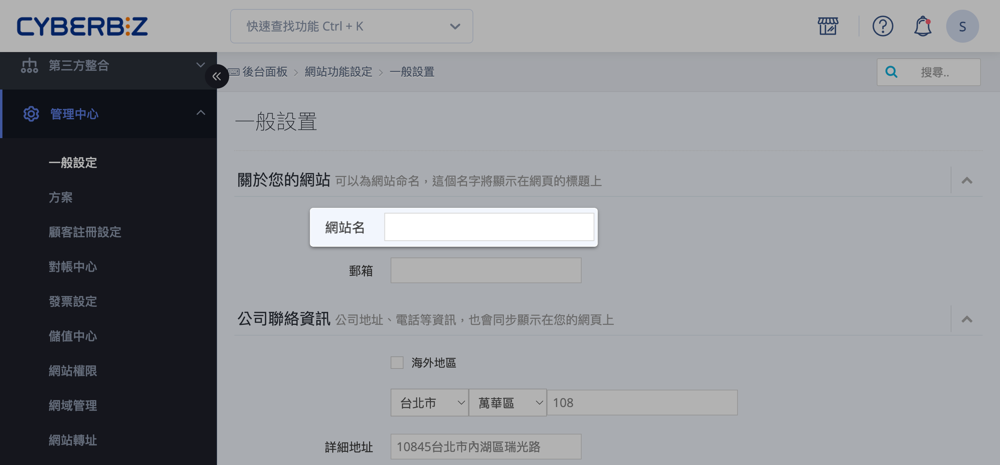

# 申請 CYBERBIZ PAYMENTS
開通 CYBERBIZ PAYMENTS 金流服務。
{ .subtitle }

{ .hero-page }

## 什麼是 CYBERBIZ PAYMENTS

**CYBERBIZ PAYMENTS** 是 CYBERBIZ 提供的 **金流代收代付服務**，支援信用卡及多種支付工具，為商家與顧客提供 **快速、安全、便利** 的交易環境。

### 核心優勢與資安保障

- **國際資安認證**：通過 **PCIDSS Level 1 認證**，確保每筆交易符合國際信用卡安全標準。
        
- **行動支付自動開通**：
    
    - 商家開通服務時，系統 **自動啟用 Google Pay 與 Apple Pay**。
    - 手續費通常與信用卡一次付清相同，無需額外申請。
        
- **降低盜刷風險**：可設定 [3D 驗證門檻](設定信用卡 3D 驗證門檻.md){ data-preview }。
    - 超過門檻的交易需手機簡訊驗證，低於門檻則採 幕後授權。
    - 若發生爭議，責任通常由持卡人承擔。

### 支援支付方式

開通後，商家可啟用以下多樣化收款工具：

| 類別 | 支付方式 | 說明 |
|---|---|---|
| 信用卡 | Visa / Mastercard / JCB | 支援一次付清 |
| 銀聯卡 | UnionPay |  |
| 行動支付 | Apple Pay / Google Pay | 與信用卡相同費率，免額外申請 |
| 先享後付 | AFTEE | 顧客僅需手機驗證即可結帳 |
| 超商支付 | 7-11 / 全家 | 下單後手機取得條碼，至門市掃碼付款 |
| ATM 轉帳 | 虛擬 ATM | 取得專屬虛擬帳號後，透過網銀或實體 ATM 轉帳付款 |

### 自動化管理功能

- **自動退款**：當訂單狀態改為「已退貨」時，系統自動觸發信用卡、行動支付、AFTEE 及街口支付的退款流程。
        
- **帳務自動確認**
    
    - **一般版 與 PLUS 版** 商家可設定金額門檻，由系統自動確認帳款，避免撥款延遲。
    - **企業版** 不支援此自動功能。
        
- **欠款自動扣繳**：若對帳單出現負值（退款金額大於撥款金額），商家可綁定信用卡，由系統自動扣繳欠款。

## 申請前準備事項

在提交金流申請前，請先完成以下事項：

- 可正常瀏覽的前台網站
- 可辨識的品牌或公司名稱
- 至少一項已上架的商品或服務

!!! info "風控單位將依據網站內容，判斷是否能清楚識別店家身份與販售項目。"

## 如何申請 CYBERBIZ PAYMENTS

商家符合申請資格後，系統將提供申請入口，通知方式：

- **後台彈窗公告**
- **電子郵件通知**

或透過後台操作路徑直接申請：

**金物流 > 金流設定 > CYBERBIZ PAYMENTS > 立即申請**

## 申請流程

以下為 **申請流程的共通架構**。實際需完成的步驟，依您使用的方案而有所不同。

### 步驟一：網站基本建置

完成網站基本資訊設定，供風控單位審核。

詳情請見 [完成網站建置](#完成網站建置)

### 步驟二：店家資料與合約處理

1. 登入 CYBERBIZ 管理後台，前往 **金物流 → 金流設定 > CYBERBIZ PAYMENTS > 立即申請**
2. 依照畫面提示，填寫商店資訊與相關資料。
3. 送出申請後，確認合約已簽署完成，方進入審核流程。

詳情請見 [審核流程說明](#審核流程)。

## 審核流程

申請送出並符合審核條件後，將進入以下流程。

### 審核狀態說明

- **等待簽約**：請完成合約簽署；未簽約前審核將不會進行。如有更新，請聯繫您的業務代表。
- **審核中**：風控部門審核網站與商店資料，預計審核時間約 **5–15 個工作天**。
- **未通過**：系統將透過後台公告及電子郵件通知您，請依指示修正資料後重新提交。
- **已開通**：審核通過後，系統將自動開通 **CYBERBIZ PAYMENTS** 服務，開通後會透過後台公告及電子郵件通知您。

## 完成網站建置

### 設定網站 Logo

1. 登入 CYBEBIZ 管理後台，前往  **網站外觀 > 套版主題管理 > 網站設定 > 導覽列**
2. 上傳並設定網站 Logo，建議使用品牌 Logo，保持辨識度。

### 設定網站名稱

1. 登入 CYBEBIZ 管理後台，前往 **管理中心 > 一般設定 > 網站名**
2. 輸入網站名稱，建議使用 **品牌名稱或公司名稱**，避免僅使用網址或英文，確保使用者易於辨識。
3. 點擊 **儲存** 以套用變更。

### 上架至少一個商品或服務

> 後台路徑：**商品 > 所有商品 > 新增商品**

上架商品或服務須包含：

- **商品圖片**：清楚呈現外觀或內容。
- **明確售價**：方便使用者了解價格。
- **商品介紹或服務說明**：提供詳細描述，展現特色與價值。

!!! note "詳細設定步驟，請參閱 [上架單一商品](新增與更新商品.md)"

### 設定「關於我們」頁面

1. 登入 CYBERBIZ 管理後台，前往 **網站外觀 > 自訂頁面管理**。
2. 點擊 **關於我們** 進入編輯頁面，或點擊 **新增頁面** 以新增頁面。
3. 點擊 **文字編輯** 可進行頁面文字編輯，或點擊 **新增區塊** 以新增不同區塊樣式。

### 設定聯絡資訊

1. 登入 CYBERBIZ 管理後台，前往 **網站外觀 > 套版主題管理 > 網站設定 > 頁腳**。
2. 點擊 **聯絡資訊** 進行編輯，或點擊 **新增區塊**，選擇 **聯絡資訊** 進行新增。

## 後續步驟

- :lucide-shield-check:{ .lg }   
  [__設定信用卡 3D 驗證__](設定信用卡 3D 驗證門檻.md)    
  匯入編輯過的商品 Excel 檔案，同步更新多筆商品的商品描述與配送相關設定。
- :simple-applepay:{ .lg }     
  [__設定 Apple Pay__](設定 Apple Pay)  
  啟用 Apple Pay 支付選項。
- :lucide-clock:{ .lg }     
  [__設定 AFTEE__](設定 AFTEE)  
  啟用 AFTEE 先享後付支付選項。

## 常見問題

??? quote "什麼條件才能申請 CYBERBIZ PAYMENTS？"
    - 網站需可正常瀏覽。
    - 品牌或公司名稱清楚可辨識。
    - 至少上架一個商品或服務。
    - 完成合約簽署。

??? quote "申請後多久可以完成審核？"
    - 審核流程約 **5–15 個工作天**，視商店資料完整性與風控審核而定。
    - 審核狀態會透過後台公告及電子郵件通知。

??? quote "審核未通過，如何重新申請？"
    1. 根據系統通知或後台公告，修正未通過的資料。
    2. 登入後台，重新送出申請。
    3. 重新進入審核流程，等待風控審核。

??? quote "已開通後，可立即收款嗎？"
    - 開通後即可使用支援的支付方式收款，包括信用卡、行動支付、超商支付、ATM 轉帳及先享後付。

??? quote "行動支付需要額外申請嗎？"
    不需要。系統開通 CYBERBIZ PAYMENTS 後，**自動啟用 Google Pay 與 Apple Pay**。手續費通常與信用卡一次付清相同。

??? quote "可以設定信用卡 3D 驗證嗎？"
    可以。請參考 [設定信用卡 3D 驗證門檻](設定信用卡 3D 驗證門檻.md){ data-preview }。超過門檻的交易需簡訊驗證，低於門檻則採幕後授權。

??? quote "如果商品資料不完整會影響審核嗎？"
    會。商品圖片、價格及商品介紹或服務說明需完整，否則風控可能要求補件，延長審核時間。

??? quote "合約簽署可以線上完成嗎？"
    是。系統提供線上簽署功能，簽署完成後才會進入審核流程。
