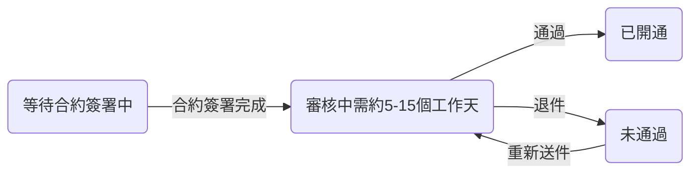

# 申請 CYBERBIZ PAYMENTS
開通 CYBERBIZ PAYMENTS 金流服務。
{ .subtitle }

{ .hero-page }

## 什麼是 CYBERBIZ PAYMENTS

**CYBERBIZ PAYMENTS** 是 CYBERBIZ 提供的 **金流代收代付服務**，支援信用卡及多種支付工具，為商家與顧客提供 **快速、安全、便利** 的交易環境。

### 核心優勢與資安保障

- **國際資安認證**：通過 **PCIDSS Level 1 認證**，確保每筆交易符合國際信用卡安全標準。
        
- **行動支付自動開通**：
    
    - 商家開通服務時，系統 **自動啟用 Google Pay 與 Apple Pay**。
    - 手續費通常與信用卡一次付清相同，無需額外申請。
        
- **降低盜刷風險**：可設定 [3D 驗證門檻](設定信用卡 3D 驗證門檻.md){ data-preview }。
    - 超過門檻的交易需手機簡訊驗證，低於門檻則採 幕後授權。
    - 若發生爭議，責任通常由持卡人承擔。

### 支援支付方式

開通後，商家可啟用以下多樣化收款工具：

| 類別 | 支付方式 | 說明 |
|---|---|---|
| 信用卡 | Visa / Mastercard / JCB | 支援一次付清 |
| 銀聯卡 | UnionPay |  |
| 行動支付 | Apple Pay / Google Pay | 與信用卡相同費率，免額外申請 |
| 先享後付 | AFTEE | 顧客僅需手機驗證即可結帳 |
| 超商支付 | 7-11 / 全家 | 下單後手機取得條碼，至門市掃碼付款 |
| ATM 轉帳 | 虛擬 ATM | 取得專屬虛擬帳號後，透過網銀或實體 ATM 轉帳付款 |

### 自動化管理功能

- **自動退款**：當訂單狀態改為「已退貨」時，系統自動觸發信用卡、行動支付、AFTEE 及街口支付的退款流程。
        
- **帳務自動確認**
    
    - **一般版 與 PLUS 版** 商家可設定金額門檻，由系統自動確認帳款，避免撥款延遲。
    - **企業版** 不支援此自動功能。
        
- **欠款自動扣繳**：若對帳單出現負值（退款金額大於撥款金額），商家可綁定信用卡，由系統自動扣繳欠款。

## 申請前準備事項

在提交金流申請前，請先完成以下事項：

- [ ] 可正常瀏覽的前台網站
- [ ] 可辨識的品牌或公司名稱
- [ ] 至少一項已上架的商品或服務

> 風控單位將依據網站內容，判斷是否能清楚識別店家身份與販售項目。

## 如何申請 CYBERBIZ PAYMENTS

請前往後台操作：  
> **金物流 > 金流設定 > CYBERBIZ PAYMENTS > 立即申請**

!!! info "PLUS / 企業版商家，符合申請資格時，會收到後台彈窗公告與 Email 通知，請依照指示前往申請入口。"

## 申請流程

以下為 **申請流程的共通架構**。實際需完成的步驟，依您使用的方案而有所不同。

### 步驟一：網站基本建置

完成網站基本資訊設定，供風控單位審核。

詳細請見 [完成網站建置](#完成網站建置)

### 步驟二：店家資料與合約處理（依方案）

=== "一般版"

	#### 填寫店家資料並完成申請
	
	請依序完成以下事項：
	
	1. 填寫公司或個人基本資料 
	
		- 公司戶：統一編號、公司地址  
		- 個人戶：身分證字號、出生年月日
	
	2. 上傳身份驗證文件  
	3. 填寫撥款銀行帳戶資料
	
	完成後即可送出申請，案件將進入審核流程。

	!!! warning "個人戶注意事項"

		1. 個人戶月收款額度為 20 萬元。若當月收款超過額度，將無法繼續使用 CYBERBIZ PAYMENTS 金流。
		2. 未成年人無法申請。
		3. 外籍人士無法申請。

=== "PLUS 版"

	#### 填寫店家資料並完成合約簽署
	
	請依序完成以下事項：
	
	1. 填寫公司登記相關資料
	2. 依指示完成合約簽署
	
	合約簽署完成後，申請案件才會進入審核流程。

=== "企業版"

	#### 由專屬業務協助完成申請與合約
	
	企業版申請流程包含：
	
	- 由專屬業務提供合約與申請指引
	- 依業務指示提交公司資料與驗證文件
	
	所有必要資料完成後，案件將進入審核流程。

## 審核流程

申請送出並符合審核條件後，將進入以下流程。

### 審核狀態說明

- **等待簽約**：請完成合約簽署；未簽約前審核將不會進行。如有更新，請聯繫您的業務代表。
- **審核中**：風控部門審核網站與商店資料，預計審核時間約 **5–15 個工作天**。
- **未通過**：系統將透過後台公告及電子郵件通知您，請依指示修正資料後重新提交。
- **已開通**：審核通過後，系統將自動開通 **CYBERBIZ PAYMENTS** 服務，開通後會透過後台公告及電子郵件通知您。

## 完成網站建置

以下設定為所有方案的必要條件。

### 設定網站 Logo 與網站名稱

- Logo：  
    `網站外觀 → 套版主題管理 → 網站設定 → 導覽列`
    
- 網站名稱：  
    `管理中心 → 一般設定 → 網站名`
    

請使用品牌名稱或公司名稱，避免僅顯示網址英文。

### 上架至少一個商品或服務

商品需包含：

- 商品圖片
- 明確售價
- 商品介紹或服務說明
    

### 設定關於我們與聯絡資訊

- 關於我們：`網站外觀 → 自訂頁面管理`
- 聯絡資訊：`網站外觀 → 套版主題管理 → 網站設定 → 頁腳`

## CYBERBIZ PAYMENTS 申請流程

CYBERBIZ PAYMENTS 的申請流程分為 **申請** 與 **審核** 兩個階段。  
商家需先完成網站與商店資訊設定，並提交申請資料，通過風控審核後，系統將自動啟用金流服務。

## 申請流程總覽

### 從哪裡開始申請？

請前往後台操作路徑：

> **金物流 → 金流設定 → CYBERBIZ PAYMENTS → 立即申請**

---

### 申請流程有哪些步驟？

=== "一般版"
	申請流程共 **四個步驟**：
	
	1. **閱讀並同意平台合約**  
	   確認並同意 CYBERBIZ PAYMENTS 平台合約內容。
	
	2. **完成網站基本建置**  
	   供風控單位審核店家身份與販售商品類型。
	
	3. **填寫店家基本資料**  
	   - 公司戶：統一編號、公司登記地址等  
	   - 個人戶：身分證字號、出生年月日等
	
	4. **身份驗證與銀行帳戶設定**  
	   上傳驗證文件並填寫撥款銀行帳戶資料。

=== "PLUS 版"
	申請流程共 **兩個步驟**：
	
	1. **完成網站基本建置**
	2. **填寫店家基本資料**
	
	> 送出申請後，需完成合約簽署，才會進入審核流程。

=== "企業版"
	申請流程與 PLUS 版相同，但：
	
	- 合約簽署與申請流程將由 **專屬業務協助**
	- 申請進度請直接洽詢您的業務窗口

---

### 需要多久會收到審核結果？

送出申請並完成必要資料後，審核時間約為 **5～15 個工作天**。

---

## 審核流程說明

=== "一般版"
	- **審核中**：風控單位審核網站內容與申請資料  
	- **未通過**：請依通知內容修正後重新送出  
	- **已開通**：系統自動啟用金流服務

=== "PLUS 版"
	1. **等待合約簽署中**：完成合約後才會開始審核  
	2. **審核中**  
	3. **未通過**  
	4. **已開通**

=== "企業版"
	審核流程與 PLUS 版相同，實際進度請洽詢專屬業務。

---

## 完成網站建置（審核必要條件）

### 為什麼需要完成網站建置？

風控單位將依據網站頁面資訊，判斷：

- 店家是否可被清楚識別
- 商品或服務類型是否明確

若資訊不足，可能導致審核未通過。

---

### 1️⃣ 上傳網站 Logo 並設定網站名稱

- **上傳 Logo 路徑**  
  `網站外觀 → 套版主題管理 → 網站設定 → 導覽列 → 網站 Logo`

- **設定網站名稱路徑**  
  `管理中心 → 一般設定 → 網站名`

> ⚠️ 請將網站名稱設定為「品牌名稱或公司名稱」，避免僅使用網址英文。

---

### 2️⃣ 至少上架一個商品

後台路徑：`商品 → 所有商品 → 新增商品`

商品需包含以下資訊：

- 至少一張商品圖片  
- 明確的商品售價  
- 商品介紹與規格說明  

---

### 3️⃣ 設定「關於我們」與聯絡資訊

- **關於我們頁面**  
  `網站外觀 → 自訂頁面管理`

- **聯絡資訊**  
  `網站外觀 → 套版主題管理 → 網站設定 → 頁腳`

---

## 注意事項

=== "一般版"
	- 切換金流前成立的訂單，若後續需退款，請商家自行進行人工退款。
	- **個人戶限制**：
		- 每月收款上限為 **新台幣 20 萬元**
		- 未成年人與外籍人士無法申請

=== "PLUS 版"
	- 必須完成合約簽署後，才會進入審核流程
	- 退款規則與一般版相同

=== "企業版"
	- 金流與退款相關規範請依企業合約內容為準

## 後續步驟

- :lucide-shield-check:{ .lg }   
  [__設定信用卡 3D 驗證__](設定信用卡 3D 驗證門檻.md)    
  匯入編輯過的商品 Excel 檔案，同步更新多筆商品的商品描述與配送相關設定。

- :lucide-ban:{ .lg }     
  [__物流限制與排除選項__](設定超商配送限制與物流排除.md)  
  設定商品的配送物流條件，限制特定物流方式於結帳流程中的顯示與使用。

## 常見問題

