# 申請綠界金流與超商取貨付款

綠界科技（ECPay）是台灣普及度極高的第三方支付服務商，提供包含信用卡、ATM、超商代碼等多元金流，以及便利的超商取貨付款（物流）服務。本指南將引導您完成帳號註冊、服務申請與後台介接。
{ .subtitle }

[:lucide-lock:{ title="適用方案" }](../../resources/conventions#適用方案) | 專業 / 進階 / 高手
{ .doc-badge }

{ .hero-page }

!!! info "適用版本說明"
    綠界金流與超商物流串接僅支援 **專業、進階、高手版** 商家，且限 **未啟用 CYBERBIZ PAYMENTS** 之用戶使用；若您已使用 CYBERBIZ PAYMENTS，其系統已內建完整的金流與超商物流功能，無需另行串接綠界服務。
    

## 使用須知

在開始設定前，請依您的服務需求選擇對應的操作路徑：

- **僅需線上金流（不含超商取貨）**：請跳過步驟 2，僅需完成步驟 1 與步驟 3-1 即可。
- **需完整金、物流（含超商取貨）**：請依序完成步驟 1 至 步驟 3 的所有設定。
  > 若您的商店同時需要金流與超商取貨服務，建議在註冊帳號時 **一併申請**，可避免日後需重複補件或紙本作業，縮短開通時程。
- **既有綠界會員（欲升級特約）**：請參考步驟 2-2 完成合約商議流程。

## 步驟 1：註冊綠界帳號與基本資料

無論您是僅需金流或是同時需要物流服務，第一步皆需在綠界官網建立帳號。

### 1. 帳號註冊與會員類別

1. 前往 [綠界官網](https://www.ecpay.com.tw/)，點擊右上角 **註冊**。
2. 設定登入帳號及密碼。
3. **選擇會員類別**：公司行號請選擇 **商務會員**。
4. **勾選申請服務**：勾選 **金流** 與 **物流** 服務。
    
    > 電子發票服務將另行收費，若暫無需求可先不勾選。

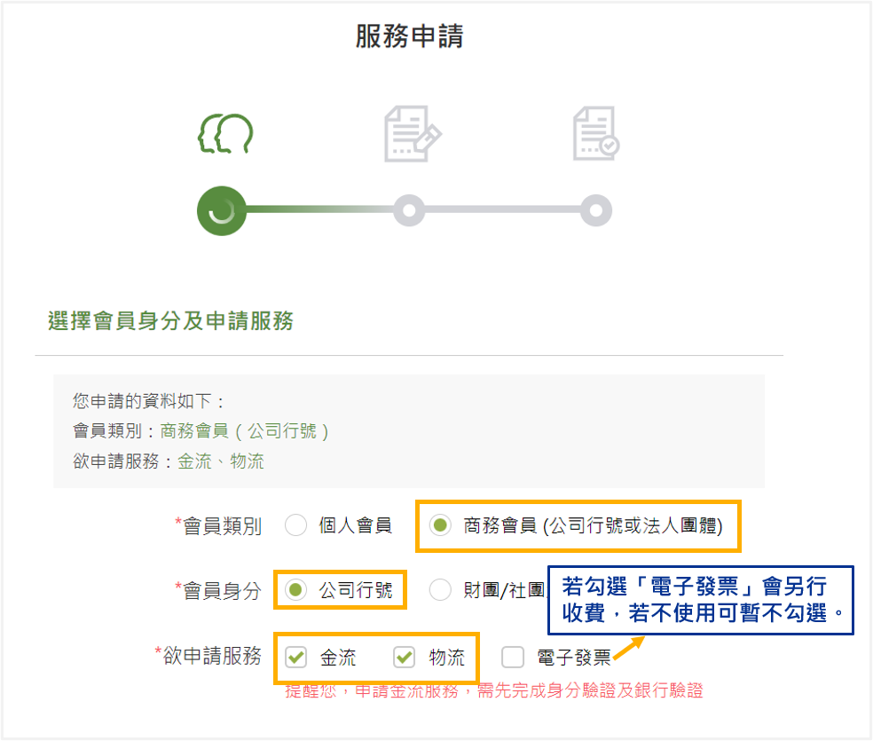

### 2. 填寫公司資訊

填寫時請確保與您在 CYBERBIZ 一般設定中的資訊一致，以利審核：

- **準備文件**：
    1. 負責人證件影本。
    2. 登記證照或公司變更事項登記表。

    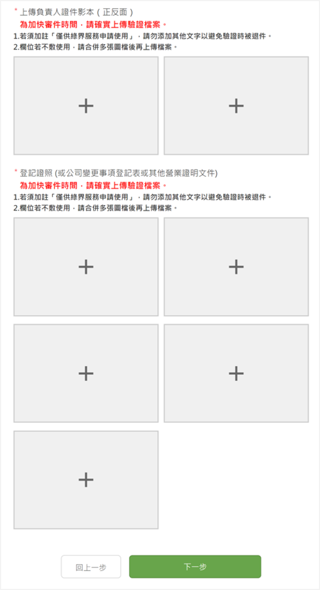

- **商店名稱**：此名稱會顯示於付款頁面與買家信用卡帳單。請與 **管理中心 > 一般設定** 中的 **網站名** 相同。

    > 如需變更商店名稱，每個站台可享 2 次免手續費(100元)優惠，變更流程約需 5-7 個工作天。

    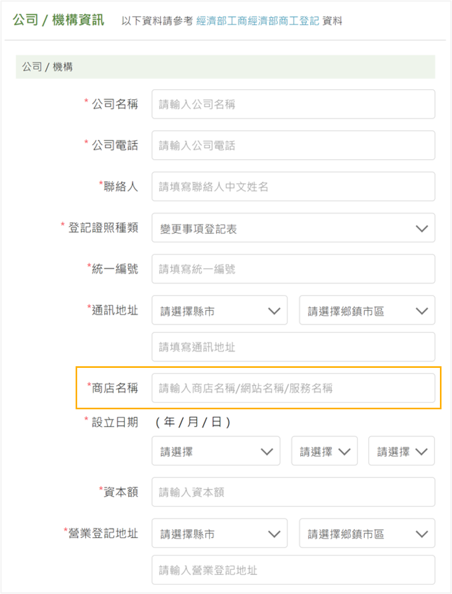

### 3. 填寫官網資訊

- **聯絡資訊**：**Email、電話與地址** 等聯繫資訊，須與官網前台顯示之 **聯絡資訊** 保持一致。
- **官網網址**：填寫您在 CYBERBIZ 的正式網域，請與 **管理中心 > 網域管理** 中的 **網域名** 相同，且網站中需至少上架一個商品。

    > 請勿設定網路禁止販售之商品相關文字，如：放大片、瞳、EYES等。

    

- **開通服務**：建議一併勾選 **信用卡** 及 **海外信用卡**。
    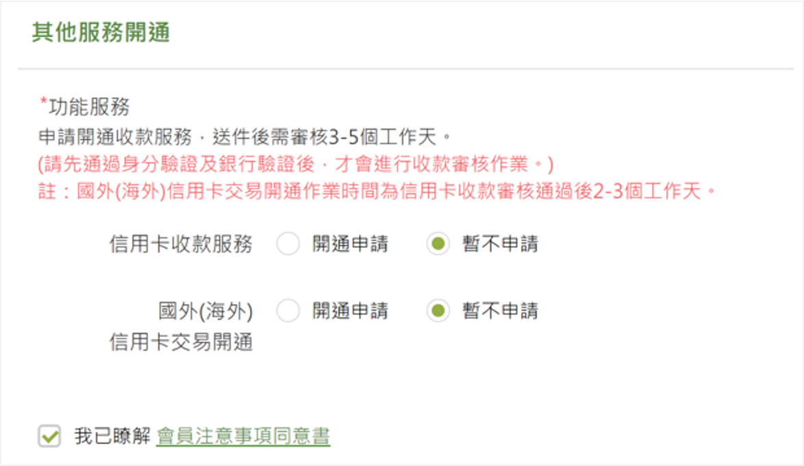

!!! warning "審核時程"
    送出申請後，綠界約需 **3-5 個工作天** 進行審核，結果將透過 Email 通知。

## 步驟 2：申請超商物流服務（選用）

若您需要提供「超商取貨付款」功能，需在帳號審核通過或議約前完成物流開通。

### 1. 申請物流服務

1. 前往綠界後台，前往 [申請物流寄送服務](https://www.ecpay.com.tw/IntroTransport)。
2. **選擇物流模式**：
    - **C2C (門市寄取)**：適用於專業版、進階版、高手版。
    - **B2C (大宗寄倉)**：僅限高手版方案申請。

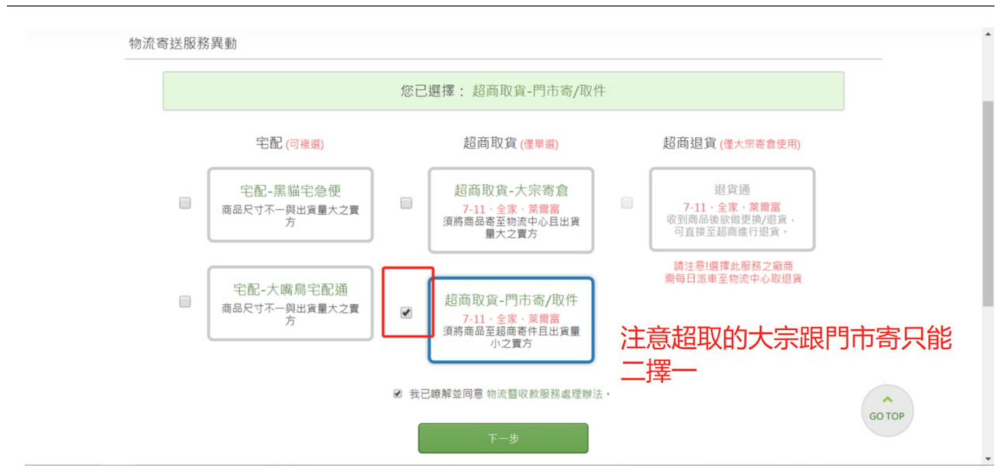

### 2. 合約商議

1. 前往[綠界後台](https://vendor.ecpay.com.tw/User/LogOn_Step1)，點擊右上角的 **合約商議**。
    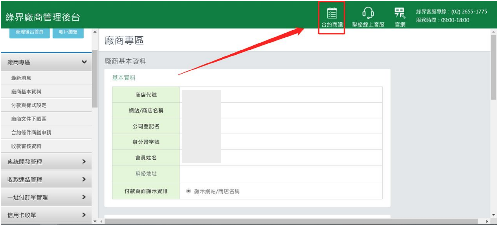
2. 填寫聯絡資訊。
  -  **業務聯絡人資訊** 勾選 **同帳務聯絡人**。
      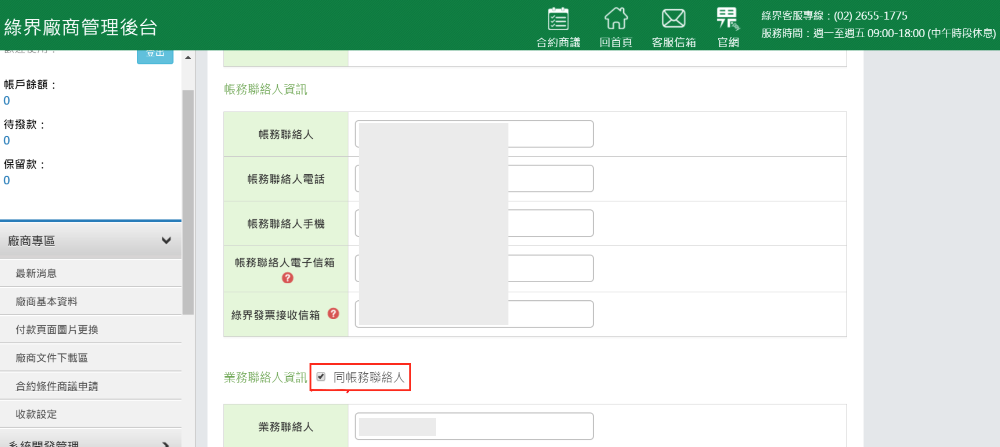
  -  **業務代號** 填寫 `5468`，或在 **推廣商** 填寫 `順立智慧`。
      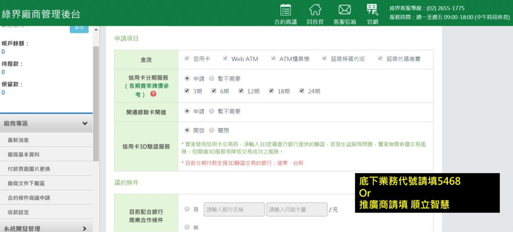
3. 上傳至少 3 張營運場所相關圖片。
    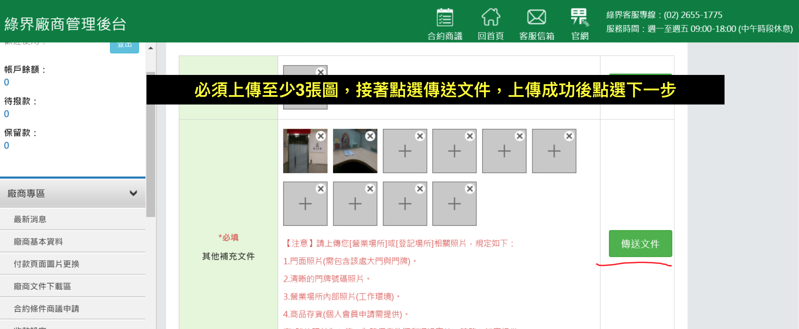

### 3. 檢查已完成審核

1. 前往[綠界後台](https://vendor.ecpay.com.tw/User/LogOn_Step1)，前往 **廠商專區 > 收款審核資料**。
2. 請檢查一下欄位，確保審核已通過。

    - **信用卡審核狀態** 欄位應顯示為 **已申請通過**。

        > 若審核未通過，請優先確認申請流程中是否遺漏應繳交之證明文件或相關資料。

        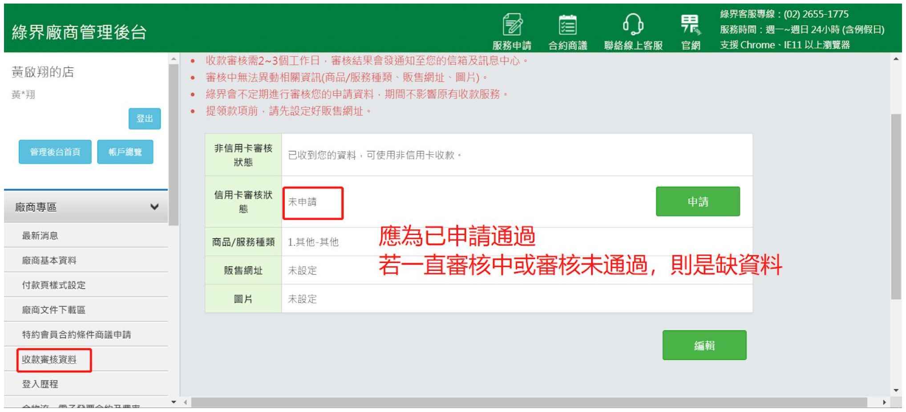

    - **服務費率**：應顯示配合方案之實際費率。
        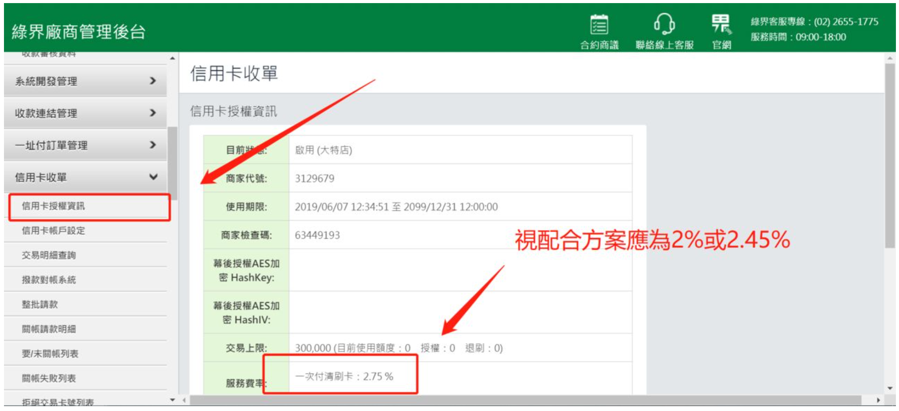
    - **超商取貨服務**：應為 **已開通**。

        > 請於議約前完成物流申請。若於議約後方才申請，則需依循紙本申請流程。

        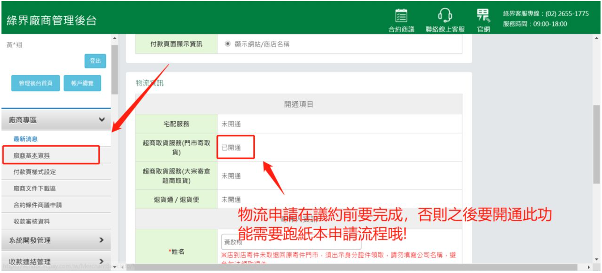

## 步驟 3：CYBERBIZ 後台介接設定

取得綠界廠商編號後，即可在 CYBERBIZ 後台完成綁定。

### 1. 啟用金流服務
1. 前往 **金物流 > 金流設定 > 綠界金流**。
2. 在 **廠商編號** 欄位貼上從綠界後台取得的商店代號。
  > 查詢路徑：廠商專區 > 廠商基本資料。
  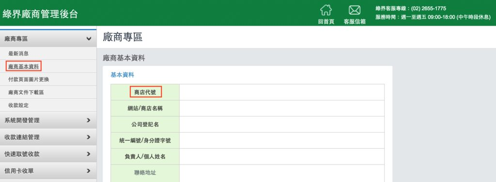
3. 開啟您欲提供給消費者的支付方式（如：信用卡、ATM、超商代碼）。
4. **關鍵步驟**：前往 **金物流 > 宅配物流**，選擇對應的物流選項，將新增的綠界支付方式勾選起來，前台才會顯示該付款選項。

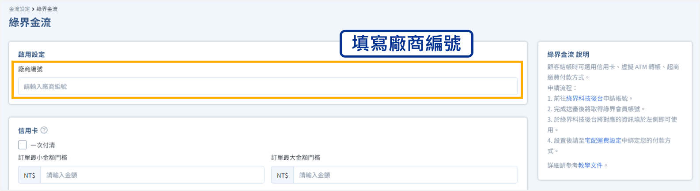

!!! info "信用卡分期功能說明"
    信用卡分期功能通常僅限於 **綠界特約商店**。請確認您已完成 **合約商議** 且綠界端已核准開通分期功能。

### 2. 啟用超商物流服務(選用)

依據您申請的物流模式進入對應路徑：

- **C2C 模式**：前往 **金物流 > 超商物流 > 綠界超商取貨**。
- **B2C 模式**：前往 **金物流 > 結帳頁＆物流設定 > 綠界B2C**。

填寫基本資訊後，開啟 **7-11/全家** 的 **貨到付款/取貨不付款** 開關，並設定金額門檻。

## 常見問題

??? quote "綠界金流與超商取貨的審核是分開的嗎？"
    是的。基本帳號審核過後，金流服務通常會先開通；物流服務與特約商店議約則需額外的審核時間。建議一次性提交資料以加快進度。

??? quote "申請過程中遇到問題該聯繫誰？"
    若涉及綠界帳號審核、費率、合約問題，請直接聯繫綠界客服：

    - **客服專線**：(02) 2655-1775（24 小時服務）。
    - **線上諮詢**：綠界官網右下角客服插件。

## 後續步驟

- :lucide-credit-card:{ .lg }   
  [__於綠界後台查詢訂單__](../../test-guide/金流測試教學)       
  了解如何於綠界後台即時查詢訂單狀態，並確認款項入帳情形。

