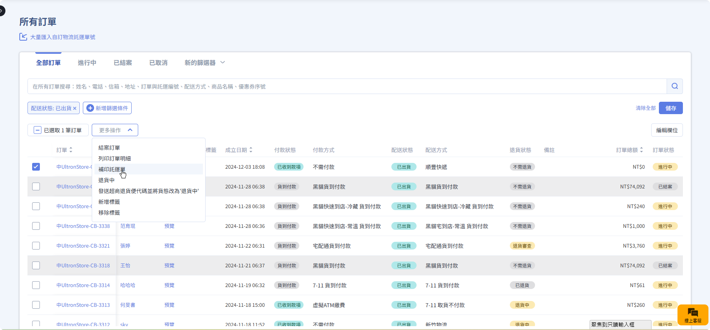
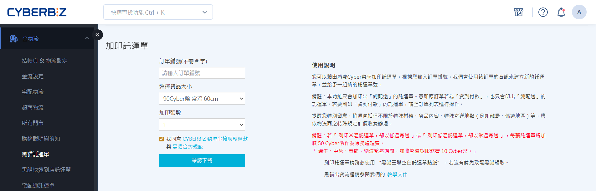

# 補印與加印託運單

出貨時若發生託運單損毀遺失，或因商品材積過大需拆箱配送，商家可透過 **補印** 或 **加印** 功能解決。
{ .subtitle }

## 功能對照表

| 項目 | 補印 | 加印 |
| :--- | :--- | :--- |
| **用途** | 恢復原始文件 | 新增配送包裹 | 
| **使用情境** | 託運單檔案損毀、遺失或運送異常 | 商品過多需拆箱、**宅配貨到付款需部分出貨** |
| **託運單號** | **沿用** 原有的託運單號 | **產生** 一組全新的託運單號 |
| **運費扣取** | 不會重複扣取運費 | **額外計算** 並扣取新單號的運費 |
| **操作路徑** | 訂單列表 > 更多操作 > 補印 | 金物流 > 各物流託運單頁面 |

!!! info "系統物流部分出貨：操作指引"
    - **宅配貨到付款**：因無法使用系統內建的 **部分出貨** 功能，若需拆箱，可選擇使用 **加印託運單** 處理。
    - **其他訂單**：**超商** 與 **宅配貨到不付款** 訂單，請使用 [宅配部分出貨]() 或 [超商部分出貨]()。

## 補印託運單

補印功能僅用於重新下載已產生的文件，不會變更訂單資訊或單號。

### 操作條件

| 情境 | 訂單配送狀態要求 | 時效限制 |
| --- | ----------- | -------- |
| 託運單檔案損毀遺失 | 需為 **已出貨** | 第一次印出託運單後的 **5 天內** |
| 物流端發生運送異常 | 需為 **運送異常** | 貨態轉為 **運送異常** 後的 **5 天內** |

### 操作步驟

1. 前往 **訂單 > 所有訂單**。
2. 勾選欲補印的訂單。
3. 點選右上方 **更多操作**。
4. 選擇 **補印託運單**，系統將自動下載檔案。
    - **補印文件**：**託運單、出貨明細、揀貨單** 之壓縮檔。

!!! info "系統自動重取機制：針對異常單號之補印"
    若黑貓或宅配通訂單因系統異常未成功產出單號，執行補印時，系統會自動嘗試重新取號。

{ .screenshot }

## 加印託運單

當同一張訂單需拆成多個包裹運送時，應使用加印功能。

### 核心規則

- **收費機制**：加印視同新出一筆包裹，會依照選擇的尺寸與溫層扣取 Cyber 幣。
- **支付限制**：僅支援 **純配送**。若原訂單為 **貨到付款** ，加印單亦不會向顧客收款。
- **對帳判定**：需待訂單所有託運單皆變更為 **已收貨** 後，方可認列於對帳單。

### 操作步驟

1. 前往 **金物流 > [物流商名稱] 託運單**（如：黑貓、宅配通、順豐、新竹物流）。
2. 在頁面中輸入要加印的 **訂單編號**。
3. 選擇配送條件：
    - **尺寸**（如：60cm、90cm 等）。
    - **溫層**（常溫、低溫）。
4. 點選 **確認下載** 。
    - **加印文件**：僅含 **託運單** 之壓縮檔。

{ .screenshot }

### 託運單貨態追蹤

加印單的狀態會顯示在 **訂單明細頁**，但不影響訂單列表頁的原始配送狀態。訂單 **配送狀態** 僅依原始託運單的狀態進行更新。

| 狀態欄位 | 說明 |
| ------- | -----| 
| 已出貨 | 已下載加印託運單 系統會根據物流狀態提供補充資訊，可參考[已出貨狀態新增物流提示文字]() |
| 配送中 | 物流商已收到貨品，並開始進行配送 |
| 已收貨 | 貨品已送達 | 

### 注意事項

- **繁盛期費用**：在三大節慶（端午、中秋、春節）期間，每筆加印單將加收繁盛期服務費（約 10-60 Cyber 幣，依各物流商公告為準）。
- **物流商特殊費用/限制**：
    - **宅配通**：週六、日取件每筆加收 20 Cyber 幣。
    - **順豐**：
        - **材積限制**：包裹材積若超過 170cm，建議拆成兩個包裹並使用加印功能。
        - **溫層錯誤費**：若列印常溫單卻寄送低溫貨件（或反之），物流商將加收帳務處理費。

## 常見問題 

??? quote "加印的託運單如果沒用到會退費嗎？"
    視物流商而定：

    1. **順豐**：下載後 21 天內未實際出貨，單號將自動失效並退回預扣的 Cyber 幣。
    2. **新竹物流**：不提供轉單，若未使用該單號，預扣金額會自動返還。
    3. 其他物流商請洽客服或參考後台公告。

??? quote "加印託運單可以改收件地址嗎？"
    不可以。加印功能會自動抓取原始訂單的收件資訊，無法修改。若地址有誤，請先取消訂單並請客戶重下。
