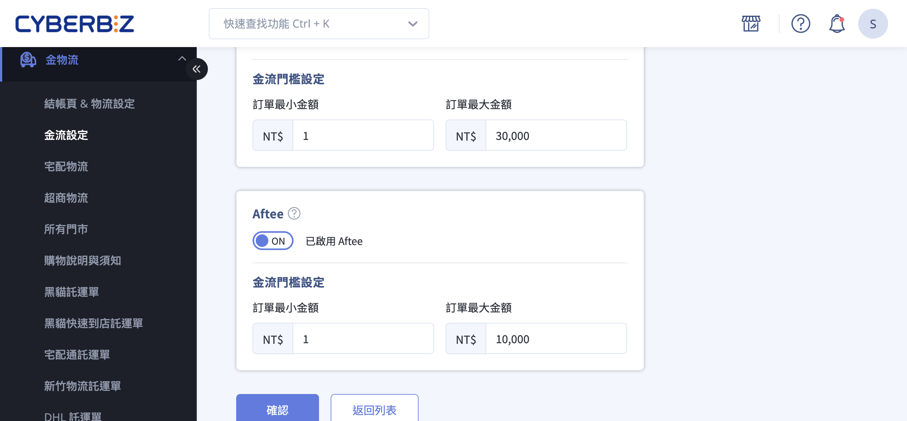
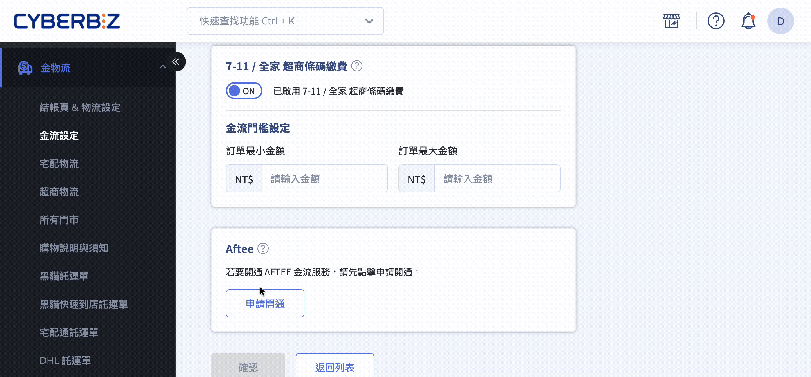
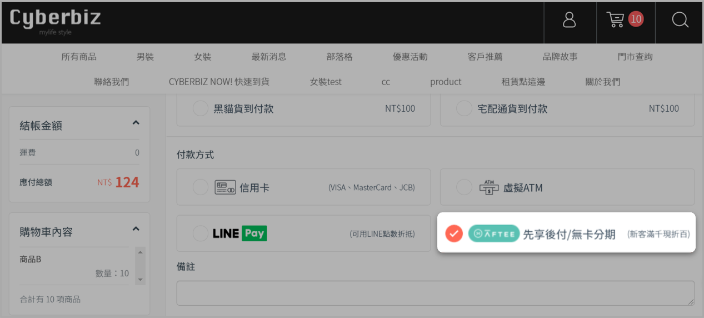
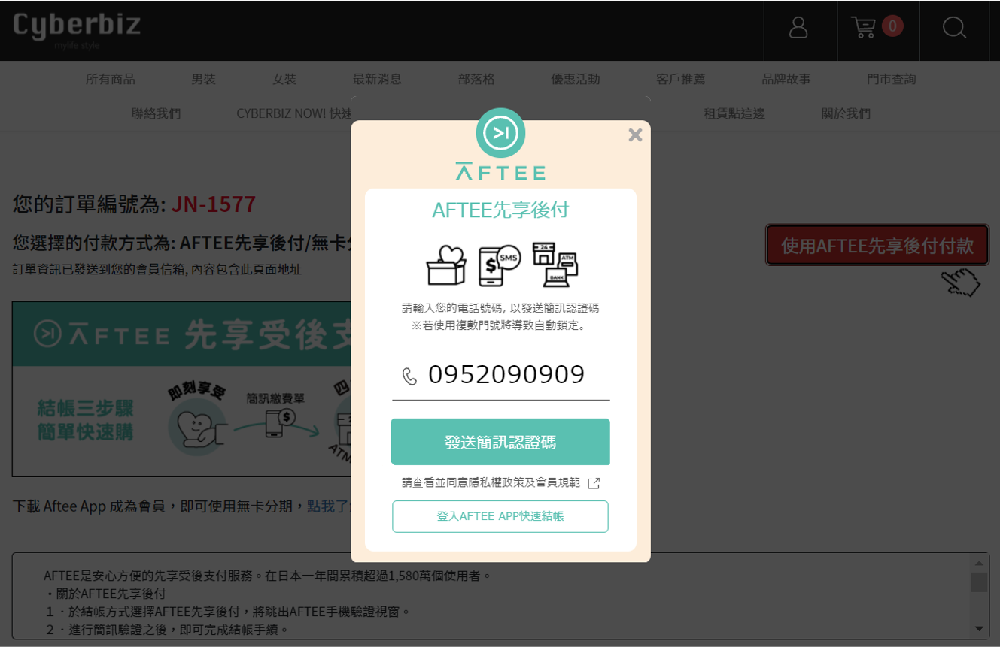

# 設定 AFTEE

透過 AFTEE 先享後付提供顧客快速、便利的付款方式，無需信用卡即可完成結帳。
{ .subtitle }

{ .hero-page }

## AFTEE 先享後付說明

AFTEE 先享後付提供顧客一種快速、便利且安全的付款方式，無需信用卡即可完成結帳。

- 顧客可透過手機號碼完成驗證後使用 AFTEE 先享後付付款。
- 提升結帳效率與付款便利性，增加訂單完成率。
- 顧客如遇付款或帳務問題，可直接聯繫 [AFTEE 官方網站](https://aftee.tw/) 支援。

### 交易與費用
  
- **手續費**：依後台設定之費率收取，費率未含 5% 營業稅；對帳單將另行加計 5% 營業稅。
- **優惠費率**：2.5%（未稅），費率認列以出貨時間為準。
- **退款**：流程與信用卡付款相同。

### 裝置與瀏覽器限制

- 顧客需可接收簡訊的手機完成驗證。
- 系統無額外瀏覽器限制，但建議使用主流手機瀏覽器以確保流程順暢。

### 自動取消規則

- 訂單使用 AFTEE 付款，超過 90 天未出貨將自動取消（預購商品除外）。
- 系統會在取消前 30、15、7、3、1 天發送提醒通知，確保商家掌握出貨進度。

### 支援分期付款

- 顧客下載 AFTEE App 後，可選擇分期付款方式。
- 無需額外開通，分期功能由 AFTEE App 控制。瞭解 [如何使用 AFTEE 分期付款 :lucide-external-link:](https://netprotections.freshdesk.com/support/solutions/articles/70000197869-%E5%8F%AA%E6%9C%89app%E6%9C%83%E5%93%A1%E8%83%BD%E5%88%86%E6%9C%9F%E5%97%8E-)

## 操作步驟

### 步驟一：申請開通 AFTEE

1. 登入 CYBERBIZ 後台，前往 **金物流 > 金流設定**。
2. 在 CYBERBIZ PAYMENTS 區塊，點擊  **編輯** 進入編輯頁面。
3. 在 AFTEE 設定區塊，點擊 **申請開通**，填寫『AFTEE 啟用申請』彈窗資料，點擊 **送出申請** 供 AFTEE 端審核。
4. AFTEE 審核通過後，系統會發送通知信件給網站管理員。 

### 步驟二：啟用後支付方式

1. 登入 CYBERBIZ 後台，前往 **金物流 > 金流設定**。
2. 在 CYBERBIZ PAYMENTS 區塊，點擊  **編輯** 進入編輯頁面。
3. 在 AFTEE 區塊，啟用 AFTEE。
4. 前台顯示 AFTEE 付款選項。

### 步驟三：顧客付款流程

1. 顧客在結帳頁選擇 AFTEE 後支付。
2. 點擊 **使用 AFTEE 後支付付款**。  
3. 輸入已註冊 AFTEE 手機號碼，收到驗證碼後完成付款。
4. 系統顯示訂單「已收到款項」即可進行出貨。  
5. 若付款未通過，顧客可依指示重試或直接聯繫 AFTEE。

<!--

## 後續步驟

- :lucide-shield-check:{ .lg }  
  [__設定訂單自動取消規則__](設定訂單自動取消規則)  
  控制 AFTEE 訂單超過 90 天未出貨自動取消，並發送提醒信件。

- :lucide-bar-chart-2:{ .lg }  
  [__查看 AFTEE 手續費與對帳__](查看 AFTEE 手續費與對帳)  
  確認每筆訂單手續費及稅額，維護金流準確性。

-->

## 常見問題

??? quote "AFTEE 先享後付有金額限制嗎？"
	可以，在後台設定金流門檻，限制最小/最大訂單金額。

??? quote "顧客未收到驗證碼怎麼辦？"
	請確認手機號碼正確並可接收簡訊，如仍未收到請顧客聯繫 AFTEE。

??? quote "訂單超過 90 天未出貨會怎樣？"
	系統會自動取消該筆訂單，預購商品除外，並在取消前 30、15、7、3、1 天發送提醒信。

??? quote "AFTEE 支援分期付款嗎？"
	支援，需顧客下載 AFTEE App 並在 App 中選擇分期付款。

??? quote "如何確認顧客已付款？"
	後台訂單狀態顯示「已收到款項」，即可進行後續出貨。