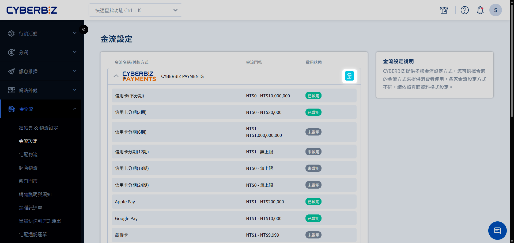
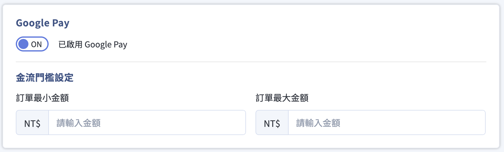
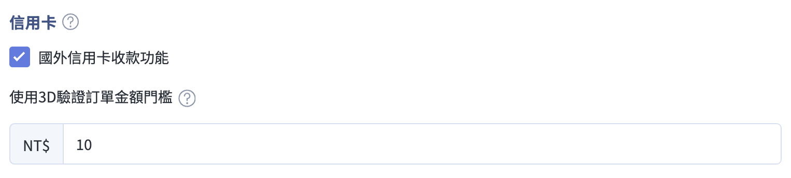

# 設定 Google Pay™
指引商家在官網啟用並管理 Google Pay™ 支付選項，包含費率說明、後台配置流程以及金流門檻設定限制。
{ .subtitle }

[:lucide-toggle-right:{ title="適用功能" }](../../resources/conventions#適用功能) | CYBERBIZ PAYMENTS
{ .doc-badge }

## Google Pay™ 核心優勢

- **免申請、免等待**：當 CYBERBIZ PAYMENTS 開通時，系統將自動同步開啟 Google Pay 選項，不需向 Google 額外申請。
- **極速結帳**：消費者直接調用 Google 錢包內的卡片資訊，幾秒內即可完成支付。
- **安全保障**：支援 Google 的虛擬帳號技術，交易時不傳輸真實卡號，降低盜刷風險。

### 費率與規範說明

- **手續費**：比照商家與 CYBERBIZ 合約中的 **信用卡一次付清** 費率。
- **額外費用**：**免收** 年費、免開發者帳號申請費、免額外系統維護費。
- **支付限制**：僅支援一次付清，**不提供信用卡分期** 功能。
- **退款流程**：退貨與退款的操作流程與一般信用卡一致。

## 啟用設定

1. 前往 **金物流 > 金流設定**。
2. 找到 **CYBERBIZ PAYMENTS** 欄位，點擊右側的 :lucide-square-pen: **編輯**。
    { .screenshot }
3. 下滑至 **Google Pay** 區域。
    { .screenshot }
4. **功能開關**：切換為 **ON** 或 **OFF**。
5. **金流門檻設定** (選填)：輸入 **訂單最小金額** 或 **訂單最大金額**，限制消費者僅能在特定金額區間使用 Google Pay。

    > :lucide-lock: **金流門檻設定** 功能僅支援 **高手版、PLUS版 與企業版**。若為一般專業版或進階版，後台將不顯示此門檻配置欄位。

## 支付安全性與 3D 驗證

### 支付安全邏輯設定

Google Pay 的交易安全邏輯將繼承商家在後台的信用卡設定：

- **3D 驗證觸發機制**：若消費者選用 Google 錢包中的 **真實信用卡** 付款，系統將依據您在 **信用卡設定** 中配置的 [使用 3D 驗證訂單金額的門檻]() 來決定是否要求驗證。
- **國外卡交易限制**：若商家未勾選 **國外信用卡收款功能**，則消費者無法使用綁定 Google Pay 的國外信用卡進行支付。
    { .screenshot }
- **虛擬卡優先原則**：當消費者錢包中同時存有 **真實卡片** 與 **虛擬卡片** 時，Google 系統會優先選用安全性較高的虛擬卡片（由 Google 生成的代碼化卡號）。

    >  **虛擬信用卡** 是 Google提供的資安服務，在 Google錢包綁定 **真實信用卡** 後，Google會生成 **虛擬信用卡** 供刷卡，防止 **真實信用卡** 資訊遭外洩盜刷。詳情請看 [Google Pay 幫助](https://support.google.com/googlepay/answer/7644068)。

### 交易驗證與合規聲明

請確保與您的金流服務商合作，為 Google Pay 保存的實體卡交易觸發基於風險的 3D-S 驗證。

- [Google Pay APIs Acceptable Use Policy](https://payments.developers.google.com/terms/aup)
- [Google Pay API Terms of Service defines](https://payments.developers.google.com/terms/sellertos)
- Google Pay and Google Wallet are trademarks of Google LLC

## 後續步驟

- :lucide-badge-dollar-sign:{ .lg }   
  [__北美站金流設定__](北美站金流服務.md)     
  若您經營的是 **Global 北美站**，其 Google Pay 設定與費率邏輯不同，請參閱相關專屬指南。

