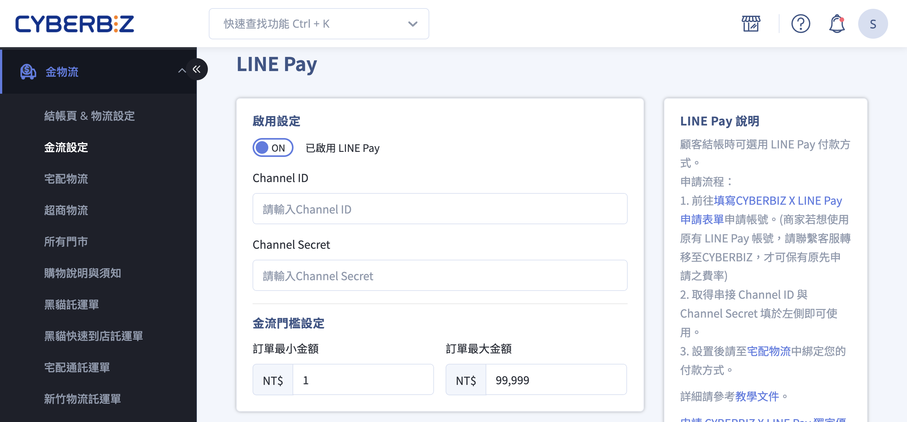
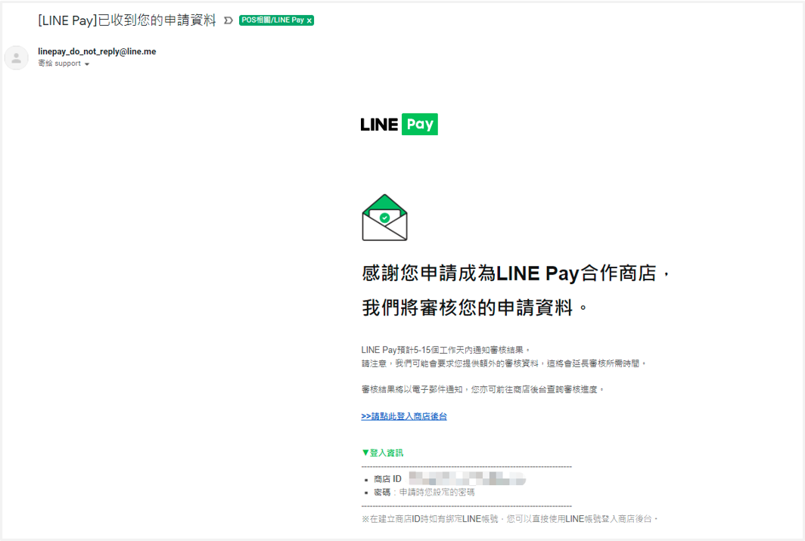
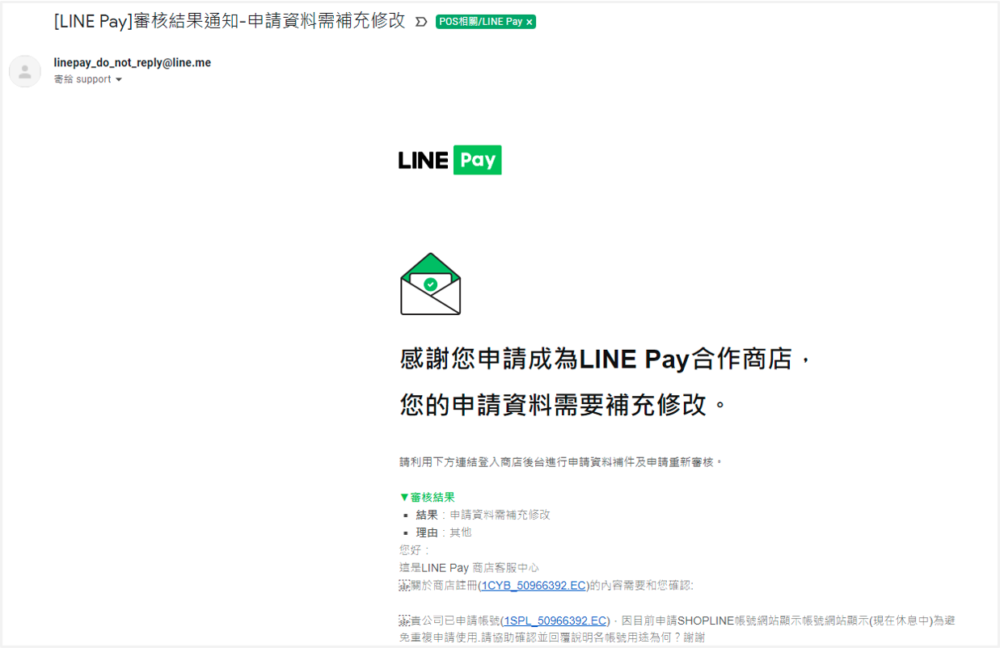
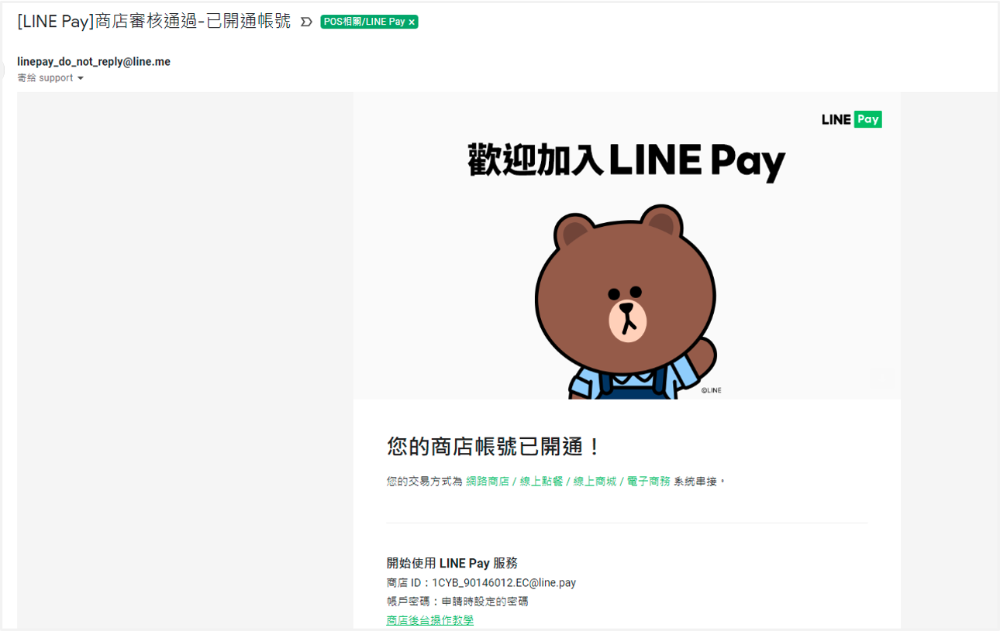
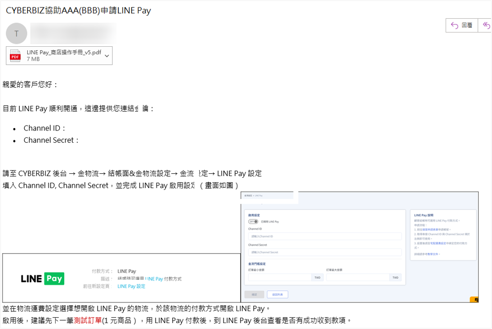
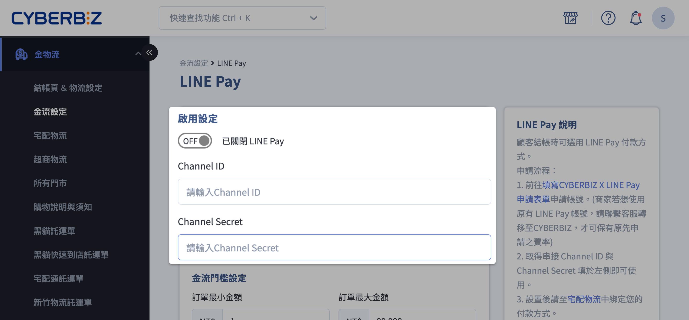
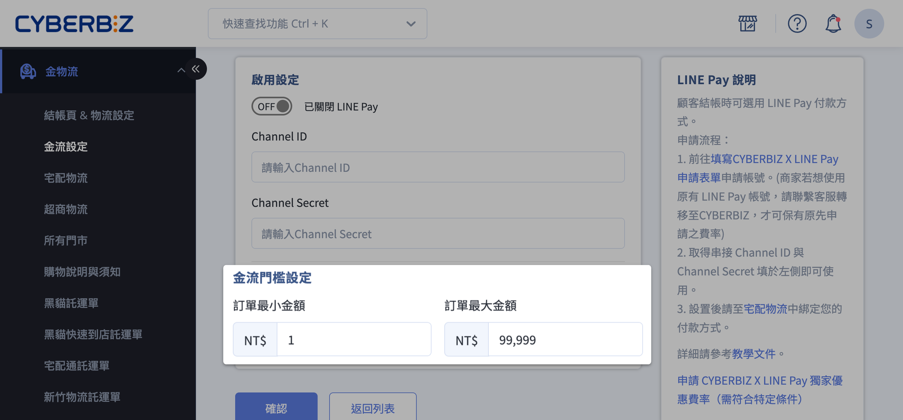
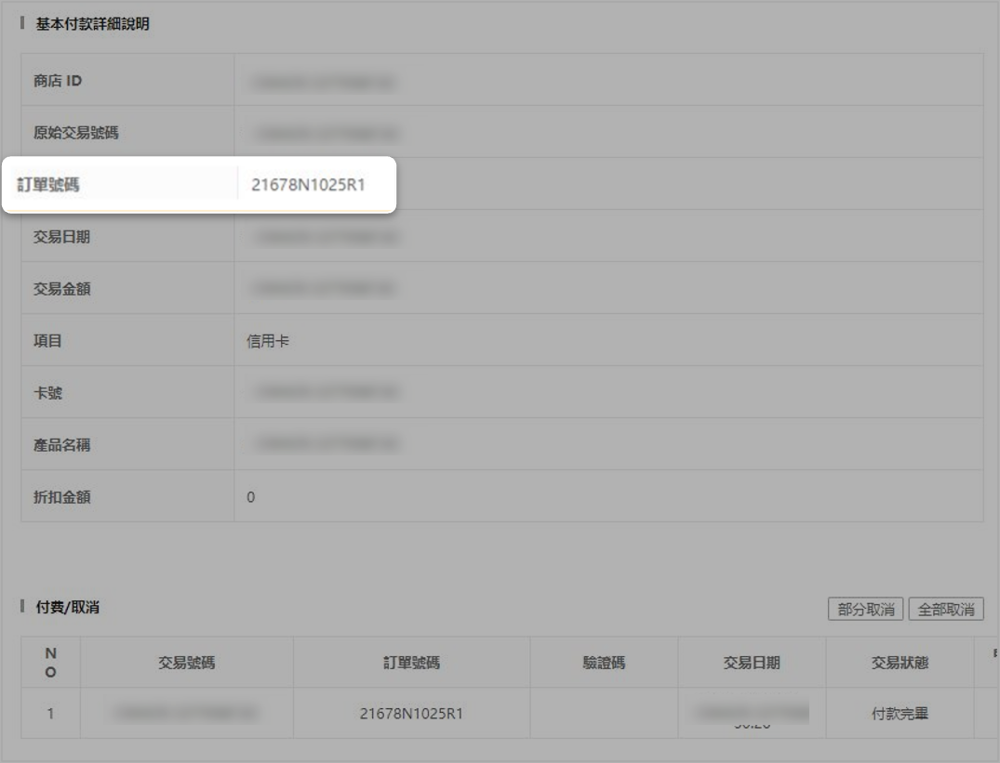

# 設定 LINE Pay

串接 LINE Pay 付款，消費者於結帳時可選用 LINE Pay 進行支付。
{ .subtitle }

[:lucide-lock:{ title="適用方案" }](../../resources/conventions#適用方案) | 進階 / 高手 / 專業PLUS / 進階PLUS / 高手PLUS / 企業
{ .doc-badge }

{ .hero-page }

## LINE Pay 說明

- 消費者可於結帳頁選擇 LINE Pay 付款。
- 提升結帳效率，增加訂單完成率。
- LINE Pay 退款與訂單查詢透過官方後台操作。

## 使用須知

- **申請資格**：必須以公司名義申請，個人戶不可申請。
- **既有帳號**：如已有 LINE Pay 收款帳號，仍需透過 CYBERBIZ 進行帳號轉移與串接。
- **手續費**：依申請表或後台設定收取，限期優惠請參考申請表。
- **申請流程**：資料齊全且正確無需補件，一般審核時間約 1 個月。
- **補件**：如 LINE Pay 要求補件，補件完成後需重新審核，審核時間約 6–8 週。

## 操作步驟

### 步驟一：填寫申請表單並上傳申請資料

請先準備並上傳以下 **4 項必要文件**，每項文件須為 **獨立的 PDF 或圖片檔**（掃描或清晰截圖皆可）。

!!! warning "注意事項"
	- 若文件缺漏、頁面不完整或資訊不符，將影響審核進度，並可能導致申請無法受理，請於送出前再次確認資料正確性。
	- 若文件需標註為申請用途，請以浮水印方式標示：`僅供申請 LINE Pay / 一卡通 Money 使用`

#### 必要申請文件

1. **公司證明文件**（以下擇一提供，須為完整版本，不可缺頁）

	- 最新版本之公司設立／變更登記表
	- 商業登記抄本（不接受舊式營業登記證明）
	- 國稅局核發之稅籍登記證明  

2. **公司負責人身分證正反兩面影本** 
3. **撥款帳戶銀行存摺封面影本**
	- 限使用銀行帳戶（**不支援農會／漁會／合作社帳戶**）
	- 帳戶戶名須與公司登記名稱完全一致

4. **網站首頁截圖** (需可清楚辨識品牌名稱與網站內容)

文件準備完成後，請填寫 [CYBERBIZ × LINE Pay 串接準備資料 :lucide-external-link:](https://docs.google.com/forms/d/e/1FAIpQLSeefpmgOBHtkYiwvaz11DuV99v8p2DtX0dwkipexVdFEOsPjA/viewform?usp=sharing) 申請表單。

<!--
（適用於 **2022/12/15 後開通之商家**）
-->

### 步驟二：等待審核及補件

#### 資料審核流程
    
- CYBERBIZ 將您提供的文件轉交 LINE Pay 進行審核。 
- LINE Pay 後台帳號資訊會寄送至您的聯繫信箱。
- **注意**：收到通知信件不代表審核完成，正式審核仍需 2–4 週。
- 審核通過後，CYBERBIZ 將提供串接專用 **Channel ID** 與 **Channel Secret**。
        
#### 通知類型與說明
    
- **審核通知信件**
	- 表示 LINE Pay 已收到申請資料，但審核尚在進行中。
	- 審核結果將由 LINE Pay 決定，通過後會再以信件通知。  

	
            
- **補件通知（僅當需要時）**
        
    - 若 LINE Pay 需要補充文件，將寄送此信件，並由 CYBERBIZ 同步通知。
    - 請依指示提供完整資料，完成後將重新進行審核（審核時間約 6–8 週）。 
    
    
            
- **帳號已開通**
        
    - 表示 LINE Pay 帳號審核通過，可進行後續串接設置。        
    - CYBERBIZ 將寄送金鑰通知信，提供專用 **Channel ID** 與 **Channel Secret**。  
            
    

### 步驟三：於 CYBERBIZ 系統後台填寫金鑰

1. **收到 CYBERBIZ 金鑰通知信件**
    
    - 信件內含串接專用 **Channel ID** 與 **Channel Secret**。
    - 收到信件即表示 LINE Pay 申請完成，請至 CYBERBIZ 後台填入金鑰完成串接。  

	
        
2. **於後台填入金鑰並啟用 LINE Pay**
    
    - 登入 CYBERBIZ 管理後台，前往 **金物流 > 金流設定**。
    - 點擊 LINE Pay 區塊中的 編輯按鈕 :material-file-document-edit-outline:，進入編輯頁面。 
    - 將收到的通知信件內的 **Channel ID** 與 **Channel Secret** 填入對應欄位。
    - 啟用 LINE Pay 功能。
        
	!!! warning "注意事項"
        
        - 輸入時請勿帶有空格，否則無法啟用。  
        - 若同時申請 EC 與 POS LINE Pay，兩者金鑰不可共用，請分別填入對應系統。  

	

2. **設定金流門檻**：設定訂單最大/最小金額。
    
    !!! info  "專業PLUS 與 進階PLUS 方案不支援 LINE Pay 金流門檻設定。"  

	

2. **完成後台付款方式勾選**
    
    - 新增金流選項後，請至 **金物流 > 宅配物流** 相關的物流編輯頁面中，勾選新增的付款方式選項，確保前台完整顯示並可使用。  

	

## LINE Pay 訂單編號對照說明

在 LINE Pay 後台查看訂單時，請注意「訂單號碼」欄位的格式。以以下範例為例：

- `21678N`、`R1` 為隨機生成的編號。
- 中間的數字部分對應 **CYBERBIZ 後台的訂單編號**，方便查詢和對照。

## 後續步驟

- :lucide-banknote-arrow-down:{ .lg }   
  [__LINE Pay 退款__](https://www.cyberbiz.io/support/?p=1756)     
  LINEPAY後台退款操作。

- :lucide-book-text:{ .lg }     
  [__LINE Pay 操作手冊__](https://www.cyberbiz.io/support/wp-content/uploads/LINE_Pay_%E5%95%86%E5%BA%97%E6%93%8D%E4%BD%9C%E6%89%8B%E5%86%8A_v5.pdf)  
  商店後台操作手冊（網頁版）。

- :lucide-circle-question-mark:{ .lg }   
  [__LINE Pay 官方 FAQ__](https://pay.line.me/portal/tw/customer/faq?categoryId=account)  
  LINE Pay 官方彙整的常見問題。

