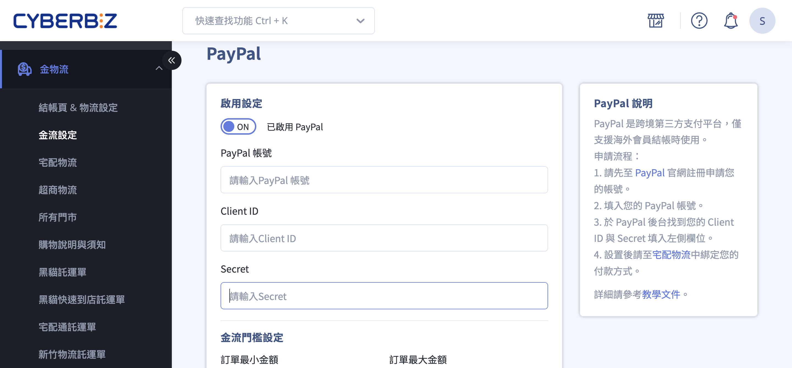
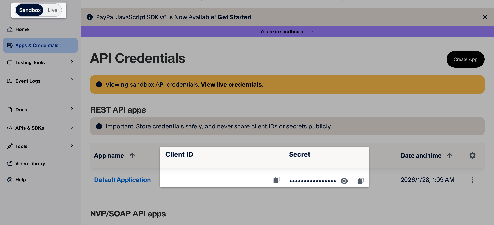

# 設定 PayPal

串接 PayPal 金流，讓海外信用卡顧客於結帳時可使用 PayPal 支付。
{ .subtitle }

[:lucide-bolt:{ title="適用功能" }](../../resources/conventions#適用功能) | CYBERBIZ PAYMENTS
{ .doc-badge }

{ .hero-page }

## PayPal 說明

PayPal 是全球知名的線上支付平台，可讓消費者使用信用卡、金融卡或 PayPal 餘額完成付款。透過 PayPal，商家可以安全、快速地收款，並支援多國貨幣交易。

### 適用情境

- 適合跨境或海外客戶的商家
- 希望提供安全支付方式，並整合至 CYBERBIZ 後台訂單管理

### 使用須知 

- **法規限制**：台灣商家僅能進行跨境交易，無法於台灣境內互轉。持國外信用卡的顧客可使用 PayPal 付款。 
- **自動退款**：系統支援付款後 **180 天內** 自動退款，超過期限需商家手動退款。 
- **手續費**：費率依消費者發卡國家（國內或國際交易）而異，詳細金額請參考 PayPal 對帳單。 
- **金流門檻**：可設定 PayPal 使用金額上限與下限，避免小額訂單手續費成本過高。

## 操作步驟

### 步驟一：申請 PayPal 帳號

!!! info "請使用可正常收信的電子郵件註冊，此郵件將作為後續串接 CYBERBIZ 後台的 PayPal 帳號。"

#### 操作步驟

1. 前往 [PayPal 官方網站 :lucide-external-link:](https://www.paypal.com/tw/webapps/mpp/home?locale.x=zh_TW)，申請 **商業帳號（Business account）**。
2. 依照 PayPal 指示完成帳號註冊與身分驗證流程。
3. 確認可成功登入 PayPal 後台，並完成基本帳號設定。

### 步驟二：取得 PayPal Client ID 與 Secret

> **提示**：已開通 CYBERBIZ PAYMENTS 的商家，可透過 Client ID 與 Secret 啟用 **自動退款功能**。

#### 操作說明

1. 登入 PayPal 商業帳號後，前往 [**PayPal 開發者後台（Developer Dashboard）** :lucide-external-link:](https://developer.paypal.com/home/)。  
2. 在開發者後台中，進入 **Apps & Credentials** 相關頁面。
3. 確認目前環境為 **Live（正式環境）**，而非 Sandbox（測試環境）。
4. 建立或選取既有的 App，即可取得：
    
    - **Client ID**
    - **Secret**

> 以上畫面僅為操作位置示意，實際畫面請以 PayPal 後台顯示為準。

### 步驟三：CYBERBIZ 後台設定

1. **進入設定頁面** 

	- 登入 CYBERBIZ 管理後台，前往 **金物流 > 金流設定**。
	- 在 PayPal 區塊，點擊 編輯按鈕 :material-file-document-edit-outline: 進入編輯頁面。
    
2. **填寫 PayPal 串接資料**
    
    - **PayPal 帳號**：輸入 PayPal 商業帳號的註冊電子郵件
    - **Client ID**：貼上於 PayPal 開發者後台取得的 Client ID    
    - **Secret**：貼上於 PayPal 開發者後台取得的 Secret
        
    
    > :lucide-triangle-alert: 請確認貼上內容 **未包含任何空格或換行字元**，否則可能導致串接失敗。
    
2. **啟用金流服務**：將 PayPal 金流選項切換為 **啟用（ON）**，並點擊 **確認儲存**。
    
3. **綁定物流方式**  
	- 前往 **金物流 > 宅配物流**
	- 編輯相關物流方式，勾選新增的 PayPal 付款選項，確保前台可使用

	!!! warning "若未將新增金流選項綁定至物流，前台將無法顯示該付款方式。"

	

## 後續步驟

- :lucide-banknote-arrow-down:{ .lg }   
  [__退貨退款__](一般退貨退款)     
  退貨退款操作。

- :lucide-circle-question-mark:{ .lg }   
  [__PayPal 官方 FAQ__](https://www.paypal.com/tw/cshelp/personal)  
  PayPal 官方彙整的常見問題。

