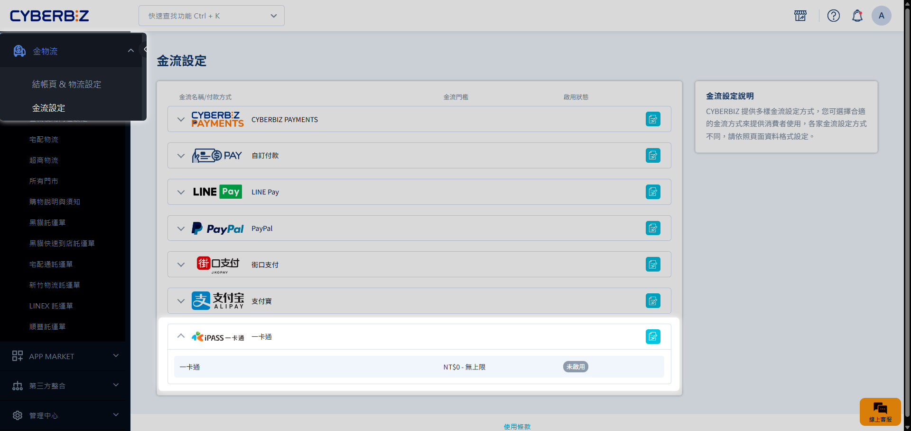
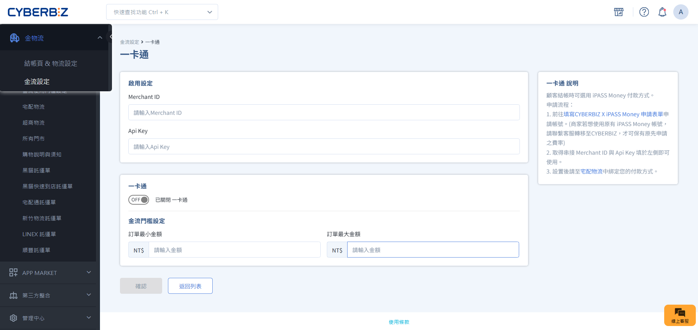
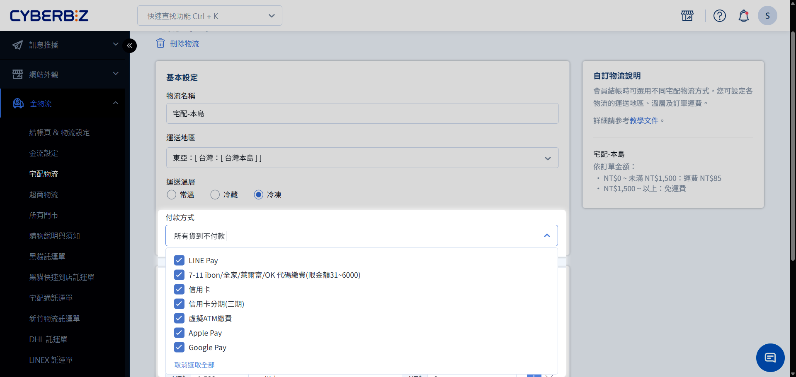

# 設定 iPASS MONEY 支付
指引商家申請並串接 iPASS MONEY（一卡通）支付服務。涵蓋申請規範、必要證明文件、2-4 週審核時程及後台金鑰配置流程。
{ .subtitle }

!!! warning "LINE Pay 功能異動重要通知"
    自 **2026 年 1 月 1 日** 起，一卡通 iPASS MONEY 功能已全面從 LINE Pay 錢包移除。若官網需提供一卡通支付選項，商家必須 **獨立申請並重新串接**，不可沿用舊版 LINE Pay 金鑰。

## 步驟 1 準備申請文件

請先準備以下四項文件的電子檔（PDF 或圖片格式）：

1.  **公司證明文件**（擇一/不可缺頁）
    - 最新版本貴司完整之公司設立/變更登記表
    - 商業登記抄本（非舊式營業登記例證）
    - 國稅局核發的稅籍登記證明
    - 經濟部商業司商工登記證明
2.  **負責人身分證**：正反兩面影本。
3.  **銀行存摺影本**：撥款帳戶戶名必須與公司登記名稱完全一致。
4.  **網站首頁截圖**：官網正式上線之首頁畫面。

!!! tip "資料安全建議"
    若需標註申請專用，請在文件中加入浮水印 `僅供申請 iPASS MONEY 一卡通使用`。

## 步驟 2 提交申請與審核

1.  **提交表單**：備妥文件後，填寫 [CYBERBIZ x iPASS MONEY 串接申請表單](https://forms.gle/vHe3DdHZChcS43CUA)。
2.  **等待審核**：CYBERBIZ 將資料轉交一卡通進行審查，時程約 **2 至 4 週**。 
3.  **建立帳戶**：註冊完畢後，系統將寄發通知信，內含一卡通後台之帳號密碼。

    !!! info "注意事項"
        若收到一卡通發送的 **開通後台帳號信件**，僅代表系統帳號建立完成，**不代表審核通過**。請務必等待 CYBERBIZ 提供金鑰通知信後再進行串接。

## 步驟 3 後台串接設定

收到 CYBERBIZ 寄送的金鑰通知信件後，請依照以下步驟啟用服務：

1.  前往 **金物流 > 金流設定 > 一卡通**。
    { .screenshot }
2.  填入金鑰資訊：依通知信件中提供的金鑰填寫。
    -   **Channel ID**
    -   **Api Key**
    { .screenshot }
3. 設定 **金流門檻限制**。

    > :lucide-lock: **金流門檻設定** 功能僅支援 **高手版**、**PLUS 版** 與 **企業版**。專業版與進階版恕不支援。

4.  點擊 **儲存**。

!!! warning "填寫規範"
    填入金鑰時請確保前後 **無空格**（包含複製時產生的隱藏空白），以免導致驗證失敗。

## 步驟 4 綁定物流支付

若站台使用 **自訂物流** 或 **宅配貨到不付款**，需手動勾選支援一卡通：

1.  前往 **金物流 > 自訂物流**。
2.  點擊欲修改的物流選項。
3.  在 **付款方式** 中勾選 **一卡通**。
4.  點擊 **儲存**。

{ .screenshot }