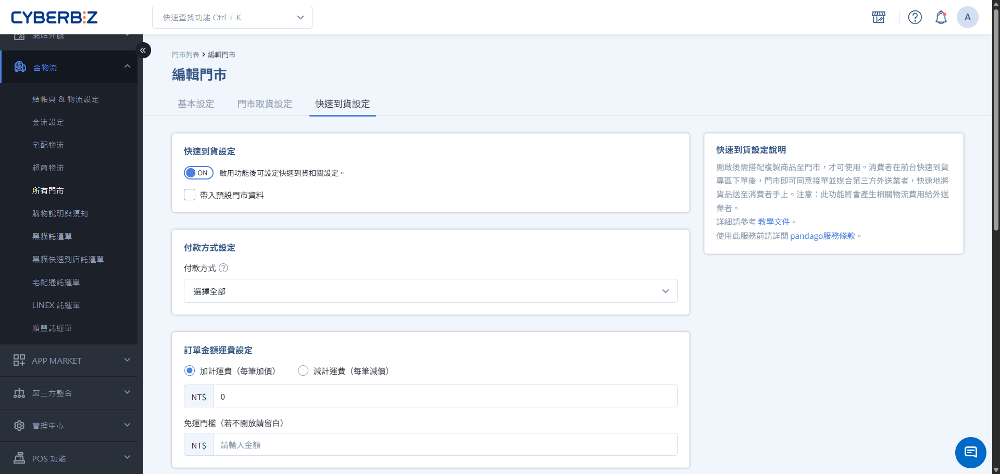

# 設定門市快速到貨服務

完成門市快速到貨 (CYBERBIZ NOW) 服務設定，包含啟用功能、接單時間、運費規則與外送資訊管理。
{ .subtitle }

[:lucide-lock:{ title="適用方案" }](../../resources/conventions#適用方案) | 所有PLUS / 企業
{ .doc-badge }

{ .hero-page }

## 快速到貨服務說明

**CYBERBIZ NOW 快速到貨** 是整合第三方外送業者（如 Uber Direct、Pandago）的即時配送服務。消費者在官網下單後，由門市端快速揀貨，並由外送司機於 1-2 小時內送達指定地點，提供如同外送平台般的即時購物體驗。

!!! tip "應用情境"
    - **餐飲美食**：蛋糕甜點、即食料理配送，保持商品新鮮度。
    - **日常用品**：嬰幼兒用品、清潔用品等急需品，提供高便利性回購。
    - **節慶禮禮盒**：鮮花、禮盒即時補貨配送，提升購物體驗。

## 使用須知

- **建立門市**：請先於 **金物流 > 所有門市** 建立門市資訊，再行設定。
- **刪除門市**：若刪除門市，與門市設定與對應商品都會一併刪除。
- **門市地址正確性**：配送範圍由外送系統依門市地址自動計算（約半徑 3-5 公里），地址錯誤將導致無法配送。
- **付款方式建議**：為確保配送效率，建議僅開啟「線上支付」方式，避免貨到付款產生的收款糾紛。
- **設定複製**：若有多個門市，可利用 **帶入預設門市資料** 快速同步運費與接單時間。

!!! warning "適用條件"
    - **系統整合**：若同時使用 CYBERBIZ 電商倉儲，快速到貨功能僅支援部分串倉，恕不支援全串倉。
    - **適用行銷活動**：快速到貨不支援首購禮。
    - **適用物流**：快速到貨不支援舊版物流。若站台使用舊版物流，可洽詢客服人員，協助您切換為新版物流。
    - **適用版型**：適用拖拉版型(3.0.0以上版本)，若站台使用舊版版型且經過客製，則需評估是否升級版型。升級版型後，您的客製項目將會消失。

## 操作流程

### 步驟 1：開啟門市快速到貨功能

1. 登入 CYBERBIZ 管理後台，前往 **金物流 > 所有門市**。
2. 找到欲設定的門市，點擊右側 **編輯**。
3. 切換至 **快速到貨設定** 頁籤。
4. 將 **啟用快速到貨** 開關切換為 `開啟 (ON)`。

### 步驟 2：設定接單時間與運費規則

1. **付款方式設定**：點擊選單並勾選允許使用的付款方式（如：信用卡、LINE Pay）。
2. **運費規則**：
    - **運費加計/減計**：可在基礎外送費上額外加價或減價（如偏遠地區加價）。
    - **免運門檻**：輸入滿額免運金額，若不開放免運請留白。
3. **接單時間**：
    - **全時段接單**：適用於 24 小時營業門市。
    - **自訂接單時段**：建議設定早於門市打烊時間 1-2 小時（如營業至 22:00，接單設至 20:00），預留處理最後訂單的時間。

### 步驟 3：設定外送聯絡與備註資訊

1. 填寫 **聯絡電話**，供外送司機聯繫門市使用。
2. 在 **備註資訊** 欄位填寫給司機的指引（如：門市位於百貨 B1 美食街、請由東側電梯上樓等）。

### 步驟 4：管理門市排序（適用多門市）

若有多家門市開啟快速到貨，可控制前台展示順序：

1. 回到 **金物流 > 所有門市** 列表頁。
2. 在列表中使用以下方式調整：
    - **拖曳排序**：滑鼠左鍵點擊門市欄位不放，上下移動調整位置。
    - **輸入數字**：直接在排序欄位輸入數字，數字越小排序越前面。

## 常見問題

??? quote "快速到貨的配送範圍如何計算？"
    配送範圍由外送業者根據門市地址自動計算，通常為 3-5 公里。若消費者輸入的地址超出範圍，結帳時將無法選擇快速到貨。

??? quote "為什麼有些門市無法啟用功能？"
    請確認：1. 門市地址是否完整正確。 2. 該地區是否有第三方外送業者服務。 3. 是否已向 CYBERBIZ 申請並開通 NOW 功能。

??? quote "門市人員無法及時接單怎麼辦？"
    若門市暫時人手不足，可進入該門市設定，暫時將 **啟用快速到貨** 切換為 `關閉`，待狀況緩解後再行開啟。

??? quote "如果商品缺貨如何處理？"
    若接單後發現商品缺貨，請立即聯繫客戶說明，並於後台取消訂單安排退款，以維持顧客滿意度。

## 後續步驟

- :lucide-copy-plus:{ .lg }   
  [__複製商品到快速到貨門市__](複製商品到快速到貨門市.md)       
  將適合即時配送的商品同步至門市專區。

- :lucide-layout-template:{ .lg }     
  [__設定快速到貨前台頁面__](設定快速到貨前台頁面.md)  
  配置前台入口與視覺樣板。

- :lucide-clipboard-check:{ .lg }     
  [__處理快速到貨訂單__](處理門市到貨訂單.md)  
  了解門市端如何操作揀貨與司機媒合流程。

