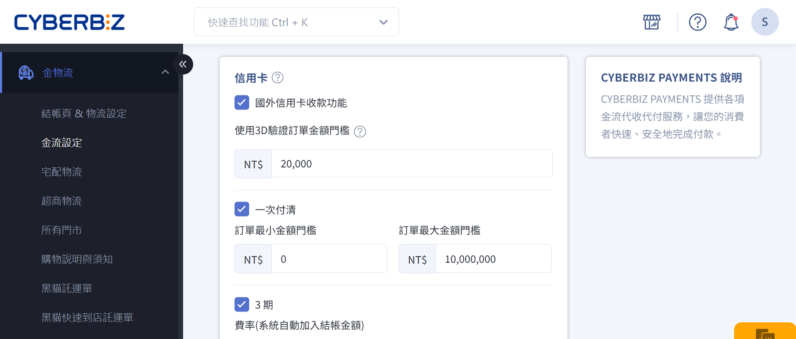
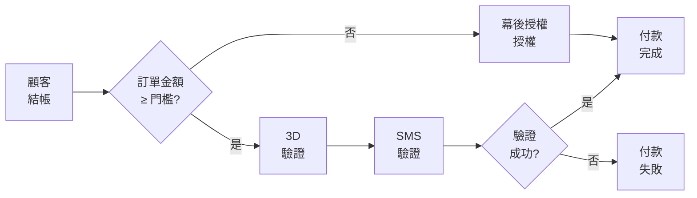
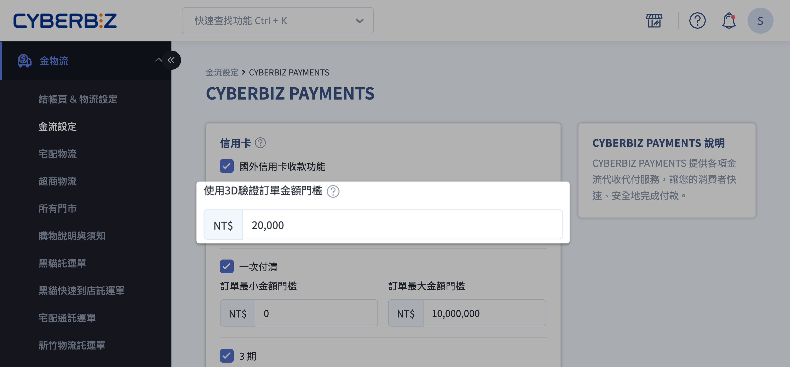
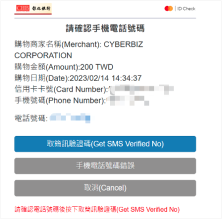

# 設定信用卡 3D 驗證門檻

設定交易金額門檻，以決定哪些信用卡交易需要進行 3D 驗證。
{ .subtitle }

[:lucide-sparkles:{ title="適用擴充" }](../../resources/conventions#適用擴充) | CYBERBIZ PAYMENTS
{ .doc-badge }

{ .hero-page }

## 3D 驗證門檻說明

設定交易金額門檻，用來控制 **哪些信用卡交易需要進行 3D 驗證（SMS / OTP）**，以平衡 **交易安全性** 與 **結帳轉換率**。

### 系統判斷規則

- 當訂單金額 **大於或等於** 設定門檻時，系統會要求顧客完成 **3D 驗證**。
- 當訂單金額 **低於** 設定門檻時，系統將直接進行 **幕後授權**，不顯示驗證畫面。

### 什麼是 3D 驗證

**3-D Secure（3DS）** 是一種線上信用卡交易的額外身分驗證機制，可有效降低盜刷與未授權交易風險。

在結帳過程中，持卡人需透過以下任一方式完成驗證：

- 簡訊一次性密碼（OTP）
- 發卡銀行驗證頁面
- 生物識別（依銀行支援狀況）

### 什麼是「幕後授權」

**幕後授權** 是指系統在背景自動完成信用卡授權流程，顧客不需要進行 3D 驗證或輸入簡訊驗證碼。

> 注意：幕後授權仍完成信用卡授權，但 **未使用 3D 驗證防盜刷機制**，**盜刷風險與責任由商家承擔**。商家應依實際風險評估是否調整門檻或啟用 3D 驗證。

### 3D 驗證流程

## 前置條件

- [x] 已成功 [開通 **CYBERBIZ PAYMENTS**](申請 CYBERBIZ PAYMENTS)  
- [x] 商店前台可正常瀏覽並完成結帳流程

## 使用須知

- **定期定額訂單**
    
    - 首筆交易會依門檻規則進行 3D 驗證     
    - 後續定期扣款皆採用幕後授權，不再要求顧客驗證
        
- **適用卡別**
    
    - 國內信用卡    
    - 國外信用卡

### 盜刷責任歸屬

|設定方式|盜刷責任|損失承擔|
|---|---|---|
|**有啟用 3D 驗證**|持卡人|盜刷經銀行認定後，商家通常不需承擔損失|
|**未啟用 3D 驗證**|商家|持卡人可向銀行申請退刷，商家通常需自行吸收損失|

> :lucide-info: 實際責任與款項處理方式，仍依發卡銀行、收單銀行與支付機構之判定為準。

!!! tip "建議設定"
	- 為降低盜刷風險，建議將 3D 驗證門檻設定為 **1 元**，讓所有信用卡交易皆需完成 3D 驗證。
	- 此為風險控管建議，非系統強制限制。

## 設定 3D 驗證門檻

1. 登入 CYBERBIZ 後台，前往 **金物流 > 金流設定**。
2. 在 CYBERBIZ PAYMENTS 欄位，點擊 **:material-file-document-edit-outline: 編輯**，進入設定頁面。
3. 在 **3D 驗證金額門檻** 欄位，輸入觸發的數值。
4. 儲存設定。

## 客戶結帳流程

### 一般付款（幕後授權）

當訂單金額低於門檻時：

1. 客戶輸入信用卡資訊
2. 系統直接完成授權
3. 付款完成
    
### 3D 驗證付款

當訂單金額達到或超過門檻時：

1. 客戶輸入信用卡資訊
2. 系統轉址至發卡銀行驗證頁面
3. 客戶完成簡訊或銀行驗證
4. 驗證成功後完成付款

## 常見問題

??? quote "3D 驗證失敗怎麼辦？"  
	請向發卡銀行確認以下事項：  
	
	1. 登記的手機號碼是否正確  
	2. 是否已開通簡訊驗證服務  
	3. 信用卡是否支援 3D 驗證功能

    > 建議：如仍無法完成驗證，可請客戶更換信用卡或聯絡銀行客服。

??? quote "可以關閉 3D 驗證嗎？"
	可以，將門檻設定為一個極高的金額（例如 9999999），所有訂單都會走幕後授權。但不建議這樣做，會增加盜刷風險。
	    
??? quote "定期定額訂單每次都要 3D 驗證嗎？"
	不用。只有首筆訂單需要 3D 驗證，之後的扣款都是幕後授權，不會再要求客戶驗證。
	
??? quote "國外信用卡也支援 3D 驗證嗎？"
	是的，國內外信用卡都支援 3D 驗證。
	    
??? quote "修改門檻後，多久會生效？"
	立即生效。下一筆訂單就會套用新的門檻設定。

??? quote "3D 驗證失敗會扣款嗎？"
	不會。驗證失敗代表交易未完成，不會進行扣款。