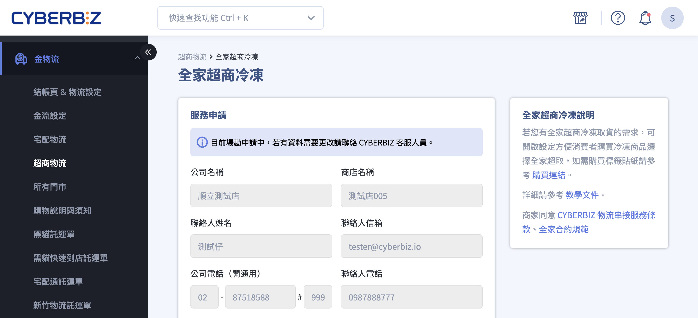

# 設定全家冷凍物流 B2C

申請、設定與操作全家冷凍物流 B2C 服務。
{ .subtitle }

[:lucide-tag:{ title="適用方案" }](../../resources/conventions#適用方案) | 高手 / 高手 PLUS / 企業  
[:lucide-bolt:{ title="適用功能" }](../../resources/conventions#適用功能) | CYBERBIZ PAYMENTS
{ .doc-badge }

{ .hero-page }

## 全家冷凍物流 B2C 說明

**全家冷凍 B2C（大宗寄倉）** 服務是由全台物流（全家日翊配合的物流公司）至商家指定地點收貨（上收服務），並配送至消費者指定的全家門市。

### 適用版本與申請前提

• **適用版本**：僅提供 **高手版（且須搭配 CYBERBIZ PAYMENTS）**、**高手 PLUS 版** 及 **企業版** 商家申請。

• **金流限制**：若商家未使用 CYBERBIZ PAYMENTS，則僅能提供「取貨不付款」服務，無法使用「貨到付款」。

• **賠償上限**：貨物遺失或毀損之賠償上限為 **TWD 5,000**。

## 申請流程步驟

1. **聯繫客服**：欲使用此功能，請先聯繫系統客服申請開啟物流功能。

2. **開啟申請頁面**：經客服確認後，系統會在後台開啟申請入口，並以 Email 通知商家。

3. **送出申請表**：

	- **後台路徑**：**金物流 > 超商物流**，點擊 **全家超商冷凍**。
	- 填寫資料並送出，隨後全家會進行 **場勘**，流程約需 **3 至 4 週**（不含假日）。
	- **注意**：若填寫有誤，會導致後續調整時間較長，恐將影響申請進度或後續出貨流程，請送出前務必確認資料無誤。

4. **審核與開通**：

	- 場勘成功後，系統會自動為您進行開通流程。
	- 若場勘失敗，系統會發信告知原因，商家可修正後重新申請。

!!! note "場勘說明"
	商家申請 **全家冷凍 B2C 物流** 或 **新竹物流** 等 上收服務 時，由物流公司派員至商家倉庫或出貨地點進行實地評估。

## 開通後設定

收到系統開通成功的通知信後，請依以下步驟啟用服務：

1. **進入設定頁面**：
	
	- 登入 CYBERBIZ 管理後台，前往 **金物流 > 超商物流**。
	- 點擊 **全家超商冷凍** 編輯 :material-file-document-edit-outline: 按鈕，進入編輯頁面。

2. **輸入營運資訊**：
	
	- 依序輸入 **運費、免運門檻**。
	- 依需求開啟 **貨到不付款** 或 **貨到付款** 功能。
	- 點擊 **儲存** 套用變更。

## 出貨操作與配送規範

1. **出貨操作**：
	
	- 商家在後台訂單列表中勾選欲出貨訂單，並點選「選擇操作」，下載對應材積的託運單（s60 或 s105）。
	- 下載托運單後，全台物流即會收到訂單，並會 **自動到府收貨**，不需另外聯絡。

2. **填寫單據**：

	- 下載 [取貨明細表](https://docs.google.com/spreadsheets/d/19d8q4v86k9dNHovERuFNoakaUxBth_eY/edit?gid=879537903#gid=879537903) 並填寫相關內容。（務必在收貨前填寫完成）
	- 司機現場點收、確認清單內容，並填寫 貨運溫度/取貨溫度紀錄。
	> 建議保留明細表至少兩個月以備查驗。

!!! info "**低消門檻**：全家原定單次收件未達 10 件需加收處理費，但自 **2024/02/01 起，未達 10 件之處理費優惠免收**（如有異動以公告為主）。"

## 包裹規格與限制

- **尺寸與費用**：

	- **s60**（$145）：三邊總和 ≤ 60cm（單邊最長邊 ≤ 45cm），重量 ≤ 5kg。
	- **s105**（$155）：三邊總和 ≤ 105cm（單邊最長邊 ≤ 45cm），重量 ≤ 10kg。

- **包裝要求**：須使用完整、無凹損且不可裸露的紙箱，**不可使用束繩、保麗龍或破壞袋**。

- **溫度控管**：僅支援 **冷凍食品**，溫度須低於 **-12℃**（或 -18℃ 依規範而定），且寄件前須 **預冷 12 小時以上** 並確保完全冷凍。

- **標籤張貼**：將託運單印出後放入 **防水透明袋** 中，平貼於紙箱寬面，不得凹折或縮放條碼。

## 全台物流收件和配送時間

!!! warning "如遇 **農曆年節、天然災害或物流高峰期等不可抗力因素**，實際收貨、配送時程將由雙方另行協議。"

### 物流收貨服務時間（全台物流至商家端收貨）

- **收貨日**：星期一至星期六（**星期日不收貨**）
    
- **收貨時程判定方式**：  
    收貨日於場勘時由物流方判定為 **D 或 D+1**，一經確認後 **無法更改**。  
    判定邏輯請參考下方 [收貨日估算範例說明](#收貨日估算範例)。

### 物流配送服務時間（全台物流配送至門市）

- **配送日**：星期一至星期日（**包含例假日**）
    
- **配送時程**：  
    包裹將於完成收貨後 **約 5–7 個工作日內配送至指定門市**。

> 實際時程依物流方公告為準

### 收貨日估算範例

=== "D"

	以下表格以 **9/1 (四)** 廠商按「下載託運單」為基準日，說明收貨與配送之預估時程：

	|**訂單可收貨時間**|**全台物流收貨時間**|**配送至店 (約收貨日 + 5 天)**|
	|---|---|---|
	|**9/1 (四) 09:30 前**|9/1 (四) 下午|約 9/6 (二)|
	|**9/1 (四) 09:30 後**|9/2 (五) 下午|約 9/7 (三)|
	|**9/2 (五) 09:30 前**|9/2 (五) 下午|約 9/7 (三)|

	> **D 收貨：** 以 **09:00** 作為時間切割點。

=== "D + 1"

	以下表格以 **9/1 (四)** 廠商按「下載託運單」為基準日，說明 D+1 模式下的收貨與配送預估時程：

	|**訂單可收貨時間**|**全台物流收貨時間**|**配送至店 (收貨日 + 5 天)**|
	|---|---|---|
	|**9/1 (四) 17:00 前**|9/2 (五) 下午|約 9/7 (三)|
	|**9/1 (四) 17:00 後**|9/3 (六) 下午|約 9/8 (四)|

	> **D+1 收貨：** 時間以 **17:00** 做切割。

## 異常情境處理

- **消費者逾期未取**：包裹到店 4 日未取，全台物流會回收並暫存於物流中心，待下次司機到商家處收件時一併退回，**此段逆物流不額外收費**。

- **門市關轉（閉店）**：若取件門市結束營業，系統會通知商家，商家須於 **6 日內** 聯繫消費者並至後台重新選擇門市。

- **出貨異常**：包裹未於 D+3 (出貨日+3天) 到店，則會進入查找流程，若確認遺失或商品失溫則會開始走調查賠償流程。

## 常見問題

??? quote "商品超過 出貨日+7日 沒有送到店？" 
	全家會自動取消該筆訂單預留的物流空間。此時 CYBERBIZ 後台會顯示「運送異常」，客戶需依照 **退貨流程** 進行後續處理。

??? quote "消費者無法於結帳頁面選擇全家冷凍地圖？" 
	全家冷凍物流設有材積限制。若消費者購物車內的商品材積超過 **s105**，系統將無法顯示全家冷凍地圖，或可能因超規而被退件。

??? quote "消費者無法選擇想要的特定店家？" 
	當消費者開啟冷凍地圖時，全家系統會自動判斷商家出貨時間（預設為隔天起 8 天內），並僅顯示仍有剩餘冷凍庫存空間的店家。若原選定店家空間不足，地圖將自動顯示 **1.5km 內** 的其他替代店家。