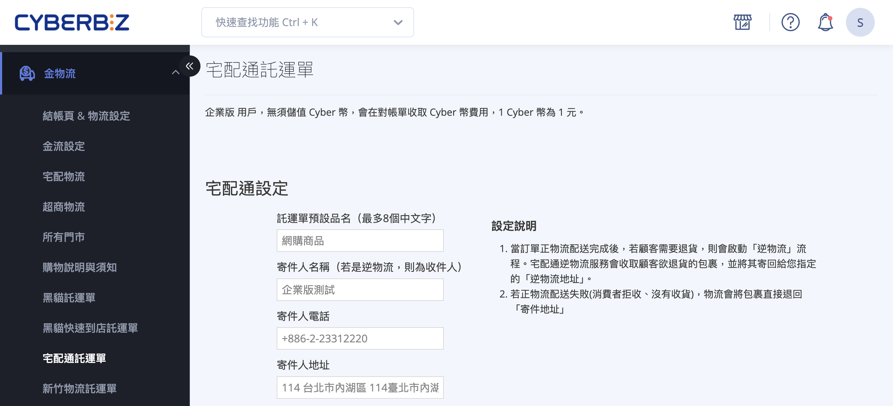
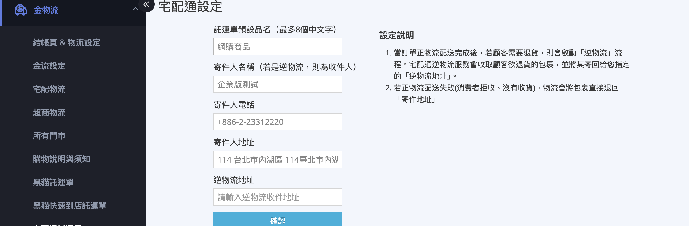
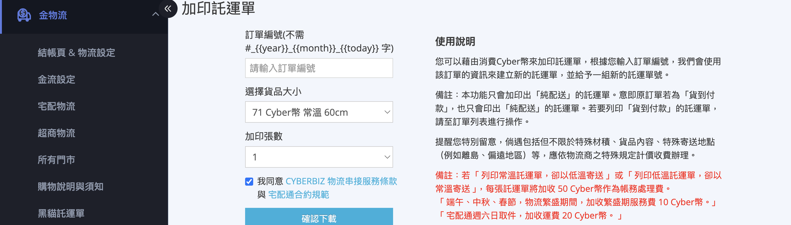
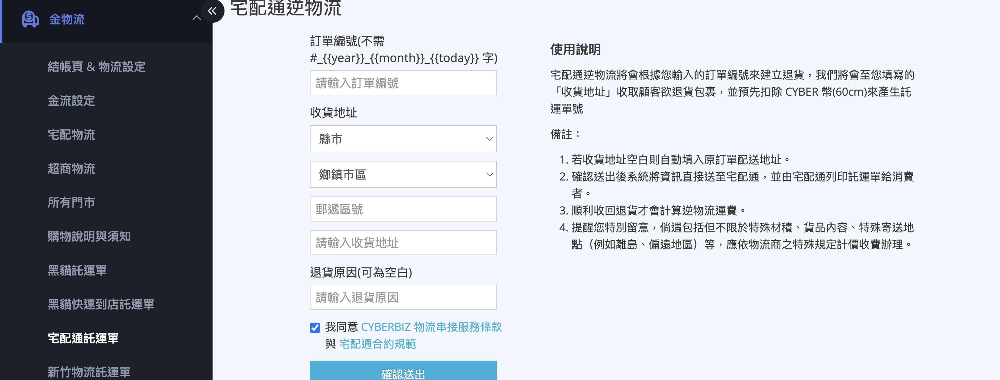
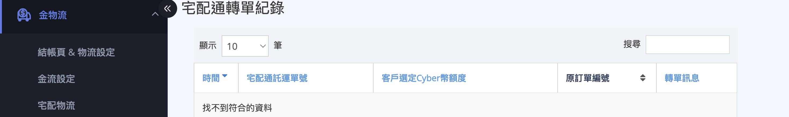
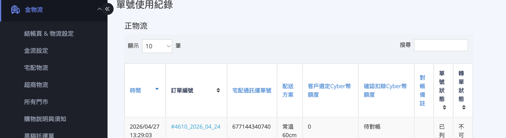

管理宅配通託運單指南，包含設定寄件人資訊、加印託運單、建立宅配通逆物流，以及查詢託運單號使用紀錄與 Cyber 幣扣款對帳。
{ .subtitle }

{ .hero-page }

## 功能介紹 { #intro-pelican-shipping-note }

「宅配通託運單」管理頁位於 **後台左側選單「金物流」>「宅配通託運單」**。這個頁面集中處理 **日常出貨流程之外** 的宅配通操作：

* **宅配通設定**：寄件人名稱、電話、地址等資料，加印託運單與逆物流時會使用。
* **加印託運單**：為同一筆訂單產生 **新的單號** ，適合一單拆多箱寄送的情境。
* **宅配通逆物流**：建立退貨託運單，由宅配通到府收件並送回您的逆物流地址。
* **轉單紀錄、單號使用紀錄**：查詢所有託運單號的扣費、狀態與對帳資訊。

一般出貨流程(批次下載、單筆出貨、部分出貨、補印託運單)請見 [如何使用宅配通出貨](../orders/使用宅配通出貨.md)。

!!! info "提示"
    頁面最上方會顯示計費資訊：一般版商家會看到「目前 Cyber 幣餘額」；PLUS版 / 企業版商家則顯示對帳單說明文字。

## 設定寄件人資料 { #configure-pelican-shipping-note-sender }

首次使用「加印託運單」或「宅配通逆物流」前，請先設定寄件人資料。日後若公司地址或聯絡人變更，也回到這裡修改。

1. **進入頁面：** 前往後台「金物流」>「宅配通託運單」，捲動至最上方 **「宅配通設定」** 區塊。
2. **填寫託運單預設品名：** 輸入印在託運單品名欄的文字，最多 **8 個中文字**。
3. **填寫寄件人資訊：** 依序填入寄件人 **名稱** 、**電話** 、**地址** 。若進行逆物流(退貨)，這裡的姓名會顯示為退貨件的 **收件人** 。
4. **填寫逆物流地址：** 顧客退貨時包裹會送回此地址。若留空，逆物流會使用上方「寄件人地址」。
5. **儲存設定：** 點擊 **「確認」** 按鈕，系統會顯示「已成功變更設定」。

!!! note "註釋"
    * 寄件人欄位皆為 **必填** (品名、名稱、電話、地址)，漏填會跳出錯誤訊息。
    * 此處的寄件人資料僅用於 **加印託運單** 與 **逆物流** ；從訂單列表批次下載託運單時，系統會使用「管理中心」>「一般設定」中設定的公司物流地址。

## 加印託運單(同訂單多箱寄送) { #operate-pelican-shipping-note-add-print }

當一筆訂單需要拆成多個包裹寄送(例如商品太多裝不下一箱)，使用「加印託運單」可以為 **同一筆訂單建立額外的託運單號** ，每箱各貼一張。

1. **進入頁面：** 前往後台「金物流」>「宅配通託運單」，捲動至 **「加印託運單」** 區塊。
2. **輸入訂單編號：** 在「訂單編號」欄位輸入要加印的訂單編號 **不需訂單前綴字**，前綴會由系統自動帶入。
3. **選擇貨品大小：** 從下拉選單挑選本張新單對應的尺寸，選項旁會顯示該尺寸要扣的 Cyber 幣金額。
4. **選擇加印張數：** 從「加印張數」下拉選擇要加印幾張[^1]。每張會 **各自扣費** 並產生 **獨立單號** 。
5. **同意條款：** 勾選 **「我同意 CYBERBIZ 物流串接服務條款 與 宅配通合約規範」**，勾選後「確認下載」按鈕才會啟用。
6. **確認下載：** 點擊 **「確認下載」**，系統會跳出確認視窗，顯示將扣除的 Cyber 幣總額。
7. **送出加印請求：** 點擊確認視窗中的 **「確認」**，系統會建立託運單號並產出 PDF 自動下載。

!!! info "提示"
    * 加印託運單只會印出 **「純配送」** 託運單，即使原訂單為貨到付款，加印出來的單也不會帶代收款。
    * 若需要為貨到付款訂單拆箱寄送代收款，請聯繫 CYBERBIZ 客服協助處理。
    * 加印 **必定** 產生新單號並扣費。若您只是印壞了想重印同一張單，請改用 [補印託運單][operate-pelican-reprint]{ data-preview } (從訂單列表操作，不會扣費)。

[^1]: 例如分 3 箱寄送則選 3。

## 建立宅配通逆物流(退貨) { #operate-pelican-shipping-reverse }

當顧客需要退貨，且您希望由宅配通到府收件時，可從這裡建立逆物流託運單。

1. **進入頁面：** 前往「金物流」>「宅配通託運單」，捲動至 **「宅配通逆物流」** 區塊。
2. **輸入訂單編號：** 在「訂單編號」欄位輸入要退貨的訂單編號(不需訂單前綴字)。
3. **填寫收貨地址：** 透過下拉選單選擇縣市、鄉鎮、郵遞區號，並在地址欄位填入完整地址[^2]。
4. **填寫退貨原因(可選)：** 在「退貨原因」欄填入備註，若不填可留空。
5. **同意條款：** 勾選 **「我同意 CYBERBIZ 物流串接服務條款 與 宅配通合約規範」** 。
6. **送出建立請求：** 點擊 **「確認送出」**，系統會跳出確認視窗，顯示將以最低費率「常溫 60cm」**預扣 Cyber 幣** 的金額。
7. **確認建立：** 點擊視窗中的 **「確認」**，資訊會直接送至宅配通端，**由宅配通端列印託運單** 並交給消費者。
8. **等待退貨收回：** 順利收回退貨後，才會以實際包裹尺寸計算逆物流運費並完成扣費。

!!! note "註釋"
    * 建立逆物流時 **預扣** 的金額為「常溫 60cm」的基本費率，等同最低費用。
    * 託運單由宅配通端列印並交給顧客，商家後台 **不會** 直接拿到 PDF 。
    * 退貨包裹會送至 [宅配通設定][configure-pelican-shipping-note-sender]{ data-preview } 中填寫的「逆物流地址」(留空時則送至寄件人地址)。

[^2]: 若留空，系統會自動帶入原訂單的配送地址。

## 查詢紀錄與對帳 { #operate-pelican-shipping-records }

頁面下方提供三份歷史紀錄表，所有資料皆可使用右上角搜尋框關鍵字過濾。

### 宅配通轉單紀錄 { #pelican-shipping-transfer-records }

顯示曾經啟用「轉單」機制的單號紀錄，作為對帳查詢用。

??? info-clean "欄位說明"

    | 欄位 | 說明 |
    | :-- | :-- |
    | 時間 | 轉單發生的日期與時間 |
    | 原訂單編號 | 原本綁定該單號的訂單 |
    | 宅配通託運單號 | 該筆被轉用的宅配通託運單號 |
    | 客戶選定 Cyber 幣額度 | 當初下載託運單時選擇的扣抵金額 |
    | 轉單訊息 | 轉單過程的系統備註 |

---

### 單號使用紀錄(正物流 / 逆物流) { #pelican-shipping-usage-records }

「正物流」記錄出貨用單號，「逆物流」記錄退貨用單號，兩者欄位結構相同。

??? info-clean "欄位說明"

    | 欄位 | 說明 |
    | :-- | :-- |
    | 時間 | 託運單建立時間 |
    | 訂單編號 | 對應訂單編號，點擊可跳至訂單詳情頁 |
    | 宅配通託運單號 | 宅配通配給的託運單號 |
    | 配送方案 | 託運單的材積尺寸 |
    | 客戶選定 Cyber 幣額度 | 下載當下選擇的扣抵金額 |
    | 確認扣除 Cyber 幣額度 | 實際結算後最終扣除的 Cyber 幣金額 |
    | 單號狀態 | 託運單目前狀態（使用中、取消寄件等），「取消寄件」表示 14 日未使用已自動退費 |
    | 轉單狀態 | 顯示該單號是否已使用轉單機制 |

!!! tip "技巧"
    對帳時建議優先比對 **確認扣除 Cyber 幣額度** 欄位，這是實際結算後的金額；「客戶選定 Cyber 幣額度」只是下載當下的預扣金額，可能因退費或調整而與最終扣費不同。

## 後續操作

- :lucide-package:{ .lg }  
  [__使用宅配通出貨__](../orders/使用宅配通出貨.md){ data-preview }  
  批次下載託運單、單筆 / 部分出貨、補印託運單等日常出貨流程。

- :lucide-undo-2:{ .lg }  
  [__宅配逆物流__](宅配逆物流（黑貓宅配通新竹物流）.md){ data-preview }  
  宅配逆物流的完整退貨處理流程，適用於已出貨訂單的退貨取件。

- :lucide-wallet:{ .lg }  
  [__Cyber 幣儲值__](../website-management/Cyber 幣儲值中心使用指南.md){ data-preview }  
  加印託運單會即時扣抵 Cyber 幣，餘額不足時請先至儲值中心儲值。

## 常見問題 { #faq-pelican-management }

??? quote "為什麼點「確認下載」按鈕沒反應?"
    { #faq-pelican-management-disabled-button }

    請檢查是否已勾選下方的 **「我同意 CYBERBIZ 物流串接服務條款 與 宅配通合約規範」** 。未勾選同意條款時，確認按鈕會處於停用狀態。

??? quote "加印託運單時跳出「Cyber 幣不足」要怎麼處理?"
    { #faq-pelican-management-insufficient }

    一般版商家需先至「儲值中心」儲值 Cyber 幣；PLUS版 / 企業版商家不應遇到此訊息，若有發生請聯繫 CYBERBIZ 客服確認方案設定。

??? quote "逆物流送出後，顧客什麼時候會收到託運單?"
    { #faq-pelican-management-reverse-timing }

    送出後系統會把資料傳給宅配通， **由宅配通端列印託運單並交給消費者** 。實際送達時間依宅配通配送排程而定，建議事先與顧客約定可收件的時間範圍。

??? quote "寄件人資料改了之後，已下載的託運單會跟著改嗎?"
    { #faq-pelican-management-sender-update }

    不會。寄件人資料只影響 **修改後新建立** 的託運單(加印或逆物流)。**已下載** 的託運單會保留下載當下的寄件人資料，無法事後變更。

??? quote "單號狀態顯示「取消寄件」，我還能用嗎?"
    { #faq-pelican-management-cancelled }

    「取消寄件」表示該張託運單下載後超過 14 日未實際寄出，系統已自動退回運費。**如果您仍使用該張託運單寄送** ，系統會再次記錄運費(一般版重扣 Cyber 幣；PLUS版 / 企業版列入對帳單)。建議直接重新下載新單號避免混淆。

??? quote "批次下載的託運單寄件人資料和這裡設的不一樣？"

    { #faq-pelican-management-sender-batch }

    從訂單列表批次下載託運單時，系統使用的是「**管理中心 > 一般設定**」中設定的公司物流地址。此頁的寄件人資料僅用於 **加印託運單** 與 **逆物流**。若需修改批次下載的地址，請至管理中心調整。

??? quote "逆物流預扣 60cm 費用，實際包裹比較大怎麼辦？"

    { #faq-pelican-management-reverse-billing }

    建立逆物流時 **預扣** 的是最低費率「常溫 60cm」。宅配通順利收回退貨後，會以 **實際包裹尺寸** 計算運費並完成扣費，系統會自動補扣差額或維持原扣抵。若實際運送尺寸較大或為低溫配送，最終扣費會高於預扣金額。

??? quote "貨到付款訂單加印後，新託運單還能代收貨款嗎？"

    { #faq-pelican-management-cod-print }

    不行。加印功能 **只會印出「純配送」託運單**，即使原訂單為貨到付款，新單也不會帶代收款。若您需要為貨到付款訂單拆箱寄送並保留代收功能，請聯繫 CYBERBIZ 客服協助處理。

