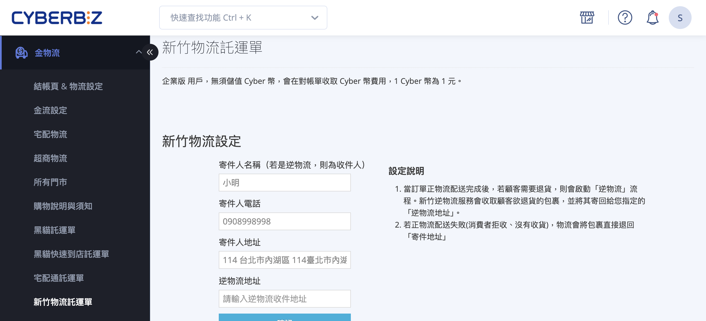
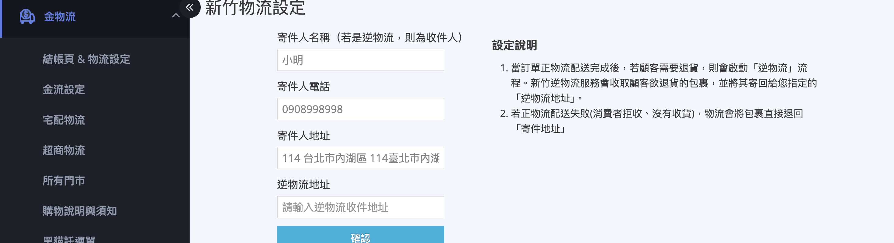
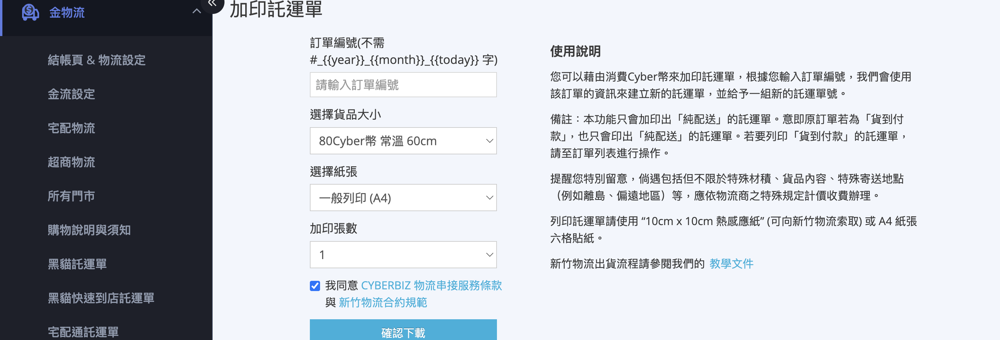
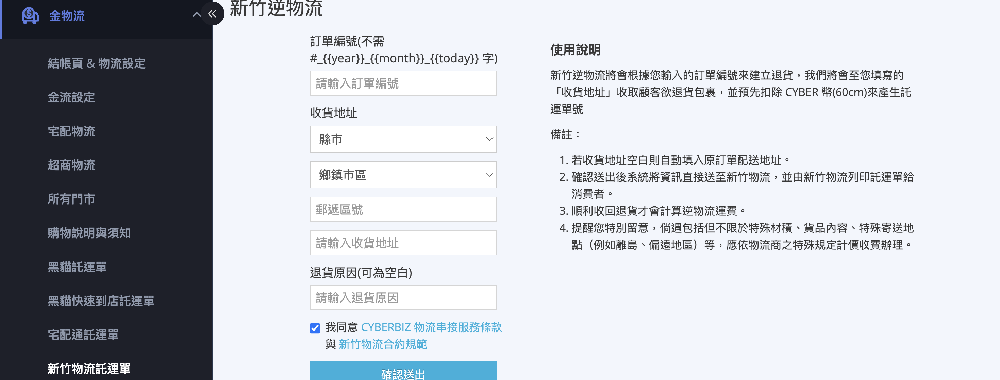
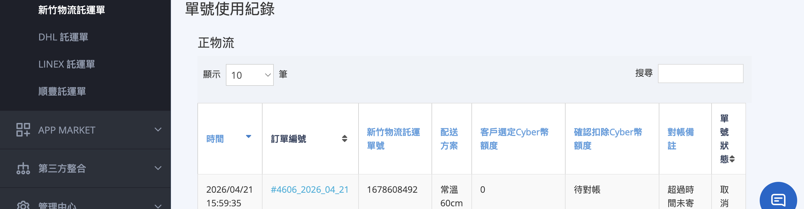

設定新竹物流託運單完整教學，包含寄件人資訊設定、加印託運單、逆物流建立、單號查詢與常見問題。
{ .subtitle }

{ .hero-page }

## 新竹物流託運單說明 { #intro-hct-waybill } 

「新竹物流託運單」頁面是您與新竹物流串接後的中控台，包含寄件人資訊設定、加印託運單、新竹逆物流、以及單號使用紀錄。出貨前請先完成寄件人設定，訂單列表才能順利下載託運單。

## 頁面功能總覽 { #overview-hct-setup }

「金物流」>「新竹物流託運單」頁面包含四個區塊：

| 區塊 | 用途 | 對應段落 |
| :-- | :-- | :-- |
| 新竹物流設定 | 設定寄件人名稱、電話、寄件地址、逆物流地址 | [設定寄件人資訊](#operate-hct-setup-sender) |
| 加印託運單 | 同一筆訂單產生額外的單號與託運單(分箱寄送用) | [加印託運單](#operate-hct-waybill-reprint) |
| 新竹逆物流 | 由新竹物流司機至顧客處取件並寄回您的指定地址 | [建立新竹逆物流](#operate-hct-setup-reverse) |
| 單號使用紀錄 | 查詢過往正物流與逆物流託運單號、扣費紀錄、單號狀態 | [查詢單號使用紀錄](#operate-hct-setup-records) |

## 使用前提與限制 { #prerequisites-hct-setup }

### 申請開通新竹物流 { #prerequisites-hct-setup-enroll }

使用新竹物流前，需先向 CYBERBIZ 申請開通：

- [x] **填寫開通申請**：至「金物流/宅配物流」>「串接物流」找到「新竹物流貨到付款」並[填寫申請表單](宅配貨到付款（黑貓宅配通新竹物流）.md#2-新竹物流貨到付款){ data-preview }。

開通完成後，本頁面「新竹物流託運單」才會於後台選單中出現，並可進行下列設定。

---

### 領取託運貼紙 { #prerequisites-hct-waybill-stickers }

新竹物流提供兩種列印用紙，商家需自行向所屬營業所索取：

| 紙張規格 | 適用列印模式 |
| :-- | :-- |
| 10cm x 10cm 熱感應紙 | 訂單列表[下載](../orders/使用新竹物流出貨.md#operate-hct-shipping-modal){ data-preview }時選擇「熱感列印」、加印託運單時選擇對應紙張 |
| A4 六模託運單貼紙 | 訂單列表[下載](../orders/使用新竹物流出貨.md#operate-hct-shipping-modal){ data-preview }時選擇「一般列印(A4)」、加印託運單時選擇對應紙張 |

聯繫所屬營業所時請提供 **寄件客代：`0577349`**，告知已串接 CYBERBIZ 系統並需要列印紙。

---

### Cyber 幣 vs 對帳單 { #prerequisites-hct-setup-billing }

新竹物流託運單的扣費方式依方案而定：

- **一般版**：建立託運單時 **立即扣除 Cyber 幣**，餘額不足將擋下加印或逆物流。頁面上方會顯示「目前 Cyber 幣」餘額，請至「管理中心」>「儲值中心」儲值。
- **PLUS 版/ 企業版**：不需儲值，費用 **列入每期對帳單**。頁面上方不會顯示 Cyber 幣餘額。

---

## 操作步驟 { #operate-hct-setup }

### 設定寄件人資訊 { #operate-hct-setup-sender }

第一次使用前，請於頁面上方「新竹物流設定」區塊填入寄件人資訊：

1. **寄件人名稱**(若是逆物流，則為收件人)：輸入寄件人公司名稱或聯絡人。
2. **寄件人電話**：輸入聯絡電話。
3. **寄件人地址**：輸入完整寄件地址。
4. **逆物流地址**：輸入接收顧客退貨包裹的地址(若空白，系統會用「寄件人地址」)。
5. 點擊 **「確認」**，系統會即時向新竹物流驗證地址，完成後顯示「已成功變更設定」。

!!! warning "地址驗證失敗"
    若新竹物流回報地址無法驗證，請檢查：寄件地址是否完整(包含縣市、區、門牌)、是否有錯字、是否落在新竹物流配送範圍內。

---

### 同步公司物流地址 { #operate-hct-setup-company-address }

完成[上一步][operate-hct-setup-sender]{ data-preview }後，請至「管理中心/一般設定」>「公司物流地址」 **再填一次相同的寄件地址**。這是因為訂單列表下載託運單時，系統會以「公司物流地址」為寄件人地址欄位。

!!! info "為什麼要設兩次?"
    「新竹物流設定」是 **向新竹物流系統登記** 的寄件人資訊；「公司物流地址」是 **列印在託運單上** 的寄件欄位。兩者用途不同，但內容應一致，避免顧客或司機誤判。

---

### 加印託運單 { #operate-hct-waybill-reprint }

當一筆訂單需要 **拆成多箱寄送** 時，可使用此功能產生額外的託運單號：

1. **輸入訂單編號**：填入訂單編號(不需要輸入訂單編號的英文前綴)。
2. **選擇貨品大小**：由下拉選單選擇對應的尺寸。下拉選單會即時顯示對應的 Cyber 幣費用。
3. **選擇紙張**：選擇「A4 紙張」或「10cm x 10cm 熱感應紙」。
4. **加印張數**：選擇要產生幾張(1~8張)新單號。
5. **同意條款**：勾選同意 CYBERBIZ 與新竹物流的物流服務條款。
6. 點擊 **「確認下載」**，系統會跳出二次確認視窗顯示「訂單編號 XXX，N Cyber 幣」，按 **「確認」** 即會[^reprint-deduct]：
    - 扣除 Cyber 幣(或列入對帳單)
    - 呼叫新竹物流取得新單號
    - 自動下載託運單 PDF
    - 將該訂單與新單號寫入下方「單號使用紀錄」

!!! warning "加印託運單只列印純配送"
    本功能只會印出 **「純配送」** 的託運單。若原訂單為 **貨到付款**，加印的託運單也 **不會** 帶上代收款資訊。若需列印「貨到付款」的託運單，請至訂單列表透過「下載新竹物流託運單」操作。

[^reprint-deduct]: 一般版若 Cyber 幣餘額不足會直接擋下，並提示「Cyber 幣不足，請至儲值中心進行儲值」。

---

### 建立新竹逆物流 { #operate-hct-setup-reverse }

當顧客需要退貨且您希望由新竹物流司機至顧客處取件時：

1. **輸入訂單編號**：填入要退貨的訂單編號(不需要英文前綴)。
2. **收貨地址**：
    - 由下拉選單選擇縣市 / 鄉鎮區。
    - 補上門牌、樓層等詳細地址。
    - **若空白**，系統會自動填入原訂單的配送地址。
3. **退貨原因**：可選填，寫上退貨原因方便對帳。
4. **同意條款**：勾選同意 CYBERBIZ 與新竹物流的物流服務條款。
5. 點擊 **「確認送出」**，系統會跳出二次確認視窗，顯示「將會扣除最低費用『常溫 60cm』80 Cyber 幣」，按 **「確認」** 後：
    - 預先扣除 **80 Cyber 幣**(常溫 60cm 最低費用)
    - 將退貨資訊送至新竹物流，**由新竹物流列印託運單給消費者**
    - 訂單會顯示退貨資訊

!!! note "逆物流計費規則"
    - **預扣** 常溫 60cm = 80 Cyber 幣(僅一般版)。
    - **實際運費以包裹實際尺寸計算**，完成收貨後對帳調整。
    - 若 **未順利收回包裹**，逆物流運費 **不會計算**(不收費)。

---

### 查詢單號使用紀錄 { #operate-hct-setup-records }

頁面最下方提供「正物流」與「逆物流」兩張表，可查詢[^records-query]過往的託運單號、扣費紀錄、單號狀態：

??? info "欄位說明"

    | 欄位 | 說明 |
    | :-- | :-- |
    | 時間 | 託運單建立時間 |
    | 訂單編號 | 對應的訂單編號 |
    | 新竹物流託運單號 | 新竹物流回傳的單號(可向新竹物流查詢貨態) |
    | 配送方案 | 例如「常溫 60cm」 |
    | 客戶選定 Cyber 幣額度 | 建立時預扣的金額 |
    | 確認扣除 Cyber 幣額度 | 對帳後實際扣除的金額(可能與預扣不同) |
    | 對帳備註 | 系統對帳時的補充說明(例如「超過時間未寄件，回補 Cyber 幣」) |
    | 單號狀態 | 待物流收件 / 已收件 / 取消寄件 等 |

[^records-query]: 可使用上方的「搜尋」框依訂單編號或單號快速過濾紀錄。

## 重要規範與限制 { #specs-hct-setup }

### 加印託運單只能列印純配送 { #specs-hct-setup-reprint-only }

「加印託運單」功能 **不會** 列印貨到付款的代收款資訊，即使原訂單為貨到付款，加印單號也只是純配送。若分箱寄送的訂單為貨到付款，且要由不同包裹各自代收款，請聯繫 CYBERBIZ 客服協助處理。

---

### 逆物流預扣常溫 60cm { #specs-hct-setup-reverse-fee }

建立逆物流時，系統一律 **預扣常溫 60cm 80 Cyber 幣**，無論顧客實際包裹大小、溫層為何。實際運費以收件後新竹物流回報的尺寸計算，差額會於對帳時補扣或退回。

---

### 託運單 14 日失效 { #specs-hct-setup-expiry }

加印或訂單下載產生的託運單，**14 天內未實際寄件** 會自動失效：

- 單號狀態改為「取消寄件」
- 一般版預扣的 Cyber 幣會 **全額回補**(可於「單號使用紀錄」確認對帳備註)
- 失效後若仍要寄件，需重新加印或重新從訂單下載

## 後續操作 { #next-steps-hct-setup }

- :lucide-truck:{ .lg }  
  [__使用新竹物流出貨__](../orders/使用新竹物流出貨.md){ data-preview }  
  從訂單列表批次下載託運單並更新訂單貨態。

- :lucide-table:{ .lg }  
  [__新竹物流配送尺寸與運費對照表__](../orders/references/新竹物流配送尺寸與運費對照表.md){ data-preview }  
  尺寸 / 溫層 / 不受理品項與 Cyber 幣費率。

- :lucide-map-pin:{ .lg }  
  [__一般設定__](../website-management/設定網站基本資訊.md#gp-logistics-address){ data-preview }  
  公司物流地址同步設定。

## 常見問題 { #faq-hct-setup }

??? quote "為什麼地址驗證失敗?"
    { #faq-hct-setup-address-invalid }

    請依以下順序檢查：

    - 地址是否包含 **完整縣市、區、門牌**?
    - 是否有錯字(例如「臺」/「台」、空格)?
    - 寄件地址是否在 **新竹物流配送範圍內**?偏遠地區可能無法寄件。
    - 若仍無法解決，請聯繫新竹物流所屬營業所或 CYBERBIZ 客服。

??? quote "加印託運單需要扣費嗎?"
    { #faq-hct-setup-reprint-fee }

    需要。**每張** 加印託運單都會 **個別扣費**，費用以您於下拉選單選擇的「貨品大小」對應的 Cyber 幣為準。一般版立即扣除；PLUS 版 / 企業版列入對帳單。

??? quote "貨到付款訂單要怎麼加印託運單?"
    { #faq-hct-setup-cod-reprint }

    「加印託運單」 **不會** 列印貨到付款資訊。若您需要為貨到付款訂單分箱寄送，且每箱要各自代收款，請聯繫 CYBERBIZ 客服協助處理代收款分配。若不需分配代收款(只是分箱)，可使用「加印託運單」產生純配送單號搭配原本的代收款託運單。

??? quote "逆物流的收貨地址留白會怎樣?"
    { #faq-hct-setup-reverse-address-blank }

    系統會自動填入 **原訂單的配送地址**(即顧客的收貨地址)作為新竹物流收件地點。若您希望由其他地點取件(例如顧客已搬家)，請手動填寫新的取件地址。

??? quote "已建立的單號可以撤銷嗎?"
    { #faq-hct-setup-cancel-tracking }

    商家後台 **無法自行撤銷** 已建立的單號。若您沒有實際寄件，系統會於 **14 天後** 自動將單號改為「取消寄件」並回補 Cyber 幣(僅一般版)。如需提前撤銷請聯繫 CYBERBIZ 客服。

??? quote "Cyber 幣不足怎麼辦?"
    { #faq-hct-setup-insufficient-balance }

    請至「管理中心」>「儲值中心」儲值。一般版商家必須先儲值 Cyber 幣才能加印託運單或建立逆物流。若您是 PLUS 版 / 企業版，則不需儲值，費用列入對帳單。

??? quote "單號使用紀錄的「對帳備註」是什麼?"
    { #faq-hct-setup-reconcile-note }

    對帳備註會顯示系統與新竹物流對帳的結果，例如「超過時間未寄件，回補 Cyber 幣」、實際尺寸與預估不符的補扣金額等。若欄位為空，代表此筆單號尚未進入對帳流程。

