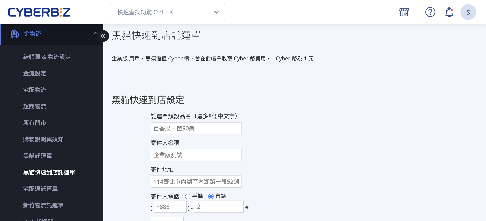
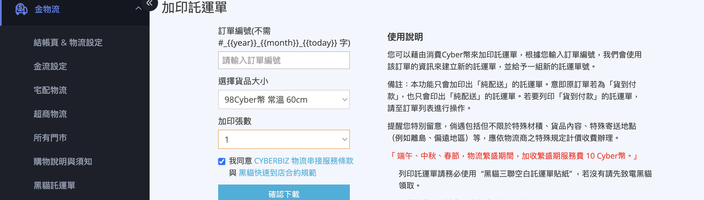
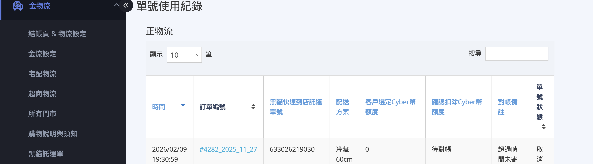

黑貓快速到店託運單完整指南，包含設定寄件人資訊、加印純配送託運單，以及查詢託運單號使用紀錄與 CYBER 幣扣款對帳。
{ .subtitle }

{ .hero-page }

## 黑貓快速到店託運單頁面說明 { #intro-ezcat-cvs-shipping-note }

「黑貓快速到店託運單」頁面是您管理 **黑貓宅急便—快速到店(超商取貨)** 寄件資料、加印託運單與查詢扣款紀錄的單一入口。後台路徑為 **金物流 >
黑貓快速到店託運單** 。

!!! path "後台路徑：金物流 > 黑貓快速到店託運單"

頁面整合下列商家最常用的動作，並提供一份歷史紀錄供您核對 CYBER 幣扣抵情形:

* **黑貓快速到店設定**:設定寄件人姓名、寄件地址、聯絡電話與託運單預設品名，後續所有託運單會自動代入。
* **加印託運單**:以 CYBER 幣為單筆訂單再列印一張或多張「純配送」託運單。
* **單號使用紀錄**:列出本店所有黑貓快速到店託運單與 CYBER 幣扣抵金額，供對帳查詢。

!!! info "提示"
    此頁僅適用於 **黑貓快速到店(超商取貨)** 託運單。如需操作 **黑貓宅急便(宅配)** 託運單，請改至[設定與加印黑貓託運單](設定與加印黑貓託運單.md)頁面。

---

## 頁面區塊總覽 { #ezcat-cvs-shipping-note-overview }

| 區塊 | 用途 | 觸發時機 |
| :-- | :-- | :-- |
| [黑貓快速到店設定][configure-ezcat-cvs-shipping-note-sender-setup] | 設定寄件人姓名、地址、聯絡電話與託運單預設品名 |
首次使用、寄件人資訊變更 |
| [加印託運單][ezcat-cvs-shipping-note-create] | 針對單一訂單再列印 1 至 8 張「純配送」託運單 | 需分箱寄送、託運單損毀重印 |
| [單號使用紀錄][ezcat-cvs-shipping-note-usage-records] | 列出本店所有黑貓快速到店託運單與扣抵金額 | 對帳、查詢單號狀態 |

!!! plan "方案 / 加值功能"
  * **黑貓快速到店—常溫**:需店家方案內含「黑貓快速到店—常溫」功能; **專業、專業 PLUS、進階、進階 PLUS、高手、高手 PLUS、企業**
等方案皆已內含。
  * **黑貓快速到店—冷凍 / 
冷藏**:需店家方案內含「黑貓快速到店—冷凍」或「黑貓快速到店—冷藏」功能，方案開通內容同上。若入口未顯示對應溫層的規格選項，請聯繫您的
CYBERBIZ 業務窗口確認方案開通狀態。

---

## 計費規則 { #ezcat-cvs-shipping-note-billing }

黑貓快速到店託運單採 **CYBER 幣預扣** 制，於列印當下即時扣抵。

### 基本費率 { #ezcat-cvs-shipping-note-rate }

各尺寸 / 溫層的基準扣抵金額，請參閱:

* [黑貓快速到店費用對照表][reference-ezcat-cvs-fee-table]

實際扣抵以您後台「選擇貨品大小」下拉選單顯示的金額為準。

**若您與 CYBERBIZ 已協議客製費率，系統會自動套用** 。下拉選單格式為 `OO CYBER幣 規格名稱 促銷訊息` ，促銷期間會額外標示。

---

### 額外費用 { #ezcat-cvs-shipping-note-surcharge }

下列情境會在原扣抵金額之外再加收 CYBER 幣:

| 情境 | 加收 CYBER 幣 | 說明 |
| :-- | :-- | :-- |
| 託運單溫層與實際寄送不符 | 每張 +50 | 列印常溫卻以低溫寄送，或列印低溫卻以常溫寄送，作為帳務處理費 |
| 物流繁盛期 | 每張 +10 | 端午、中秋、春節期間，黑貓收取繁盛期服務費 |

!!! tip "技巧"
    加印託運單會 **以您頁面上方顯示的 CYBER 幣餘額即時檢查** ，CYBER 幣不足時系統會擋下並提醒儲值。請至「儲值中心」[儲值](../website-management/CYBER%20幣儲值中心使用指南.md){ data-preview
  }後再回此頁操作。

---

### 託運單貼紙規定 { #ezcat-cvs-shipping-note-sticker }

列印託運單請務必使用 **「黑貓三聯空白託運單貼紙」** 。如未持有，請先致電黑貓客服索取。使用其他規格紙張可能造成黑貓系統無法掃描。

## 設定寄件人資訊 { #configure-ezcat-cvs-shipping-note-sender-setup }

首次使用黑貓快速到店託運單功能前， **必須** 完成「黑貓快速到店設定」區塊。寄件人姓名、地址、電話會被代入後續所有託運單。

1. **進入頁面** :登入後台，前往 **金物流 > 黑貓快速到店託運單** 。
2. **填寫託運單預設品名** :在「託運單預設品名(最多 8 個中文字)」輸入框中，填入您要列印在託運單上的品名(例如「網購商品」)。
3. **填寫寄件人名稱** :在「寄件人名稱」欄位輸入寄件人姓名[^1]。
4. **填寫寄件地址** :在「寄件地址」欄位輸入完整寄件地址， **配送失敗(顧客拒收、超商未領取)的包裹會自動退回此地址** 。
5. **選擇寄件人電話類型** :點選 **手機** 或 **市話** 。
  * 手機:於 `0988111222` 格式輸入框直接填入手機號碼。
  * 市話:依序填入 **區碼** (例 `02` )、 **電話號碼** (例 `23112244` )、 **分機** (可空白)。
6. **填寫逆物流地址** :在「逆物流地址」欄位輸入退貨包裹的收件地址。此欄位僅供未來退件作業使用，不影響此頁的加印與寄件流程;若您同時使用其
他黑貓物流功能，請一併填寫。
7. **儲存設定** :點擊 **確認** 按鈕。畫面跳出「已成功變更設定」即代表完成。

[^1]: 寄件人名稱不得含特殊符號;若儲存時系統提示錯誤訊息，請依提示移除無效字元後再試。

## 加印託運單 { #ezcat-cvs-shipping-note-create }

「加印」是針對 **已存在於系統的訂單** ，再產生額外的託運單號;典型情境為一筆訂單需分多箱寄送、或原本的託運單損毀需重新列印。

### 適用條件 { #prerequisites-ezcat-cvs-shipping-note-create }

每張加印託運單會即時扣抵 CYBER 幣，系統會在送出前進行下列檢查，任一項不符即會中止:

| 條件 | 系統要求 |
| :-- | :-- |
| 訂單存在 | 須輸入正確的訂單編號(不含店家編號前綴) |
| 訂單配送方式 | 必須為 **黑貓快速到店—常溫** 、 **黑貓快速到店—冷凍** 或 **黑貓快速到店—冷藏** (含先付 /
貨到付款兩種變體);其他物流無法加印 |
| 訂單付款狀態 | 必須為 **已付款** 或 **貨到付款** |
| CYBER 幣餘額 | 須大於「每張費用 × 加印張數」 |
| 加印張數 | 最多 **8 張** |
| 規格溫層相符 | 加印選擇的溫層必須與原訂單的溫層相符(常溫訂單只能加印常溫、冷凍訂單只能加印冷凍、冷藏訂單只能加印冷藏) |

!!! note "註釋"
  若原訂單為「貨到付款」，加印僅會印出 **「純配送」**
託運單;若您需要列印「貨到付款」的託運單(可向收件人代收貨款)，請至訂單詳情頁操作，本頁不支援。

---

### 操作步驟 { #operate-ezcat-cvs-shipping-note-create }

1. **進入頁面** :登入後台，前往 **金物流 > 黑貓快速到店託運單** ，捲動至「加印託運單」區塊。
2. **填入訂單編號** :在「訂單編號」欄位，輸入要加印的訂單編號(系統提示框會顯示您店家的訂單編號格式前綴， **不需重複輸入** )。
3. **選擇貨品大小** :於下拉選單選擇對應的 **常溫 / 冷凍 / 冷藏 + 尺寸** 規格，選項旁會即時顯示扣抵的 CYBER
幣金額。下拉選項依您方案內含的溫層動態顯示，且必須與原訂單的溫層相符。
4. **選擇加印張數** :在下拉選單選擇要列印的張數(1 至 8 張)。
5. **勾選同意條款** :勾選「我同意 CYBERBIZ 物流串接服務條款 與 黑貓快速到店合約規範」核取方塊， **確認下載** 按鈕方會啟用。
6. **點擊確認下載** :點擊 **確認下載** 按鈕，系統會彈出確認視窗顯示「確認要消費 Cyber 幣列印黑貓快速到店託運單?」並列出本次扣抵金額。
7. **再次確認** :於確認視窗點擊 **確認** ，系統開始向黑貓索取單號並產生 PDF。
8. **取得託運單 PDF** :系統會自動下載託運單 PDF，並向黑貓索取一組全新單號(每張加印託運單為獨立新單號[^2])。
9. **列印** :使用 **黑貓三聯空白託運單貼紙** 列印 PDF，並交由黑貓司機或自行送至營業所。

!!! tip "技巧"
  系統會依您 **上一次加印** 的規格自動預選下拉選單;若同一店家經常列印同一規格，可省下重複操作。

[^2]: 系統會依加印張數逐張向黑貓索取全新單號(同一筆訂單的 N 張加印 = N 個獨立新單號)。

---

## 查詢紀錄與對帳 { #ezcat-cvs-shipping-note-records }

頁面下方提供「單號使用紀錄」表，可使用右上角搜尋框關鍵字過濾，點擊欄位標題可切換排序。

### 單號使用紀錄 { #ezcat-cvs-shipping-note-usage-records }

紀錄本店所有黑貓快速到店託運單的扣抵情形與單號狀態。

| 欄位 | 說明 |
| :-- | :-- |
| 時間 | 託運單建立時間 |
| 訂單編號 | 對應訂單編號，點擊可跳至訂單詳情頁;若訂單已刪除會顯示「訂單已刪除」 |
| 黑貓快速到店託運單號 | 黑貓配給的託運單號 |
| 配送方案 | 託運單規格(例:黑貓快速到店—常溫 60cm) |
| 客戶選定 CYBER 幣額度 | 當下下載時所選的扣抵金額 |
| 確認扣除 CYBER 幣額度 | 實際對帳後最終扣除的 CYBER 幣金額 |
| 對帳備註 | 系統或客服備註，多為客服協助處理時的內部說明 |
| 單號狀態 | 託運單目前狀態(已使用、待寄件等) |

!!! note "註釋"
  * 「客戶選定 CYBER 幣額度」與「確認扣除 CYBER 幣額度」差值會發生於 [額外費用][ezcat-cvs-shipping-note-surcharge] 情境(溫層誤標
+50、繁盛期 +10 等)。
  * 黑貓快速到店託運單 **固定為不可轉單** ;每次加印或出貨都會向黑貓索取全新單號。

## 後續操作

- :lucide-wallet:{ .lg }
[__CYBER 幣儲值__](../website-management/CYBER 幣儲值中心使用指南.md){ data-preview }
加印託運單會即時扣抵 CYBER 幣，餘額不足時系統將擋下操作，請先至儲值中心儲值。

- :lucide-truck:{ .lg }
[__設定與加印黑貓託運單__](設定與加印黑貓託運單.md){ data-preview }
若您同時使用黑貓 **宅配** ，請至黑貓託運單頁面設定寄件人資訊與加印宅配託運單。

## 常見問題 { #faq-ezcat-cvs-shipping-note }

??? quote "「加印託運單」按鈕點不下去 / 灰色"
    #### 加印託運單按鈕灰色 { #faq-ezcat-cvs-shipping-note-button-disabled } { .hidden-header }
    請先勾選下方的 **「我同意 CYBERBIZ 物流串接服務條款 與 黑貓快速到店合約規範」** ;同意條款後 **確認下載** 按鈕才會啟用。

??? quote "顯示「該訂單尚未付款」或「請輸入正確的訂單編號」"
    #### 訂單編號或付款狀態錯誤 { #faq-ezcat-cvs-shipping-note-order-status } { .hidden-header }
    可能原因:

    * 訂單編號輸入錯誤，或誤帶入店家編號前綴(欄位旁的提示文字顯示前綴， **不需手動輸入** )。
    * 訂單尚未付款，加印僅支援 **已付款** 或 **貨到付款** 訂單。
    * 該訂單的配送方式不是「黑貓快速到店」，本頁僅支援黑貓快速到店訂單。

??? quote "顯示「此訂單運送方式非黑貓快速到店，不可加印」"
    #### 訂單運送方式不符 { #faq-ezcat-cvs-shipping-note-shipping-type-not-match } { .hidden-header }
    訂單的配送方式不是 **黑貓快速到店—常溫 / 冷凍 / 冷藏** (含先付 /
  貨到付款兩種變體)。例如訂單原本走宅配、其他超商、自訂出貨等，皆無法在此頁加印;宅配請至 [設定與加印黑貓託運單](設定與加印黑貓託運單.md){
  data-preview }頁面操作。

??? quote "顯示「黑貓快速到店—XX 的訂單只能選擇 XX 的溫層」"
    #### 溫層規格不符 { #faq-ezcat-cvs-shipping-note-rate-mismatch } { .hidden-header }
    加印選擇的溫層必須與原訂單的溫層相符:

    * **常溫** 訂單只能加印 **常溫** 規格。
    * **冷凍** 訂單只能加印 **冷凍** 規格。
    * **冷藏** 訂單只能加印 **冷藏** 規格。

    請於下拉選單重新選擇對應的溫層;若下拉選單沒有對應溫層，代表您方案未開通該溫層，請聯繫 CYBERBIZ 業務窗口確認。

??? quote "顯示「餘額不足，請至儲值中心進行儲值」"
    #### CYBER 幣不足 { #faq-ezcat-cvs-shipping-note-points-insufficient } { .hidden-header }
    您的 CYBER 幣餘額小於「每張費用 × 加印張數」。請至 **後台面板 > 儲值中心** 完成
  [儲值](../website-management/CYBER%20幣儲值中心使用指南.md){ data-preview }後再回此頁操作。頁面上方藍色數字即為目前餘額。

??? quote "為什麼貨到付款訂單加印後變成「純配送」?"
    #### 加印只印純配送 { #faq-ezcat-cvs-shipping-note-cod-not-supported } { .hidden-header }
    **加印託運單功能僅會印出「純配送」單號**
  ，不會將代收貨款金額綁到新單上。若您需要分箱且仍要黑貓代收貨款，請至訂單詳情頁操作出貨，並聯繫客服協助。

??? quote "下載後託運單 PDF 沒跳出來"
    #### PDF 沒下載 { #faq-ezcat-cvs-shipping-note-pdf-missing } { .hidden-header }
    可能原因:

    * 瀏覽器封鎖了自動下載，請允許本網站的「自動下載多個檔案」權限後重試。
    * 託運單仍在背景產生中;請耐心等待，期間勿關閉頁面。
    * 若超過數分鐘仍無回應，可至「單號使用紀錄」確認單號是否已產生，並聯繫 CYBERBIZ 客服協助補發。

??? quote "託運單下載後可以修改規格或地址嗎?"
    #### 託運單下載後修改 { #faq-ezcat-cvs-shipping-note-edit-after-download } { .hidden-header }
    不可以。已下載的託運單無法在系統內修改，需在託運單上 **手寫更正**
  ，並於交件時告知黑貓司機。若規格或地址完全錯誤，建議於「單號使用紀錄」確認該單號狀態後，聯繫 CYBERBIZ 客服協助作廢並重新申請。

??? quote "顯示「網路不穩，請稍後重試」"
    #### 網路不穩 { #faq-ezcat-cvs-shipping-note-bad-reception } { .hidden-header }
    與黑貓系統連線暫時失敗。請稍後再試;若多次重試仍失敗，可至「單號使用紀錄」確認單號是否已產生(避免重複扣抵 CYBER 幣)後，再決定是否重試。

## 參考資料 { #ezcat-cvs-shipping-note-references }

* [黑貓快速到店費用對照表][reference-ezcat-cvs-fee-table]{ data-preview }

### 黑貓快速到店費用對照表 { #reference-ezcat-cvs-fee-table }

本對照表列出 **黑貓快速到店(超商取貨)** 託運單各規格的 CYBER
幣扣抵金額，供商家估算列印成本參考。實際扣抵以後台「選擇貨品大小」下拉選單顯示為準。

| 溫層 | 60cm | 90cm | 105cm | 繁盛期 加收[^1] | 帳務處理費(若適用)[^2] |
| :-- | --: | --: | --: | --: | --: |
| 常溫 | 98 | 123 | 168 | +10 | +50 |
| 冷凍 | 177 | 242 | 310 | +10 | +50 |
| 冷藏 | 177 | 242 | 310 | +10 | +50 |

!!! note "註釋"
    * 金額均為 **CYBER 幣** ， **含稅** 。
    * **重量限制 20kg 內** 。
    * 黑貓快速到店因受超商貨架限制，僅提供 **60cm、90cm、105cm** 三個尺寸，無 120cm 以上規格(此為本頁與「黑貓宅配」最大差異之一)。
    * 若您的店家與 CYBERBIZ 已協議客製費率，系統會自動套用，實際扣抵以後台下拉選單顯示為準。
    * **促銷期間** 部分尺寸會有優惠價，下拉選單會額外標示促銷訊息;系統會自動以優惠價扣抵。

[^1]: **物流繁盛期** (端午、中秋、春節)加收繁盛期服務費 **10 CYBER 幣** 。
[^2]: 列印託運單時若實際寄送溫層與標示不符(常溫單寄低溫，或低溫單寄常溫)，每張加收 **50 CYBER 幣** 作為帳務處理費。

