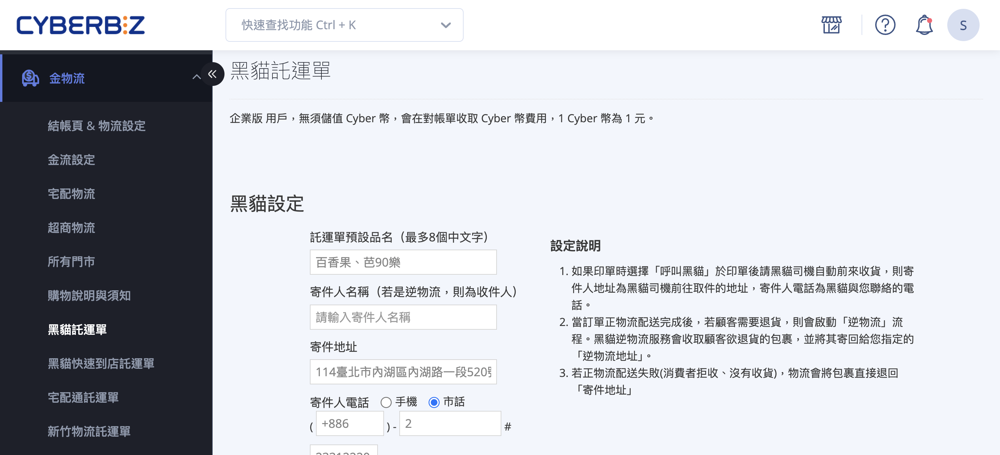
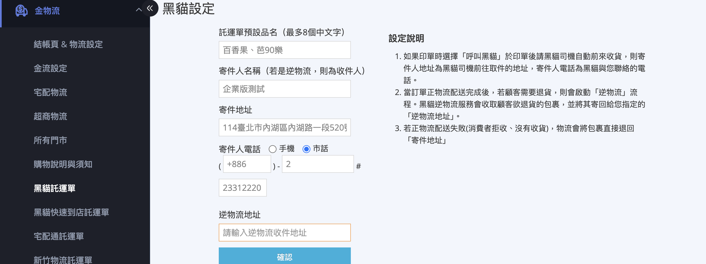
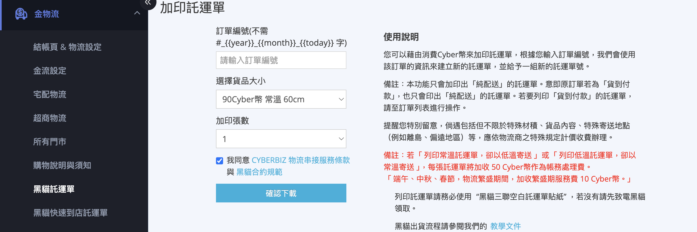
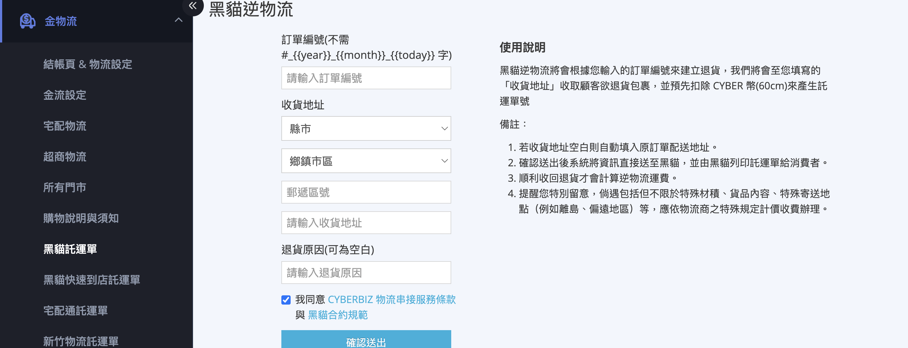
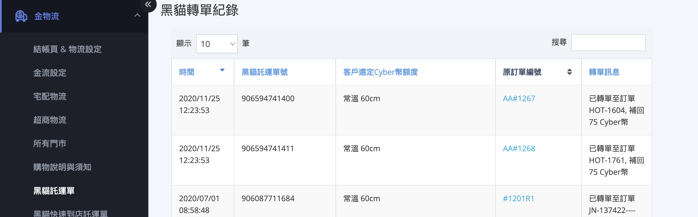
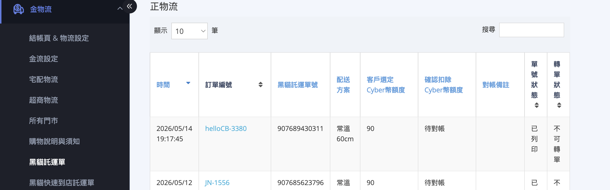

黑貓宅急便託運單完整指南，包含設定寄件人資訊、加印純配送託運單、建立黑貓逆物流退貨取件，以及查詢託運單號使用紀錄與 CYBER 幣扣款對帳。
{ .subtitle }

{ .hero-page }

## 黑貓託運單頁面說明 { #intro-ezcat-shipping-note }

「黑貓託運單」頁面是您管理 **黑貓宅急便** 寄件資料、加印託運單、建立逆物流以及查詢扣款紀錄的單一入口。後台路徑為 **金物流 > 黑貓託運單** 。

頁面整合下列三項商家最常用的動作，並提供兩份歷史紀錄供您核對 CYBER 幣扣抵情形:

* **設定寄件人資訊**：將會帶入正物流出貨與逆物流取件單上。
* **加印託運單**：以 CYBER 幣為單筆訂單再列印一張或多張「純配送」託運單。
* **建立黑貓逆物流**：由黑貓上門至顧客處收件並寄回您指定的逆物流地址。

!!! info "提示"
    此頁僅適用於 **黑貓宅急便(宅配)** 託運單。如需操作 **黑貓快速到店(常溫 / 冷藏 / 冷凍)** 託運單，請改至「黑貓快速到店託運單」頁面。

---

## 頁面區塊總覽 { #ezcat-shipping-note-overview }

| 區塊 | 用途 | 觸發時機 |
| :-- | :-- | :-- |
| [黑貓設定][configure-ezcat-shipping-note-sender-setup] | 設定寄件人姓名、地址、聯絡電話與逆物流收件地址 | 首次使用、寄件人資訊變更 |
| [加印託運單][ezcat-shipping-note-create] | 針對單一訂單再列印 1 至 8 張「純配送」託運單 | 需分箱寄送、託運單損毀重印 |
| [黑貓逆物流][ezcat-shipping-note-reverse] | 由黑貓上門至顧客處取件並送回您的逆物流地址 | 顧客退貨且訂單已出貨 |
| [黑貓轉單紀錄][ezcat-shipping-note-transfer-records] | 系統自動將原訂單未使用的單號轉用至新訂單的歷程 | 對帳查詢用 |
| [單號使用紀錄(正物流)][ezcat-shipping-note-usage-records] | 列出本店所有黑貓宅急便正物流託運單與扣抵金額 | 對帳、查詢轉單狀態 |
| [單號使用紀錄(逆物流)][ezcat-shipping-note-usage-records] | 列出本店所有黑貓宅急便逆物流託運單與扣抵金額 | 對帳、查詢轉單狀態 |

!!! plan "方案 / 加值功能"
    * **黑貓宅配**：需店家方案內含「黑貓宅配」功能；若入口未顯示，請聯繫您的 CYBERBIZ 業務窗口確認方案開通狀態。
    * **[呼叫黑貓](../orders/自動呼叫黑貓司機取件.md){ data-preview }** (加值功能)：啟用後，加印託運單時可選擇「呼叫黑貓」，由黑貓司機自動到府取件；未開通則需自行交件。

---

## 計費規則 { #ezcat-shipping-note-billing }

黑貓託運單採 **CYBER 幣預扣** 制，於列印或建立逆物流時即時扣抵。

### 基本費率 { #ezcat-shipping-note-rate }

各尺寸 / 溫層的基準扣抵金額，請參閱:

* [黑貓託運單規格與費用對照表][reference-ezcat-fee-table]

實際扣抵以您後台「選擇貨品大小」下拉選單顯示的金額為準。

**若您與 CYBERBIZ 已協議客製費率，系統會自動套用** 。下拉選單格式為 `OO CYBER幣 規格名稱 促銷訊息` ，促銷期間會額外標示。

---

### 額外費用 { #ezcat-shipping-note-surcharge }

下列情境會在原扣抵金額之外再加收 CYBER 幣：

| 情境 | 加收 CYBER 幣 | 說明 |
| :-- | :-- | :-- |
| 託運單溫層與實際寄送不符 | 每張 +50 | 列印常溫卻以低溫寄送，或列印低溫卻以常溫寄送，作為帳務處理費 |
| 物流繁盛期 | 每張 +10 | 端午、中秋、春節期間，黑貓收取繁盛期服務費 |
| 逆物流低溫 / 偏遠 / 特殊材積 | 依黑貓規定 | 順利收回後依黑貓實際計價 |

!!! tip "技巧"
    加印託運單會 **以您頁面上方顯示的 CYBER 幣餘額即時檢查** ，CYBER 幣不足時系統會擋下並提醒儲值。請至「儲值中心」[儲值][operate-cyber-coin-deposit]{ data-preview }後再回此頁操作。

---

### 託運單貼紙規定 { #ezcat-shipping-note-sticker }

列印託運單請務必使用 **「黑貓三聯空白託運單貼紙」** 。如未持有，請先致電黑貓客服索取。使用其他規格紙張可能造成黑貓系統無法掃描。

## 設定寄件人資訊 { #configure-ezcat-shipping-note-sender-setup }

首次使用黑貓託運單功能前，**必須** 完成「黑貓設定」區塊。寄件人姓名、地址、電話會被代入後續所有正物流與逆物流託運單。

1. **進入頁面**：登入後台，前往 **金物流 > 黑貓託運單** 。
2. **填寫託運單預設品名**：在「託運單預設品名(最多8個中文字)」輸入框中，填入您要列印在託運單上的品名(例如「網購商品」)。
3. **填寫寄件人名稱**：在「寄件人名稱」欄位輸入寄件人姓名[^1]；此名稱在 **逆物流** 時會作為 **收件人** 使用。
4. **填寫寄件地址**：在「寄件地址」欄位輸入完整寄件地址，**正物流配送失敗(顧客拒收、未收貨)包裹會自動退回此地址** 。
5. **選擇寄件人電話類型**：點選 **手機** 或 **市話** 。
    * 手機：於 `0988111222` 格式輸入框直接填入手機號碼。
    * 市話：依序填入 **區碼** (例 `02` )、 **電話號碼** (例 `23112244` )、 **分機** (可空白)。
6. **填寫逆物流地址**：在「逆物流地址」欄位輸入退貨包裹的收件地址。可與寄件地址相同，也可分開設定。
7. **儲存設定**：點擊 **確認** 按鈕。畫面跳出「已成功變更設定」即代表完成。

!!! note "註釋"
    「[呼叫黑貓](../orders/自動呼叫黑貓司機取件.md){ data-preview }」加值功能啟用時，寄件人地址會作為 **黑貓司機到府取件的地址** ，寄件人電話會作為 **黑貓與您聯絡的電話** 。

[^1]: 寄件人名稱不得含特殊符號；若儲存時提示「收件人名稱...」錯誤訊息，請依提示移除無效字元後再試。

## 加印託運單 { #ezcat-shipping-note-create }

「加印」是針對 **已存在於系統的訂單** ，再產生額外的託運單號；典型情境為一筆訂單需分多箱寄送、或原本的託運單損毀需重新列印。

### 適用條件 { #prerequisites-ezcat-shipping-note-create }

每張加印託運單會即時扣抵 CYBER 幣，系統會在送出前進行下列檢查，任一項不符即會中止：

| 條件 | 系統要求 |
| :-- | :-- |
| 訂單存在 | 須輸入正確的訂單編號(不含店家編號前綴) |
| 訂單配送方式 | 必須為 **黑貓宅急便** 或 **黑貓貨到付款** ；其他物流(超商、自訂、快速到貨等)無法加印 |
| 訂單付款狀態 | 必須為 **已付款** 或 **貨到付款** |
| CYBER 幣餘額 | 須大於「每張費用 × 加印張數」 |
| 加印張數 | 最多 **8 張** |

!!! note "註釋"
    若原訂單為「貨到付款」，加印僅會印出 **「純配送」** 託運單；若您需要列印「貨到付款」的託運單(可向收件人代收貨款)，請至訂單詳情頁操作，本頁不支援。

---

### 操作步驟 { #operate-ezcat-shipping-note-create }

1. **進入頁面**：登入後台，前往 **金物流 > 黑貓託運單**，捲動至「加印託運單」區塊。
2. **填入訂單編號**：在「訂單編號」欄位，輸入要加印的訂單編號(系統提示框會顯示您店家的訂單編號格式前綴，**不需重複輸入** )。
3. **選擇貨品大小**：於下拉選單選擇對應的 **常溫 / 低溫 + 尺寸** 規格，選項旁會即時顯示扣抵的 CYBER 幣金額。
4. **選擇加印張數**：在下拉選單選擇要列印的張數(1 至 8 張)。
5. **勾選同意條款**：勾選「我同意 CYBERBIZ 與黑貓的物流條款」核取方塊，**確認下載** 按鈕方會啟用。
6. **點擊確認下載**：點擊 **確認下載** 按鈕，系統會彈出確認視窗顯示「確認要消費 CYBER 幣列印黑貓託運單?」並列出本次扣抵金額。
7. **(低溫貨品)選擇溫層與易碎標示**：若您在步驟 3 選擇低溫規格，確認視窗會多出 **是否為冷藏?** 、 **是否為冷凍?** 、 **是否為易碎?** 三個核取方塊。請依實際包裹狀況勾選。
    * 「冷藏」與「冷凍」不可同時勾選，系統會自動排除。
    * 勾選結果會印在託運單的右上角(冷藏 / 冷凍)與右下角(易碎)。
8. **再次確認**：於確認視窗點擊 **確認** ，系統開始向黑貓索取單號並產生 PDF。
9. **取得託運單 PDF**：系統會自動下載託運單 PDF，並向黑貓索取一組全新單號（每張加印託運單為獨立新單號[^5]）。
10. **列印**：使用 **黑貓三聯空白託運單貼紙** 列印 PDF，並交由黑貓司機或自行送至營業所。

!!! tip "技巧"
    系統會依您 **上一次加印** 的規格，自動預選下拉選單；若同一店家經常列印同一規格，可省下重複操作。

[^5]: 系統會依加印張數逐張向黑貓索取全新單號（同一筆訂單的 N 張加印 = N 個獨立新單號）

---

## 建立黑貓逆物流 { #ezcat-shipping-note-reverse }

「逆物流」是由黑貓上門至 **顧客指定地址** 收取退貨包裹，送回您於「黑貓設定」填寫的逆物流地址。送出後，**黑貓會列印託運單交給消費者** ，您不需印單。

### 適用條件 { #ezcat-shipping-note-reverse-prerequisites }

| 條件 | 系統要求 |
| :-- | :-- |
| 已完成黑貓設定 | 寄件人區碼必須存在(來自 [設定寄件人資訊][configure-ezcat-shipping-note-sender-setup]的寄件地址) |
| 訂單存在 | 訂單編號正確 |
| 非 POS 訂單 | 門市 POS 訂單無法於此頁面建立逆物流 |
| 訂單配送狀態 | 須為 **已出貨** 或更後階段；尚未出貨、準備出貨的訂單不允許 |
| 收貨地址有效 | 收貨地址須能查到郵遞區碼；查無區碼時會中止並提醒修改 |

---

### 操作步驟 { #ezcat-shipping-note-reverse-steps }

1. **進入頁面**：登入後台，前往 **金物流 > 黑貓託運單**，捲動至「黑貓逆物流」區塊。
2. **填入訂單編號**：在「訂單編號」欄位輸入要建立退貨的訂單編號(不含前綴)。
3. **填寫收貨地址**：
    * **若收貨地址與原訂單配送地址相同**：可直接 **留白** ，系統會自動帶入原配送地址。
    * **若不同**：使用下拉選單依序選擇 **縣市 > 鄉鎮市區 > 郵遞區號** ，然後在右側輸入框補上詳細地址(街道、巷弄、樓層)。
4. **填寫退貨原因(可空白)**：於「退貨原因」欄位輸入文字說明，作為內部紀錄。
5. **勾選同意條款**：勾選「我同意 CYBERBIZ 與黑貓的物流條款」核取方塊。
6. **點擊確認送出**：點擊 **確認送出** 按鈕，系統會彈出確認視窗，顯示「將會扣除最低費用 **常溫 60cm** CYBER 幣[^2]」字樣。
7. **再次確認**：於確認視窗點擊 **確認** ，系統將資訊送至黑貓並等待回覆。
8. **完成**：成功後畫面會顯示扣抵 CYBER 幣金額與剩餘餘額，該筆紀錄會出現在下方「[單號使用紀錄(逆物流)][ezcat-shipping-note-usage-records]」表格中。

!!! info "提示"
    系統送出後，**黑貓會直接列印託運單給消費者** ，您與消費者皆不需印單。

[^2]: 建立逆物流時 **預扣最低費用「常溫 60cm」**；**順利收回退貨後** 系統會依黑貓實際計算的尺寸與溫層補扣或維持原扣抵金額。

## 查詢紀錄與對帳 { #ezcat-shipping-note-records }

頁面下方提供三份歷史紀錄表，所有資料皆可使用右上角搜尋框關鍵字過濾，點擊欄位標題可切換排序。

### 黑貓轉單紀錄 { #ezcat-shipping-note-transfer-records }

!!! info "提示"
      黑貓宅配商已不再支援託運單轉單機制，新的加印與出貨操作一律向黑貓索取新單號；本表僅列出停用前所累積的歷史紀錄，新操作不會再產生新資料。

呈現過去系統將「未使用之黑貓單號」自動沿用至新訂單的歷史紀錄，作為對帳查詢用。

| 欄位 | 說明 |
| :-- | :-- |
| 時間 | 轉單發生的日期與時間 |
| 黑貓託運單號 | 該筆被轉用的黑貓託運單號 |
| 客戶選定 CYBER 幣額度 | 當初下載託運單時客戶選擇的扣抵金額 |
| 原訂單編號 | 原本綁定該單號的訂單，點擊可跳至訂單詳情頁 |
| 轉單訊息 | 轉單過程的系統備註 |

---

### 單號使用紀錄(正物流 / 逆物流) { #ezcat-shipping-note-usage-records }

「正物流」記錄出貨用單號，「逆物流」記錄退貨用單號，兩者欄位相同。

| 欄位 | 說明 |
| :-- | :-- |
| 時間 | 託運單建立時間 |
| 訂單編號 | 對應訂單編號，點擊可跳至訂單詳情頁；若訂單已刪除會顯示「訂單已刪除」 |
| 黑貓託運單號 | 黑貓配給的託運單號 |
| 配送方案 | 託運單規格(例:常溫 90cm) |
| 客戶選定 CYBER 幣額度 | 當下下載時所選的扣抵金額 |
| 確認扣除 CYBER 幣額度 | 實際對帳後最終扣除的 CYBER 幣金額 |
| 對帳備註 | 系統或客服備註，多為客服協助處理時的內部說明。 |
| 單號狀態 | 託運單目前狀態(已使用、轉單、待對帳等) |
| 轉單狀態 | **可轉單** 或 **不可轉單** ，顯示該單號是否還能被自動轉用至下一筆訂單 |

!!! note "註釋"
    「客戶選定 CYBER 幣額度」與「確認扣除 CYBER 幣額度」差值會發生於 [額外費用][ezcat-shipping-note-surcharge] 情境(溫層誤標 +50、繁盛期 +10 等)。

## 後續操作

- :lucide-cog:{ .lg }  
  [__自動呼叫黑貓司機取件__](../orders/自動呼叫黑貓司機取件.md){ data-preview }  
  啟用加值功能後，加印託運單時可選擇由黑貓司機自動到府取件，不需自行交件。

- :lucide-wallet:{ .lg }  
  [__CYBER 幣儲值__](../website-management/CYBER 幣儲值中心使用指南.md){ data-preview }  
  加印託運單會即時扣抵 CYBER 幣，餘額不足時系統將擋下操作，請先至儲值中心儲值。

- :lucide-package:{ .lg }  
  [__宅配逆物流__](宅配逆物流（黑貓宅配通新竹物流）.md){ data-preview }  
  黑貓逆物流的完整退貨處理流程，適用於已出貨訂單的退貨取件。

## 常見問題 { #ezcat-shipping-note-faq }

??? quote "「加印託運單」按鈕點不下去 / 灰色"
    #### 加印託運單按鈕灰色 { #faq-ezcat-button-disabled } { .hidden-header }
    請先勾選下方的 **「我同意 CYBERBIZ 與黑貓的物流條款」** ；同意條款後 **確認下載** 按鈕才會啟用。

??? quote "顯示「該訂單尚未付款」或「請輸入正確的訂單編號」"
    #### 訂單編號或付款狀態錯誤 { #faq-ezcat-order-status } { .hidden-header }
    可能原因:

    * 訂單編號輸入錯誤，或誤帶入店家編號前綴(欄位旁的提示文字顯示前綴，**不需手動輸入** )。
    * 訂單尚未付款，加印僅支援 **已付款** 或 **貨到付款** 訂單。
    * 該訂單的配送方式不是「黑貓宅急便」或「黑貓貨到付款」，本頁僅支援黑貓宅配。

??? quote "顯示「此訂單無法加印黑貓托運單」"
    #### 訂單無法加印 { #faq-ezcat-shipping-type-not-match } { .hidden-header }
    訂單的配送方式不是 **黑貓宅急便** 或 **黑貓貨到付款** 。例如訂單原本走超商、自訂出貨、快速到貨等，皆無法在此頁加印黑貓單。

??? quote "顯示「CYBER 幣不足，請至儲值中心進行儲值」"
    #### CYBER 幣不足 { #faq-ezcat-points-insufficient } { .hidden-header }
     您的 CYBER 幣餘額小於「每張費用 × 加印張數」。請至 **後台面板 > 儲值中心** 完成[儲值](../website-management/CYBER%20幣儲值中心使用指南.md){ data-preview }後再回此頁操作。頁面上方藍色數字即為目前餘額。

??? quote "為什麼貨到付款訂單加印後變成「純配送」?"
    #### 加印只印純配送 { #faq-ezcat-cod-not-supported } { .hidden-header }
    **加印託運單功能僅會印出「純配送」單號** ，不會將代收貨款金額綁到新單上。若您需要分箱且仍要黑貓代收貨款，請至訂單詳情頁操作出貨，並聯繫客服協助。

??? quote "建立逆物流時顯示「缺少寄件人區碼」"
    #### 缺少寄件人區碼 { #faq-ezcat-reverse-no-suda5 } { .hidden-header }
    您尚未在 **黑貓設定** 區塊填寫寄件地址，或填寫的地址系統無法解析郵遞區碼。請回到頁面最上方的「黑貓設定」確認寄件地址正確並重新儲存。

??? quote "建立逆物流時顯示「建立逆物流失敗，此筆訂單未出貨」"
    #### 訂單未出貨無法逆物流 { #faq-ezcat-reverse-unshipped } { .hidden-header }
    逆物流僅適用於 **已出貨** 的訂單。配送狀態為「未出貨」或「準備出貨」的訂單，請改至訂單詳情頁直接取消或退款，**不需** 走逆物流流程。

??? quote "建立逆物流時顯示「POS 訂單不支援線上退貨」"
    #### POS 訂單不支援 { #faq-ezcat-reverse-pos } { .hidden-header }
    門市 POS 系統的訂單無法在此頁建立黑貓逆物流。請於門市 POS 端依退貨流程處理。

??? quote "下載後託運單 PDF 沒跳出來"
    #### PDF 沒下載 { #faq-ezcat-pdf-missing } { .hidden-header }
    可能原因:

    * 瀏覽器封鎖了自動下載，請允許本網站的「自動下載多個檔案」權限後重試。
    * 託運單仍在背景產生中(系統每 10 秒檢查一次)；請耐心等待，期間勿關閉頁面。
    * 若超過數分鐘仍無回應，可至「單號使用紀錄」確認單號是否已產生，並聯繫 CYBERBIZ 客服協助補發。

??? quote "託運單下載後可以修改地址嗎?"
    #### 託運單下載後改地址 { #faq-ezcat-edit-address } { .hidden-header }
    不可以。已下載的託運單地址無法在系統內修改，需在託運單上 **手寫更正** ，並於交件時告知黑貓司機。若地址完全錯誤，建議於「單號使用紀錄」確認該單號狀態後，聯繫 CYBERBIZ 客服協助作廢並重新申請。

??? quote "加印好的託運單，黑貓司機要怎麼來收件？"
    #### 加印託運單的取件方式 { #faq-ezcat-reprint-pickup } { .hidden-header }
    加印託運單頁面本身沒有「自動呼叫司機」選項。若您希望黑貓司機到府收取這些包裹，請擇一處理：

    * 同一天在「訂單列表」對任一筆當日要出貨的訂單啟用 [自動呼叫黑貓司機取件](../orders/自動呼叫黑貓司機取件.md){ data-preview }；司機到場後會一併收走當天所有待寄包裹（含加印的部分），不需逐張綁定託運單。
    * 自行致電黑貓客服安排取件，或將包裹送至黑貓營業所交件。

## 參考資料 { #ezcat-shipping-note-references }

### 費用對照表 { #reference-ezcat-fee-table}

本對照表列出 **黑貓宅急便(宅配)** 託運單各規格的 CYBER 幣扣抵金額，供商家估算列印成本參考。實際扣抵以後台「選擇貨品大小」下拉選單顯示為準。

=== "一般版"

    商家未與 CYBERBIZ 簽訂客製費率合約時適用。

    | 材積 | 常溫 | 低溫(冷藏／冷凍) | 繁盛期 加收[^3] | 帳務處理費(若適用)[^4] |
    | :-- | --: | --: | --: | --: |
    | 60cm | 95 | 160 | +10 | +50 |
    | 90cm | 130 | 215 | +10 | +50 |
    | 120cm | 180 | 290 | +10 | +50 |
    | 150cm | 220 | — | +10 | +50 |

=== "PLUS 版 / 企業版"

    訂閱 CYBERBIZ **專業 PLUS 版**、**進階 PLUS 版**、**高手 PLUS 版**、**企業版** 方案的商家適用。

    | 材積 | 常溫 本島 | 常溫 離島 | 低溫 本島 | 低溫 離島 | 繁盛期 加收[^3] | 帳務處理費(若適用)[^4] |
    | :-- | --: | --: | --: | --: | --: | --: |
    | 60cm | 90 | 225 | 160 | 265 | +10 | +50 |
    | 90cm | 124 | 285 | 215 | 345 | +10 | +50 |
    | 120cm | 171 | 325 | 290 | 405 | +10 | +50 |
    | 150cm | 209 | 365 | — | — | +10 | +50 |

!!! note "註釋"
    * 金額均為 **CYBER 幣**，且 **含稅**。
    * **無單邊長限制**；**重量限制 20kg 內**。
    * 若遇特殊材積、貨品內容、特殊寄送地點(例如離島、偏遠地區)等，應依物流商之特殊規定計價收費；詳細資訊以黑貓公告訊息為準。
    * 若您的店家與 CYBERBIZ 已協議客製費率，系統會自動套用，實際扣抵以後台下拉選單顯示為準。
    * **促銷期間** 部分尺寸會有優惠價，下拉選單會額外標示促銷訊息；系統會自動以優惠價扣抵。

[^3]: **物流繁盛期**(端午、中秋、春節)加收繁盛期服務費 **10 CYBER 幣**。
[^4]: 列印託運單時若實際寄送溫層與標示不符(常溫單寄低溫，或低溫單寄常溫)，每張加收 **50 CYBER 幣** 作為帳務處理費。
