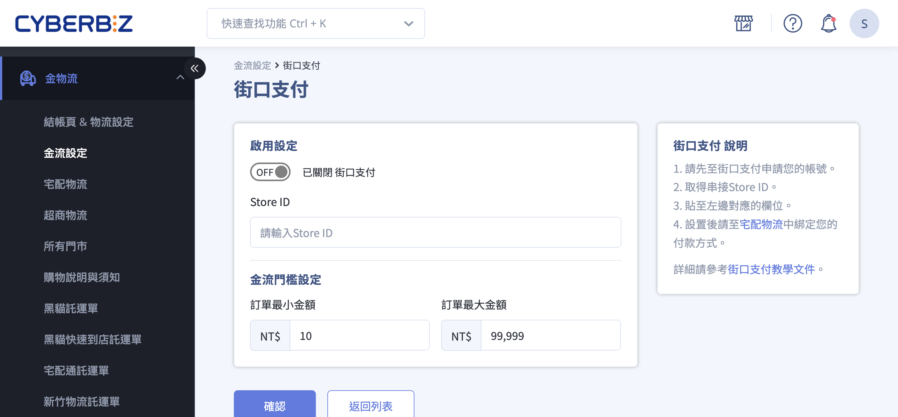
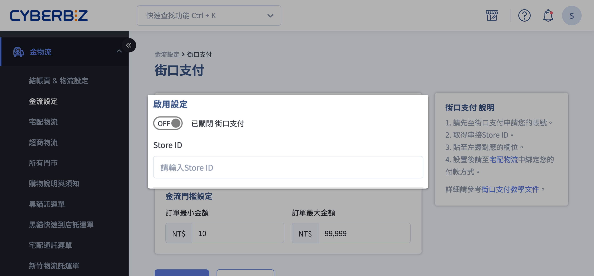

# 設定街口支付

申請街口支付帳號，並在 CYBERBIZ 後台完成串接設定。
{ .subtitle }

[:lucide-tag:{ title="適用方案" }](../../resources/conventions#適用方案) | 進階 / 高手 / 專業 PLUS / 進階 PLUS / 高手PLUS / 企業
{ .doc-badge }

{ .hero-page }

## 街口支付說明

街口支付（JKOPAY）是一個提供電子支付、街口幣及信用卡付款的第三方支付服務，支援多種交易方式並可串接電商平台進行金流管理。

### 支援支付方式

| 支付方式 | 說明 |
|----------|------|
| 街口幣支付 | 消費者可使用街口幣折抵訂單金額，折抵金額由街口支付承擔。 |
| 網銀直連 | 支援即時網路銀行轉帳(`/account_link`)，交易快速且安全。 |
| 電子支付帳戶 | 支援消費者綁定電子支付帳戶進行付款，例如 LINE Pay、街口電子帳戶。 |
| 信用卡支付 | 支援主要信用卡品牌。 |

> 詳細街口回饋方式說明請參考 [街口回饋方式簡介 :lucide-external-link:](https://www.cyberbiz.io/helpcenter/wp-content/uploads/2021/03/%E3%80%90%E8%A1%97%E5%8F%A3%E6%94%AF%E4%BB%98%E3%80%91%E8%A1%97%E5%8F%A3%E5%9B%9E%E9%A5%8B%E6%96%B9%E5%BC%8F%E7%B0%A1%E4%BB%8B.pdf)。

### 申請限制與注意事項

- **個人戶** 無法申請街口支付。
- 使用街口幣折抵訂單金額時，由街口支付承擔折抵金額。
- 申請流程約需 **1–2 週**，以街口支付官方進度為準。

## 操作步驟
  
### 步驟一：填寫申請表單

前往 [CYBERBIZ x 街口支付串接申請表單](https://docs.google.com/forms/d/e/1FAIpQLSeu-OHx8njpaQtC61vZRIpoj529BmkdRtt74490Io3u16AJ_g/viewform)，填寫完整資料。

### 步驟二：完成街口支付帳號申請

1. 提交表單後，街口支付會透過 Email 發送後續申請指引。

2. 如有問題，可聯繫街口客服：

	- 電話：02-87717000
	- Email：am@jkos.com

### 步驟三：完成 CYBERBIZ 後台串接設定

1. 收到街口支付提供的 **店鋪代碼（Store ID）**。
2. 登入 CYBERBIZ 管理後台，前往 **金物流 > 金流設定**，在 **街口支付** 區塊，點擊編輯按鈕 :material-file-document-edit-outline: 進入編輯頁面。
3. 填入 **Store ID**，完成串接上線。
4. 啟用街口支付功能。

## 後續步驟

- :lucide-badge-percent:{ .lg }   
  [__街口回饋方式__](https://www.cyberbiz.io/helpcenter/wp-content/uploads/2021/03/%E3%80%90%E8%A1%97%E5%8F%A3%E6%94%AF%E4%BB%98%E3%80%91%E8%A1%97%E5%8F%A3%E5%9B%9E%E9%A5%8B%E6%96%B9%E5%BC%8F%E7%B0%A1%E4%BB%8B.pdf)     
  街口回饋方式介紹。

- :lucide-book-text:{ .lg }     
  [__街口支付操作手冊__](https://www.cyberbiz.io/support/wp-content/uploads/%E8%A1%97%E5%8F%A3%E6%94%AF%E4%BB%98%E5%BA%97%E5%AE%B6%E5%BE%8C%E5%8F%B0%E6%93%8D%E4%BD%9C%E6%89%8B%E5%86%8A.pdf)  
  街口店家管理後台操作手冊。

- :lucide-circle-question-mark:{ .lg }   
  [__街口支付官方 FAQ__]([https://pay.line.me/portal/tw/customer/faq?categoryId=account](https://www.jkopay.com/application/faq))  
  街口支付官方彙整的常見問題。

