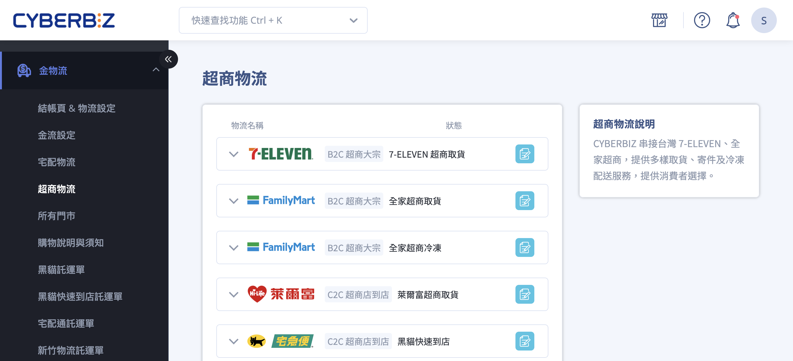

# 設定超商大宗寄倉 B2C

申請、設定超商大宗寄倉 B2C 服務。
{ .subtitle }

[:lucide-tag:{ title="適用方案" }](../../resources/conventions#適用方案) | 進階 / 高手 / 專業 PLUS / 進階 PLUS / 高手 PLUS / 企業  
[:lucide-bolt:{ title="適用功能" }](../../resources/conventions#適用功能) | CYBERBIZ PAYMENTS
{ .doc-badge }

{ .hero-page }

## 超商大宗寄倉 B2C 說明

**超商大宗寄倉 (B2C)** 是指商家將商品包裝後，**自行寄送至超商物流中心**，再由物流中心配送至消費者指定的門市。相較於店到店（C2C），B2C 的配送時效較快，通常可達成 **N+1 日到店**。

## 申請前置與適用條件

- **物流服務商**：支援 7-11 (大智通)、全家 (日翊) 與萊爾富物流。

- **系統版本限制**：僅限以下系統版本之商家可申請開通 **超商大宗寄倉（B2C）** 服務：

	- **進階版** (需有使用 CYBERBIZ PAYMENTS)
	- **高手版** (需有使用 CYBERBIZ PAYMENTS)
	- **專業版 PLUS**
	- **進階版 PLUS**
	- **高手版 PLUS**
	- **企業版**

- **硬體要求**：為確保託運單條碼可正確判讀，商家務必準備 **雷射印表機** 進行印製有防水材質標籤，或使用塑膠袋掛號寄出。

## 申請流程步驟

### 步驟一：提交建檔申請

1. 登入 CYBERBIZ 管理後台，前往 **金物流 > 超商物流**，選擇欲申請的超商（如 7-ELEVEN 超商取貨）。
2. 完整填寫申請表格（皆為必填），並選擇一種 **退貨方式**。資料存檔後，系統將於隔日開始申請流程。

### 步驟二：進行測標（驗標）

!!! note "測標說明"
	商家在申請開通 **超商大宗寄倉（B2C）** 物流服務時，必須經過的一項條碼判讀測試流程。其主要目的是確保商家所列印的託運標籤條碼可以被超商物流中心的設備正確辨識與判讀，以避免日後實際出貨時發生無法掃描的問題。

1. **下載標籤**：建檔成功後，點擊 **下載標籤** 取得測標 PDF 檔。

2. **列印與交寄**：使用真實出貨用的貼紙（如 A4 標籤貼）印出後，**掛號寄送** 至[指定的物流中心](#各超商物流中心寄送資訊)進行人工驗標。

3. **各家審核時程**：

	- **7-11 (大智通)**：流程約需 **2~3 週**，且測標成功後需透過 CYBERBIZ 客服協助開通。
	- **全家 (日翊)**：流程約需 **7~10 個工作天**。
	- **萊爾富**：流程約需 **7~10 個工作天**。

### 步驟三：啟用功能與設定運費

驗標成功後，後台將出現設定功能。商家需手動開啟 **貨到付款** 或 **取貨不付款** 按鈕。

1. 登入 CYBERBIZ 管理後台，前往 **金物流 > 超商物流**，選擇欲設定的超商，點擊 編輯 :material-file-document-edit-outline: 按鈕進入設定頁面。
2. 依照需求，開起 **貨到付款** 或 **取貨不付款** 功能。
3. **設定運費**：於 **運費** 欄位填寫金額並儲存。可參考 [物流運費總覽 :lucide-external-link:](https://docs.google.com/spreadsheets/d/1YBWaHV9WSIX4ttETU8NPFQQhTl4h_C49/edit?gid=515311718#gid=515311718) 進行填寫。

## B2C 寄送與包裝規範

### 包裹限制

- **尺寸限制**：三邊總和 ≤ 105cm，最長邊 ≤ 45cm。**全家 B2C** 規格較寬，三邊總和可達 ≤ 120cm，最長邊 ≤ 50cm。

- **重量限制**：7-11 B2C 上限為 **10kg**；全家與萊爾富 B2C 上限為 **10kg**。若商品超過重量，系統將於結帳頁自動隱藏超商選項。

### 出貨作業須知

- **出貨點點交**：商家需自行聯絡物流單位（如黑貓、新竹物流等）將包裹寄至超商物流總倉。

- **物流中心驗收**：貨品必須以 **紙箱保護，不可散裝**，否則若損壞遺失由商家負責。

- **收貨時間**：

	- **7-11 (大智通)**：週一至週六 08:00 - 14:00。
	- **全家 (日翊)**：週一至週日 08:00 - 14:00 (當天出貨)，14:00 - 16:30 (隔日出貨)。
	- **萊爾富**：週一至週日 08:30 - 14:00。

> 以上收貨時間僅為參考用，實際收貨時間以官方提供資訊為主。

## 各超商物流中心寄送資訊

|超商通路|收件地址|收件人|備註|
|---|---|---|---|
|**7-11**|238037 新北市樹林區佳園路二段 70-1 號|大智通文化行銷 EC 驗收組收|測試標籤，順立智慧(829)的子廠商(廠商代號+廠商名稱)|
|**全家**|33543 桃園市大溪區仁善里15鄰新光東路76巷22-2號|日翊文化行銷股份有限公司 電子商務部 收|測試標籤，順立智慧(692)的子廠商(廠商代號+廠商名稱)|
|**萊爾富**|238 新北市樹林區味王街1-25號|萊爾富物流中心 EC 服務課|測試標籤，順立智慧(025)的子廠商(廠商代號+廠商名稱)|

## 異常處理與補印

- **補印託運單**：限於「已出貨」狀態下的 5 日內操作，補印不會產生新單號，亦不會重複扣費。

- **門市關轉**：

	- **7-11**：商家需於 2 日內聯繫消費者並於後台重新選擇門市。
	- **全家/萊爾富**：通常直接轉為退貨流程，退回商家指定的退貨地址。

## 後續步驟

- :lucide-package:{ .lg }   
  [__操作超商店到店 C2C 出貨__](../orders/操作超商店到店 C2C 出貨)     
  建立訂單後，前往訂單後台產生寄件單並完成超商寄件流程。

- :lucide-ban:{ .lg }     
  [__設定超商配送限制__](../products/設定超商配送限制與物流排除)  
  設定商品材積、重量或類型，讓系統自動排除不適用超商配送的商品。

## 常見問題

??? quote "什麼情況下適合使用 B2C，而不是 C2C？"
	B2C 適合以下情境：

	- 出貨量大、每天固定批次出貨。
	- 需要較快配送時效（例如希望 N+1 到店）。
	- 商品規格穩定，可集中寄送至物流中心。

	若是零星出貨、臨時單筆寄件，則使用 **店到店 C2C** 會較彈性。

??? quote "一定要做測標（驗標）嗎？可以跳過嗎？"

	不可以。**測標是超商物流的強制流程**，未通過驗標前，物流中心不會接收實際出貨包裹。測標的目的在於：

	- 確認條碼可被物流設備正確掃描。
	- 避免正式出貨時整批退件或無法入庫。

??? quote "測標沒通過會怎樣？可以重測嗎？"

	可以重測。常見失敗原因包含：

	- 使用噴墨印表機，條碼模糊。
	- 標籤紙反光或非防水材質。
	- 縮放列印導致條碼比例異常。

	修正後重新下載標籤，再次寄送即可重新驗標。

??? quote "一定要用雷射印表機嗎？熱感列印可以嗎？"
	不建議使用熱感列印。B2C 標籤需經物流中心長時間搬運與掃描，熱感紙容易因摩擦或高溫導致條碼褪色，官方驗標標準建議使用 **雷射印表機 + 防水標籤貼紙**。

??? quote "可以一次申請多家超商 B2C 嗎？"
	可以，但 **每一家都需要各自測標與驗標**。也就是說：

	- 7-11、全家、萊爾富 > 三家三套測標流程。
	- 驗標時程互不影響，開通時間可能不同步。

??? quote "驗標通過後，為什麼後台還不能用？"
	常見原因有兩種：

	1. **7-11 需人工開通**：即使驗標成功，仍需由 CYBERBIZ 客服手動啟用。
	2. 尚未設定運費或未開啟付款方式。

	建議檢查：

	- 是否已開啟「貨到付款 / 取貨不付款」。
	- 是否已填寫運費並儲存。

??? quote "包裹寄到物流中心後，多久會上架到門市？"
	一般情況下：

	- 物流中心當天驗收成功 > 隔天（N+1）到門市。
	- 若遇尖峰（雙 11、節慶）可能延至 N+2。

	實際時效仍依各物流中心當日作業量為準。

??? quote "如果物流中心拒收包裹，會發生什麼事？"

	物流中心可能拒收的原因包含：

	- 包裝不完整（非紙箱、散裝）。
	- 超過尺寸或重量限制。
	- 條碼無法掃描。

	拒收後通常：

	- 包裹原路退回給商家。
	- 該筆訂單需重新出貨並重新列印標籤。

??? quote "B2C 可以做部分出貨或拆單嗎？"

	不建議。B2C 設計邏輯是 **一單一箱一標籤**，若拆單或部分出貨，容易造成：

	- 對帳困難。
	- 客訴「只收到部分商品」。
	- 物流追蹤失真。

	若需要拆單流程，建議改用宅配或 C2C。

??? quote "消費者逾期未取，B2C 包裹會怎麼處理？"

	包裹會退回商家指定的退貨地址。

	流程通常為：

	1. 門市保管期限到期。
	2. 物流中心統一退回。
	3. 商家需自行負擔來回物流成本。

---

**超商大宗寄倉 B2C** 適用於每日出貨量較大的商家，商家將貨件集中包裝後自行寄至超商物流中心（如大智通、日翊、萊爾富物流中心），再由物流中心分發至消費者指定門市。
{ .subtitle }

## 功能介紹 { #intro-cvs-b2c-setup }

開通 B2C 大宗寄倉前，商家須於後台完成以下流程：

1. 進入「B2C 超商大宗」設定頁，挑選欲申請的通路
2. 同意該通路的合作協議
3. 填寫商家基本資訊並提交申請
4. 印出測試標籤掛號寄至各超商物流中心
5. 等待超商審核通過後，於後台設定運費並啟用服務

完成後，商家即可在訂單列表透過「[使用超商大宗寄倉 B2C 出貨](../orders/cvs-b2c-shipping.md){ data-preview }」批次下載託運單。

---

## 使用前提與限制 { #prerequisites-cvs-b2c-setup }

- [x] **方案支援**：限定方案才能申請 B2C 大宗寄倉，詳見 [方案開通對照](references/cvs-b2c-plans.md#reference-cvs-b2c-plans-eligibility){ data-preview }。
- [x] **真實出貨環境**：申請過程包含「測標」步驟，需使用實際出貨用的雷射印表機與貼紙列印標籤寄至各超商審核。
- [x] **退貨方式**：商家須事先決定一種固定退貨方式（如自取或指定貨運），不可混用，否則審核會被退件。
- [x] **串接綠界的商家**：請改透過綠界 B2C 大宗寄倉服務申請，相關設定不在此頁面完成。

---

## 操作步驟 { #operate-cvs-b2c-setup }

### 進入 B2C 設定頁 { #operate-cvs-b2c-setup-enter }

1. 登入後台，路徑為「**金物流**」→「**超商物流**」。
2. 於頂部切換到「**B2C 超商大宗**」分頁。
3. 頁面會列出可申請的通路：「**7-ELEVEN 超商取貨**」、「**全家超商取貨**」、「**全家冷凍超商取貨**」、「**萊爾富超商取貨**」。

### 申請各超商通路 { #operate-cvs-b2c-setup-apply }

依序為每家欲開通的超商完成以下動作，各通路必填欄位差異請見 [申請時必填欄位對照](references/cvs-b2c-channels.md#reference-cvs-b2c-channels-fields){ data-preview }。

1. 點擊欲申請的通路名稱進入協議頁。
2. 詳閱協議內容後勾選同意並點擊 **「提交申請」**[^1]。
3. 系統會自動帶到「**商家資訊**」填寫頁，依欄位提示輸入：
    * 公司名稱、統一編號、公司網站（依通路而定）
    * 聯絡人名稱、聯絡電郵、公司電話
    * 退貨地址、退貨方式、退貨頻率
    * 全家冷凍另需填寫倉庫門市名稱、營業時間、休業日
4. 確認資料無誤後點擊 **「提交申請」**，系統會將商家資訊同步至超商方審核佇列。

[^1]: 若協議內容尚未閱讀完畢，提交按鈕會維持禁用狀態。

### 寄送測標 { #operate-cvs-b2c-setup-testing }

申請送出後，後台會出現「下載標籤」入口供商家取得測試用 PDF。

1. 點擊 **「下載標籤」** 取得該通路的測試標籤 PDF。
2. 使用**真實出貨用的雷射印表機與 2x3 規格貼紙**列印標籤[^2]。
3. 將印出的標籤貼於實際大小的紙箱外，**掛號**寄至對應物流中心。完整地址、收件單位與信封備註請見
[測標寄送資訊](references/cvs-b2c-logistics-centers.md#reference-cvs-b2c-centers-testing){ data-preview }。
4. 保留掛號收據供查件使用。
5. 等待超商驗收，各通路審核時間約：
    * 7-ELEVEN：**2~3 週工作天**
    * 全家、萊爾富：**7~10 個工作天**

[^2]: 使用一般紙張或非雷射列印機都會導致條碼判讀失敗，標籤將被退件並需重新申請。

### 設定運費與啟用 { #operate-cvs-b2c-setup-fee }

驗標通過後，後台該通路會出現「運費設定」與「啟用」按鈕[^3]。

1. 進入該通路的設定頁面。
2. 於「**運費**」輸入單筆訂單運費金額。
3. 於「**免運門檻**」輸入消費滿額免運費的金額（可留空表示無門檻）。
4. 開啟「**貨到付款**」或「**取貨不付款**」金物流選項（**至少需開啟一項**才會在前台顯示）。
5. 點擊 **「儲存」**，並將該通路的啟用狀態切換為「**已啟用**」。

[^3]: 7-ELEVEN 通路測標通過後，需由 CYBERBIZ 客服協助開通才會出現運費設定，全家與萊爾富則商家可自行於後台啟用。

---

## 重要規範與限制 { #specs-cvs-b2c-setup }

* **重量與材積上限**：依通路不同，詳見 [重量與材積限制對照](references/cvs-b2c-channels.md#reference-cvs-b2c-channels-specs){ data-preview
}。商品建檔時若超出上限，前台會自動阻擋消費者選擇該通路。
* **退貨方式不可混用**：申請時填寫的退貨方式（如「自取」或「指定貨運」）一經審核通過即固定，調整需重新發起申請。
* **方案差異**：可開通的通路依方案不同，詳見 [方案開通對照](references/cvs-b2c-plans.md#reference-cvs-b2c-plans-eligibility){ data-preview }。

---

## 後續操作 { #next-steps-cvs-b2c-setup }

- :lucide-truck:{ .lg }
  [__使用超商大宗寄倉 B2C 出貨__](../orders/cvs-b2c-shipping.md){ data-preview }
  完成設定後，於訂單列表批次下載託運單並寄送至物流中心。

- :lucide-coins:{ .lg }
  [__儲值 CYBER 幣__](#){ data-preview }
  一般版商家於下載託運單前需先儲值 CYBER 幣，避免餘額不足而被阻擋。

- :lucide-package:{ .lg }
  [__設定商品重量與材積__](#){ data-preview }
  確保商品資料符合各通路上限，避免前台無法選擇此配送方式。

---

## 常見問題 { #faq-cvs-b2c-setup }

??? quote "可以一次申請多家超商嗎？"
    { #faq-cvs-b2c-setup-multi-apply }
    可以，但每家超商需個別走完「協議 → 商家資訊 → 測標 → 審核」流程，且各通路審核時間獨立計算。建議先確認所有通路的退貨方式與必填欄位可一致填寫，再一次性送出申請。

??? quote "測標需要寄真實貨品嗎？"
    { #faq-cvs-b2c-setup-testing-real }
    僅需寄送「印出的測試標籤」，不需放入真實商品。但**標籤本身必須使用實際出貨用的雷射印表機與貼紙列印**，否則無法通過條碼判讀測試。

??? quote "申請後多久可以使用？"
    { #faq-cvs-b2c-setup-timeline }
    依通路而定：

    - 7-ELEVEN：約 2~3 週工作天，且測標通過後需 CYBERBIZ 客服協助開通
    - 全家、萊爾富：約 7~10 個工作天，測標通過後商家可自行啟用

??? quote "我是串接綠界的商家，要如何申請？"
    { #faq-cvs-b2c-setup-ecpay }
    串接綠界金物流的商家無法透過後台「B2C 超商大宗」頁面申請，請直接洽詢綠界科技辦理，相關運費計算與託運單下載皆由綠界端處理。

??? quote "我的方案有支援 B2C 嗎？"
    { #faq-cvs-b2c-setup-plan }
    請參考 [方案開通對照](references/cvs-b2c-plans.md#reference-cvs-b2c-plans-eligibility){ data-preview }。若您目前的方案不支援，請聯絡 CYBERBIZ 客服了解升級方案。

---

## 參考資料 { #reference-cvs-b2c-setup }

- [各通路規格與必填欄位](references/cvs-b2c-channels.md){ data-preview }
- [物流中心與測標寄送資訊](references/cvs-b2c-logistics-centers.md){ data-preview }
- [方案開通與計費對照](references/cvs-b2c-plans.md){ data-preview }
