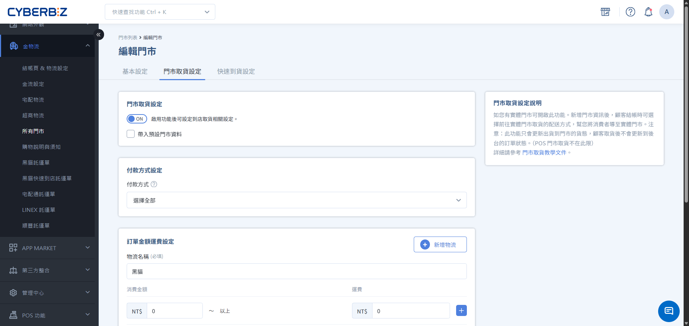

# 設定門市取貨服務

完整的門市取貨功能設定流程，包含啟用功能、設定付款方式、運費規則、取貨日期選項與門市備註管理。
{ .subtitle }

[:lucide-tag:{ title="適用方案" }](../../resources/conventions#適用方案) | 高手 / 所有PLUS / 企業
{ .doc-badge }

{ .hero-page }

## 門市取貨說明

「門市取貨」提供線上購物、線下取貨的 O2O 體驗。消費者於官網完成下單付款後，可選擇到指定的實體門市領取商品。此功能不僅能節省宅配成本，更能增加消費者到店機會，帶動門市額外銷售。

!!! tip "應用情境"
    - **節省運費成本**：提供免運或低運費的門市取貨選項，吸引顧客到店自取。
    - **提升到店率**：透過門市取貨引導顧客進入實體門市，增加現場加購的可能性。
    - **彈性取貨時間**：讓顧客依據個人行程，在門市營業時間內隨時取貨。

## 使用須知

- **付款限制**：僅支援「先付款後取貨」，結帳時系統會自動過濾僅顯示線上付款方式。

## 操作流程

### 步驟 1：開啟門市取貨功能

1. 登入 CYBERBIZ 管理後台，前往 **金物流 > 所有門市**。
2. 找到欲設定的門市，點擊右側 **編輯**。
3. 切換至 **門市取貨設定** 頁籤。
4. 將 **門市取貨設定** 開關切換為 `開啟 (ON)`。

!!! info "效率提示：帶入預設資料"
    可將指定門市設為預設門市，其餘門市點擊 **帶入預設門市資料**，系統將自動填入相同付款方式與運費規則，加快設定速度。

### 步驟 2：設定付款方式與運費規則

1. **付款方式設定**：在清單中勾選允許使用的付款方式（如：信用卡、LINE Pay）。

    > 注意：請至少選擇一種付款方式，且不支援貨到付款。

2. **訂單金額運費設定**：點擊 **新增規則**，填寫以下欄位：
    - **快遞/物流名稱**：前台顯示的名稱（如：門市取貨）。
    - **消費金額**：設定階梯式運費門檻。
    - **運費**：該金額級距對應的運費。

!!! example "階梯式運費範例"
    - 滿 $0 元 → 運費 $60
    - 滿 $1,000 元 → 運費 $0 (免運)

### 步驟 3：設定取貨日期選項

若希望限制顧客取貨的時間，請完成以下設定：

1. 將 **取貨日期** 切換為 `開啟`。
2. **商家配貨天數**：輸入備貨所需天數（例：`2` 天），系統將依此推算顧客最快可選的日期。
3. **顧客可選天數**：輸入可供選擇的日期長度（例：`14` 天）。
4. **排除選項**：
    - **排除指定星期**：勾選門市公休日（如：每週一）。
    - **排除指定日期**：點擊日曆選擇國定假日或店休日期。

        !!! info "適用版本"
            此功能恕不支援專業 PLUS 版。

### 步驟 4：填寫門市取貨備註

在 **其他設定** 區塊的備註欄位，填寫取貨指引：

- **位置提示**：如「門市位於百貨 2 樓，請由西側電梯上樓」。
- **領取規範**：如「取貨請攜帶訂單編號與身分證件」。
- **保留期限**：如「商品最長保留 7 天，逾期將取消訂單」。

### 步驟 5：儲存與前台驗證

1. 點擊右下角 **儲存** 完成設定。
2. 前往官網前台，將商品加入購物車並進入結帳頁。
3. 確認「門市取貨」選項正常顯示，且運費計算、日期選擇器、備註資訊皆符合設定。

## 常見問題

??? quote "為什麼結帳頁面沒有出現「門市取貨」選項？"
    請檢查：1. 是否已將該門市的「門市取貨設定」切換為開啟。 2. 商品編輯頁面是否關閉了門市取貨功能。 3. 是否有勾選至少一種可用的付款方式。

??? quote "消費者取貨後，訂單狀態會變更嗎？"
    一般門市取貨訂單，系統不會在取貨後自動更新狀態。商家需於 **訂單管理** 手動將訂單標記為「已出貨」或相關狀態。若使用 POS 門市取貨則會連動更新。

??? quote "可以針對不同門市設定不同的免運門檻嗎？"
    可以。每間門市的「訂單金額運費設定」皆為獨立，您可以為市區門市設定較低的免運門檻，或為特定門市設定促銷運費。

## 後續步驟

- :lucide-clipboard-list:{ .lg }   
  [__處理門市取貨訂單__](處理門市取貨訂單.md)       
  了解如何管理並核銷顧客到店取貨的訂單。

- :lucide-package-search:{ .lg }     
  [__管理門市取貨商品__](../products/建立商品)  
  學習如何在商品端批次開啟或關閉門市取貨權限。

