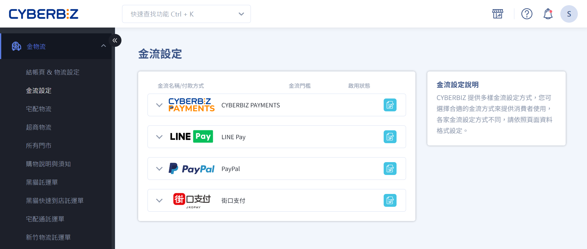

# 付款金流

 
<big>__開始使用__</big>  
管理支付與收款流程。  
設定多元支付方式、掌握訂單付款狀態，提升結帳體驗與交易安全。  
 
[快速上手 :lucide-circle-arrow-right:](quickstart.md)

---

=== "設定支付方式"

	

	
	-   :lucide-circle-plus: __新增支付方式__
	
	    ---
	    
	    

	    
	    [設定信用卡支付](設定信用卡支付.md)  
	    
	    [設定 LINE Pay](設定-line-pay.md)  
	    
	    [設定 PayPal](設定-paypal.md)  
	    
	    [設定貨到付款](設定-cod.md)  
	    
	    

	
	-   :lucide-landmark: __銀行帳戶與轉帳__
	    
	    ---
	    
	    

	    
	    [新增銀行轉帳帳戶](新增銀行帳戶.md)  
	    
	    [設定跨行轉帳收款](設定跨行轉帳.md)  
	    
	    

	
	-   :lucide-shield-check: __支付安全__
	    
	    ---
	    
	    

	    
	    [啟用支付驗證與風控](支付風控.md)  
	    
	    [設定交易安全規則](設定交易安全.md)  
	    
	    

	
	

=== "訂單付款管理"

	

	
	-   :lucide-list-check: __付款狀態__
	    
	    ---
	    
	    

	    
	    [查詢訂單付款狀態](訂單付款狀態.md)  
	    
	    [批次更新付款狀態](批次更新付款狀態.md)  
	    
	    

	
	-   :lucide-repeat: __退款與退貨__
	    
	    ---
	    
	    

	    
	    [設定退款流程](設定退款流程.md)  
	    
	    [批次處理退款訂單](批次退款處理.md)  
	    
	    

	
	-   :lucide-bell: __付款提醒__
	    
	    ---
	    
	    

	    
	    [設定未付款提醒](未付款提醒.md)  
	    
	    [到期支付通知](支付到期通知.md)  
	    
	    

	
	

=== "第三方金流整合"

	

	
	-   :lucide-webhook: __外部平台串接__
	    
	    ---
	    
	    

	    
	    [串接第三方支付平台](串接第三方支付平台.md)  
	    
	    [設定支付 API webhook](支付-webhook.md)  
	    
	    

	
	-   :lucide-file-text: __收款對帳__
	    
	    ---
	    
	    

	    
	    [每日收款對帳流程](每日對帳.md)  
	    
	    [匯出交易明細](匯出交易明細.md)  
	    
	    

	
	-   :lucide-key: __金流權限__
	    
	    ---
	    
	    

	    
	    [設定收款人權限](收款權限.md)  
	    
	    [管理金流操作權限](金流操作權限.md)  
	    
	    

	
	

=== "前台結帳體驗"

	

	
	-   :lucide-shopping-cart: __結帳流程__
	    
	    ---
	    
	    

	    
	    [設定結帳流程](設定結帳流程.md)  
	    
	    [啟用快速結帳](快速結帳.md)  
	    
	    

	
	-   :lucide-credit-card: __多支付選項__
	    
	    ---
	    
	    

	    
	    [顯示多支付方式於前台](前台支付選項.md)  
	    
	    [設定支付預設方式](支付預設方式.md)  
	    
	    

	
	-   :lucide-thumbs-up: __交易評價__
	    
	    ---
	    
	    

	    
	    [啟用付款後評價功能](付款後評價.md)  
	    
	    [前台付款提醒與提示](前台付款提醒.md)  
	    
	    

	
	

